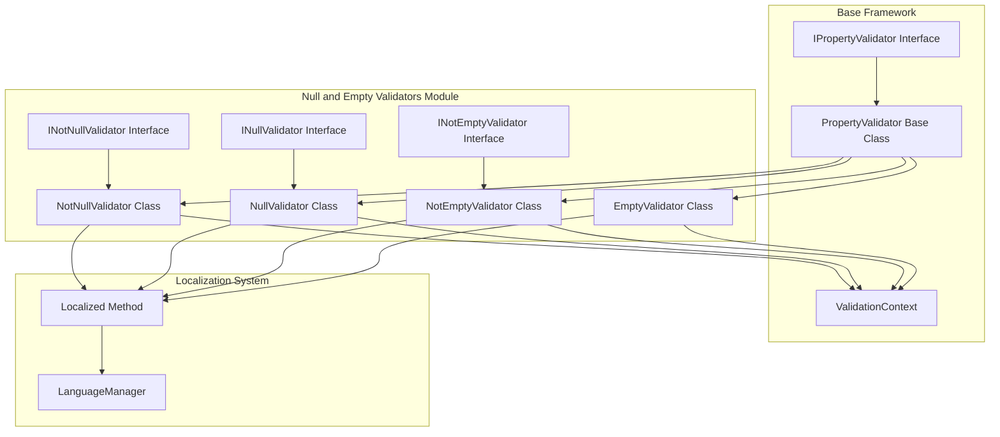
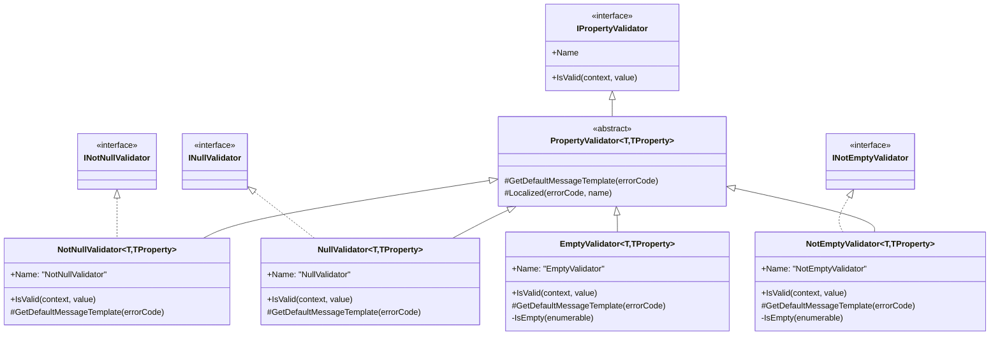
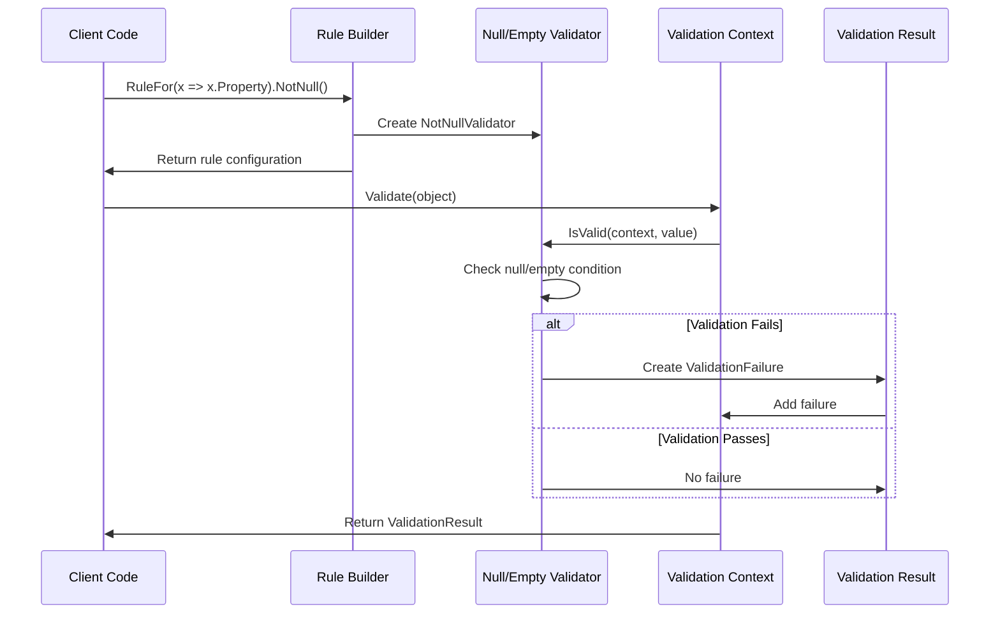
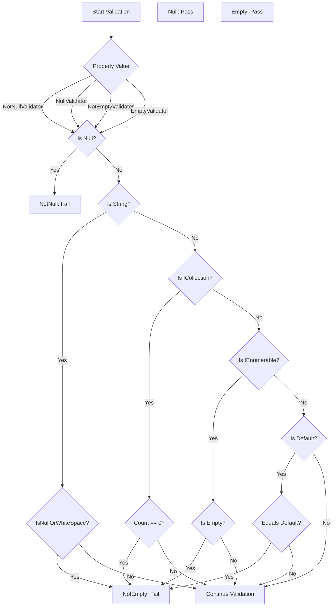
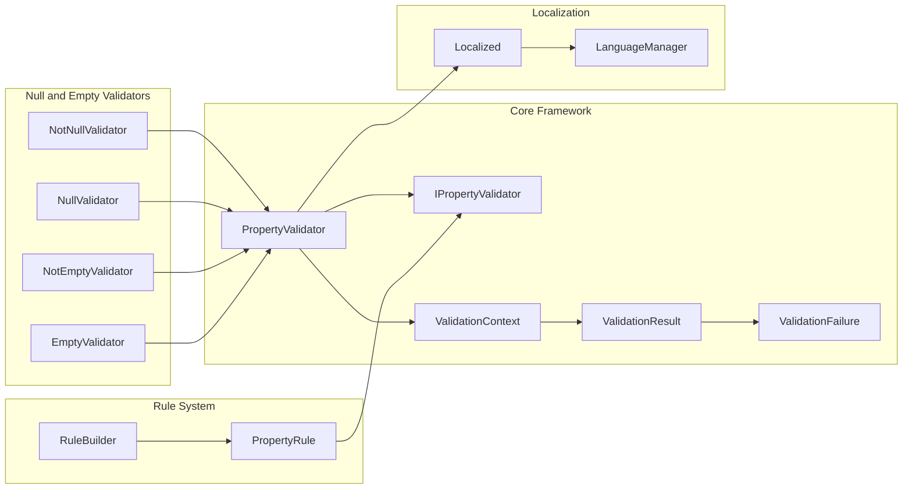

# Null and Empty Validators Module

## Introduction

The Null and Empty Validators module provides essential validation capabilities for checking null values and empty states in .NET applications. This module is a fundamental part of the FluentValidation library, offering validators that ensure data integrity by validating whether properties are null, not null, empty, or not empty. These validators support various data types including strings, collections, and complex objects, making them versatile tools for comprehensive data validation scenarios.

## Overview

The Null and Empty Validators module consists of four primary validators that handle different aspects of null and empty state validation:

- **NotNullValidator**: Ensures that a property value is not null
- **NullValidator**: Ensures that a property value is null
- **NotEmptyValidator**: Ensures that a property is not empty (handles strings, collections, and default values)
- **EmptyValidator**: Ensures that a property is empty (handles strings, collections, and default values)

These validators are designed to work seamlessly with the FluentValidation framework's property validation system and support localization for error messages.

## Architecture

### Component Structure



### Validator Hierarchy



## Core Components

### NotNullValidator

The `NotNullValidator` ensures that a property value is not null. It's one of the most commonly used validators for mandatory fields.

**Key Features:**
- Validates that the property value is not null
- Supports all reference types and nullable value types
- Provides localized error messages
- Implements `INotNullValidator` interface for extensibility

**Usage Pattern:**
```csharp
RuleFor(x => x.PropertyName).NotNull();
```

### NullValidator

The `NullValidator` ensures that a property value is null. This is useful for scenarios where you need to ensure a property remains unset or is explicitly null.

**Key Features:**
- Validates that the property value is null
- Supports all reference types and nullable value types
- Provides localized error messages
- Implements `INullValidator` interface for extensibility

**Usage Pattern:**
```csharp
RuleFor(x => x.PropertyName).Null();
```

### NotEmptyValidator

The `NotEmptyValidator` provides comprehensive empty state validation across multiple data types. It checks for null values, empty strings, empty collections, and default values.

**Key Features:**
- Validates against null values
- Checks for empty or whitespace-only strings
- Validates empty collections (ICollection)
- Validates empty enumerables (IEnumerable)
- Checks against default values for value types
- Provides localized error messages
- Implements `INotEmptyValidator` interface for extensibility

**Validation Logic:**
1. Returns false if value is null
2. Returns false if value is a string with only whitespace
3. Returns false if value is an empty collection
4. Returns false if value is an empty enumerable
5. Returns false if value equals default(TProperty)

**Usage Pattern:**
```csharp
RuleFor(x => x.PropertyName).NotEmpty();
```

### EmptyValidator

The `EmptyValidator` ensures that a property is in an empty state. It handles various data types including strings, collections, and default values.

**Key Features:**
- Validates that value is null (considered empty)
- Validates that strings are empty or contain only whitespace
- Validates that collections are empty
- Validates that enumerables are empty
- Validates that value equals default(TProperty)
- Provides localized error messages

**Validation Logic:**
1. Returns true if value is null
2. Returns true if value is a string with only whitespace
3. Returns true if value is an empty collection
4. Returns true if value is an empty enumerable
5. Returns true if value equals default(TProperty)

**Usage Pattern:**
```csharp
RuleFor(x => x.PropertyName).Empty();
```

## Data Flow

### Validation Process Flow



### Type-Specific Validation Logic



## Integration with FluentValidation Framework

### Dependency Relationships



### Validator Registration and Usage

The validators integrate with the FluentValidation framework through the property validation system:

1. **Rule Builder Integration**: Extension methods on `IRuleBuilder` create appropriate validators
2. **Property Rule Integration**: Validators are attached to property rules during rule construction
3. **Validation Execution**: During validation, the framework calls `IsValid` on each validator
4. **Error Message Generation**: Failed validations generate localized error messages
5. **Result Aggregation**: Validation failures are collected into a `ValidationResult`

## Localization Support

All validators in this module support localization through the FluentValidation localization system:

- Error messages are retrieved using the `Localized` method
- Messages are culture-specific and can be customized
- Default messages are provided in multiple languages
- Custom error messages can be specified per rule

## Performance Considerations

### Optimization Strategies

1. **Type Checking**: Validators use efficient type checking with pattern matching
2. **Early Returns**: Validation logic returns as soon as a condition is met
3. **Generic Constraints**: Type parameters are constrained for better performance
4. **Memory Management**: Disposable objects are properly managed (e.g., enumerators)

### Benchmark Considerations

- **Null Checks**: O(1) operation - fastest validation
- **String Checks**: O(n) where n is string length
- **Collection Checks**: O(1) for ICollection.Count, O(n) for IEnumerable enumeration
- **Default Value Checks**: O(1) operation using EqualityComparer

## Error Handling

### Validation Failure Scenarios

1. **Null Validation Failures**: When NotNullValidator encounters null or NullValidator encounters non-null
2. **Empty Validation Failures**: When NotEmptyValidator encounters empty states or EmptyValidator encounters non-empty states
3. **Type Mismatch**: Handled gracefully through type checking
4. **Collection Enumeration Errors**: Protected with proper exception handling

### Error Message Customization

```csharp
RuleFor(x => x.PropertyName)
    .NotNull()
    .WithMessage("Custom error message for {PropertyName}");
```

## Testing Strategies

### Unit Testing Approach

1. **Null Validator Tests**:
   - Test with null values (should pass for NullValidator, fail for NotNullValidator)
   - Test with non-null values (should fail for NullValidator, pass for NotNullValidator)
   - Test with different reference types

2. **Empty Validator Tests**:
   - Test with null values
   - Test with empty strings
   - Test with whitespace-only strings
   - Test with empty collections
   - Test with empty enumerables
   - Test with default values
   - Test with non-empty values

3. **Integration Tests**:
   - Test with real validation contexts
   - Test error message localization
   - Test with complex object graphs

## Best Practices

### When to Use Each Validator

1. **NotNullValidator**: Use for mandatory fields that must have a value
2. **NullValidator**: Use for fields that must remain unset or explicitly null
3. **NotEmptyValidator**: Use for fields that must contain meaningful data (strings, collections)
4. **EmptyValidator**: Use for fields that should be cleared or remain empty

### Common Patterns

```csharp
// Mandatory string field
RuleFor(x => x.Name).NotNull().NotEmpty();

// Optional collection that must be empty if provided
RuleFor(x => x.Tags).Empty().When(x => x.Tags != null);

// Conditional null validation
RuleFor(x => x.DepartmentId).NotNull().When(x => x.IsEmployee);

// Chain with other validators
RuleFor(x => x.Email).NotNull().NotEmpty().EmailAddress();
```

## Related Documentation

- [Built-in Validators](Built-in%20Validators.md) - Overview of all built-in validators
- [Fluent API & Rule Definition](Fluent%20API%20&%20Rule%20Definition.md) - Rule builder and syntax
- [Validation Results and Failures](Validation%20Results%20and%20Failures.md) - Understanding validation results
- [Localization](Localization.md) - Customizing error messages and languages