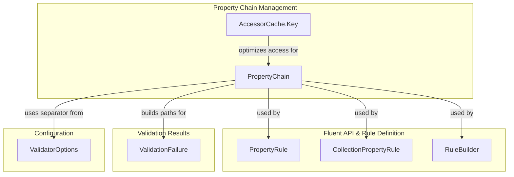
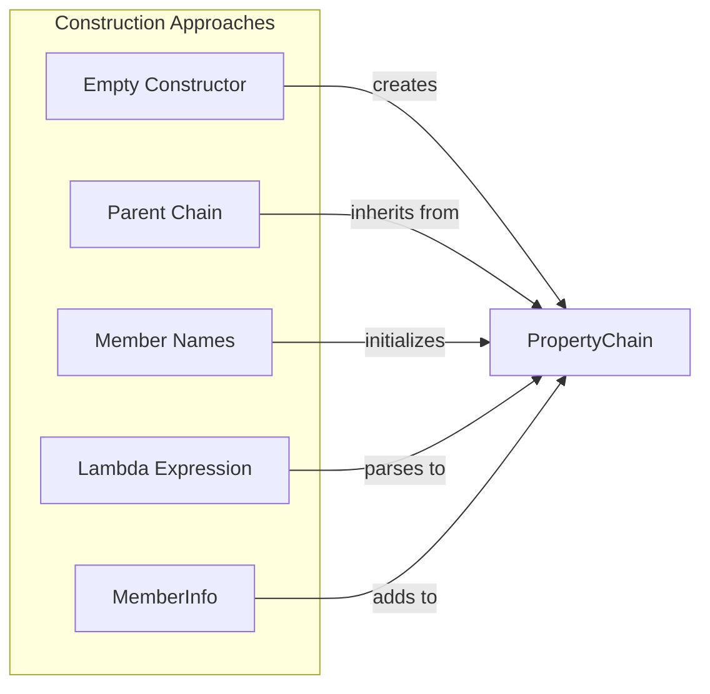
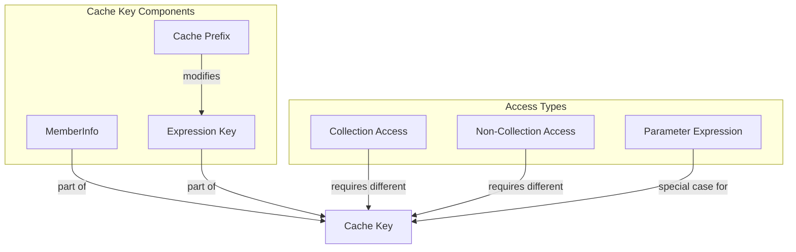
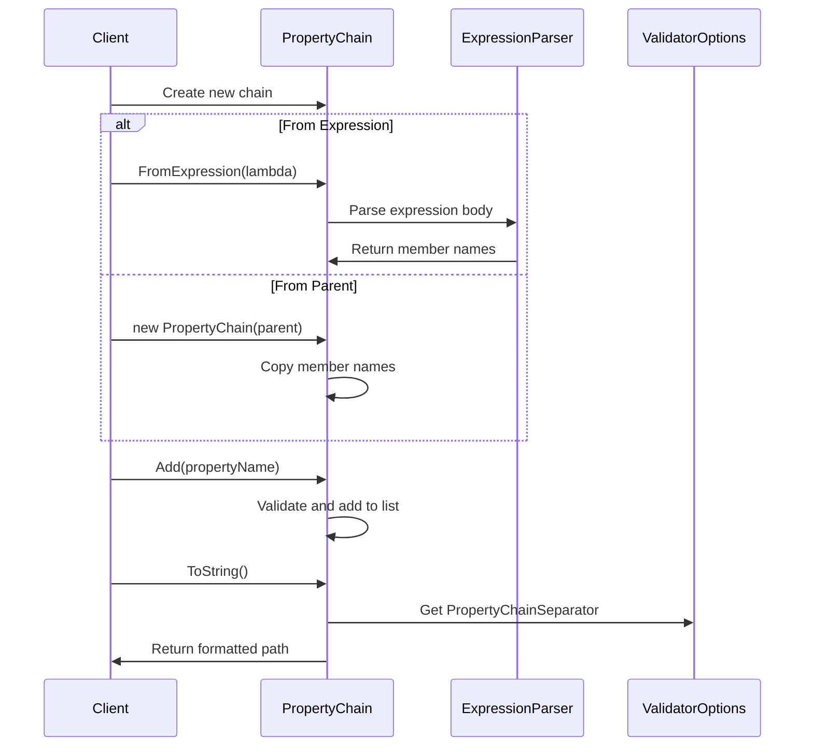
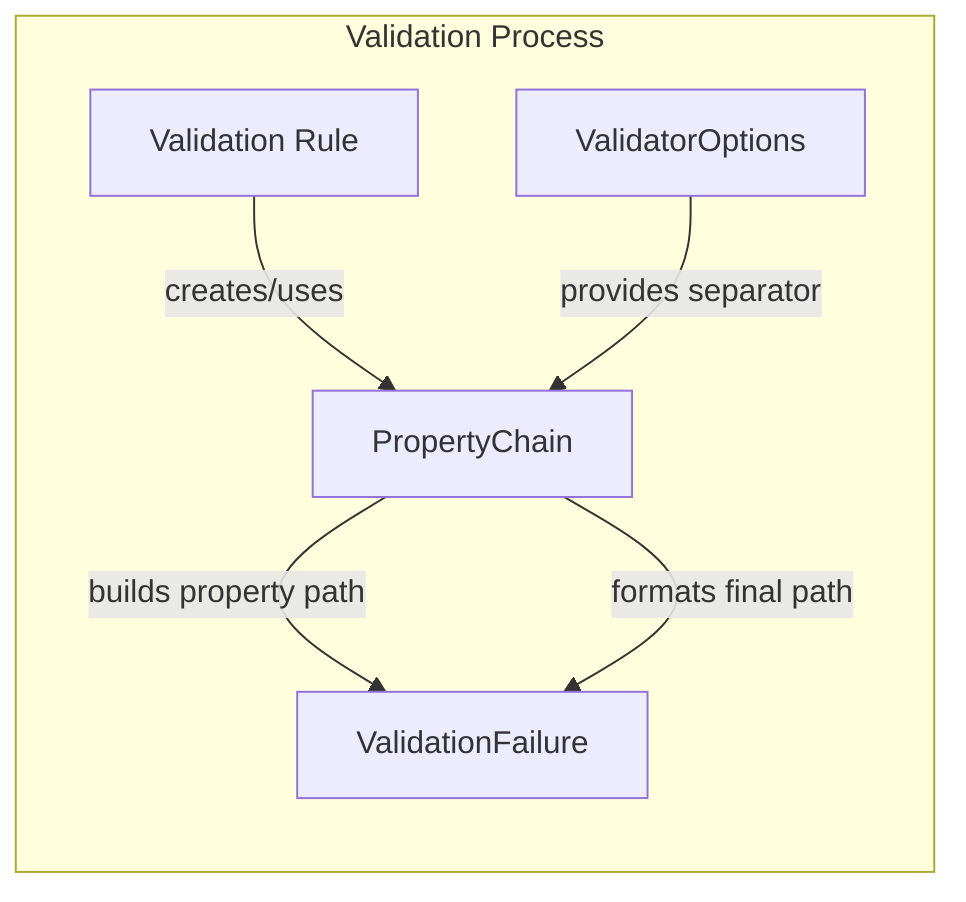

# Property Chain Management Module

## Introduction

The Property Chain Management module is a fundamental component of the FluentValidation library that handles the representation, construction, and manipulation of property paths within validation rules. This module provides the infrastructure for tracking nested property access patterns, enabling precise validation targeting and error reporting for complex object hierarchies.

The module's primary responsibility is to manage property chains - sequences of property names that represent the path to a specific property within an object graph. This capability is essential for scenarios involving nested object validation, collection validation, and complex property access patterns.

## Architecture Overview

### Core Components

The Property Chain Management module consists of two primary components:

1. **PropertyChain** - The main class responsible for building and managing property chains
2. **AccessorCache.Key** - A specialized cache key structure for optimizing property access

### Module Relationships



## Component Details

### PropertyChain Class

The `PropertyChain` class is the cornerstone of property path management in FluentValidation. It provides a flexible and efficient way to construct, manipulate, and represent property paths within object hierarchies.

#### Key Features

- **Hierarchical Construction**: Supports building property chains from parent chains, enabling nested validation scenarios
- **Expression Parsing**: Can automatically construct property chains from lambda expressions
- **Indexer Support**: Handles collection indexing within property paths (e.g., `Parent.Child[0]`)
- **Performance Optimization**: Optimized string concatenation with special handling for common cases
- **Chain Relationship Analysis**: Provides methods to determine parent-child relationships between chains

#### Construction Methods



#### Property Path Building

The module supports sophisticated property path construction through the `BuildPropertyPath` method, which intelligently combines existing chain segments with new property names while maintaining proper separation using the configured property chain separator.

### AccessorCache.Key Structure

The `AccessorCache.Key` is a specialized internal component designed to optimize property access performance through intelligent caching mechanisms.

#### Cache Strategy



#### Performance Considerations

The cache key implementation ensures that:
- Collection and non-collection access use different cache entries to prevent runtime exceptions
- Parameter expressions (like `x => x`) are handled as special cases
- Member information is properly incorporated into cache key equality
- Expression string representations are used for precise cache differentiation

## Data Flow Architecture

### Property Chain Construction Flow



### Validation Integration Flow



## Integration Points

### Rule Builder Integration

The Property Chain Management module integrates seamlessly with the [Rule Builder System](Rule%20Builder%20System.md) to provide property path context during rule construction and execution.

### Validation Failure Integration

Property chains are essential for the [Validation Results and Failures](Validation%20Results%20and%20Failures.md) module, providing the precise property paths needed for accurate error reporting.

### Collection Validation Support

The module works in conjunction with [Collection Rules](Collection%20Rules.md) to handle complex scenarios involving collection indexing and nested collection validation.

## Usage Patterns

### Basic Property Chain Construction

```csharp
// Create from expression
var chain = PropertyChain.FromExpression(x => x.Address.City);
// Result: "Address.City"

// Manual construction
var chain = new PropertyChain();
chain.Add("Address");
chain.Add("City");
// Result: "Address.City"
```

### Hierarchical Chain Building

```csharp
// Parent chain
var parentChain = PropertyChain.FromExpression(x => x.Order);

// Child chain inherits from parent
var childChain = new PropertyChain(parentChain);
childChain.Add("Customer");
childChain.Add("Name");
// Result: "Order.Customer.Name"
```

### Collection Indexing

```csharp
var chain = PropertyChain.FromExpression(x => x.Items);
chain.AddIndexer(0);
chain.Add("Product");
chain.Add("Name");
// Result: "Items[0].Product.Name"
```

## Performance Characteristics

### Memory Efficiency

- Uses `List<string>` with initial capacity of 2 for optimal memory allocation in typical scenarios
- Implements efficient string concatenation with special handling for single-element cases
- Minimizes object allocations through reuse of parent chain data

### Cache Optimization

The AccessorCache component provides significant performance benefits by:
- Eliminating repeated expression compilation overhead
- Using concurrent dictionaries for thread-safe access
- Supporting cache bypass for scenarios where caching is undesirable
- Implementing proper cache key differentiation for collection vs. non-collection access

## Configuration Integration

The module integrates with the global [Configuration and Global Options](Configuration%20and%20Global%20Options.md) to respect user-defined property chain separators and other validation settings.

## Error Handling

The module implements robust error handling for edge cases:
- Validates indexer operations against empty chains
- Handles null member information gracefully
- Provides clear error messages for invalid operations
- Maintains consistency across different construction methods

## Thread Safety

The PropertyChain class itself is not thread-safe for modifications but is safe for concurrent read operations. The AccessorCache component uses concurrent collections to ensure thread-safe caching operations.

## Extensibility Considerations

The module is designed with extensibility in mind:
- Property chain construction can be customized through inheritance
- Cache behavior can be modified via global configuration options
- Expression parsing logic can be extended for complex scenarios
- Integration points are clearly defined for future enhancements