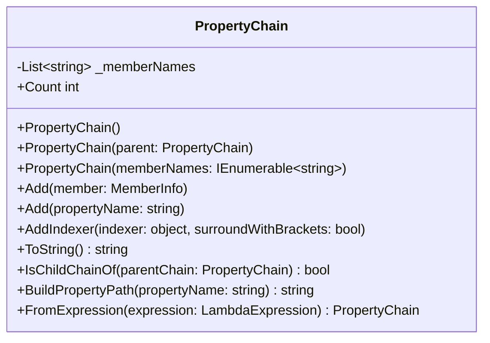
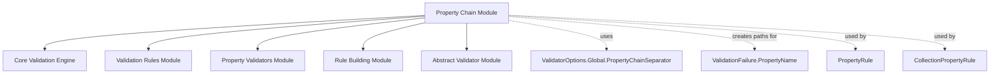
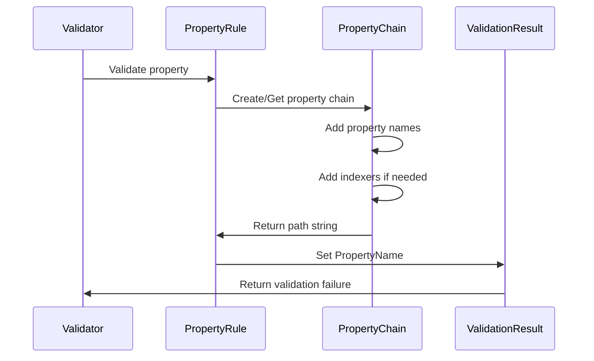
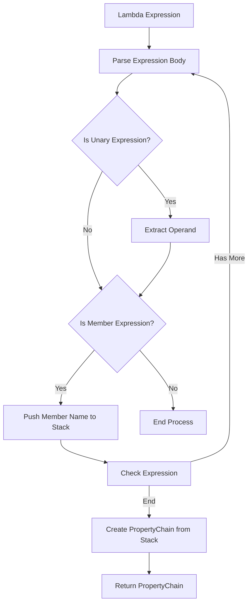

# Property Chain Module Documentation

## Introduction

The Property Chain module is a fundamental component of the FluentValidation library that manages hierarchical property path representations. It provides a mechanism for tracking and manipulating nested property paths during validation, enabling the library to accurately identify and report validation errors for complex object graphs.

## Overview

PropertyChain serves as the backbone for property path management in FluentValidation, handling everything from simple property names to complex nested object hierarchies with indexers. This module is essential for generating accurate property paths in validation results, particularly when dealing with nested objects, collections, and complex validation scenarios.

## Architecture

### Core Component Structure



### Module Dependencies



## Component Details

### PropertyChain Class

The `PropertyChain` class is the primary component of this module, providing a flexible and efficient way to manage property paths.

#### Key Features

1. **Hierarchical Path Management**: Supports building and manipulating nested property paths
2. **Expression Support**: Can create property chains from lambda expressions
3. **Indexer Support**: Handles collection indexers and array indices
4. **Performance Optimization**: Optimized string operations for common scenarios
5. **Chain Relationships**: Supports parent-child chain relationships

#### Constructor Overloads

- **Default Constructor**: Creates an empty property chain
- **Parent Chain Constructor**: Creates a new chain based on an existing parent chain
- **Member Names Constructor**: Creates a chain from a collection of member names

#### Core Methods

##### Add Methods
- `Add(MemberInfo member)`: Adds a member to the chain
- `Add(string propertyName)`: Adds a property name to the chain
- `AddIndexer(object indexer, bool surroundWithBrackets)`: Adds an indexer to the last property

##### Utility Methods
- `ToString()`: Generates the string representation of the property path
- `IsChildChainOf(PropertyChain parentChain)`: Determines if this chain is a child of another
- `BuildPropertyPath(string propertyName)`: Builds a complete property path
- `FromExpression(LambdaExpression expression)`: Creates a chain from a lambda expression

## Data Flow

### Property Path Construction Flow



### Expression Parsing Flow



## Integration with FluentValidation

### Usage in Validation Rules

PropertyChain is extensively used throughout the FluentValidation system:

1. **PropertyRule**: Uses PropertyChain to track the current property being validated
2. **CollectionPropertyRule**: Uses PropertyChain with indexers for collection validation
3. **ValidationFailure**: Receives property paths from PropertyChain for error reporting
4. **ChildValidatorAdaptor**: Uses PropertyChain for nested object validation

### Configuration Integration

The module integrates with the global ValidatorOptions to use the configured property chain separator:

```csharp
// Uses ValidatorOptions.Global.PropertyChainSeparator for string concatenation
return string.Join(ValidatorOptions.Global.PropertyChainSeparator, _memberNames);
```

## Performance Considerations

### Optimization Strategies

1. **Pre-sized Collections**: The internal `_memberNames` list is pre-sized to 2 elements to reduce allocations for common scenarios
2. **Optimized String Joining**: Special handling for empty and single-element chains to avoid unnecessary string.Join calls
3. **Expression Caching**: Property chains created from expressions can be cached and reused

### Memory Efficiency

- Uses `List<string>` internally for efficient memory management
- Supports chain inheritance without deep copying when possible
- String operations are optimized for the most common use cases

## Error Handling

### Validation and Edge Cases

1. **Empty Chain Protection**: Prevents adding indexers to empty chains
2. **Null Handling**: Gracefully handles null member names and parent chains
3. **String Validation**: Validates property names before adding to the chain

## Examples

### Basic Usage

```csharp
// Create a simple property chain
var chain = new PropertyChain();
chain.Add("Customer");
chain.Add("Name");
Console.WriteLine(chain.ToString()); // Output: "Customer.Name"
```

### With Indexers

```csharp
// Create a chain with indexers
var chain = new PropertyChain();
chain.Add("Orders");
chain.AddIndexer(0);
chain.Add("ProductName");
Console.WriteLine(chain.ToString()); // Output: "Orders[0].ProductName"
```

### From Expression

```csharp
// Create chain from lambda expression
Expression<Func<Order, object>> expr = o => o.Customer.Address.City;
var chain = PropertyChain.FromExpression(expr);
Console.WriteLine(chain.ToString()); // Output: "Customer.Address.City"
```

### Nested Validation

```csharp
// Use in nested validation scenarios
var parentChain = new PropertyChain();
parentChain.Add("Customer");

var childChain = new PropertyChain(parentChain);
childChain.Add("Address");
Console.WriteLine(childChain.ToString()); // Output: "Customer.Address"
```

## Related Modules

- [Core_Validation_Engine](Core_Validation_Engine.md) - Core validation infrastructure
- [Validation_Rules](Validation_Rules.md) - Rule definitions that use PropertyChain
- [Property_Validators](Property_Validators.md) - Validators that generate property paths
- [Rule_Building](Rule_Building.md) - Rule builders that construct property chains
- [AbstractValidator](AbstractValidator.md) - Base validator class that manages property chains

## Best Practices

1. **Reuse Chains**: When possible, reuse PropertyChain instances to reduce allocations
2. **Expression Usage**: Use `FromExpression` for compile-time safety when working with lambda expressions
3. **Indexer Handling**: Always check chain count before adding indexers to avoid exceptions
4. **Path Building**: Use `BuildPropertyPath` for consistent path construction
5. **Child Chain Detection**: Use `IsChildChainOf` for efficient parent-child relationship checking

## Thread Safety

PropertyChain instances are not thread-safe. Each validation operation should use its own PropertyChain instance or ensure proper synchronization when sharing instances across threads.

## Version Compatibility

The PropertyChain module maintains backward compatibility while adding new features. The `BuildPropertyName` method is marked as obsolete but retained for compatibility, with `BuildPropertyPath` providing the same functionality with a clearer name.