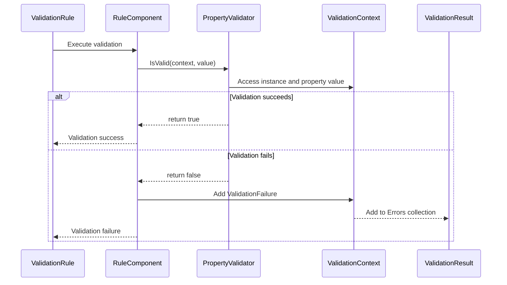

# Property Validators Module

## Introduction

The Property Validators module is a core component of the FluentValidation framework that provides the actual validation logic for individual properties. This module contains a comprehensive collection of built-in validators that can be applied to properties to enforce various validation rules, from simple null checks to complex business logic validation.

The module serves as the execution engine for property-level validation rules, providing both synchronous and asynchronous validation capabilities. It forms the foundation upon which the Validation Rules module builds its rule definitions, and integrates closely with the Core Validation Engine to provide a complete validation experience.

## Architecture Overview

The Property Validators module follows a well-structured architecture based on interface segregation and the strategy pattern, allowing for extensible and maintainable validation logic.

```mermaid
graph TB
    subgraph "Property Validators Module"
        IPropertyValidator["IPropertyValidator<T,TProperty>"]
        IAsyncPropertyValidator["IAsyncPropertyValidator<T,TProperty>"]
        
        IPropertyValidator --> PropertyValidator["PropertyValidator<T,TProperty>"]
        IAsyncPropertyValidator --> AsyncPropertyValidator["AsyncPropertyValidator<T,TProperty>"]
        
        PropertyValidator --> NotNullValidator["NotNullValidator<T,TProperty>"]
        PropertyValidator --> NullValidator["NullValidator<T,TProperty>"]
        PropertyValidator --> NotEmptyValidator["NotEmptyValidator<T,TProperty>"]
        PropertyValidator --> EmptyValidator["EmptyValidator<T,TProperty>"]
        PropertyValidator --> EqualValidator["EqualValidator<T,TProperty>"]
        PropertyValidator --> NotEqualValidator["NotEqualValidator<T,TProperty>"]
        PropertyValidator --> LengthValidator["LengthValidator<T>"]
        PropertyValidator --> RegularExpressionValidator["RegularExpressionValidator<T>"]
        PropertyValidator --> EmailValidator["EmailValidator<T>"]
        PropertyValidator --> CreditCardValidator["CreditCardValidator<T>"]
        PropertyValidator --> EnumValidator["EnumValidator<T,TProperty>"]
        PropertyValidator --> StringEnumValidator["StringEnumValidator<T>"]
        PropertyValidator --> PredicateValidator["PredicateValidator<T,TProperty>"]
        
        AsyncPropertyValidator --> AsyncPredicateValidator["AsyncPredicateValidator<T,TProperty>"]
        
        PropertyValidator --> ChildValidatorAdaptor["ChildValidatorAdaptor<T,TProperty>"]
        ChildValidatorAdaptor --> PolymorphicValidator["PolymorphicValidator<T,TProperty>"]
    end
    
    subgraph "Core Validation Engine"
        ValidationContext["ValidationContext<T>"]
        ValidationResult["ValidationResult"]
        ValidationFailure["ValidationFailure"]
    end
    
    subgraph "Validation Rules Module"
        PropertyRule["PropertyRule<T,TProperty>"]
        RuleComponent["RuleComponent<T,TProperty>"]
    end
    
    PropertyRule --> IPropertyValidator
    RuleComponent --> IPropertyValidator
    IPropertyValidator --> ValidationContext
    ValidationContext --> ValidationResult
    ValidationResult --> ValidationFailure
```



## Core Components

### Base Interfaces

#### IPropertyValidator
The fundamental interface that all property validators must implement. It provides the basic contract for validation logic and error message generation.

```csharp
public interface IPropertyValidator {
    string Name { get; }
    string GetDefaultMessageTemplate(string errorCode);
}
```

#### IPropertyValidator<T, TProperty>
The generic interface for synchronous property validation, extending the base interface with type-safe validation logic.

```csharp
public interface IPropertyValidator<T, in TProperty> : IPropertyValidator {
    bool IsValid(ValidationContext<T> context, TProperty value);
}
```

#### IAsyncPropertyValidator<T, TProperty>
The generic interface for asynchronous property validation, enabling non-blocking validation operations.

```csharp
public interface IAsyncPropertyValidator<T, in TProperty> : IPropertyValidator {
    Task<bool> IsValidAsync(ValidationContext<T> context, TProperty value, CancellationToken cancellation);
}
```

### Built-in Validators

#### Null Validators

**NotNullValidator<T,TProperty>**
Ensures that a property value is not null. This validator is commonly used for required field validation.

```csharp
public class NotNullValidator<T,TProperty> : PropertyValidator<T,TProperty>, INotNullValidator {
    public override bool IsValid(ValidationContext<T> context, TProperty value) {
        return value != null;
    }
}
```

**NullValidator<T,TProperty>**
Ensures that a property value is null, useful for conditional validation scenarios.

#### Empty Validators

**NotEmptyValidator<T,TProperty>**
Comprehensive validator that checks for non-empty values across different data types:
- Null values
- Empty or whitespace-only strings
- Empty collections
- Default values for value types

**EmptyValidator<T,TProperty>**
Validates that a property is empty according to the same criteria used by NotEmptyValidator.

#### Comparison Validators

**EqualValidator<T,TProperty>**
Validates that a property equals a specific value or another property. Supports custom equality comparers and can compare against constants or other properties.

**NotEqualValidator<T,TProperty>**
Validates that a property does not equal a specific value or another property.

#### String Validators

**LengthValidator<T>**
Validates string length with configurable minimum and maximum bounds. Includes specialized variants:
- `ExactLengthValidator`: Validates exact string length
- `MaximumLengthValidator`: Validates maximum string length only
- `MinimumLengthValidator`: Validates minimum string length only

**RegularExpressionValidator<T>**
Validates strings against regular expression patterns. Supports both static and dynamic patterns, with configurable regex options and timeout settings.

**EmailValidator<T>**
Provides email address validation with two modes:
- `AspNetCoreCompatible`: Simple validation checking for @ symbol presence
- `Net4xRegex`: Comprehensive regex-based validation (deprecated)

#### Specialized Validators

**CreditCardValidator<T>**
Implements the Luhn algorithm to validate credit card numbers, supporting various card formats with automatic formatting character removal.

**EnumValidator<T,TProperty>**
Validates that enum values are defined within their enum type, with special handling for flags enums using bitwise operations.

**StringEnumValidator<T>**
Validates string representations of enum values, with case-sensitive or case-insensitive comparison options.

#### Custom Logic Validators

**PredicateValidator<T,TProperty>**
Enables custom validation logic through predicate functions, providing maximum flexibility for complex validation scenarios.

**AsyncPredicateValidator<T,TProperty>**
Asynchronous version of the predicate validator, supporting async validation operations.

#### Nested Validation

**ChildValidatorAdaptor<T,TProperty>**
Enables validation of complex properties by delegating to other validators. This validator acts as a bridge between property validators and object validators.

**PolymorphicValidator<T,TProperty>**
Performs runtime type checking and delegates validation to appropriate validators based on the actual type of the property value, enabling polymorphic validation scenarios.

## Data Flow



## Integration with Other Modules

### Core Validation Engine
The Property Validators module integrates with the Core Validation Engine through the `ValidationContext<T>` and `ValidationResult` classes. Validators receive context information and contribute to the overall validation result.

### Validation Rules Module
Property validators are consumed by the Validation Rules module through `RuleComponent<T,TProperty>` instances. The rules module defines when and how validators are applied to properties.

### Comparison Validators Module
Some property validators (EqualValidator, NotEqualValidator) implement interfaces from the Comparison Validators module, enabling them to participate in comparison-based validation scenarios.

## Usage Patterns

### Basic Validation
```csharp
RuleFor(x => x.Name)
    .NotNull()
    .NotEmpty()
    .Length(2, 50);
```

### Conditional Validation
```csharp
RuleFor(x => x.Email)
    .NotEmpty()
    .When(x => x.RequiresEmail)
    .EmailAddress();
```

### Custom Validation Logic
```csharp
RuleFor(x => x.Age)
    .Must((person, age) => age >= 18 || person.HasParentalConsent)
    .WithMessage("Must be 18 or have parental consent");
```

### Nested Object Validation
```csharp
RuleFor(x => x.Address)
    .SetValidator(new AddressValidator());
```

### Polymorphic Validation
```csharp
RuleFor(x => x.PaymentMethod)
    .SetInheritanceValidator(v => {
        v.Add<CreditCardPayment>(new CreditCardPaymentValidator());
        v.Add<BankTransferPayment>(new BankTransferPaymentValidator());
    });
```

## Extension Points

### Custom Property Validators
Developers can create custom validators by inheriting from `PropertyValidator<T,TProperty>` or implementing the appropriate interfaces:

```csharp
public class CustomValidator<T,TProperty> : PropertyValidator<T,TProperty> {
    public override bool IsValid(ValidationContext<T> context, TProperty value) {
        // Custom validation logic
        return true; // or false
    }
    
    protected override string GetDefaultMessageTemplate(string errorCode) {
        return "Custom validation failed for {PropertyName}";
    }
}
```

### Async Custom Validators
For scenarios requiring asynchronous operations (database calls, external API validation):

```csharp
public class AsyncCustomValidator<T,TProperty> : AsyncPropertyValidator<T,TProperty> {
    public override async Task<bool> IsValidAsync(
        ValidationContext<T> context, 
        TProperty value, 
        CancellationToken cancellation) {
        // Async validation logic
        return await SomeAsyncValidation(value);
    }
}
```

## Performance Considerations

### Validation Optimization
- Validators are designed to be lightweight and stateless
- Early return patterns are used to minimize unnecessary processing
- Null values are typically considered valid (bypassing validation) unless specifically validated against

### Memory Management
- Validators are cached and reused across validation operations
- Message formatting is deferred until validation failures occur
- Collection validation uses efficient enumeration patterns

### Async Validation
- Async validators support cancellation tokens for responsive applications
- Async operations are properly awaited to prevent blocking
- Validation context is preserved across async boundaries

## Localization Support

All built-in validators support localization through the `GetDefaultMessageTemplate` method, which integrates with the Localization module to provide culture-specific error messages. The message templates use placeholder values that are populated by the validation context.

## Thread Safety

Property validators are designed to be thread-safe and stateless. They can be safely shared across multiple validation operations and concurrent threads. The validation context provides all necessary state information for each validation operation.

## References

- [Core Validation Engine](Core_Validation_Engine.md) - For validation context and result handling
- [Validation Rules](Validation_Rules.md) - For rule definition and component integration
- [Comparison Validators](Comparison_Validators.md) - For comparison-based validation interfaces
- [Localization](Localization.md) - For error message localization support