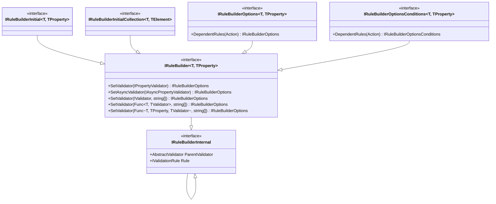
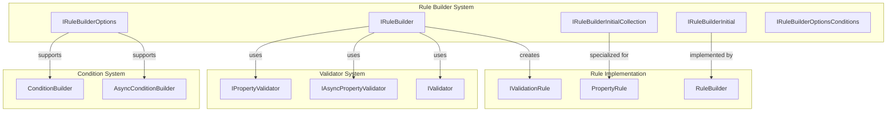
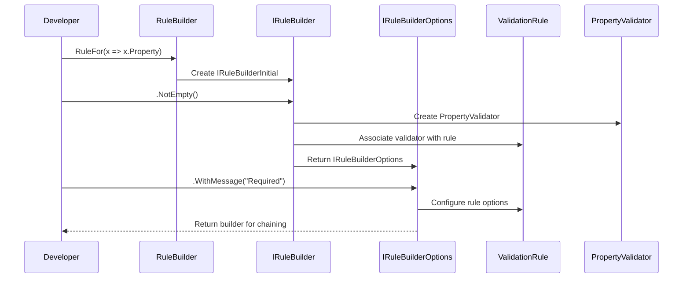

# Rule Builder System

The Rule Builder System is the core fluent API interface of FluentValidation that provides a type-safe, chainable API for defining validation rules. It serves as the primary entry point for developers to specify validation logic through a readable, expressive syntax.

## Overview

The Rule Builder System provides a set of interfaces that enable developers to build validation rules using method chaining. It acts as the bridge between the fluent API syntax and the underlying validation rule implementations, offering a consistent and intuitive way to define complex validation logic.

## Architecture

### Core Components

The Rule Builder System consists of several key interfaces that form a hierarchical structure:



### System Integration



## Component Details

### IRuleBuilder<T, TProperty>
The core interface that provides the primary methods for associating validators with properties. It supports both synchronous and asynchronous validators, as well as nested validators.

**Key Methods:**
- `SetValidator(IPropertyValidator<T, TProperty>)` - Associates a property validator
- `SetAsyncValidator(IAsyncPropertyValidator<T, TProperty>)` - Associates an async property validator
- `SetValidator(IValidator<TProperty>, params string[])` - Associates a nested validator with optional rulesets
- `SetValidator(Func<T, TValidator>, params string[])` - Associates a validator provider
- `SetValidator(Func<T, TProperty, TValidator>, params string[])` - Associates a validator provider with property access

### IRuleBuilderInitial<T, TProperty>
A marker interface that represents the starting point of a rule builder chain. It inherits from `IRuleBuilder<T, TProperty>` but doesn't add additional functionality.

### IRuleBuilderInitialCollection<T, TElement>
Specialized interface for building rules on collection properties. It provides the same functionality as `IRuleBuilder<T, TProperty>` but is specifically typed for collection elements.

### IRuleBuilderOptions<T, TProperty>
Extends the base rule builder with additional configuration options. Currently provides support for dependent rules through the `DependentRules(Action)` method.

### IRuleBuilderOptionsConditions<T, TProperty>
A specialized version of `IRuleBuilderOptions` that only supports conditional operations without other configuration options.

### Internal Interfaces

#### IRuleBuilderInternal<T>
Internal interface providing access to the parent validator instance, used for internal rule building operations.

#### IRuleBuilderInternal<T, TProperty>
Extends the internal interface with access to the underlying validation rule, enabling internal manipulation of rule components.

## Usage Patterns

### Basic Rule Definition
```csharp
RuleFor(x => x.Email)
    .NotEmpty()
    .EmailAddress();
```

### Nested Validator Association
```csharp
RuleFor(x => x.Address)
    .SetValidator(new AddressValidator());
```

### Conditional Rules with Dependent Rules
```csharp
RuleFor(x => x.Age)
    .GreaterThan(18)
    .DependentRules(() => {
        RuleFor(x => x.DriverLicense)
            .NotEmpty();
    });
```

## Data Flow



## Integration with Other Systems

### Rule Implementation System
The Rule Builder System works closely with the [Rule Implementation](Rule%20Implementation.md) system:
- Creates and configures `IValidationRule` instances
- Populates `PropertyRule` objects with validators
- Integrates with `RuleBuilder` for internal rule construction

### Condition System
Integration with the [Condition System](Condition%20System.md) provides:
- Conditional rule execution through `When`/`Unless` methods
- Async condition support through `WhenAsync`/`UnlessAsync`
- Dependent rules scoping

### Validator System
The Rule Builder System leverages the [Validator System](Core%20&%20Validation%20Execution.md) for:
- Associating nested validators via `SetValidator` methods
- Supporting both `IValidator<T>` and `IPropertyValidator<T, TProperty>`
- Enabling ruleset-based validator selection

## Design Principles

### Type Safety
The Rule Builder System maintains strong typing throughout the validation chain, ensuring compile-time safety for property access and validator associations.

### Fluent Interface
Method chaining is supported through careful interface design, allowing natural, readable validation rule definitions.

### Extensibility
The interface hierarchy allows for future extensions without breaking existing implementations, following the Open/Closed Principle.

### Separation of Concerns
Different interfaces handle different aspects of rule building (initial setup, options, conditions), maintaining clean separation of responsibilities.

## Best Practices

### Use Appropriate Interfaces
- Use `IRuleBuilderInitial` for starting rule chains
- Use `IRuleBuilderOptions` when additional configuration is needed
- Use `IRuleBuilderInitialCollection` for collection-specific rules

### Maintain Chain Consistency
Ensure that method returns maintain the appropriate interface type to support intended chaining operations.

### Leverage Type Safety
Take advantage of the generic type parameters to ensure compile-time validation of property types and validator compatibility.

## Related Documentation

- [Rule Implementation](Rule%20Implementation.md) - Details on how rules are implemented and executed
- [Condition System](Condition%20System.md) - Information on conditional rule execution
- [Core & Validation Execution](Core%20&%20Validation%20Execution.md) - Core validation framework components
- [Built-in Validators](Built-in%20Validators.md) - Available validator implementations