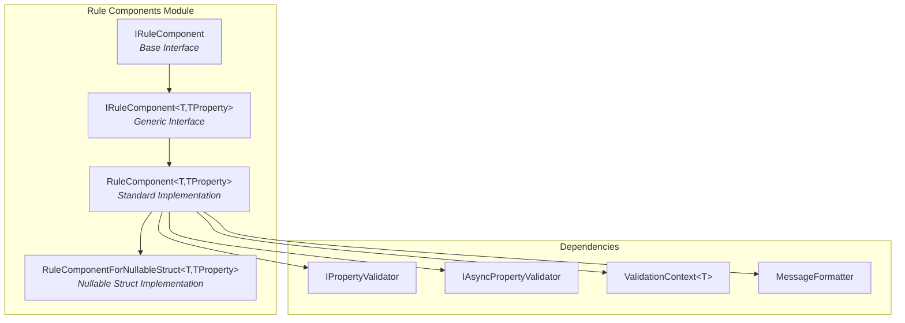
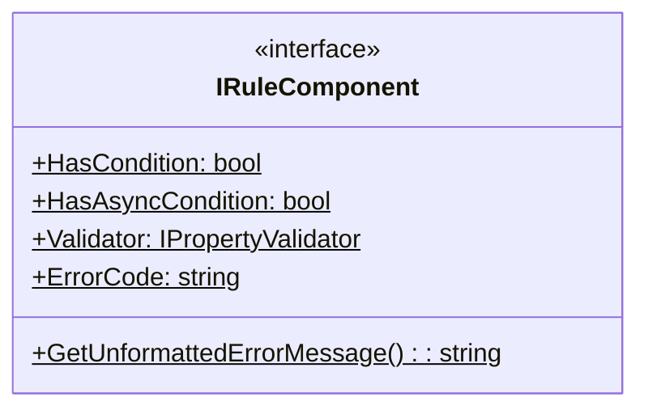
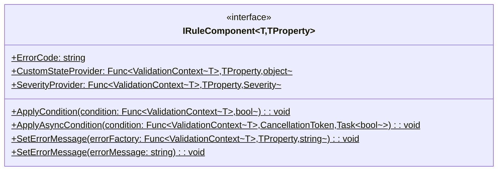
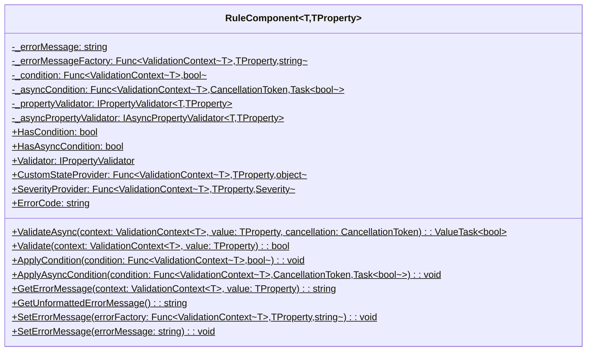
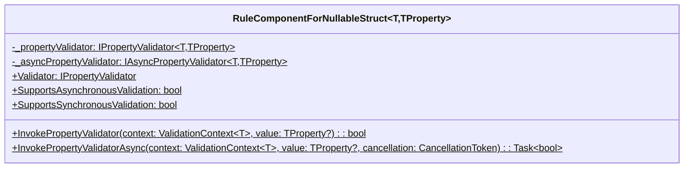
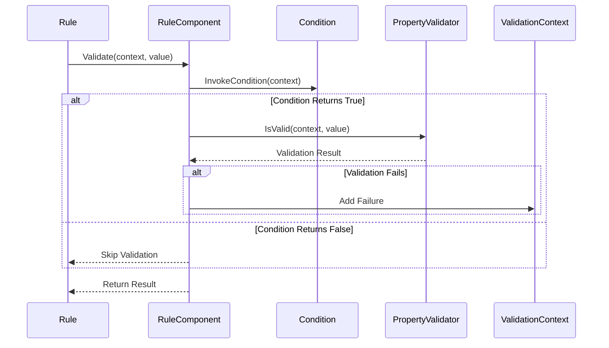
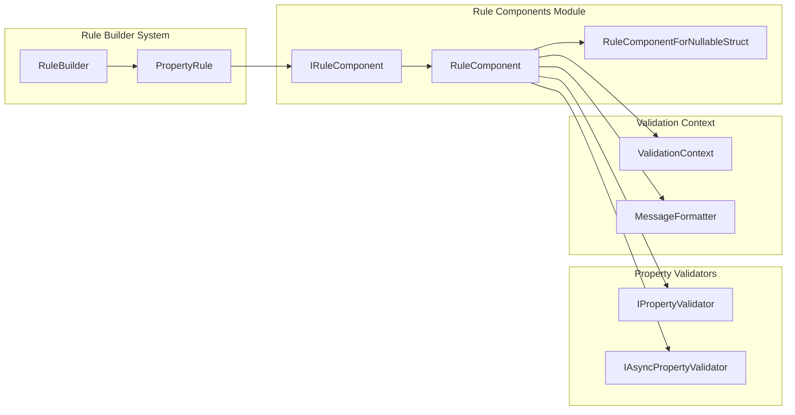

# Rule Components Module Documentation

## Introduction

The Rule Components module is a fundamental part of the FluentValidation library that provides the building blocks for individual validation rules. This module defines the interfaces and implementations that represent discrete validation components within a rule chain, enabling developers to compose complex validation logic from simple, reusable validators.

Rule components are the atomic units of validation in FluentValidation. When you define a rule like `RuleFor(x => x.Name).NotNull().NotEqual("Foo")`, both `NotNull()` and `NotEqual("Foo")` create individual rule components that work together to validate the property.

## Architecture Overview

The Rule Components module follows a clean separation of concerns with well-defined interfaces and implementations:



## Core Components

### IRuleComponent Interface

The `IRuleComponent` interface serves as the base contract for all rule components, providing essential properties and methods for validation execution:



**Key Properties:**
- `HasCondition`: Indicates whether the component has a synchronous condition
- `HasAsyncCondition`: Indicates whether the component has an asynchronous condition
- `Validator`: The property validator associated with this component
- `ErrorCode`: The error code for validation failures

### IRuleComponent<T, TProperty> Interface

The generic interface extends the base interface with type-specific functionality:



**Key Features:**
- Type-safe validation with generic parameters
- Support for custom state and severity providers
- Flexible error message configuration
- Conditional validation support

### RuleComponent<T, TProperty> Implementation

The main implementation class provides the core functionality for rule components:



**Key Responsibilities:**
- **Validation Execution**: Handles both synchronous and asynchronous validation
- **Condition Management**: Supports conditional validation with AND logic combination
- **Error Message Handling**: Provides flexible error message formatting and customization
- **Property Validator Integration**: Bridges between rule components and property validators

### RuleComponentForNullableStruct<T, TProperty> Implementation

Specialized implementation for nullable value types:



**Special Features:**
- Handles null values in nullable value types gracefully
- Only validates when the nullable value has a value (HasValue is true)
- Inherits all base functionality from RuleComponent

## Data Flow and Validation Process

The validation process within rule components follows a structured flow:



## Component Relationships

Rule components integrate with the broader FluentValidation ecosystem:



## Key Features and Capabilities

### 1. Dual Validation Mode Support
Rule components seamlessly support both synchronous and asynchronous validation:
- **Synchronous**: Direct property validator invocation
- **Asynchronous**: Async property validator with cancellation token support
- **Automatic Mode Selection**: Based on the root validator's invocation method

### 2. Conditional Validation
Flexible condition system with AND logic combination:
```csharp
// Multiple conditions are combined with AND
component.ApplyCondition(ctx => ctx.InstanceToValidate.IsActive);
component.ApplyCondition(ctx => ctx.InstanceToValidate.UserRole == "Admin");
// Both conditions must be true for validation to execute
```

### 3. Error Message Customization
Multiple ways to customize error messages:
- **Static Messages**: Direct string assignment
- **Dynamic Messages**: Factory functions with context and value access
- **Default Fallback**: Automatic fallback to validator's default message template

### 4. Nullable Type Handling
Specialized handling for nullable value types:
- **Null Safety**: Automatically handles null values without validation
- **Value Presence**: Only validates when HasValue is true
- **Type Preservation**: Maintains type safety for nullable structs

## Integration with Other Modules

### Rule Builder System
Rule components are created and managed by the [Rule Builder System](Rule%20Builder%20System.md):
- Components are instantiated when validation rules are defined
- Rule builders configure component properties and conditions
- Components are attached to property rules for execution

### Property Validators
Rule components serve as containers for [Property Validators](Built-in%20Validators.md):
- Each component wraps a specific property validator
- Components handle validator lifecycle and execution
- Support for both sync and async property validators

### Validation Context
Deep integration with the [Validation Context Management](Core%20&%20Validation%20Execution.md#validation-context-management) system:
- Context provides instance access and metadata
- Message formatting through context's MessageFormatter
- Custom state and severity provider integration

## Usage Patterns

### Basic Component Creation
```csharp
// Creating a rule component with a property validator
var component = new RuleComponent<T, TProperty>(propertyValidator);
component.ErrorCode = "NotNull";
component.SetErrorMessage("The field {PropertyName} is required.");
```

### Conditional Validation
```csharp
// Adding conditions to control when validation executes
component.ApplyCondition(ctx => ctx.InstanceToValidate.IsActive);
component.ApplyAsyncCondition(async (ctx, ct) => 
    await SomeAsyncCheck(ctx.InstanceToValidate, ct));
```

### Custom Error Messages
```csharp
// Static error message
component.SetErrorMessage("Custom error message");

// Dynamic error message based on context and value
component.SetErrorMessage((ctx, value) => 
    $"The value '{value}' is invalid for {ctx.PropertyName}");
```

## Best Practices

### 1. Validator Selection
- Use synchronous validators for simple, fast validations
- Use asynchronous validators for I/O-bound operations
- Ensure proper exception handling for async validators

### 2. Condition Design
- Keep conditions simple and fast to evaluate
- Avoid complex logic in conditions
- Use async conditions sparingly for performance

### 3. Error Message Design
- Provide clear, actionable error messages
- Use placeholders for property names and values
- Consider localization needs in message design

### 4. Performance Considerations
- Cache frequently used components
- Minimize object allocations in hot paths
- Use value types efficiently with nullable handling

## Error Handling

The rule components module includes robust error handling:

### AsyncValidatorInvokedSynchronouslyException
Thrown when an asynchronous-only validator is invoked synchronously:
```csharp
// This will throw if the component only has an async validator
component.Validate(context, value); // Synchronous call
```

### Condition Evaluation Errors
- Conditions that throw exceptions are treated as validation failures
- Async conditions support cancellation token propagation
- Proper error context is maintained for debugging

## Thread Safety

Rule components are designed with thread safety in mind:
- **Immutable Configuration**: Component configuration is set during creation
- **Stateless Validation**: Validation methods don't modify component state
- **Thread-Safe Dependencies**: All dependencies are thread-safe or properly synchronized

## Extensibility

The module provides several extension points:

### Custom Rule Components
Implement `IRuleComponent<T, TProperty>` for specialized behavior:
```csharp
public class CustomRuleComponent<T, TProperty> : IRuleComponent<T, TProperty>
{
    // Custom implementation
}
```

### Property Validator Integration
Create custom property validators that work with rule components:
```csharp
public class CustomPropertyValidator<T, TProperty> : IPropertyValidator<T, TProperty>
{
    // Custom validation logic
}
```

## Conclusion

The Rule Components module provides the essential infrastructure for building validation rules in FluentValidation. Its clean interface design, flexible implementation, and comprehensive feature set make it a powerful foundation for creating sophisticated validation logic. By understanding how rule components work, developers can create more effective and maintainable validation rules while leveraging the full power of the FluentValidation ecosystem.

The module's architecture ensures that validation logic remains composable, testable, and performant, while providing the flexibility needed for complex validation scenarios. Whether building simple property validations or sophisticated conditional validation chains, the Rule Components module provides the tools necessary for robust validation implementation.