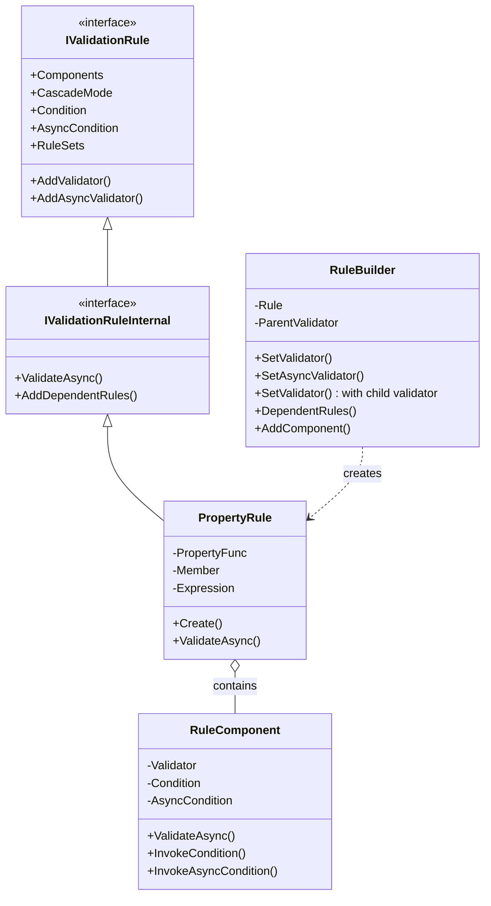
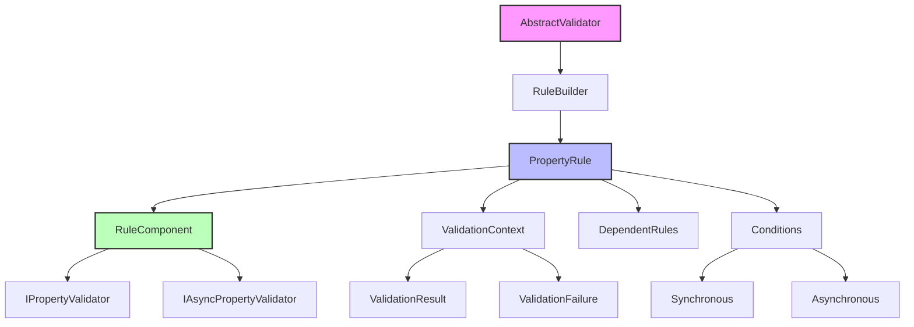
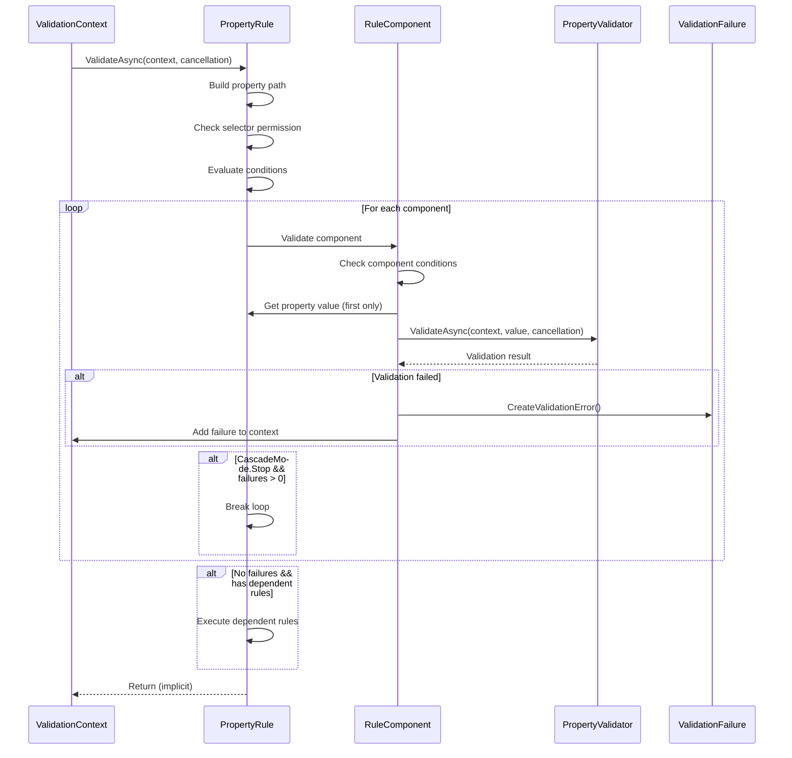
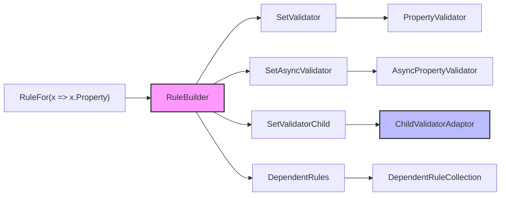
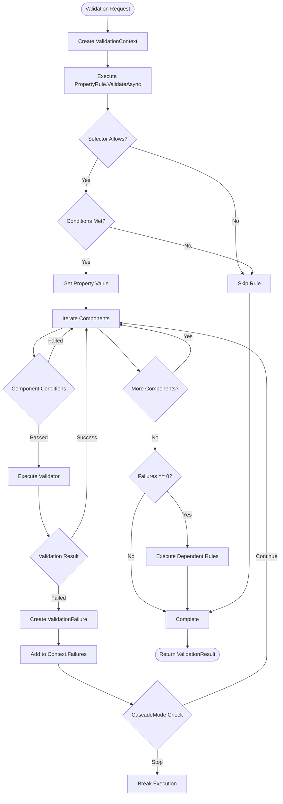
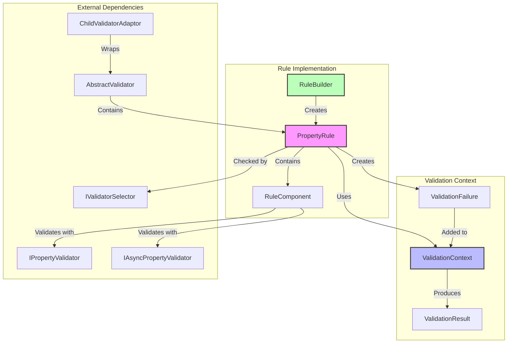

# Rule Implementation Module

## Introduction

The Rule Implementation module forms the core execution engine of the FluentValidation library, providing the fundamental infrastructure for defining, building, and executing validation rules. This module bridges the gap between the fluent API used to define validation rules and the actual validation execution, handling property access, condition evaluation, and validation result collection.

## Overview

The Rule Implementation module is responsible for:

- **Rule Definition**: Creating and configuring validation rules through the RuleBuilder
- **Property Validation**: Executing validation logic against object properties via PropertyRule
- **Component Management**: Managing validation components and their execution order
- **Condition Evaluation**: Handling both synchronous and asynchronous conditions
- **Result Collection**: Gathering and organizing validation failures
- **Dependent Rule Execution**: Managing rules that depend on the success of other rules

## Architecture

### Core Components



### Component Relationships



## Detailed Component Analysis

### PropertyRule

The `PropertyRule<T, TProperty>` class is the cornerstone of property validation in FluentValidation. It represents a validation rule associated with a specific property of an object and handles the complete validation lifecycle.

#### Key Responsibilities:

1. **Property Access**: Extracts property values using compiled lambda expressions for optimal performance
2. **Validation Execution**: Coordinates the execution of all validation components
3. **Condition Evaluation**: Evaluates both synchronous and asynchronous conditions
4. **Result Management**: Creates and manages validation failures
5. **Dependent Rule Handling**: Executes dependent rules when the primary rule succeeds

#### Validation Process Flow:



### RuleBuilder

The `RuleBuilder<T, TProperty>` class provides the fluent interface for configuring validation rules. It acts as a bridge between the user-friendly API and the internal rule representation.

#### Key Features:

1. **Validator Assignment**: Supports both synchronous and asynchronous validators
2. **Child Validator Integration**: Allows nesting validators for complex object graphs
3. **Dependent Rule Configuration**: Enables conditional rule execution
4. **Component Management**: Manages the addition of validation components to rules

#### Builder Pattern Implementation:



## Data Flow Architecture

### Validation Execution Flow



### Component Interaction



## Integration with Other Modules

### Core & Validation Execution Module
The Rule Implementation module heavily depends on the [Core & Validation Execution](Core & Validation Execution.md) module for:
- **ValidationContext**: Provides the execution context and failure collection
- **ValidationResult/ValidationFailure**: Manages validation outcomes
- **Validator Selection**: Uses selector components to determine rule execution eligibility
- **Configuration**: Leverages global validation settings

### Fluent API & Rule Definition Module
The Rule Implementation module is the target of the [Fluent API & Rule Definition](Fluent API & Rule Definition.md) module:
- **Rule Creation**: PropertyRule instances are created through the fluent API
- **Builder Integration**: RuleBuilder provides the implementation for fluent configuration methods
- **Component Registration**: Validation components are added through the builder interface

### Built-in Validators Module
The [Built-in Validators](Built-in Validators.md) module provides the actual validation logic:
- **Property Validators**: Concrete implementations of IPropertyValidator
- **Async Validators**: Support for asynchronous validation operations
- **Child Validators**: Nested validation through ChildValidatorAdaptor

## Key Design Patterns

### 1. Builder Pattern
The RuleBuilder implements the builder pattern to provide a fluent interface for rule configuration:

```csharp
RuleFor(x => x.Email)
    .NotEmpty()
    .EmailAddress()
    .When(x => x.RequiresEmail)
    .WithMessage("Please provide a valid email address");
```

### 2. Strategy Pattern
Different validator types (sync/async, child validators) are handled through a common interface:

```csharp
public interface IPropertyValidator<in T, in TProperty> {
    bool IsValid(ValidationContext<T> context, TProperty value);
}

public interface IAsyncPropertyValidator<in T, in TProperty> {
    Task<bool> IsValidAsync(ValidationContext<T> context, TProperty value, CancellationToken cancellation);
}
```

### 3. Chain of Responsibility
Validation components are executed in sequence, with cascade mode controlling continuation:

```csharp
foreach (var component in Components) {
    if (!await component.ValidateAsync(context, propValue, cancellation)) {
        // Handle failure
        if (cascade == CascadeMode.Stop) break;
    }
}
```

## Performance Considerations

### 1. Compiled Expression Caching
Property access expressions are compiled and cached for optimal performance:

```csharp
var compiled = AccessorCache<T>.GetCachedAccessor(member, expression, bypassCache);
```

### 2. Lazy Property Evaluation
Property values are only retrieved when needed (first component execution):

```csharp
if (first) {
    first = false;
    propValue = PropertyFunc(context.InstanceToValidate);
}
```

### 3. Early Termination
CascadeMode.Stop enables early termination on first failure, improving performance for validation-heavy scenarios.

## Error Handling

### 1. Null Reference Protection
Special handling for null reference exceptions with descriptive error messages:

```csharp
catch (NullReferenceException nre) {
    throw new NullReferenceException($"NullReferenceException occurred when executing rule for {Expression}. If this property can be null you should add a null check using a When condition", nre);
}
```

### 2. Async/Sync Consistency
The Zomp.SyncMethodGenerator ensures consistent behavior between sync and async execution paths.

## Usage Examples

### Basic Property Validation
```csharp
public class CustomerValidator : AbstractValidator<Customer> {
    public CustomerValidator() {
        RuleFor(x => x.Name)
            .NotEmpty()
            .Length(2, 50);
            
        RuleFor(x => x.Email)
            .NotEmpty()
            .EmailAddress();
    }
}
```

### Conditional Validation
```csharp
RuleFor(x => x.Discount)
    .GreaterThan(0)
    .When(x => x.IsPreferredCustomer)
    .WithMessage("Preferred customers must have a discount");
```

### Dependent Rules
```csharp
RuleFor(x => x.Password)
    .NotEmpty()
    .DependentRules(() => {
        RuleFor(x => x.ConfirmPassword)
            .NotEmpty()
            .Equal(x => x.Password);
    });
```

### Child Validator Integration
```csharp
RuleFor(x => x.Address)
    .SetValidator(new AddressValidator());
```

## Summary

The Rule Implementation module serves as the execution engine of FluentValidation, transforming high-level rule definitions into concrete validation operations. Through its sophisticated component model, it provides a flexible and extensible framework for property validation while maintaining excellent performance characteristics. The module's design enables complex validation scenarios including conditional execution, dependent rules, and nested validation, making it suitable for a wide range of validation requirements in enterprise applications.