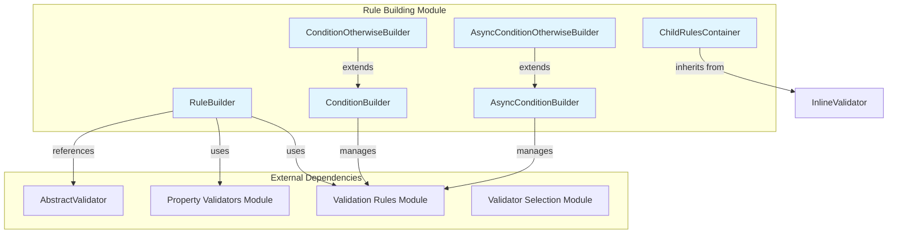
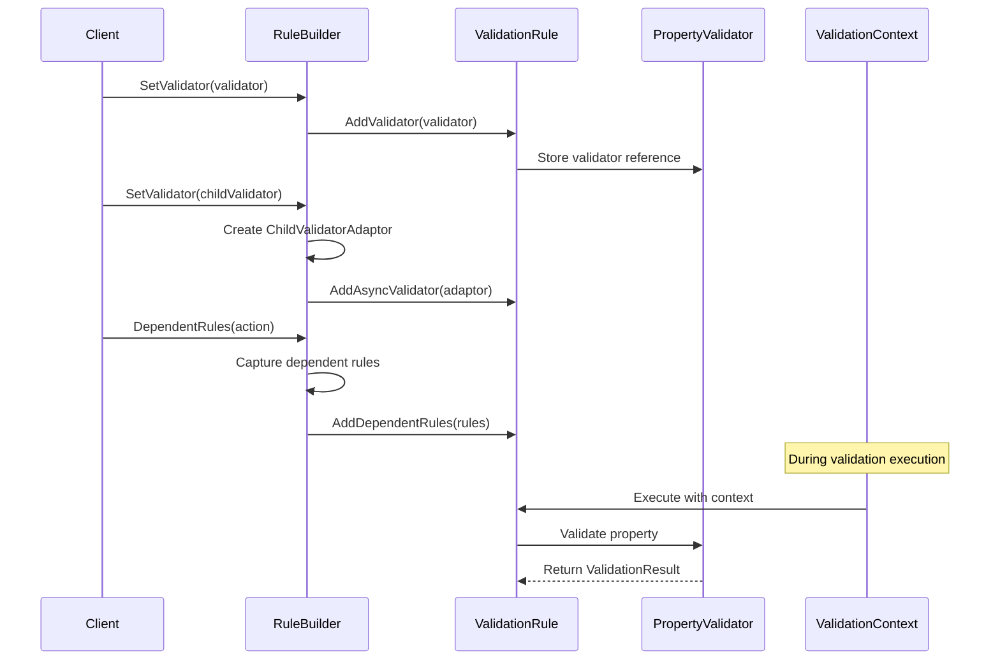

# Rule Building Module Documentation

## Overview

The Rule Building module is a core component of the FluentValidation framework that provides the infrastructure for constructing and configuring validation rules. This module serves as the bridge between the fluent API surface and the underlying validation rule implementation, enabling developers to build complex validation logic through an intuitive, chainable interface.

## Purpose

The Rule Building module is responsible for:
- **Rule Construction**: Building validation rules through a fluent API
- **Condition Management**: Applying conditional logic to validation rules
- **Validator Integration**: Connecting property validators to validation rules
- **Dependent Rule Handling**: Managing rules that depend on other validation outcomes
- **Child Rule Containerization**: Managing nested validation scenarios

## Architecture



## Core Components

### 1. RuleBuilder<T, TProperty>
The primary component responsible for constructing individual validation rules. It implements multiple interfaces to provide a comprehensive fluent API for rule configuration.

**Key Responsibilities:**
- Adding property validators to rules
- Setting child validators for complex property validation
- Managing dependent rules
- Adding rule components

**Interfaces Implemented:**
- `IRuleBuilderOptions<T, TProperty>`
- `IRuleBuilderInitial<T, TProperty>`
- `IRuleBuilderInitialCollection<T, TProperty>`
- `IRuleBuilderOptionsConditions<T, TProperty>`
- `IRuleBuilderInternal<T, TProperty>`

For detailed implementation details, see [Rule Building Core](Rule_Building_Core.md).

### 2. ConditionBuilder<T>
Manages conditional logic for groups of validation rules, allowing developers to apply conditions that affect multiple rules simultaneously.

**Key Features:**
- Shared condition evaluation with caching
- Support for both positive (When) and negative (Unless) conditions
- Integration with validation context for state management

### 3. AsyncConditionBuilder<T>
Provides asynchronous condition support for scenarios where condition evaluation requires async operations.

**Key Features:**
- Asynchronous condition evaluation
- Cancellation token support
- Result caching for performance optimization

### 4. ConditionOtherwiseBuilder<T> and AsyncConditionOtherwiseBuilder<T>
Handle the "otherwise" scenarios in conditional validation, allowing developers to define alternative validation rules when conditions are not met.

For comprehensive coverage of condition building patterns, see [Condition Building](Condition_Building.md).

### 5. ChildRulesContainer<T>
A specialized container for managing child validation rules in nested validation scenarios, particularly useful for complex object hierarchies.

For detailed information about child rules management, see [Child Rules Management](Child_Rules_Management.md).

## Data Flow



## Integration with Other Modules

### Validation Rules Module
The RuleBuilder works closely with the [Validation_Rules](Validation_Rules.md) module, using `IValidationRuleInternal<T, TProperty>` as the underlying rule implementation and adding validators to rule components.

### Property Validators Module
Integrates with the [Property_Validators](Property_Validators.md) module by wrapping property validators in rule components and managing their execution during validation.

### AbstractValidator Module
The RuleBuilder is typically used within the context of an [AbstractValidator](AbstractValidator.md), which manages the collection of rules and provides the fluent API entry point.

## Usage Patterns

### Basic Rule Building
```csharp
RuleFor(x => x.Property)
    .SetValidator(new NotNullValidator())
    .SetValidator(new LengthValidator(1, 100));
```

### Conditional Rules
```csharp
When(x => x.IsActive, () => {
    RuleFor(x => x.ActiveProperty).NotEmpty();
    RuleFor(x => x.AnotherProperty).GreaterThan(0);
});
```

### Dependent Rules
```csharp
RuleFor(x => x.Property)
    .NotEmpty()
    .DependentRules(() => {
        RuleFor(x => x.DependentProperty).NotNull();
    });
```

## Performance Considerations

- **Condition Caching**: Shared conditions are cached per validation instance to avoid redundant evaluations
- **Async Validator Fallback**: Async validators that support synchronous execution are used as fallbacks for better performance
- **Rule Set Propagation**: Rule sets are automatically propagated to dependent rules for consistent validation behavior

## Thread Safety

The Rule Building module is designed to be used during validator configuration (typically at application startup) and is not thread-safe for concurrent rule modification. Once configured, the resulting validation rules are immutable and thread-safe for execution.