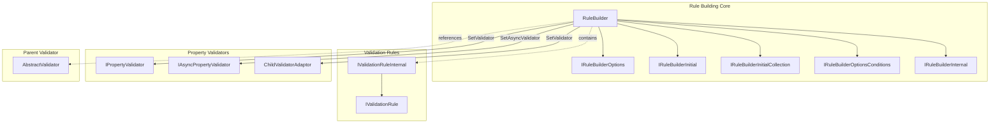
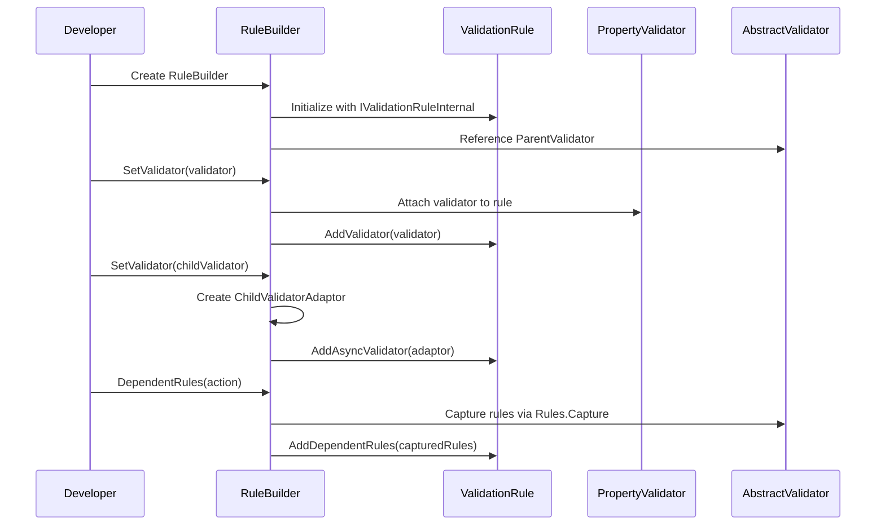
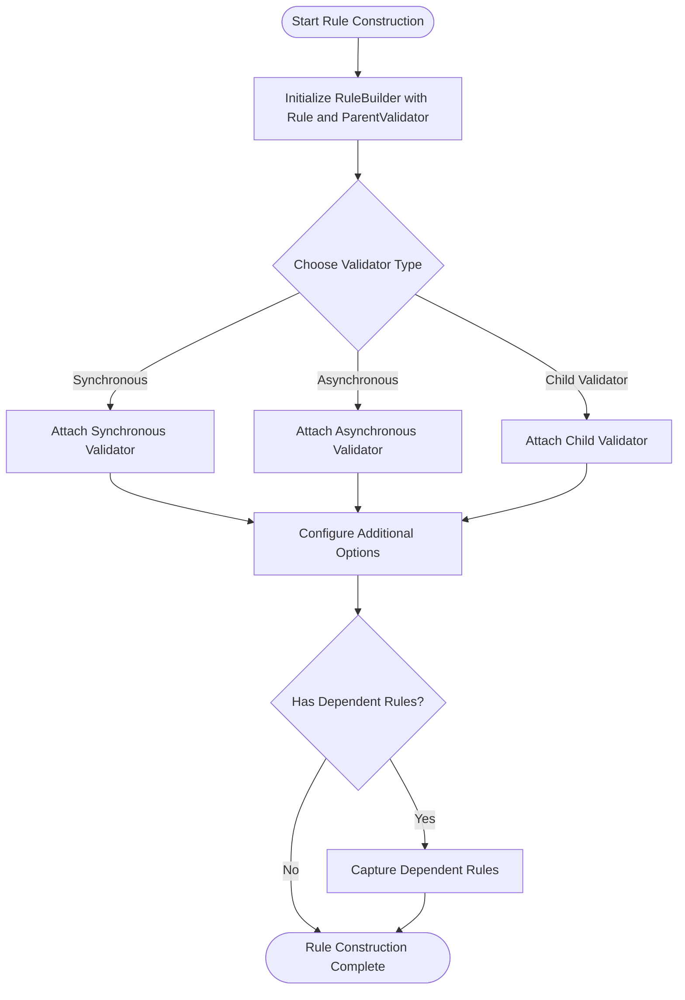

# Rule Building Core Module Documentation

## Introduction

The Rule Building Core module is the foundational component of the FluentValidation library's rule construction system. It provides the essential infrastructure for creating, configuring, and managing validation rules through a fluent API. This module serves as the primary interface between developers and the validation engine, enabling intuitive rule definition while maintaining type safety and extensibility.

## Architecture Overview

The Rule Building Core module is built around the `RuleBuilder<T, TProperty>` class, which implements multiple interfaces to provide a comprehensive fluent API for rule construction. The module acts as a bridge between the high-level validation syntax and the internal validation rule infrastructure.



## Core Components

### RuleBuilder<T, TProperty>

The `RuleBuilder<T, TProperty>` class is the central component of this module. It provides a fluent interface for configuring validation rules with the following key responsibilities:

- **Validator Attachment**: Attaches property validators and async validators to rules
- **Child Validator Integration**: Manages nested validator relationships
- **Dependent Rule Management**: Handles rule dependencies and conditional execution
- **Component Management**: Manages rule components and their configuration

#### Key Properties

- `Rule`: The underlying `IValidationRuleInternal<T, TProperty>` being constructed
- `ParentValidator`: Reference to the parent `AbstractValidator<T>` for context

#### Core Methods

- `SetValidator(IPropertyValidator<T, TProperty>)`: Attaches synchronous property validators
- `SetAsyncValidator(IAsyncPropertyValidator<T, TProperty>)`: Attaches asynchronous validators
- `SetValidator(IValidator<TProperty>, string[])`: Attaches child validators with ruleset support
- `DependentRules(Action)`: Configures dependent rule execution

## Data Flow Architecture



## Component Interactions

The Rule Building Core module interacts with several key system components:

### Integration with Validation Rules Module
The RuleBuilder works directly with `IValidationRuleInternal<T, TProperty>` implementations, which are part of the [Validation_Rules](Validation_Rules.md) module. The builder adds validators and components to these rules, effectively constructing the validation logic.

### Integration with Property Validators Module
Through the `SetValidator` methods, the RuleBuilder integrates with various property validators from the [Property_Validators](Property_Validators.md) module, including:
- Synchronous validators (`IPropertyValidator<T, TProperty>`)
- Asynchronous validators (`IAsyncPropertyValidator<T, TProperty>`)
- Child validator adaptors for nested validation

### Integration with AbstractValidator Module
The RuleBuilder maintains a reference to the parent `AbstractValidator<T>` (from the [AbstractValidator](AbstractValidator.md) module) to:
- Capture dependent rules during rule construction
- Provide context for rule execution
- Enable fluent API chaining

## Rule Construction Process



## Key Features

### Type Safety
The RuleBuilder maintains strong typing throughout the rule construction process, ensuring that property validators are compatible with the property type being validated.

### Fluent API Design
The builder implements multiple interfaces to provide a comprehensive and discoverable API:
- `IRuleBuilderInitial<T, TProperty>`: Initial rule configuration
- `IRuleBuilderOptions<T, TProperty>`: Validator attachment options
- `IRuleBuilderOptionsConditions<T, TProperty>`: Conditional rule configuration

### Async/Sync Duality
The module seamlessly handles both synchronous and asynchronous validation scenarios, automatically managing fallback mechanisms when async validators support synchronous execution.

### Dependent Rule Management
The `DependentRules` functionality allows for complex validation scenarios where rules depend on the execution of other rules, with automatic ruleset inheritance.

## Usage Patterns

### Basic Validator Attachment
```csharp
RuleFor(x => x.Property)
    .SetValidator(new NotNullValidator<T, TProperty>())
    .SetAsyncValidator(new AsyncPredicateValidator<T, TProperty>(async (value, context, cancellationToken) => {
        // Async validation logic
        return await SomeAsyncValidation(value);
    }));
```

### Child Validator Configuration
```csharp
RuleFor(x => x.NestedObject)
    .SetValidator(new NestedObjectValidator())
    .SetValidator((instance, property) => new DynamicValidator(instance, property));
```

### Dependent Rules
```csharp
RuleFor(x => x.PrimaryProperty)
    .NotEmpty()
    .DependentRules(() => {
        RuleFor(x => x.DependentProperty).NotEmpty();
        RuleFor(x => x.AnotherDependentProperty).GreaterThan(0);
    });
```

## Dependencies

The Rule Building Core module depends on:
- [Validation_Rules](Validation_Rules.md): For rule interfaces and implementations
- [Property_Validators](Property_Validators.md): For validator implementations
- [AbstractValidator](AbstractValidator.md): For parent validator context
- [InlineValidator](InlineValidator.md): For inline validation scenarios

## Extensibility Points

The module provides several extension points:
- Custom property validators implementing `IPropertyValidator<T, TProperty>`
- Custom async validators implementing `IAsyncPropertyValidator<T, TProperty>`
- Custom child validator adaptors for complex nested validation scenarios
- Rule component extensions through the `AddComponent` method

## Performance Considerations

- The RuleBuilder uses internal caching mechanisms to optimize validator creation
- Dependent rule capture is designed to minimize memory allocations during rule construction
- Async validator fallback mechanisms ensure optimal execution paths based on context

## Thread Safety

RuleBuilder instances are not thread-safe and should be used within a single thread during rule construction. Once rules are built and attached to validators, the resulting validation rules are thread-safe for execution.