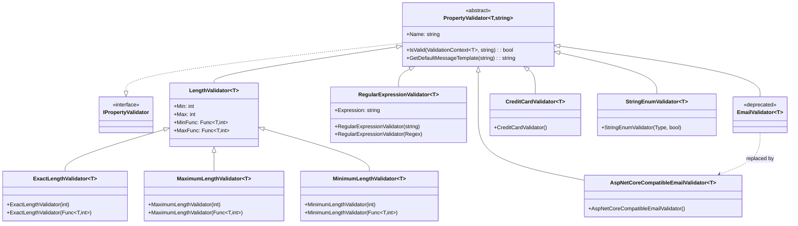
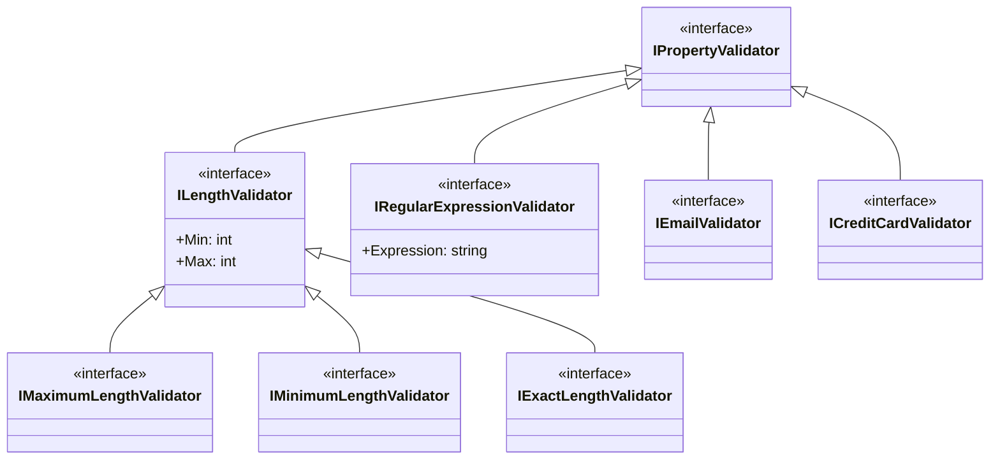
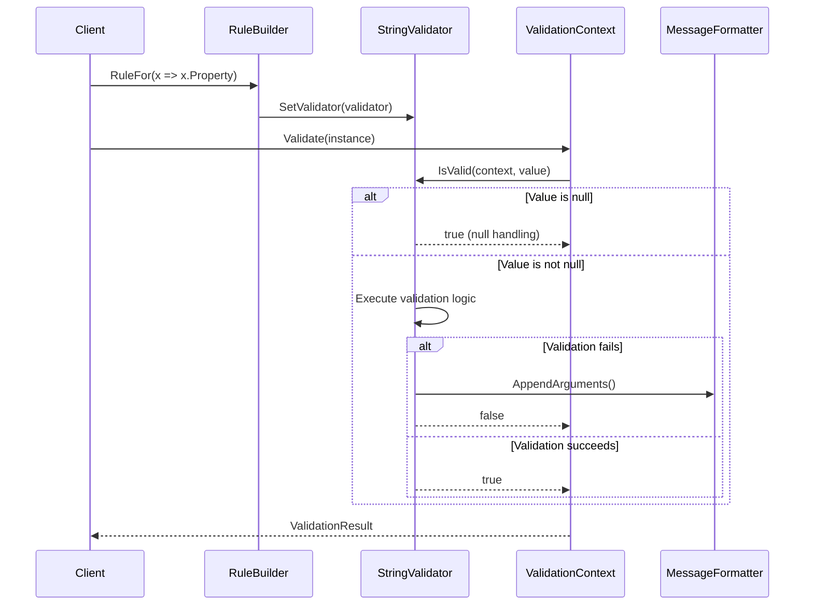
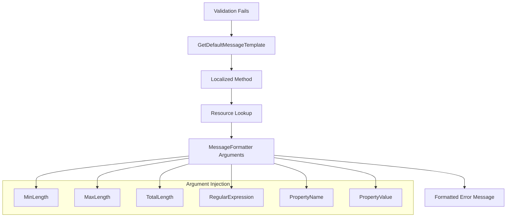
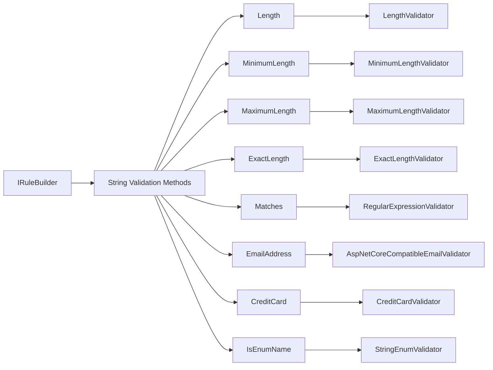
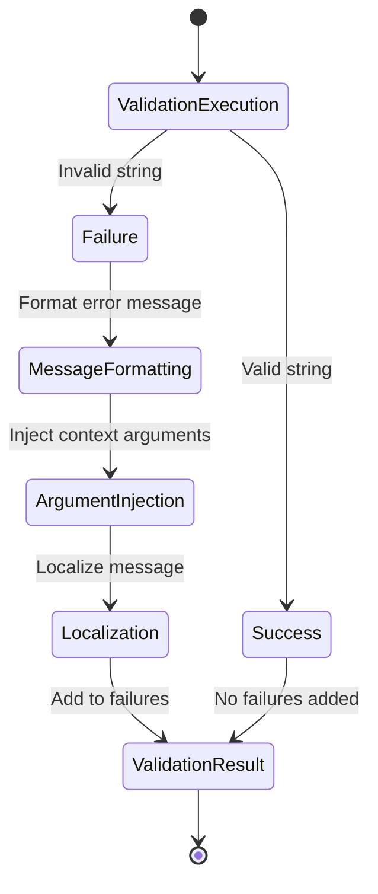

# String Validators Module

## Introduction

The String Validators module is a comprehensive collection of validation components specifically designed for string property validation within the FluentValidation framework. This module provides essential validators for common string validation scenarios including length constraints, pattern matching, email validation, credit card validation, and enum name validation. These validators form the backbone of string-based validation rules in .NET applications, offering both synchronous validation capabilities and flexible configuration options.

## Overview

String validation is one of the most common validation requirements in application development. The String Validators module addresses this need by providing a robust set of pre-built validators that handle various string validation scenarios with performance optimization and internationalization support. Each validator is designed to integrate seamlessly with the FluentValidation rule builder pattern while providing detailed error messages and flexible configuration options.

## Architecture

### Core Architecture

The String Validators module follows a hierarchical design pattern where all string validators inherit from a common base class `PropertyValidator<T, string>`. This inheritance structure ensures consistent behavior across all string validators while allowing for specialized validation logic in each implementation.



### Interface Hierarchy

The module defines specialized interfaces for different categories of string validators, enabling polymorphic behavior and type-safe validation rule construction.



## Component Details

### Length Validators

The length validation family provides comprehensive string length validation capabilities with support for both static and dynamic length constraints.

#### LengthValidator<T>
The base length validator that validates string length against minimum and maximum constraints.

**Key Features:**
- Static length validation with fixed min/max values
- Dynamic length validation using context-dependent functions
- Null value handling (null values are considered valid)
- Configurable maximum length (-1 indicates no maximum)

**Usage Patterns:**
```csharp
// Static length validation
RuleFor(x => x.Username).Length(3, 20);

// Dynamic length validation
RuleFor(x => x.Description).Length(x => x.MinLength, x => x.MaxLength);
```

#### Specialized Length Validators
- **ExactLengthValidator**: Validates exact string length
- **MaximumLengthValidator**: Validates maximum string length only
- **MinimumLengthValidator**: Validates minimum string length only

### Regular Expression Validator

The RegularExpressionValidator provides pattern-based string validation using .NET's Regex engine with built-in performance optimizations.

**Key Features:**
- Static regex patterns with compilation optimization
- Dynamic regex patterns based on context
- Configurable regex options
- Timeout protection (2-second default)
- Null value handling

**Usage Patterns:**
```csharp
// Static pattern
RuleFor(x => x.PostalCode).Matches(@"^\d{5}(-\d{4})?$");

// Dynamic pattern
RuleFor(x => x.Pattern).Matches(x => x.ExpectedPattern);

// Compiled regex with options
RuleFor(x => x.Identifier).Matches(new Regex(@"^[A-Z]{2}\d{6}$", RegexOptions.Compiled));
```

### Email Validators

The module provides two email validation approaches, with the legacy regex-based validator being deprecated in favor of ASP.NET Core compatible validation.

#### AspNetCoreCompatibleEmailValidator<T>
Implements simplified email validation compatible with ASP.NET Core's email validation logic.

**Validation Logic:**
- Ensures exactly one '@' character
- '@' character is not the first or last character
- Performs basic format validation without complex regex patterns

**Benefits:**
- Better performance than regex-based validation
- Reduced false positives
- Consistent with ASP.NET Core standards

### Credit Card Validator

The CreditCardValidator implements the Luhn algorithm for credit card number validation with preprocessing capabilities.

**Key Features:**
- Luhn algorithm validation
- Automatic removal of formatting characters (- and spaces)
- Digit-only validation after preprocessing
- Support for all major credit card formats

**Validation Process:**
1. Remove formatting characters
2. Validate that all remaining characters are digits
3. Apply Luhn algorithm checksum validation

### String Enum Validator

The StringEnumValidator validates that string values match valid enum names, providing case-sensitive or case-insensitive validation options.

**Key Features:**
- Type-safe enum validation
- Case-sensitive and case-insensitive modes
- Compile-time enum type checking
- Support for all enum types

## Data Flow

### Validation Execution Flow



### Message Formatting Flow



## Integration with FluentValidation

### Rule Builder Integration

String validators integrate seamlessly with the FluentValidation rule builder pattern, providing a fluent API for validation rule construction.



### Validation Context Usage

String validators leverage the [Validation Context Management](Validation%20Context%20Management.md) module for accessing validation context, instance data, and message formatting capabilities.

**Key Dependencies:**
- `ValidationContext<T>` for context access
- `MessageFormatter` for error message construction
- `IValidationContext` for failure tracking

## Performance Considerations

### Regex Compilation
The RegularExpressionValidator automatically compiles regex patterns for better performance when the same pattern is used repeatedly.

### Null Handling
All string validators implement efficient null handling by treating null values as valid, reducing unnecessary validation overhead.

### Memory Optimization
Validators reuse compiled regex instances and minimize object allocation during validation execution.

## Localization Support

String validators integrate with the [Localization](Localization.md) module to provide translated error messages based on the current culture settings.

**Localization Features:**
- Culture-specific error messages
- Resource-based message templates
- Dynamic message formatting with localized argument names

## Error Handling

### Validation Failure Handling

When validation fails, string validators provide detailed error information through the validation context:



### Exception Handling

- **ArgumentOutOfRangeException**: Thrown when invalid length constraints are specified
- **ArgumentNullException**: Thrown when required parameters are null
- **ArgumentException**: Thrown when invalid enum types are provided

## Best Practices

### Performance Optimization
1. Use compiled regex patterns for frequently used validations
2. Leverage dynamic validators for context-dependent validation
3. Implement proper null handling to avoid unnecessary validation

### Validation Design
1. Choose the most specific validator for your use case
2. Use AspNetCoreCompatibleEmailValidator instead of the deprecated EmailValidator
3. Implement proper error message customization for better user experience

### Integration Patterns
1. Combine multiple string validators for comprehensive validation
2. Use conditional validation for complex business rules
3. Leverage the rule builder's fluent API for readable validation rules

## Dependencies

### Core Dependencies
- [Validation Context Management](Validation%20Context%20Management.md) - For validation context and message formatting
- [Validation Results and Failures](Validation%20Results%20and%20Failures.md) - For validation result handling
- [Localization](Localization.md) - For error message localization

### Related Modules
- [Built-in Validators](Built-in%20Validators.md) - Parent module containing all built-in validators
- [Fluent API & Rule Definition](Fluent%20API%20&%20Rule%20Definition.md) - For rule builder integration

## Conclusion

The String Validators module provides a comprehensive, performant, and extensible solution for string validation within the FluentValidation framework. Its well-designed architecture, extensive feature set, and seamless integration with the broader validation ecosystem make it an essential component for any .NET application requiring robust string validation capabilities.