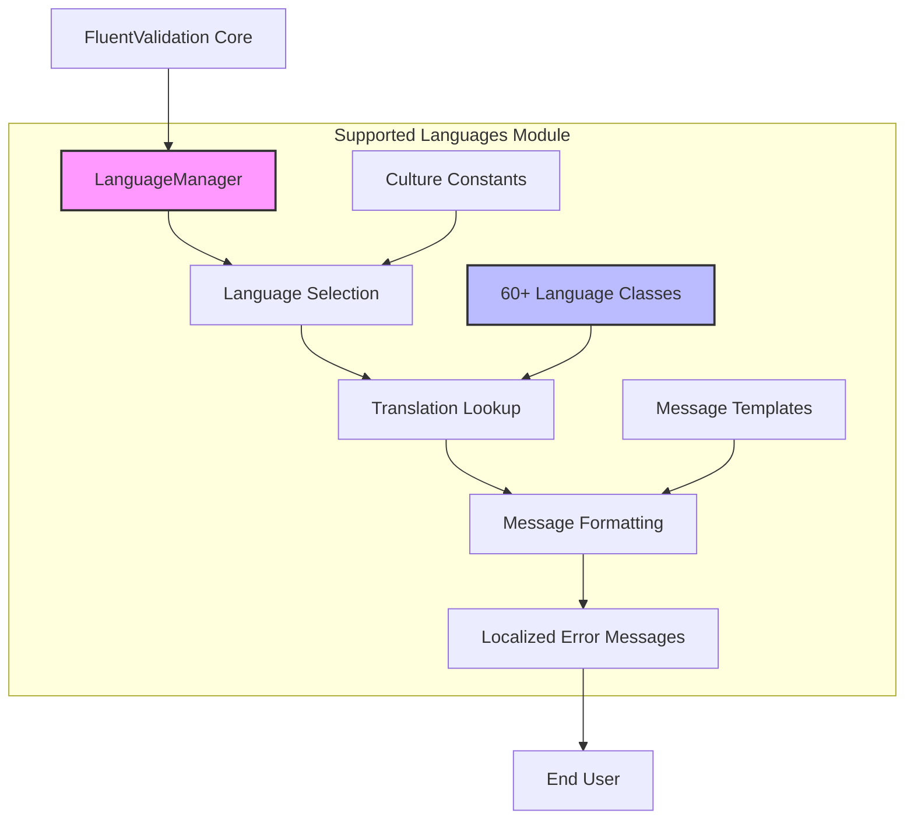
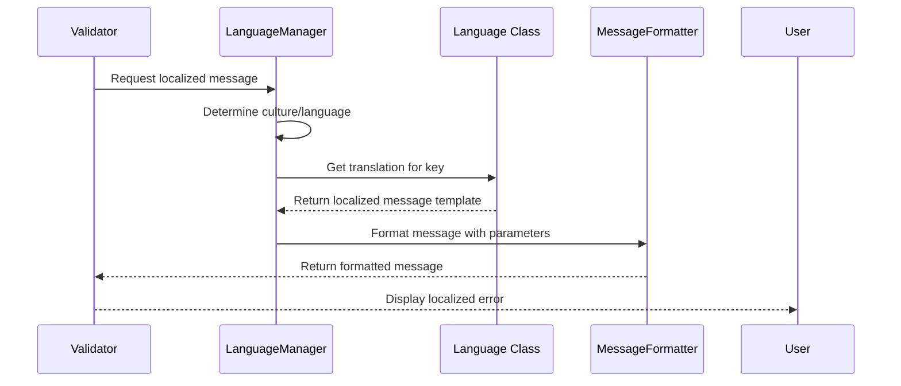

# Supported Languages Module

## Overview

The **Supported Languages** module is a comprehensive localization system within the FluentValidation framework that provides validation error messages in over 60 languages. This module ensures that validation feedback can be delivered to end users in their native language, making applications more accessible and user-friendly across different regions and cultures.

## Purpose and Core Functionality

The primary purpose of this module is to:
- Provide localized validation error messages for all built-in validators
- Support culture-specific formatting and linguistic conventions
- Enable automatic language selection based on user preferences or application settings
- Maintain consistency in validation messaging across different languages
- Support both standard and fallback message formats for client-side validation integration

## Architecture Overview



## Module Structure

The Supported Languages module is organized into several key components:

### 1. Language Management System
- **LanguageManager**: Central component that manages language selection and message retrieval
- **ILanguageManager**: Interface defining the contract for language management
- **Culture-based selection**: Automatic language detection based on culture codes

### 2. Individual Language Implementations
Each language is implemented as a separate internal class containing:
- Culture code constant (e.g., "en", "es", "fr", "zh-Hans")
- Static translation method with switch-based key lookup
- Localized validation messages for all validator types
- Fallback messages for client-side validation

### 3. Message Formatting Integration
- **MessageFormatter**: Handles placeholder substitution in localized messages
- **MessageBuilderContext**: Provides context for message construction
- Support for dynamic property names, values, and validation parameters

## Supported Languages

The module includes comprehensive support for the following languages and cultures, organized by geographic regions:

### European Languages
For detailed information about European language implementations, see [European Languages](European Languages.md).

**Supported European languages include:**
- **Albanian** (sq)
- **Basque** (eu) 
- **Bosnian** (bs)
- **Bulgarian** (bg)
- **Catalan** (ca)
- **Croatian** (hr)
- **Czech** (cs)
- **Danish** (da)
- **Dutch** (nl)
- **English** (en, en-US, en-GB)
- **Estonian** (et)
- **Finnish** (fi)
- **French** (fr)
- **Georgian** (ka)
- **German** (de)
- **Greek** (el)
- **Hungarian** (hu)
- **Icelandic** (is)
- **Italian** (it)
- **Latvian** (lv)
- **Macedonian** (mk)
- **Norwegian** (nb, nn)
- **Polish** (pl)
- **Portuguese** (pt, pt-BR)
- **Romanian** (ro)
- **Romansh** (rm)
- **Russian** (ru)
- **Serbian** (sr, sr-Latn)
- **Slovak** (sk)
- **Slovenian** (sl)
- **Spanish** (es)
- **Swedish** (sv)
- **Turkish** (tr)
- **Ukrainian** (uk)
- **Welsh** (cy)

### Asian Languages
For detailed information about Asian language implementations, see [Asian Languages](Asian Languages.md).

**Supported Asian languages include:**
- **Arabic** (ar)
- **Azerbaijani** (az)
- **Bengali** (bn)
- **Chinese Simplified** (zh-Hans)
- **Chinese Traditional** (zh-Hant)
- **Hebrew** (he)
- **Hindi** (hi)
- **Indonesian** (id)
- **Japanese** (ja)
- **Kazakh** (kk)
- **Khmer** (km)
- **Korean** (ko)
- **Persian** (fa)
- **Tajik** (tg)
- **Tamil** (ta)
- **Telugu** (te)
- **Thai** (th)
- **Uzbek** (uz, uz-Cyrl)
- **Vietnamese** (vi)

## Message Types Supported

Each language implementation provides translations for all validation message types:

### Basic Validators
- Email validation
- String length validation (minimum, maximum, exact, range)
- Comparison validators (greater than, less than, equal, not equal)
- Range validators (inclusive, exclusive)
- Null/empty validation

### Advanced Validators
- Regular expression validation
- Credit card number validation
- Enum validation
- Scale and precision validation for numeric types
- Predicate-based custom validation

### Client-side Integration Messages
Simplified versions of messages for client-side validation frameworks, including:
- Length validation messages
- Range validation messages
- Basic comparison messages

## Integration with FluentValidation



## Key Features

### 1. Automatic Culture Detection
The system automatically detects the appropriate language based on:
- Current thread culture
- Explicitly set culture
- Fallback to English if culture not supported

### 2. Consistent Message Structure
All languages maintain consistent:
- Message template structure
- Placeholder naming conventions
- Parameter substitution patterns

### 3. Extensibility
- Easy addition of new languages
- Consistent implementation pattern
- Culture-specific customization support

### 4. Performance Optimization
- Static translation methods for fast lookup
- Cached message templates
- Minimal memory footprint per language

## Usage Examples

### Basic Language Selection
```csharp
// Automatic language selection based on current culture
var validator = new MyValidator();

// Explicit language setting
ValidatorOptions.LanguageManager = new LanguageManager {
    Culture = new CultureInfo("es")
};
```

### Custom Message Integration
```csharp
// Accessing localized messages directly
var language = new SpanishLanguage();
var message = language.GetTranslation("EmailValidator");
// Returns: "'{PropertyName}' no es una dirección de correo electrónico válida."
```

## Dependencies

The Supported Languages module integrates with:
- **[Language Management](Language Management.md)**: Core language selection and management
- **[Message Formatting](Message Formatting.md)**: Template processing and parameter substitution
- **[FluentValidation Core](FluentValidation Core.md)**: Validation rule execution and message display

## Benefits

1. **Global Reach**: Support for 60+ languages enables worldwide application deployment
2. **User Experience**: Native language validation messages improve user comprehension
3. **Consistency**: Standardized message structure across all languages
4. **Maintainability**: Centralized language management and easy updates
5. **Performance**: Efficient static translation lookup with minimal overhead
6. **Extensibility**: Simple pattern for adding new languages or customizing existing ones

## Future Considerations

- **RTL Language Support**: Enhanced support for right-to-left languages
- **Regional Variants**: Support for regional dialects and variations
- **Dynamic Language Switching**: Runtime language changes without application restart
- **Translation Management**: Tools for managing and updating translations
- **Community Contributions**: Framework for community-submitted translations

The Supported Languages module is essential for creating truly international applications with FluentValidation, ensuring that validation feedback is accessible and meaningful to users regardless of their language or location.