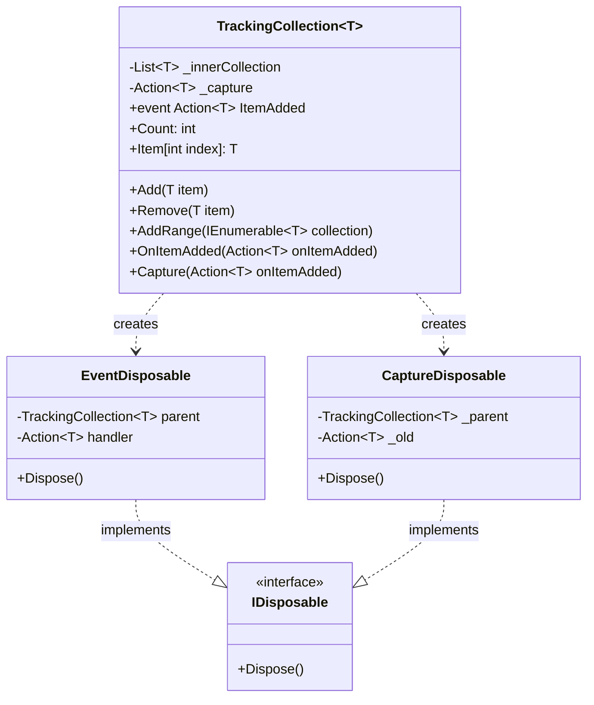
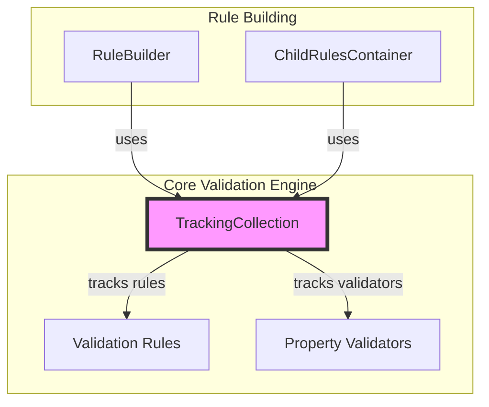
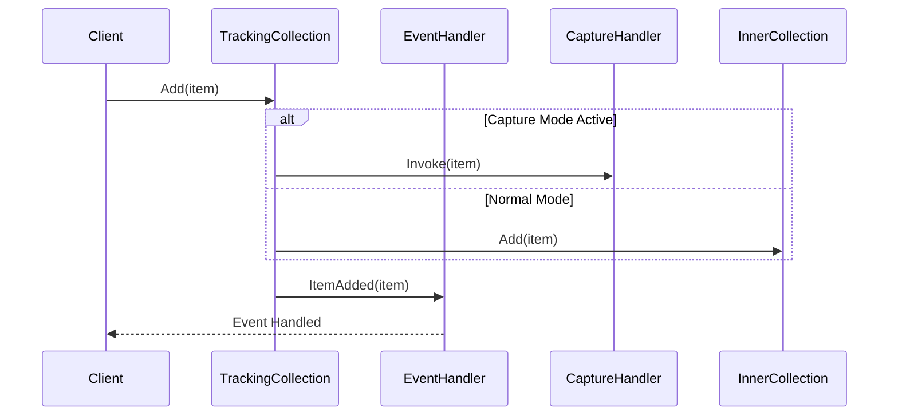
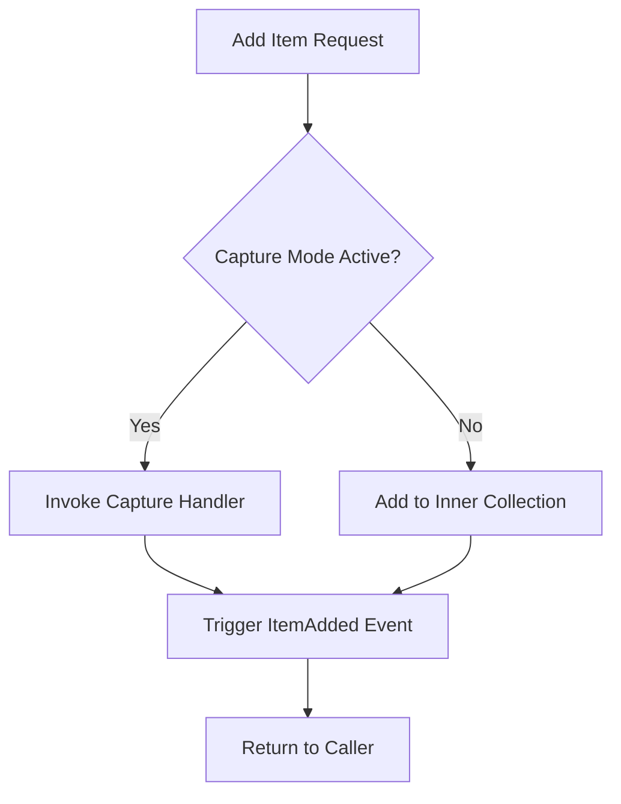
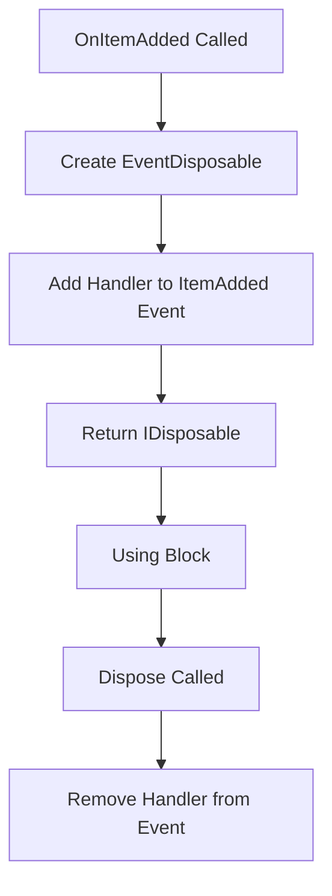

# Tracking Collection Module

## Introduction

The Tracking Collection module provides a specialized collection implementation that extends standard collection functionality with event-driven tracking capabilities. This internal component serves as a foundational utility within the FluentValidation framework, enabling real-time monitoring and interception of collection operations, particularly item additions.

## Overview

The `TrackingCollection<T>` is a generic collection that wraps a standard `List<T>` while providing additional capabilities for tracking when items are added to the collection. This functionality is crucial for scenarios where validation rules need to be dynamically managed or when external components need to be notified of collection changes.

## Architecture

### Core Component Structure



### Integration with Validation Framework



## Key Features

### 1. Event-Driven Architecture
The collection provides an `ItemAdded` event that is triggered whenever an item is added to the collection, enabling reactive programming patterns.

### 2. Item Capture Mechanism
The collection supports a capture mode where added items can be intercepted and processed by a capture handler instead of being added to the internal collection.

### 3. Disposable Event Management
Both event subscriptions and capture modes are managed through disposable objects, ensuring proper cleanup and preventing memory leaks.

## Component Details

### TrackingCollection<T>

The main collection class that provides the following functionality:

- **Generic Collection Operations**: Standard collection operations like Add, Remove, AddRange
- **Event Notification**: Raises events when items are added
- **Item Capture**: Supports intercepting items before they are added
- **Thread-Safe Event Management**: Uses disposable patterns for event subscription management

### EventDisposable

A private nested class that implements `IDisposable` to manage event subscription lifecycle:
- Automatically removes event handlers when disposed
- Prevents memory leaks by ensuring proper cleanup

### CaptureDisposable

A private nested class that manages the capture mode lifecycle:
- Temporarily replaces the normal add behavior with a capture handler
- Restores the previous capture handler when disposed
- Enables temporary interception of collection operations

## Usage Patterns

### Standard Collection Usage
```csharp
var trackingCollection = new TrackingCollection<ValidationRule>();
trackingCollection.Add(new ValidationRule());
```

### Event Subscription
```csharp
using (trackingCollection.OnItemAdded(item => Console.WriteLine($"Added: {item}")))
{
    trackingCollection.Add(item); // Will trigger the event
}
// Event handler is automatically removed after disposal
```

### Item Capture
```csharp
using (trackingCollection.Capture(item => ProcessItem(item)))
{
    trackingCollection.Add(item); // Item is processed instead of being added
}
// Capture mode is automatically disabled after disposal
```

## Dependencies

The Tracking Collection module has minimal dependencies:

- **System.Collections**: For basic collection interfaces
- **System.Collections.Generic**: For generic collection support
- **System**: For IDisposable and Action delegates

## Integration Points

### With Validation Rules Module
The TrackingCollection is used to manage collections of validation rules, allowing the validation engine to track when new rules are added and react accordingly.

### With Rule Building Module
Rule builders use TrackingCollection to manage rule collections, enabling dynamic rule construction and modification.

### With Property Validators Module
Collections of property validators are managed through TrackingCollection, allowing the validation system to monitor validator additions.

## Data Flow



## Process Flow

### Item Addition Process


### Event Subscription Process


## Benefits

1. **Reactive Programming**: Enables reactive patterns within the validation framework
2. **Memory Safety**: Proper cleanup through disposable patterns
3. **Flexibility**: Supports both normal collection operations and item interception
4. **Performance**: Minimal overhead over standard List<T> operations
5. **Extensibility**: Can be used with any type, making it highly reusable

## Best Practices

1. **Always Dispose**: Use `using` statements for event subscriptions and capture modes
2. **Avoid Long-Running Captures**: Capture mode should be used temporarily
3. **Handle Events Efficiently**: Keep event handlers lightweight to avoid performance impact
4. **Thread Safety**: Be aware that the collection itself is not thread-safe for concurrent modifications

## Related Modules

- [Validation_Rules](Validation_Rules.md) - Uses TrackingCollection for rule management
- [Rule_Building](Rule_Building.md) - Utilizes TrackingCollection in rule builders
- [Property_Validators](Property_Validators.md) - Manages validator collections with TrackingCollection

## Conclusion

The Tracking Collection module provides a robust foundation for managing collections within the FluentValidation framework. Its event-driven design and capture capabilities make it an essential component for building reactive and extensible validation systems. The careful implementation of disposable patterns ensures memory safety while maintaining high performance and flexibility.