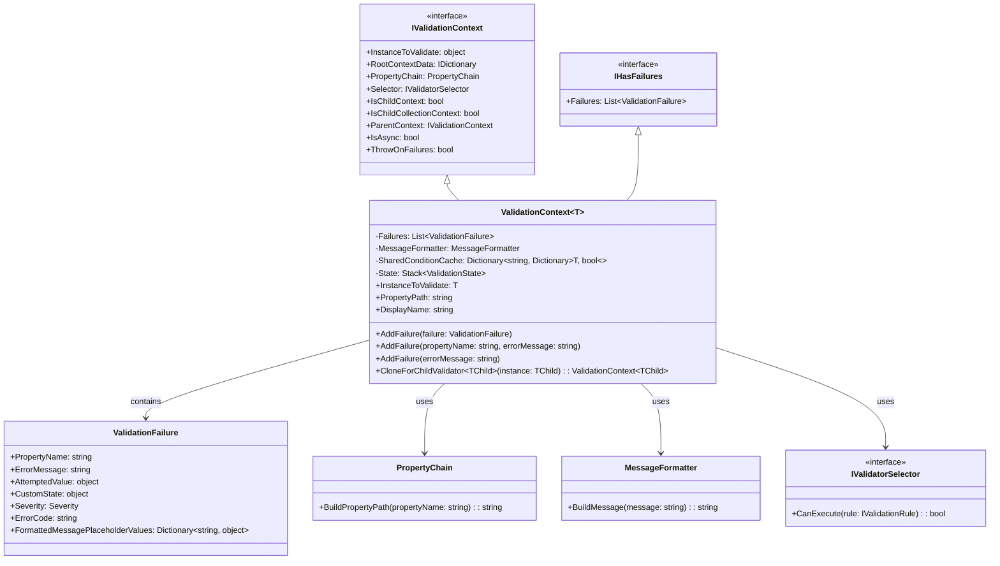
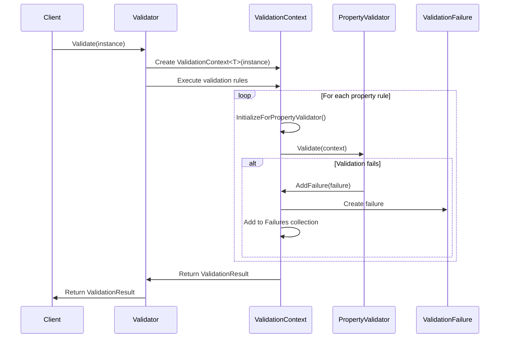
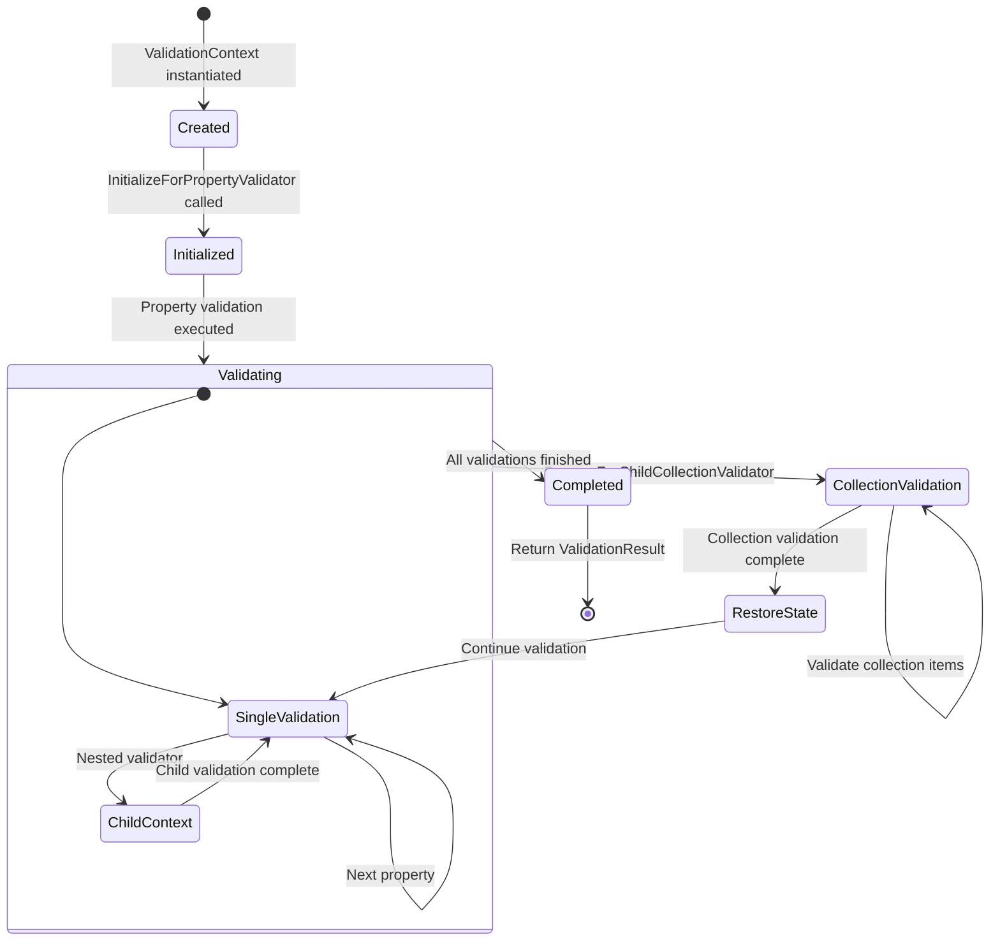
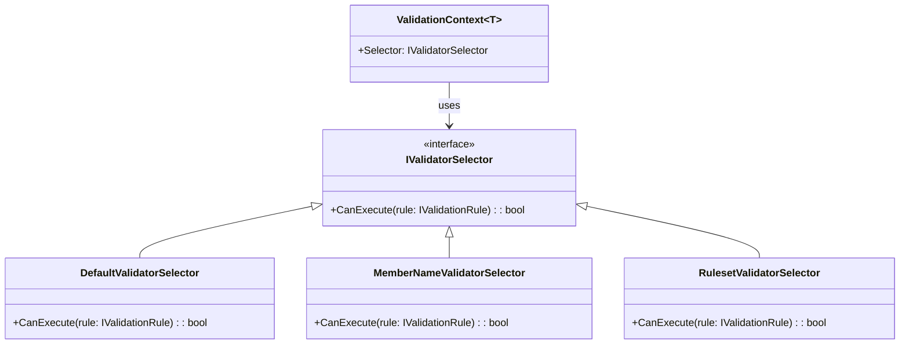
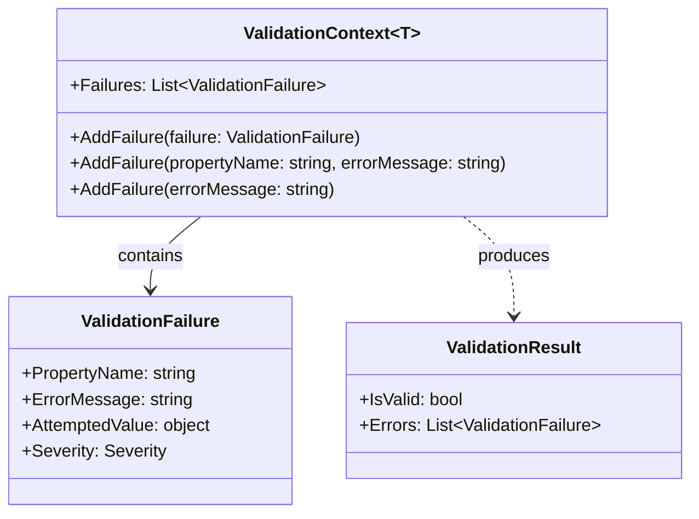

# Validation Context Management

## Introduction

The Validation Context Management module is the central orchestration system within FluentValidation that manages the state and flow of validation operations. It provides the foundational infrastructure for tracking validation state, managing property hierarchies, handling validation failures, and coordinating between parent and child validation contexts.

This module serves as the backbone of the validation execution pipeline, ensuring that validation rules are executed within the appropriate context and that validation results are properly collected and propagated throughout the validation hierarchy.

## Architecture Overview

The Validation Context Management module is built around three core interfaces and implementations that work together to provide a comprehensive validation state management system:

### Core Components



## Component Details

### IValidationContext Interface

The `IValidationContext` interface defines the contract for all validation contexts within FluentValidation. It provides access to essential validation state information including the instance being validated, property hierarchy, selector configuration, and contextual flags that control validation behavior.

**Key Responsibilities:**
- Expose the object instance being validated
- Provide access to root-level context data shared across validation operations
- Manage property chain information for nested validation scenarios
- Control validation execution through selector configuration
- Track parent-child relationships in validation hierarchies
- Handle async validation state and exception behavior

### IHasFailures Interface

The `IHasFailures` interface provides a simple contract for accessing validation failures. This interface is implemented by validation contexts to expose the collection of validation failures that have been detected during validation execution.

**Key Responsibilities:**
- Provide access to the collection of validation failures
- Enable failure collection manipulation for internal validation processes

### ValidationContext<T> Class

The `ValidationContext<T>` class is the concrete implementation that orchestrates validation operations. It maintains the complete state of a validation operation and provides mechanisms for failure collection, property path management, and child context creation.

**Key Responsibilities:**
- Manage validation state for a specific type instance
- Collect and organize validation failures
- Handle property path construction and display name resolution
- Support child context creation for nested validation scenarios
- Manage shared condition caching for performance optimization
- Provide state management for collection validation scenarios

## Data Flow Architecture



## Context Lifecycle and State Management



## Integration with Other Modules

### Validator Selection System
The Validation Context Management module works closely with the [Validator Selection System](Validator%20Selection%20System.md) to control which validation rules should be executed based on the current context:



### Validation Results and Failures
The module integrates with the [Validation Results and Failures](Validation%20Results%20and%20Failures.md) module to collect and manage validation failures:



## Key Features and Capabilities

### 1. Hierarchical Validation Support
The module provides comprehensive support for nested validation scenarios through parent-child context relationships:

- **Child Context Creation**: `CloneForChildValidator<TChild>()` method creates new contexts for nested validators
- **State Preservation**: Parent context state is maintained while child validations execute
- **Property Path Management**: Automatic construction of property paths for nested properties
- **Collection Validation**: Special handling for collection validation with state management

### 2. Performance Optimization
Several mechanisms are built into the module to optimize validation performance:

- **Shared Condition Cache**: Caches condition evaluation results to avoid redundant calculations
- **State Management**: Efficient state stacking for collection validation scenarios
- **Context Reuse**: Ability to convert between generic and non-generic contexts

### 3. Flexible Failure Management
The module provides multiple ways to add validation failures:

- **Direct Failure Addition**: Add pre-constructed `ValidationFailure` objects
- **Property-Specific Failures**: Add failures for specific properties with custom messages
- **Current Property Failures**: Add failures for the currently validated property
- **Message Formatting**: Automatic message formatting using the configured `MessageFormatter`

### 4. Context Data Management
Support for sharing data across validation operations:

- **Root Context Data**: Dictionary for sharing data across the entire validation operation
- **Parent Context Access**: Access to parent context for hierarchical data sharing
- **State Preservation**: Maintains context data through child validation operations

## Usage Patterns

### Basic Validation Context Creation
```csharp
var instance = new Person { Name = "John", Age = 25 };
var context = new ValidationContext<Person>(instance);
```

### Context Creation with Options
```csharp
var context = ValidationContext<Person>.CreateWithOptions(instance, options => {
    options.IncludeRuleSets("Basic", "Advanced");
    options.ThrowOnFailures();
});
```

### Child Context Creation
```csharp
var childContext = context.CloneForChildValidator(person.Address, preserveParentContext: true);
```

### Failure Addition
```csharp
// Add failure for current property
context.AddFailure("The value is invalid");

// Add failure for specific property
context.AddFailure("Name", "Name is required");

// Add pre-constructed failure
context.AddFailure(new ValidationFailure("Age", "Age must be positive"));
```

## Thread Safety and Performance Considerations

The Validation Context Management module is designed with performance and thread safety in mind:

- **Instance Isolation**: Each validation operation gets its own context instance
- **Lazy Initialization**: Shared condition cache is created only when needed
- **State Stacking**: Efficient state management for complex validation scenarios
- **Memory Efficiency**: Contexts are designed to minimize memory allocations

## Error Handling and Exception Management

The module provides robust error handling mechanisms:

- **Null Checking**: Comprehensive null parameter validation
- **Type Safety**: Runtime type checking for context conversion operations
- **Exception Control**: Configurable exception throwing behavior via `ThrowOnFailures`
- **State Restoration**: Guaranteed state restoration even in error scenarios

## Extensibility Points

The module provides several extension points for customization:

- **Custom Message Formatters**: Replace the default `MessageFormatter` implementation
- **Custom Selectors**: Implement custom `IValidatorSelector` for rule filtering
- **Context Data**: Use `RootContextData` to pass custom data through validation
- **Display Name Resolution**: Custom display name functions for property validation

This comprehensive validation context management system forms the foundation for all validation operations in FluentValidation, providing the necessary infrastructure for complex validation scenarios while maintaining performance and flexibility.