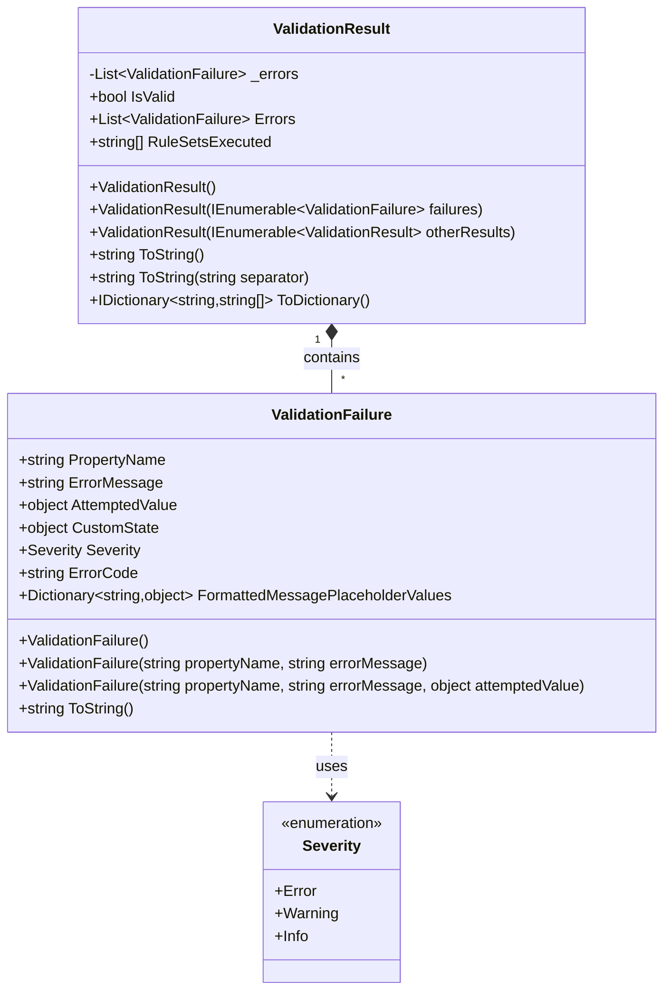
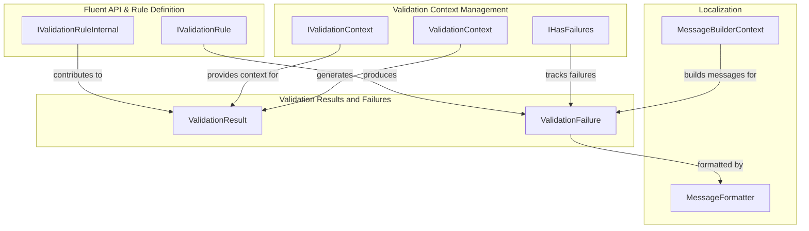
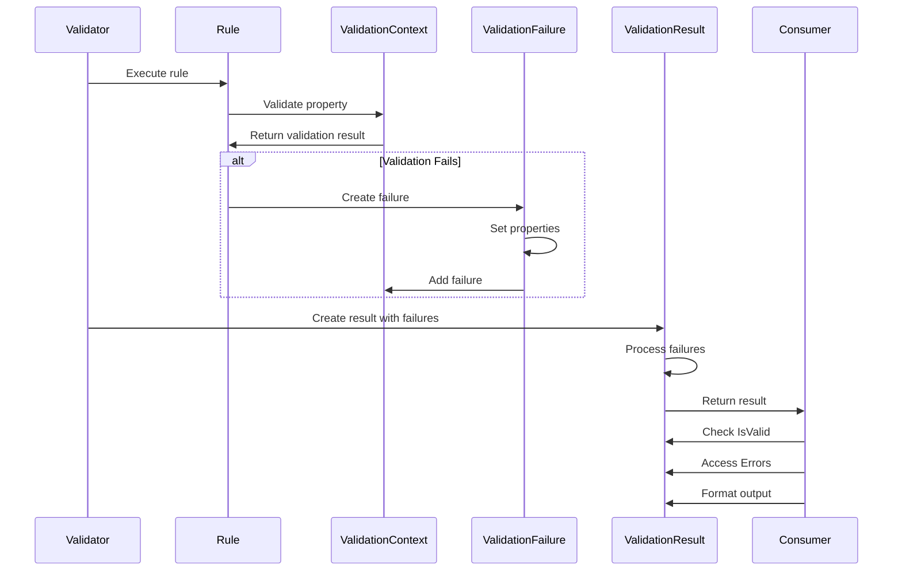
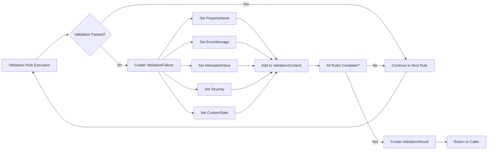

# Validation Results and Failures Module

## Introduction

The Validation Results and Failures module is a core component of the FluentValidation library that provides the fundamental data structures for representing validation outcomes. This module defines how validation results are captured, stored, and presented to consumers, serving as the primary interface between the validation engine and application code.

The module consists of two primary components: `ValidationResult` and `ValidationFailure`, which work together to provide a comprehensive representation of validation outcomes, including success/failure status, detailed error information, and convenient formatting options for various consumption scenarios.

## Architecture Overview

### Core Components



### Module Dependencies



## Component Details

### ValidationResult

The `ValidationResult` class serves as the primary container for validation outcomes, providing a unified interface for accessing validation results regardless of the complexity of the validation rules executed.

#### Key Features:
- **Success/Failure Indication**: The `IsValid` property provides a quick boolean check for validation success
- **Error Collection Management**: Maintains a collection of `ValidationFailure` objects with null-safe handling
- **RuleSet Tracking**: Records which validation rule sets were executed during validation
- **Flexible Construction**: Supports creation from individual failures, collections of failures, or combined results
- **Multiple Output Formats**: Provides string and dictionary representations for different consumption scenarios

#### Construction Patterns:
1. **Empty Result**: Creates a successful validation result with no errors
2. **Failure Collection**: Creates a result from a collection of validation failures
3. **Result Aggregation**: Combines multiple validation results into a single result
4. **Internal Construction**: Used internally by the validation engine for performance

### ValidationFailure

The `ValidationFailure` class represents a single validation error, providing detailed information about what went wrong during validation of a specific property or rule.

#### Key Features:
- **Property-Level Granularity**: Identifies the specific property that failed validation
- **Rich Error Information**: Includes error messages, attempted values, and custom state
- **Severity Levels**: Supports different severity levels (Error, Warning, Info)
- **Localization Support**: Includes placeholder values for message formatting
- **Extensibility**: Provides custom state and error code properties for application-specific needs

#### Information Captured:
- **PropertyName**: The name of the property that failed validation
- **ErrorMessage**: The human-readable error message
- **AttemptedValue**: The value that was provided and failed validation
- **CustomState**: Application-specific data associated with the failure
- **Severity**: The severity level of the failure (defaults to Error)
- **ErrorCode**: A code identifier for the failure
- **FormattedMessagePlaceholderValues**: Values for message template substitution

## Data Flow

### Validation Result Creation Flow



### Error Processing Pipeline



## Integration with Other Modules

### Validation Context Management
The Validation Results and Failures module integrates closely with the [Validation Context Management](Validation Context Management.md) module:

- **IHasFailures Interface**: Validation contexts implement this interface to track failures during validation
- **Failure Accumulation**: Validation failures are collected in the context during rule execution
- **Result Generation**: The context's failures are used to create the final ValidationResult

### Localization Integration
The module works with the [Localization](Localization.md) system to provide culture-specific error messages:

- **Message Formatting**: Error messages can be localized using the MessageFormatter
- **Placeholder Substitution**: The FormattedMessagePlaceholderValues support localized message templates
- **Language Manager**: Error messages can be retrieved from language-specific resources

### Validator Selection System
Integration with the [Validator Selection System](Validator Selection System.md) provides context about which rules were executed:

- **RuleSet Execution Tracking**: The RuleSetsExecuted property records which rule sets were applied
- **Selective Validation**: Results reflect only the rules that were actually executed based on selector choices

## Usage Patterns

### Basic Validation Result Consumption

```csharp
// Performing validation and checking results
var result = validator.Validate(customer);

if (!result.IsValid) 
{
    // Handle validation failures
    foreach (var failure in result.Errors)
    {
        Console.WriteLine($"Property {failure.PropertyName} failed validation. Error: {failure.ErrorMessage}");
    }
}
```

### Dictionary Conversion for APIs

```csharp
// Converting to dictionary for JSON serialization
var errors = result.ToDictionary();
// Returns: { "PropertyName": ["Error message 1", "Error message 2"] }
```

### String Representation

```csharp
// Getting all errors as a single string
var allErrors = result.ToString(); // Uses Environment.NewLine
var commaSeparated = result.ToString(", ");
```

### Result Aggregation

```csharp
// Combining multiple validation results
var result1 = validator1.Validate(obj1);
var result2 = validator2.Validate(obj2);
var combinedResult = new ValidationResult(new[] { result1, result2 });
```

## Performance Considerations

### Memory Efficiency
- **Null Filtering**: Both ValidationResult and ValidationFailure constructors filter out null values to prevent memory waste
- **List Copying**: Defensive copying prevents external modification of internal collections
- **Lazy Initialization**: Properties are initialized only when needed

### Result Aggregation Optimization
- **SelectMany Usage**: Efficiently combines multiple result collections using LINQ
- **Distinct RuleSets**: RuleSetsExecuted array contains only unique entries
- **Internal Constructor**: Performance-optimized constructor for internal use

## Extensibility Points

### Custom ValidationFailure Properties
The CustomState property allows attaching application-specific data to validation failures:

```csharp
var failure = new ValidationFailure("Property", "Error message")
{
    CustomState = new { CustomErrorCode = 123, Timestamp = DateTime.Now }
};
```

### Error Code Usage
The ErrorCode property enables categorization of validation errors:

```csharp
var failure = new ValidationFailure("Email", "Invalid email format")
{
    ErrorCode = "INVALID_EMAIL_FORMAT"
};
```

### Severity Levels
Different severity levels allow for flexible error handling:

- **Error**: Standard validation failures that prevent operation continuation
- **Warning**: Issues that should be noted but don't prevent operation
- **Info**: Informational messages for user awareness

## Best Practices

### Result Consumption
1. **Always check IsValid first** before accessing Errors to avoid unnecessary processing
2. **Use ToDictionary()** for API responses that need structured error formats
3. **Leverage ToString()** for logging and user-facing error displays
4. **Consider severity levels** when implementing error handling logic

### Failure Creation
1. **Always include PropertyName** for clear error identification
2. **Provide meaningful ErrorMessage** that explains what went wrong
3. **Include AttemptedValue** when it provides useful debugging information
4. **Use ErrorCode** for categorization and localization purposes

### Result Aggregation
1. **Combine related validations** using the ValidationResult aggregation constructor
2. **Track RuleSetsExecuted** for debugging and auditing purposes
3. **Handle null values** gracefully in custom validation scenarios

## Related Documentation

- [Validation Context Management](Validation Context Management.md) - Understanding how validation contexts collect failures
- [Localization](Localization.md) - Implementing culture-specific error messages
- [Validator Selection System](Validator Selection System.md) - Controlling which rules contribute to results
- [Fluent API & Rule Definition](Fluent API & Rule Definition.md) - Defining rules that produce validation failures