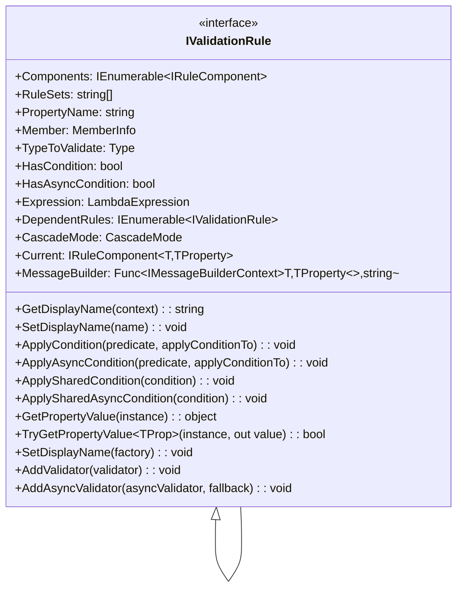
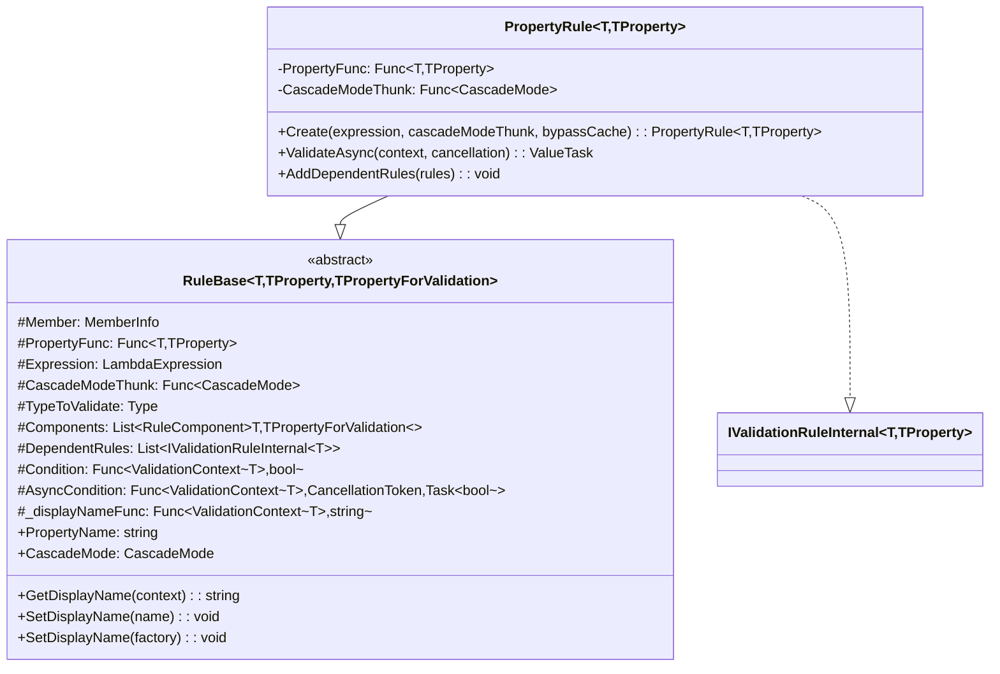
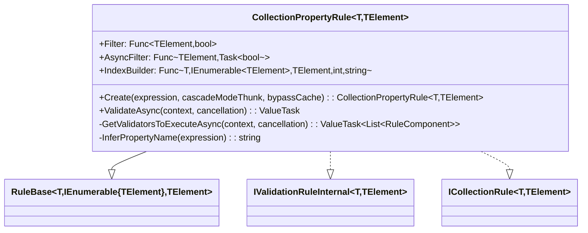
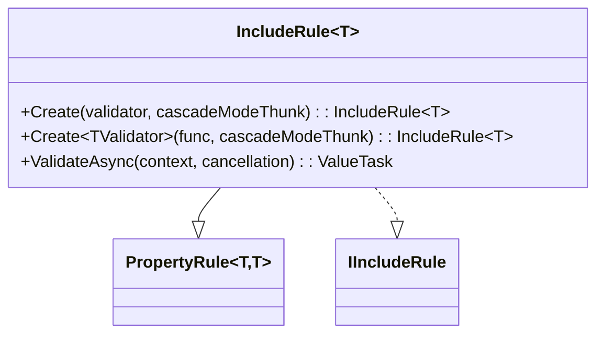
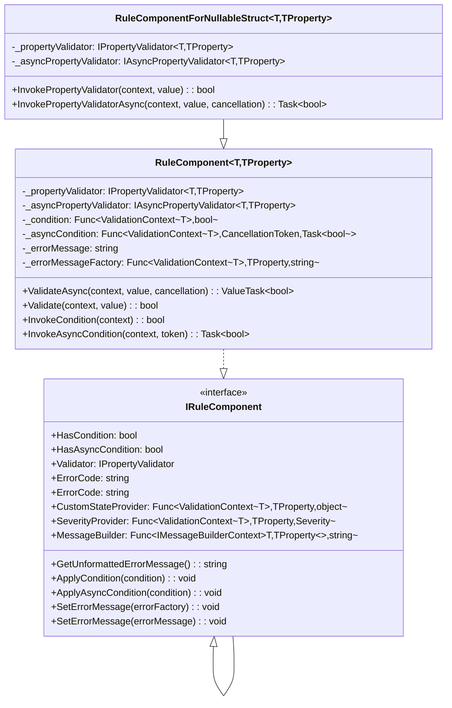
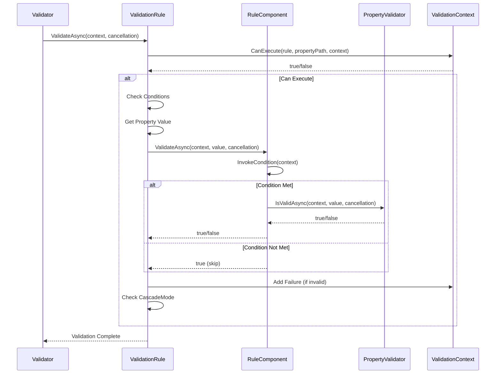
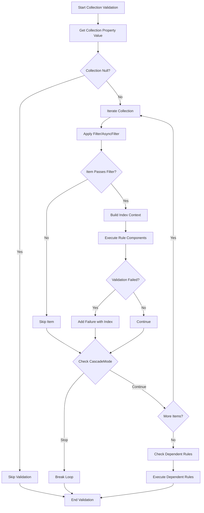
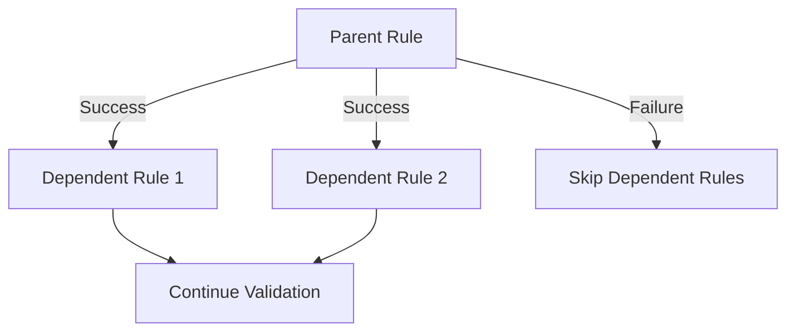

# Validation Rules Module

## Introduction

The Validation Rules module is the core component of the FluentValidation framework that defines and manages validation rules. It provides the infrastructure for creating, configuring, and executing validation rules against object properties and collections. This module serves as the bridge between the validation engine and individual property validators, handling rule composition, conditional execution, and error message formatting.

## Architecture Overview

The Validation Rules module implements a hierarchical rule system where validation rules can be composed of multiple components, each containing individual validators. The architecture supports both synchronous and asynchronous validation, conditional rule execution, and complex scenarios like collection validation and dependent rules.

```mermaid
graph TB
    subgraph "Validation Rules Module"
        IValidationRule[IValidationRule<br/>Interface]
        IValidationRuleT[IValidationRule<T><br/>Interface]
        IValidationRuleTT[IValidationRule<T,TProperty><br/>Interface]
        IValidationRuleInternal[IValidationRuleInternal<T><br/>Interface]
        IValidationRuleInternalT[IValidationRuleInternal<T,TProperty><br/>Interface]
        
        PropertyRule[PropertyRule<T,TProperty><br/>Class]
        CollectionPropertyRule[CollectionPropertyRule<T,TElement><br/>Class]
        IncludeRule[IncludeRule<T><br/>Class]
        
        IRuleComponent[IRuleComponent<br/>Interface]
        IRuleComponentT[IRuleComponent<T,TProperty><br/>Interface]
        RuleComponent[RuleComponent<T,TProperty><br/>Class]
        RuleComponentNullable[RuleComponentForNullableStruct<T,TProperty><br/>Class]
        
        ICollectionRule[ICollectionRule<T,TElement><br/>Interface]
        IIncludeRule[IIncludeRule<br/>Interface]
    end
    
    subgraph "Core Validation Engine"
        ValidationContext[ValidationContext<T><br/>from Core_Validation_Engine]
        ValidationFailure[ValidationFailure<br/>from Core_Validation_Engine]
        ValidationResult[ValidationResult<br/>from Core_Validation_Engine]
    end
    
    subgraph "Property Validators"
        IPropertyValidator[IPropertyValidator<br/>from Property_Validators]
        IAsyncPropertyValidator[IAsyncPropertyValidator<br/>from Property_Validators]
    end
    
    IValidationRule --> IValidationRuleT
    IValidationRuleT --> IValidationRuleTT
    IValidationRule --> IValidationRuleInternal
    IValidationRuleT --> IValidationRuleInternalT
    
    PropertyRule -.->|implements| IValidationRuleInternalT
    CollectionPropertyRule -.->|implements| IValidationRuleInternalT
    CollectionPropertyRule -.->|implements| ICollectionRule
    IncludeRule -.->|implements| IIncludeRule
    
    RuleComponent -.->|implements| IRuleComponentT
    RuleComponentNullable -.->|extends| RuleComponent
    
    PropertyRule -->|uses| ValidationContext
    PropertyRule -->|produces| ValidationFailure
    CollectionPropertyRule -->|uses| ValidationContext
    CollectionPropertyRule -->|produces| ValidationFailure
    IncludeRule -->|uses| ValidationContext
    
    RuleComponent -->|contains| IPropertyValidator
    RuleComponent -->|contains| IAsyncPropertyValidator
```



## Core Components

### Rule Interfaces

#### IValidationRule Hierarchy

The module defines a comprehensive interface hierarchy for validation rules:



### Rule Implementations

#### PropertyRule<T, TProperty>

The primary implementation for validating individual properties:



#### CollectionPropertyRule<T, TElement>

Specialized rule for validating collection properties:



#### IncludeRule<T>

Rule for including external validators:



### Rule Components

Rule components represent individual validators within a rule chain:



## Data Flow

### Validation Execution Flow



### Collection Validation Flow



## Key Features

### 1. Rule Composition

Rules can be composed of multiple components, each representing a specific validation check:

```csharp
// Example: RuleFor(x => x.Name).NotNull().NotEmpty().Length(1, 50)
// This creates one rule with three components: NotNull, NotEmpty, and Length validators
```

### 2. Conditional Execution

Rules support both synchronous and asynchronous conditions:

- **Rule-level conditions**: Applied to the entire rule
- **Component-level conditions**: Applied to individual validators
- **Shared conditions**: Pre-conditions that affect multiple rules

### 3. Collection Validation

Specialized support for validating collections with:
- Item filtering (sync/async)
- Custom index formatting
- Individual item validation within collection context

### 4. Dependent Rules

Rules can have dependent rules that only execute when the parent rule succeeds:



### 5. Include Rules

Support for including external validators within a rule definition, enabling code reuse and modular validation logic.

## Integration with Other Modules

### Core Validation Engine
- Uses [ValidationContext](Core_Validation_Engine.md) for execution context
- Produces [ValidationFailure](Core_Validation_Engine.md) objects
- Integrates with [ValidationResult](Core_Validation_Engine.md) collection

### Property Validators
- Contains [IPropertyValidator](Property_Validators.md) implementations
- Supports both sync and async validators via [IAsyncPropertyValidator](Property_Validators.md)
- Delegates actual validation logic to property validator instances

### Rule Building
- Integrates with [RuleBuilder](Rule_Building.md) for fluent API construction
- Supports conditional building via [ConditionBuilder](Rule_Building.md)

### Validator Selection
- Respects [IValidatorSelector](Validator_Selection.md) decisions
- Integrates with [MemberNameValidatorSelector](Validator_Selection.md) for property-specific validation

## Error Handling and Messaging

The module provides comprehensive error handling and message formatting:

1. **Error Message Templates**: Each component can have custom error messages
2. **Message Formatting**: Integration with [MessageFormatter](Localization.md) for placeholder replacement
3. **Custom State**: Support for attaching custom state to validation failures
4. **Severity Levels**: Configurable severity for validation failures

## Performance Considerations

1. **Caching**: Property accessors are cached for performance
2. **Lazy Evaluation**: Conditions are evaluated only when necessary
3. **Early Termination**: CascadeMode.Stop prevents unnecessary validation
4. **Async/Await**: Proper async pattern implementation to avoid thread blocking

## Usage Examples

### Basic Property Rule
```csharp
RuleFor(x => x.Email)
    .NotEmpty()
    .EmailAddress()
    .WithMessage("Please provide a valid email address");
```

### Collection Rule
```csharp
RuleForEach(x => x.Items)
    .Must(item => item.Quantity > 0)
    .WithMessage("Item quantity must be greater than 0");
```

### Conditional Rule
```csharp
RuleFor(x => x.ShippingAddress)
    .NotEmpty()
    .When(x => x.RequiresShipping);
```

### Include Rule
```csharp
RuleFor(x => x.Address)
    .SetValidator(new AddressValidator());
```

This module forms the backbone of the FluentValidation framework, providing the essential infrastructure for defining and executing validation rules with flexibility, performance, and extensibility in mind.