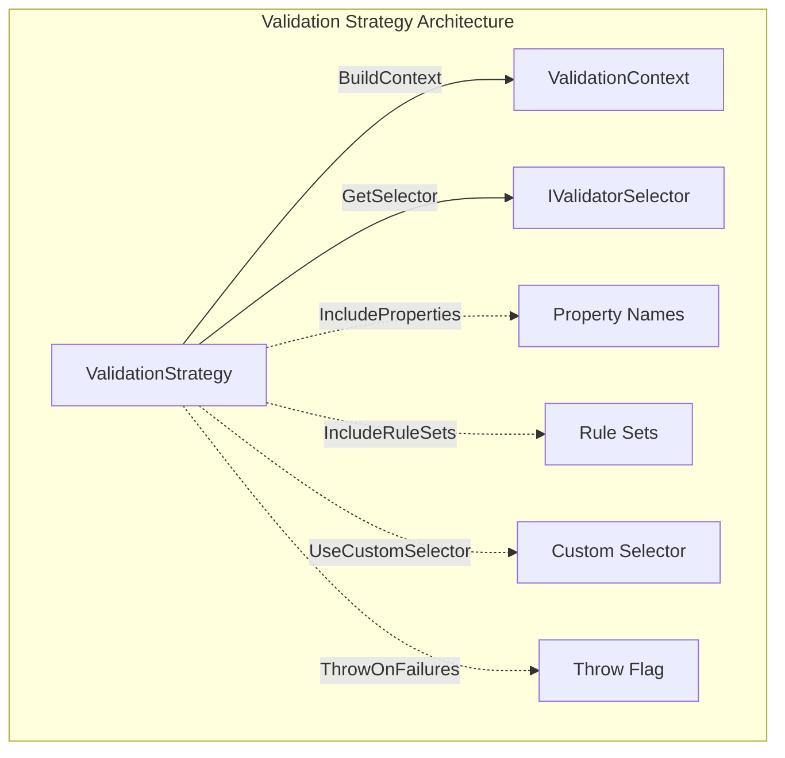
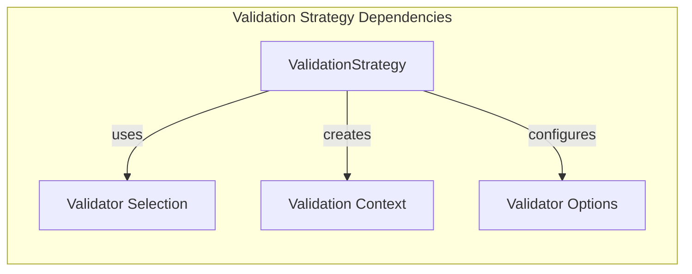
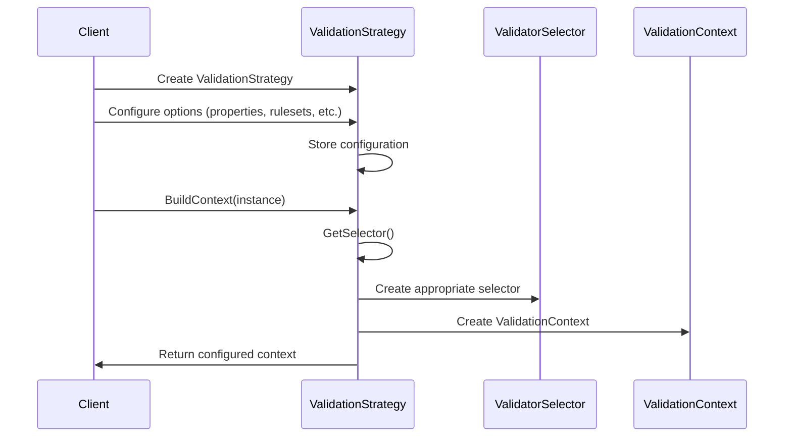
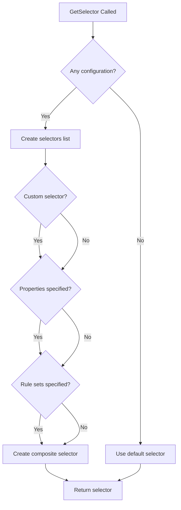
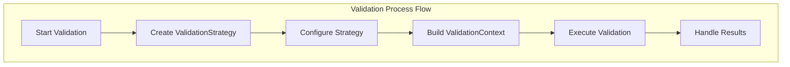

# Validation Strategy Module

## Introduction

The Validation Strategy module provides a flexible and fluent API for configuring how validation should be performed on objects. It allows developers to selectively validate specific properties, include or exclude rule sets, and control the overall validation behavior. This module serves as a configuration layer that determines which validation rules should be executed and how failures should be handled.

## Architecture Overview

The Validation Strategy module is built around the `ValidationStrategy<T>` class, which implements a fluent interface pattern for configuring validation options. The strategy acts as a builder that collects configuration options and ultimately produces a `ValidationContext<T>` that guides the validation process.



## Core Components

### ValidationStrategy<T>

The `ValidationStrategy<T>` class is the central component of this module. It provides a fluent API for configuring validation behavior with the following key features:

- **Property Filtering**: Select specific properties to validate
- **Rule Set Management**: Include/exclude specific rule sets
- **Custom Selector Support**: Use custom validation selectors
- **Failure Handling**: Control whether to throw exceptions on validation failures

#### Key Properties and Fields

```csharp
private List<string> _properties;        // Properties to validate
private List<string> _ruleSets;          // Rule sets to include
private bool _throw = false;             // Throw on failure flag
private IValidatorSelector _customSelector; // Custom selector
```

## Component Relationships

The Validation Strategy module interacts with several other modules in the FluentValidation system:



### Dependencies

1. **Validator Selection Module**: Uses validator selectors to determine which rules to execute
   - `MemberNameValidatorSelector` for property-based filtering
   - `RulesetValidatorSelector` for rule set filtering
   - `CompositeValidatorSelector` for combining multiple selectors
   - `DefaultValidatorSelector` for default behavior

2. **Core Validation Engine**: Creates and configures `ValidationContext<T>`
   - Sets up the validation context with appropriate selector
   - Configures exception throwing behavior

3. **Property Chain Module**: Uses `MemberNameValidatorSelector.MemberNamesFromExpressions` to convert lambda expressions to property names

## Data Flow

The validation strategy follows a clear data flow pattern:



## Configuration Options

### Property Inclusion

The strategy provides two methods for specifying properties to validate:

1. **String-based property names**:
   ```csharp
   strategy.IncludeProperties("Name", "Email", "Age");
   ```

2. **Expression-based property selection**:
   ```csharp
   strategy.IncludeProperties(x => x.Name, x => x.Email, x => x.Age);
   ```

### Rule Set Management

The strategy supports flexible rule set configuration:

1. **Include specific rule sets**:
   ```csharp
   strategy.IncludeRuleSets("PersonalInfo", "ContactInfo");
   ```

2. **Include rules not in any rule set**:
   ```csharp
   strategy.IncludeRulesNotInRuleSet();
   ```

3. **Include all rule sets**:
   ```csharp
   strategy.IncludeAllRuleSets();
   ```

### Custom Selector Integration

For advanced scenarios, custom validator selectors can be used:

```csharp
strategy.UseCustomSelector(new MyCustomValidatorSelector());
```

### Failure Handling

Control whether validation failures throw exceptions:

```csharp
strategy.ThrowOnFailures();
```

## Selector Creation Logic

The `GetSelector()` method implements sophisticated logic to create the appropriate validator selector based on the configuration:



## Integration with Validation Process

The Validation Strategy module integrates into the overall validation process as follows:



## Usage Patterns

### Basic Property Validation

```csharp
var strategy = new ValidationStrategy<Person>()
    .IncludeProperties(p => p.Name, p => p.Email)
    .ThrowOnFailures();
```

### Rule Set Based Validation

```csharp
var strategy = new ValidationStrategy<Order>()
    .IncludeRuleSets("Shipping", "Billing")
    .IncludeRulesNotInRuleSet();
```

### Advanced Custom Selection

```csharp
var strategy = new ValidationStrategy<Product>()
    .UseCustomSelector(new PremiumProductSelector())
    .IncludeProperties(p => p.Price, p => p.Features);
```

## Performance Considerations

1. **Selector Caching**: The strategy creates selectors on each `BuildContext` call, but the underlying selector factories may implement caching
2. **Property Name Resolution**: Expression-based property inclusion uses reflection for name resolution
3. **Composite Selector Overhead**: Using multiple selectors creates a composite selector with slight performance overhead

## Thread Safety

The `ValidationStrategy<T>` class is not thread-safe. Each thread should create its own instance or use appropriate synchronization mechanisms.

## Related Modules

- [Validator Selection](Validator_Selection.md) - Provides the selector implementations used by this module
- [Core Validation Engine](Core_Validation_Engine.md) - Contains the ValidationContext that this module creates
- [Property Chain](Property_Chain.md) - Used for property name resolution from expressions

## Best Practices

1. **Reuse Strategies**: Create validation strategies once and reuse them when validating multiple instances of the same type
2. **Prefer Expressions**: Use expression-based property selection for compile-time safety
3. **Combine Selectors**: Use composite selectors for complex validation scenarios
4. **Handle Exceptions**: Be aware of the `ThrowOnFailures()` behavior in your error handling strategy
5. **Test Selectors**: Test custom selectors thoroughly to ensure they work correctly with the strategy