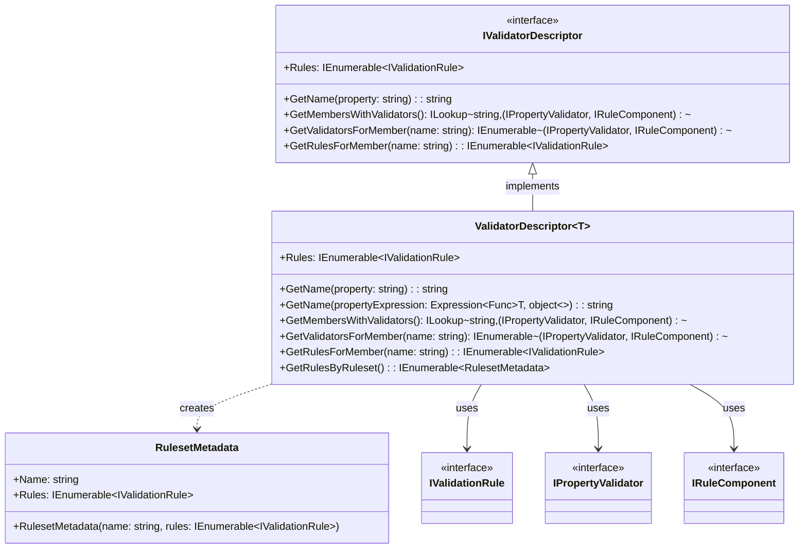
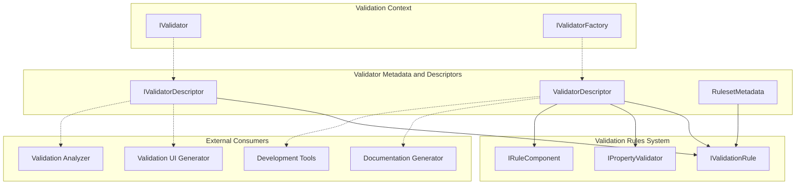
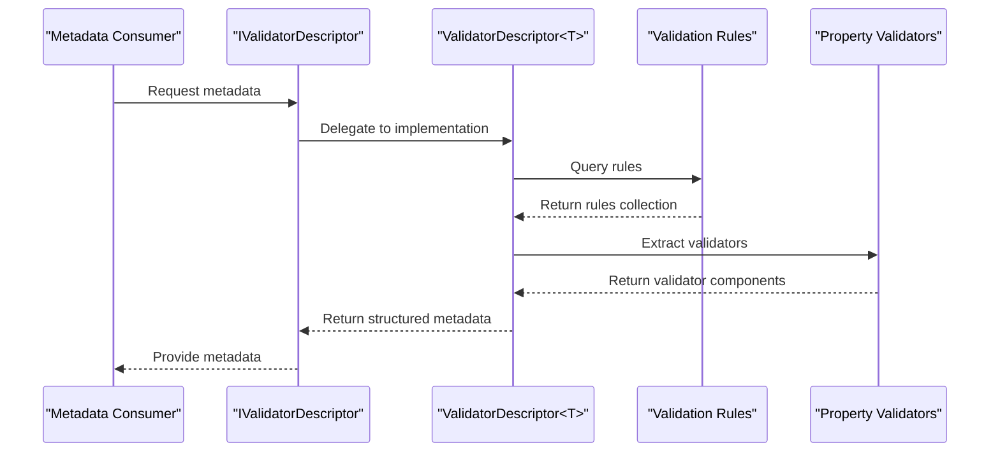
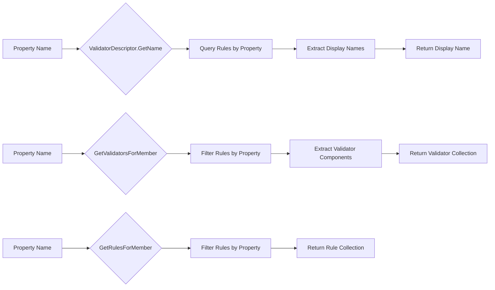

# Validator Metadata and Descriptors Module

## Introduction

The Validator Metadata and Descriptors module provides a comprehensive system for introspecting and analyzing validator configurations at runtime. This module enables developers to programmatically access information about validation rules, properties, and rulesets without executing the actual validation logic. It serves as the foundation for building validation-aware tools, generating documentation, creating dynamic validation UIs, and implementing advanced validation scenarios.

## Overview

The module consists of three core components that work together to expose validator metadata:

- **IValidatorDescriptor**: The primary interface that defines the contract for accessing validator metadata
- **ValidatorDescriptor<T>**: The concrete implementation that provides detailed information about validation rules
- **RulesetMetadata**: A helper class for organizing rules by ruleset membership

## Architecture

### Component Structure



### System Integration



## Core Components

### IValidatorDescriptor Interface

The `IValidatorDescriptor` interface serves as the primary contract for accessing validator metadata. It provides a standardized way to query information about validation rules without coupling to specific validator implementations.

**Key Responsibilities:**
- Expose all validation rules defined in a validator
- Provide property display names
- Map properties to their associated validators
- Enable property-specific rule queries

**Interface Definition:**
```csharp
public interface IValidatorDescriptor
{
    IEnumerable<IValidationRule> Rules { get; }
    string GetName(string property);
    ILookup<string, (IPropertyValidator Validator, IRuleComponent Options)> GetMembersWithValidators();
    IEnumerable<(IPropertyValidator Validator, IRuleComponent Options)> GetValidatorsForMember(string name);
    IEnumerable<IValidationRule> GetRulesForMember(string name);
}
```

### ValidatorDescriptor<T> Class

The `ValidatorDescriptor<T>` class is the concrete implementation of `IValidatorDescriptor`. It provides comprehensive metadata access for strongly-typed validators and includes additional functionality for expression-based property access and ruleset organization.

**Key Features:**
- Generic type safety with expression-based property access
- Ruleset-based rule organization
- LINQ-based metadata queries
- Integration with the validation rule system

**Enhanced Capabilities:**
- `GetName(Expression<Func<T, object>>)`: Type-safe property name resolution
- `GetRulesByRuleset()`: Ruleset-based rule grouping
- Expression-based property name extraction

### RulesetMetadata Class

The `RulesetMetadata` class encapsulates information about validation rules organized by ruleset. It provides a convenient way to access rules that belong to specific validation scenarios or contexts.

**Purpose:**
- Group validation rules by ruleset name
- Enable ruleset-specific validation analysis
- Support conditional validation scenarios

## Data Flow

### Metadata Retrieval Flow



### Property Analysis Flow



## Usage Patterns

### Basic Metadata Access

```csharp
// Obtain validator descriptor
var validator = new PersonValidator();
var descriptor = validator.CreateDescriptor();

// Access all rules
var allRules = descriptor.Rules;

// Get property display name
var displayName = descriptor.GetName("FirstName");
```

### Property-Specific Analysis

```csharp
// Get all validators for a property
var validators = descriptor.GetValidatorsForMember("Email");

// Get all rules for a property
var rules = descriptor.GetRulesForMember("Age");

// Get property display name using expression
var name = descriptor.GetName(p => p.Email);
```

### Ruleset-Based Analysis

```csharp
// Get rules organized by ruleset
var rulesByRuleset = descriptor.GetRulesByRuleset();

foreach (var ruleset in rulesByRuleset)
{
    Console.WriteLine($"Ruleset: {ruleset.Name}");
    foreach (var rule in ruleset.Rules)
    {
        // Process ruleset-specific rules
    }
}
```

### Member Analysis

```csharp
// Get all members with their validators
var membersWithValidators = descriptor.GetMembersWithValidators();

foreach (var member in membersWithValidators)
{
    Console.WriteLine($"Property: {member.Key}");
    foreach (var (validator, options) in member)
    {
        Console.WriteLine($"  Validator: {validator.GetType().Name}");
    }
}
```

## Integration with Other Modules

### Validation Rules System
The metadata system integrates closely with the [Fluent API & Rule Definition](Fluent API & Rule Definition.md) module to extract information from validation rules and their components.

### Validation Context Management
Metadata descriptors work with the [Validation Context Management](Validation Context Management.md) system to provide context-aware property name resolution.

### Validator Selection System
The metadata system supports the [Validator Selection System](Validator Selection System.md) by providing ruleset information that can be used for conditional validation.

## Advanced Scenarios

### Dynamic Validation UI Generation

```csharp
public ValidationField[] GenerateValidationFields(IValidatorDescriptor descriptor)
{
    var fields = new List<ValidationField>();
    var membersWithValidators = descriptor.GetMembersWithValidators();
    
    foreach (var member in membersWithValidators)
    {
        var field = new ValidationField
        {
            PropertyName = member.Key,
            DisplayName = descriptor.GetName(member.Key),
            Validators = member.Select(x => x.Validator.GetType().Name).ToArray()
        };
        
        fields.Add(field);
    }
    
    return fields.ToArray();
}
```

### Validation Documentation Generation

```csharp
public ValidationDocumentation GenerateDocumentation(IValidatorDescriptor descriptor)
{
    var doc = new ValidationDocumentation();
    var rulesByRuleset = descriptor.GetRulesByRuleset();
    
    foreach (var ruleset in rulesByRuleset)
    {
        var rulesetDoc = new RulesetDocumentation { Name = ruleset.Name };
        
        foreach (var rule in ruleset.Rules)
        {
            rulesetDoc.Rules.Add(new RuleDocumentation
            {
                Property = rule.PropertyName,
                DisplayName = descriptor.GetName(rule.PropertyName),
                Validators = rule.Components.Select(c => c.Validator.GetType().Name).ToArray()
            });
        }
        
        doc.Rulesets.Add(rulesetDoc);
    }
    
    return doc;
}
```

### Validation Analysis and Reporting

```csharp
public ValidationAnalysisReport AnalyzeValidator(IValidatorDescriptor descriptor)
{
    var report = new ValidationAnalysisReport();
    var membersWithValidators = descriptor.GetMembersWithValidators();
    
    report.TotalProperties = membersWithValidators.Count;
    report.TotalValidators = membersWithValidators.Sum(m => m.Count());
    
    foreach (var member in membersWithValidators)
    {
        var propertyAnalysis = new PropertyAnalysis
        {
            PropertyName = member.Key,
            ValidatorCount = member.Count(),
            ValidatorTypes = member.Select(x => x.Validator.GetType().Name).ToArray()
        };
        
        report.PropertyAnalyses.Add(propertyAnalysis);
    }
    
    return report;
}
```

## Performance Considerations

### Caching Strategies
- Consider caching `ValidatorDescriptor` instances for frequently used validators
- Property name lookups are performed via LINQ queries and may benefit from caching in high-frequency scenarios
- Ruleset metadata can be pre-computed and cached for better performance

### Memory Usage
- `ValidatorDescriptor` instances maintain references to validation rules
- Large validator hierarchies may result in significant memory usage for metadata
- Consider using weak references or periodic cache invalidation for long-running applications

## Thread Safety

The metadata components are generally thread-safe for read operations:
- `IValidatorDescriptor` implementations should be immutable after creation
- Property lookups and rule queries do not modify state
- Multiple threads can safely access the same descriptor instance

## Extensibility

### Custom Descriptor Implementations
Developers can create custom implementations of `IValidatorDescriptor` to provide specialized metadata access patterns or integrate with external systems.

### Metadata Enrichment
The descriptor system can be extended to include additional metadata such as:
- Validation rule priorities
- Custom rule categories
- Performance characteristics
- Dependency information

## Best Practices

1. **Use Expression-Based Access**: When working with strongly-typed validators, use expression-based property access for compile-time safety
2. **Cache Descriptors**: Cache `ValidatorDescriptor` instances for validators that are used frequently
3. **Leverage Ruleset Information**: Use `GetRulesByRuleset()` to understand validation scenarios and conditional validation logic
4. **Handle Missing Properties**: Always handle cases where properties or validators might not be found
5. **Consider Performance**: Be mindful of performance when querying large validator hierarchies

## Summary

The Validator Metadata and Descriptors module provides a powerful and flexible system for accessing validation configuration information at runtime. It enables a wide range of scenarios from dynamic UI generation to comprehensive validation analysis and documentation. The module's design emphasizes type safety, performance, and extensibility while maintaining clean separation of concerns within the FluentValidation framework.