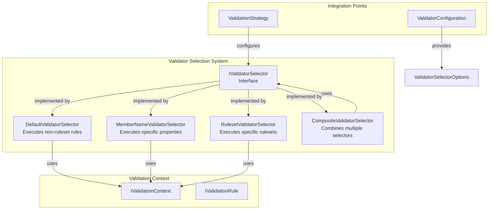
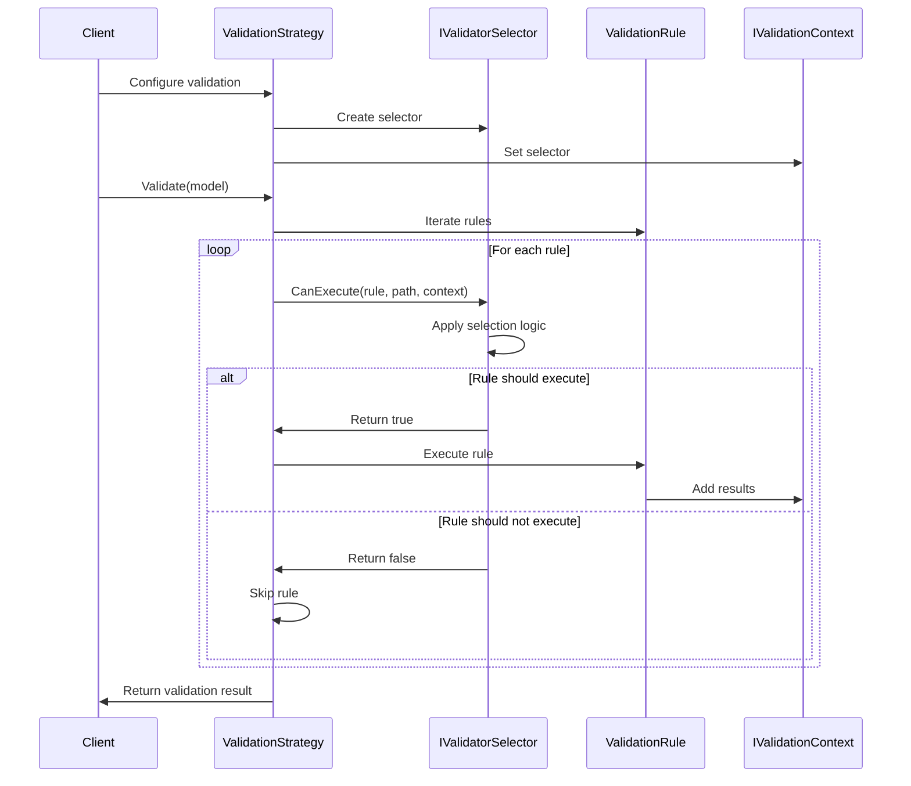
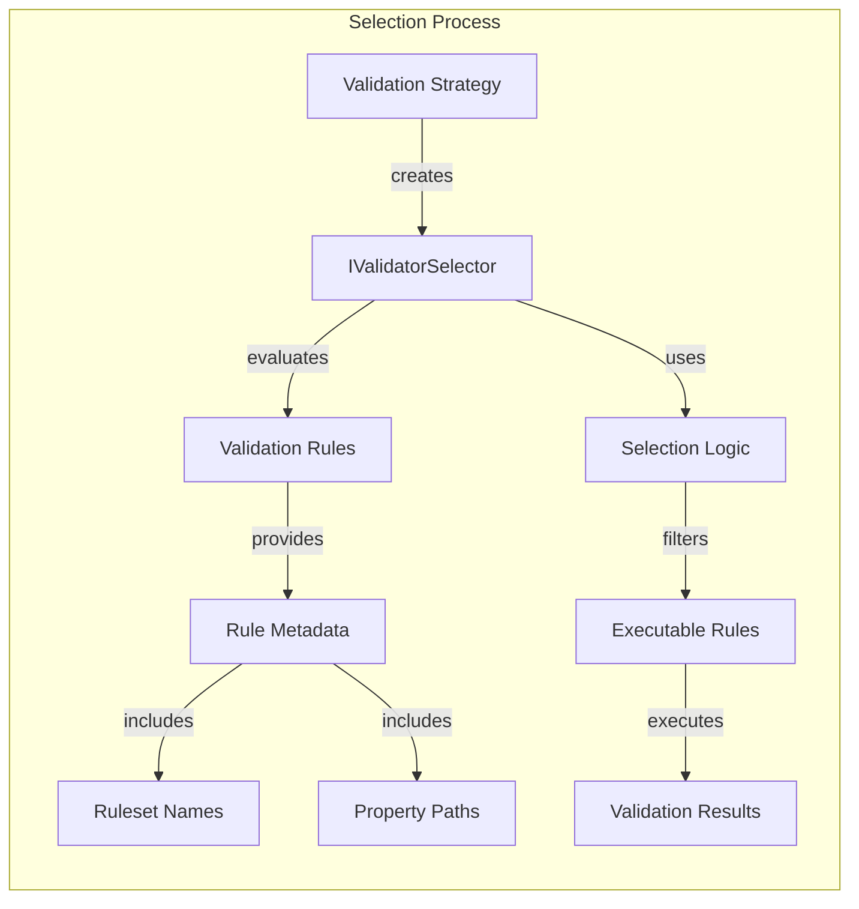

# Validator Selection System

## Introduction

The Validator Selection System is a core component of the FluentValidation framework that provides fine-grained control over which validation rules should be executed during the validation process. This system enables developers to selectively validate specific properties, rulesets, or combinations thereof, offering flexibility in validation scenarios ranging from full model validation to targeted property validation.

The system is built around the `IValidatorSelector` interface and provides multiple selector implementations that can be used individually or combined to create sophisticated validation strategies. This modular approach allows for efficient validation execution by filtering out unnecessary rules, improving performance and enabling conditional validation logic.

## Architecture Overview

The Validator Selection System follows a strategy pattern architecture where different selection strategies implement a common interface. The system is designed to be extensible, allowing custom selector implementations while providing built-in selectors for common scenarios.



## Core Components

### IValidatorSelector Interface

The `IValidatorSelector` interface is the foundation of the selection system, defining the contract for all validator selectors. It provides a single method `CanExecute` that determines whether a validation rule should be executed based on the current context.

**Key Responsibilities:**
- Rule execution filtering
- Context-aware decision making
- Property path evaluation
- Integration with validation rules

### DefaultValidatorSelector

The `DefaultValidatorSelector` is the standard selector used when no specific selection criteria are provided. It implements the default behavior of executing all rules that do not belong to a specific ruleset.

**Behavior:**
- Executes rules without ruleset associations
- Ignores rules that belong to named rulesets
- Provides backward compatibility with basic validation scenarios
- Uses case-insensitive comparison for ruleset names

### MemberNameValidatorSelector

The `MemberNameValidatorSelector` enables targeted validation of specific properties or property paths. It supports complex property navigation including nested properties and collection indexing.

**Advanced Features:**
- Property path matching with wildcard support
- Collection index normalization (e.g., `Orders[0].Name` → `Orders[].Name`)
- Parent-child property relationship handling
- Cascade control for child contexts
- Include rule bypass for nested validators

**Property Path Matching Logic:**
1. Exact property path match
2. Child property path matching
3. Parent property inclusion
4. Collection property handling
5. Wildcard collection matching

### RulesetValidatorSelector

The `RulesetValidatorSelector` executes validation rules based on their ruleset membership. It supports multiple rulesets, wildcards, and special handling for default rules.

**Ruleset Execution Logic:**
- Default ruleset execution
- Named ruleset matching
- Wildcard ruleset support (`*`)
- Include rule special handling
- Execution tracking for validation context

**Special Constants:**
- `DefaultRuleSetName`: "default" - for rules without explicit rulesets
- `WildcardRuleSetName`: "*" - for executing all rules

### CompositeValidatorSelector

The `CompositeValidatorSelector` combines multiple selectors using a logical OR operation. It allows for complex selection scenarios by aggregating different selection strategies.

**Behavior:**
- Aggregates multiple `IValidatorSelector` instances
- Uses logical OR for selector combination
- Enables complex selection criteria
- Supports mixed selection strategies

## Data Flow and Process Flow



## Component Interactions



## Integration with Validation System

The Validator Selection System integrates seamlessly with other FluentValidation components:

### ValidationStrategy Integration
The `ValidationStrategy` class uses validator selectors to control rule execution during the validation process. It configures the appropriate selector based on validation requirements and applies it consistently across all validation rules.

### ValidationContext Integration
Validator selectors receive contextual information through the `IValidationContext` interface, which provides:
- Current property path
- Validation root context data
- Child context indicators
- Cascade control flags

### Rule Integration
Validation rules expose metadata that selectors use for decision-making:
- Ruleset associations
- Property paths
- Include rule indicators
- Rule-specific configuration

## Usage Patterns

### Property-Specific Validation
```csharp
// Validate only specific properties
var selector = new MemberNameValidatorSelector(new[] { "Email", "Address.City" });
var result = validator.Validate(customer, selector);
```

### Ruleset-Based Validation
```csharp
// Validate specific rulesets
var selector = new RulesetValidatorSelector(new[] { "PersonalInfo", "ContactInfo" });
var result = validator.Validate(customer, selector);
```

### Combined Selection
```csharp
// Combine multiple selectors
var selectors = new IValidatorSelector[]
{
    new MemberNameValidatorSelector(new[] { "Email" }),
    new RulesetValidatorSelector(new[] { "Critical" })
};
var composite = new CompositeValidatorSelector(selectors);
var result = validator.Validate(customer, composite);
```

## Performance Considerations

The Validator Selection System is designed for optimal performance:

### Selector Efficiency
- **DefaultValidatorSelector**: O(1) complexity for ruleset checking
- **MemberNameValidatorSelector**: O(n) complexity where n is the number of member names
- **RulesetValidatorSelector**: O(n) complexity where n is the number of rulesets
- **CompositeValidatorSelector**: O(n) complexity where n is the number of selectors

### Optimization Strategies
- Early termination in composite selectors
- Efficient string comparison using ordinal ignore case
- Minimal allocation during selection process
- Caching of normalized property paths

### Memory Management
- Reuse of selector instances where possible
- Minimal object creation during selection
- Efficient collection handling for member names

## Extension Points

The Validator Selection System provides several extension points for customization:

### Custom Selector Implementation
Developers can implement `IValidatorSelector` to create custom selection logic:

```csharp
public class CustomValidatorSelector : IValidatorSelector
{
    public bool CanExecute(IValidationRule rule, string propertyPath, IValidationContext context)
    {
        // Custom selection logic
        return /* custom condition */;
    }
}
```

### Selector Composition
The composite pattern allows for complex selection scenarios by combining existing selectors with custom logic.

### Context-Aware Selection
Custom selectors can leverage the validation context to make sophisticated decisions based on runtime conditions, user permissions, or application state.

## Error Handling and Edge Cases

The Validator Selection System handles various edge cases:

### Null and Empty Handling
- Empty member name collections
- Null ruleset collections
- Missing property paths
- Invalid context data

### Collection Indexing
- Normalization of collection indices
- Wildcard matching for collection items
- Nested collection property handling

### Context Cascade Control
- Child context detection
- Cascade enable/disable functionality
- Parent-child relationship preservation

## Best Practices

### Selector Selection
- Use `DefaultValidatorSelector` for standard validation scenarios
- Employ `MemberNameValidatorSelector` for targeted property validation
- Utilize `RulesetValidatorSelector` for organized rule grouping
- Combine selectors with `CompositeValidatorSelector` for complex scenarios

### Performance Optimization
- Cache selector instances when possible
- Minimize selector creation in hot paths
- Use efficient property path expressions
- Leverage wildcard matching for collections

### Maintainability
- Document selector usage and intent
- Use meaningful ruleset names
- Maintain consistent property path conventions
- Test selector behavior with various scenarios

## Related Documentation

- [Validation Context Management](Validation%20Context%20Management.md) - Understanding validation contexts used by selectors
- [Fluent API & Rule Definition](Fluent%20API%20&%20Rule%20Definition.md) - Defining rules that work with selectors
- [Validation Results and Failures](Validation%20Results%20and%20Failures.md) - Understanding validation outcomes
- [Configuration and Global Options](Configuration%20and%20Global%20Options.md) - Global selector configuration options

## Summary

The Validator Selection System provides a powerful and flexible mechanism for controlling validation rule execution in FluentValidation. Through its strategy-based architecture, it enables developers to implement sophisticated validation scenarios while maintaining clean separation of concerns and optimal performance. The system's extensibility ensures it can adapt to complex validation requirements while providing built-in solutions for common selection patterns.