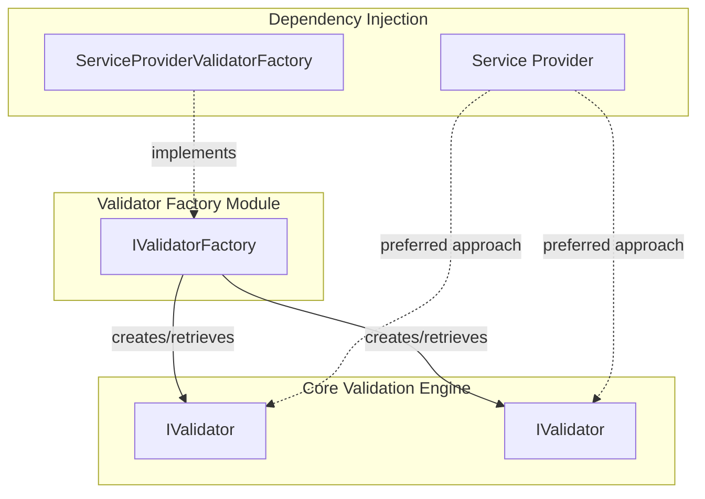
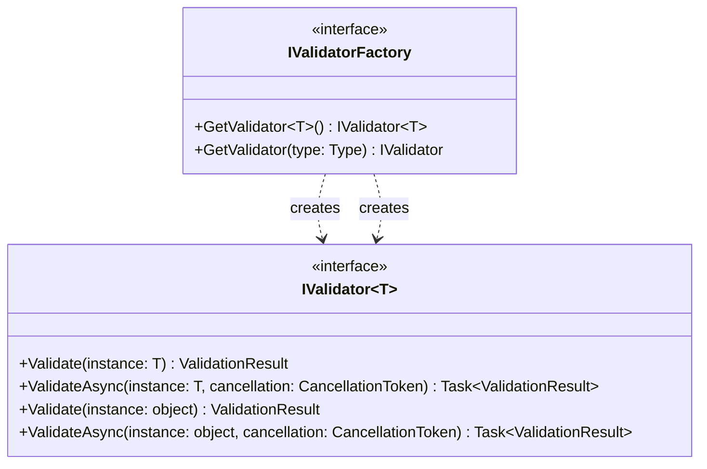
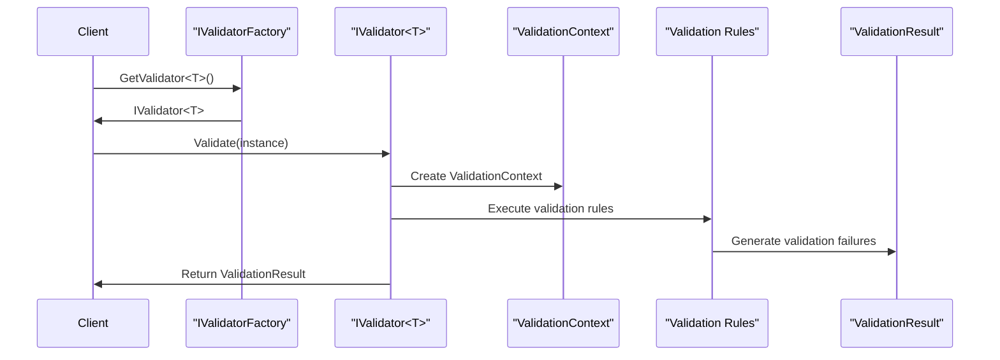
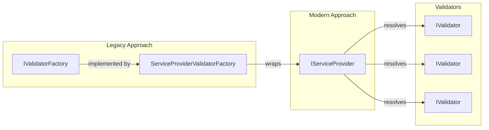
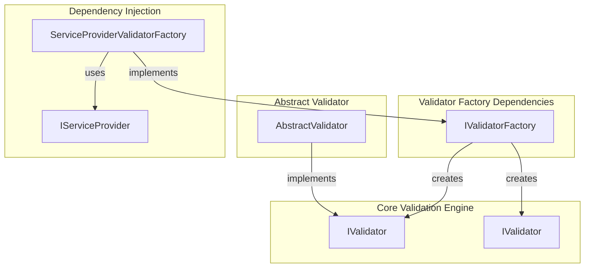

# Validator Factory Module Documentation

## Introduction

The Validator Factory module provides a factory pattern implementation for creating and retrieving validators in the FluentValidation framework. This module serves as a centralized mechanism for obtaining validator instances for specific types, abstracting the creation logic and enabling dependency injection scenarios. However, it's important to note that this module is marked as obsolete and is being phased out in favor of direct service provider usage.

## Architecture Overview

The Validator Factory module is built around a single core interface that defines the contract for validator creation and retrieval. The module acts as a bridge between the validation framework and dependency injection containers, providing a standardized way to access validators without direct instantiation.



## Core Components

### IValidatorFactory Interface

The `IValidatorFactory` interface is the primary component of this module, providing two key methods for validator retrieval:

- `GetValidator<T>()` - Generic method for obtaining strongly-typed validators
- `GetValidator(Type type)` - Non-generic method for runtime type-based validator retrieval



## Integration with the Validation Framework

The Validator Factory module integrates with the broader validation ecosystem by providing access to validators that implement the core validation interfaces. These validators are responsible for executing validation rules against objects and returning validation results.



## Dependency Injection Integration

While the `IValidatorFactory` interface is being deprecated, the module includes integration with dependency injection through the `ServiceProviderValidatorFactory` implementation. This implementation acts as an adapter between the factory pattern and modern dependency injection practices.



## Usage Patterns

### Factory Pattern Usage (Deprecated)

```csharp
// Using the factory to get validators
IValidatorFactory factory = // ... get factory instance
IValidator<Customer> validator = factory.GetValidator<Customer>();
ValidationResult result = validator.Validate(customer);
```

### Direct Service Provider Usage (Recommended)

```csharp
// Modern approach using service provider directly
IServiceProvider serviceProvider = // ... get service provider
IValidator<Customer> validator = serviceProvider.GetService<IValidator<Customer>>();
ValidationResult result = validator.Validate(customer);
```

## Relationship to Other Modules

The Validator Factory module has dependencies on several core validation components:

- **[Core_Validation_Engine](Core_Validation_Engine.md)**: Provides the fundamental `IValidator` and `IValidator<T>` interfaces that the factory creates
- **[AbstractValidator](AbstractValidator.md)**: Concrete validator implementations that the factory typically retrieves
- **[Dependency_Injection](Dependency_Injection.md)**: Modern replacement for the factory pattern using service providers



## Migration Path

Since the `IValidatorFactory` is obsolete, applications should migrate to using dependency injection directly:

1. **Remove factory usage**: Replace `IValidatorFactory` dependencies with direct `IServiceProvider` usage
2. **Register validators**: Ensure validators are registered in the DI container
3. **Update resolution code**: Use `serviceProvider.GetService<IValidator<T>>()` instead of factory methods
4. **Remove factory registration**: Remove any `IValidatorFactory` registrations from DI containers

## Best Practices

1. **Avoid new implementations**: Do not create new implementations of `IValidatorFactory`
2. **Use DI directly**: Prefer direct service provider usage for new code
3. **Plan migration**: Include migration from `IValidatorFactory` in technical debt planning
4. **Consistent registration**: Ensure validators are consistently registered in the DI container

## Performance Considerations

The factory pattern adds an additional abstraction layer that may impact performance. Direct service provider usage eliminates this overhead and provides better performance characteristics.

## Thread Safety

Implementations of `IValidatorFactory` should be thread-safe as they may be accessed concurrently in multi-threaded applications. The `ServiceProviderValidatorFactory` delegates this responsibility to the underlying service provider.

## Error Handling

The factory interface does not specify error handling behavior. Implementations may throw exceptions if:
- No validator is registered for the requested type
- The service provider is not properly configured
- Validator creation fails due to dependency resolution issues

Applications should handle these exceptions appropriately when using the factory pattern.