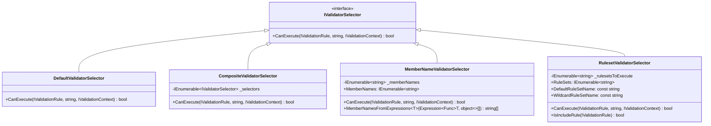
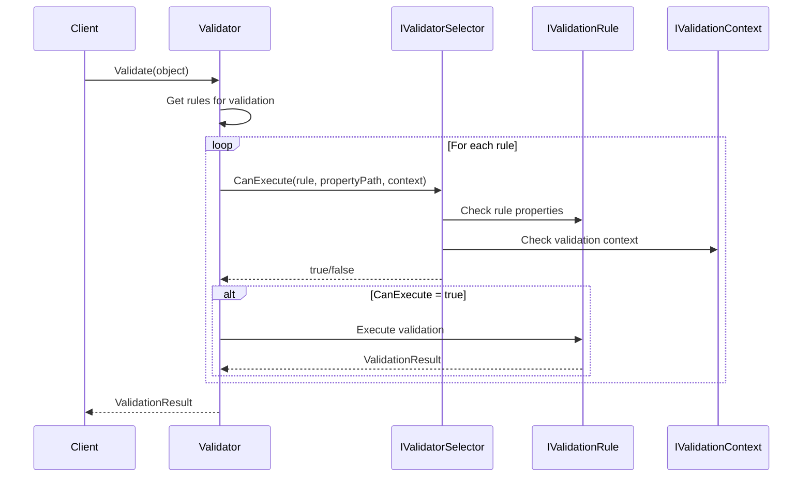
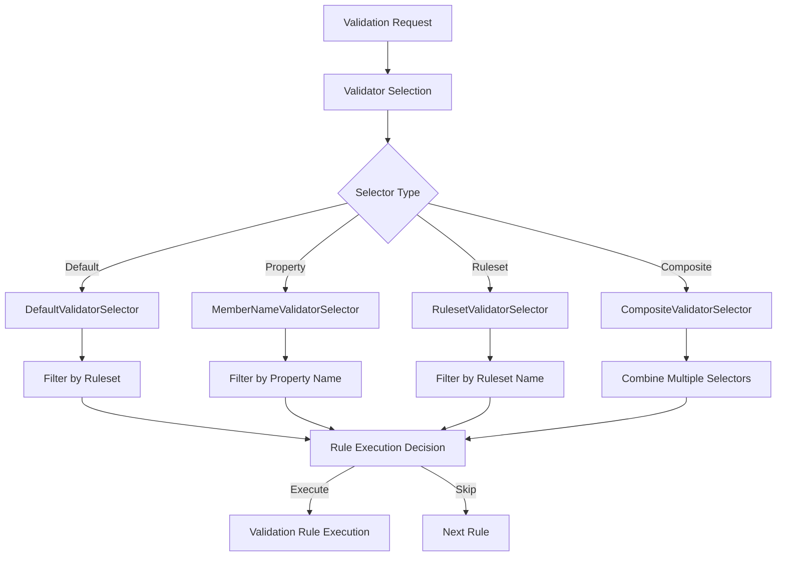
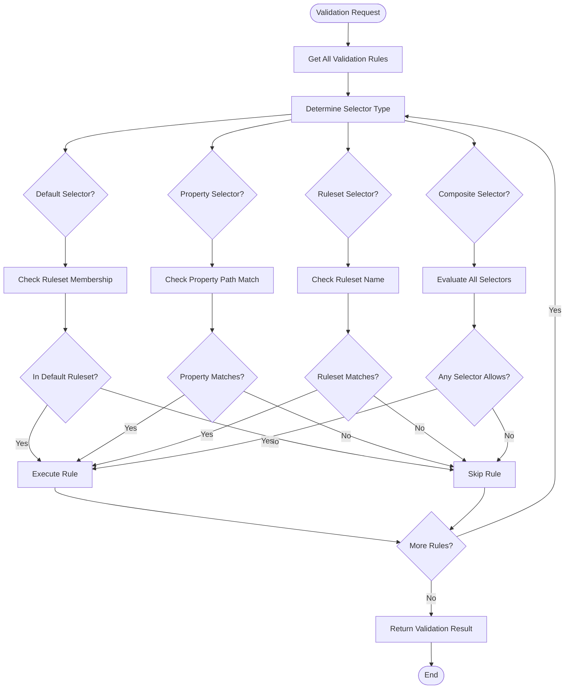

# Validator Selection Module

## Introduction

The Validator Selection module is a critical component of the FluentValidation framework that provides flexible rule execution control mechanisms. This module determines which validation rules should be executed based on various criteria such as property names, rulesets, or custom conditions. It enables developers to create conditional validation scenarios, optimize validation performance by targeting specific rules, and implement complex validation workflows.

## Architecture Overview

The Validator Selection module implements the Strategy pattern to provide different selection strategies for validation rules. The core architecture consists of an interface (`IValidatorSelector`) and multiple concrete implementations that define specific selection criteria.



## Core Components

### IValidatorSelector Interface

The `IValidatorSelector` interface defines the contract for all validator selectors. It provides a single method `CanExecute` that determines whether a validation rule should be executed based on the rule, property path, and validation context.

**Key Responsibilities:**
- Define the selection strategy contract
- Provide context-aware rule execution decisions
- Enable extensibility for custom selection logic

### DefaultValidatorSelector

The `DefaultValidatorSelector` is the standard selector that executes all rules not belonging to a specific ruleset. It filters out rules that are part of named rulesets unless they belong to the default ruleset.

**Key Features:**
- Executes rules without explicit ruleset assignments
- Ignores rules belonging to named rulesets (except default)
- Provides baseline validation behavior

### CompositeValidatorSelector

The `CompositeValidatorSelector` combines multiple selectors using a logical OR operation. A rule executes if any of the contained selectors allows execution.

**Key Features:**
- Combines multiple selection strategies
- Enables complex selection logic
- Supports flexible validation scenarios

### MemberNameValidatorSelector

The `MemberNameValidatorSelector` targets validation rules for specific properties based on their names. It supports complex property path matching including nested properties and collection indexing.

**Key Features:**
- Property-specific validation targeting
- Support for nested property paths (e.g., "Customer.Address.Line1")
- Collection property support with wildcard matching
- Expression-based member name extraction

**Property Path Matching Logic:**
- Exact property name matches
- Parent-child property relationships
- Collection property normalization
- Wildcard support for collection items

### RulesetValidatorSelector

The `RulesetValidatorSelector` executes validation rules based on their ruleset membership. It supports named rulesets, wildcard selection, and special handling for include rules.

**Key Features:**
- Ruleset-based rule selection
- Wildcard ruleset support ("*")
- Default ruleset handling
- Include rule special treatment

## Data Flow



## Component Interactions



## Process Flow

### Rule Selection Process



## Integration with Other Modules

### Core Validation Engine
The Validator Selection module integrates closely with the [Core_Validation_Engine](Core_Validation_Engine.md) to control rule execution flow. The validation engine uses selectors to determine which rules should be processed during validation.

### Validation Rules
The module works with [Validation_Rules](Validation_Rules.md) to evaluate rule properties and make execution decisions. Rules contain metadata such as ruleset membership and property associations that selectors use for filtering.

### Property Validators
Integration with [Property_Validators](Property_Validators.md) occurs through the validation context and property path information passed to selectors.

## Usage Scenarios

### Property-Specific Validation
```csharp
// Validate only specific properties
var selector = new MemberNameValidatorSelector(new[] { "Email", "Name" });
var result = validator.Validate(customer, selector: selector);
```

### Ruleset-Based Validation
```csharp
// Validate only rules in specific rulesets
var selector = new RulesetValidatorSelector(new[] { "Create", "Update" });
var result = validator.Validate(customer, selector: selector);
```

### Composite Selection
```csharp
// Combine multiple selectors
var selectors = new IValidatorSelector[] {
    new MemberNameValidatorSelector(new[] { "Email" }),
    new RulesetValidatorSelector(new[] { "Critical" })
};
var composite = new CompositeValidatorSelector(selectors);
var result = validator.Validate(customer, selector: composite);
```

## Performance Considerations

### Selector Efficiency
- **DefaultValidatorSelector**: O(1) - Simple ruleset membership check
- **MemberNameValidatorSelector**: O(n) - Linear search through member names
- **RulesetValidatorSelector**: O(n) - Linear search through rulesets
- **CompositeValidatorSelector**: O(n*m) - Product of contained selectors

### Optimization Strategies
1. **Cache Selector Results**: For repeated validations with the same selector
2. **Minimize Property Paths**: Use shorter property paths when possible
3. **Limit Ruleset Count**: Reduce the number of rulesets for faster matching
4. **Use Composite Selectors Sparingly**: Combine only necessary selectors

## Extension Points

### Custom Selector Implementation
Developers can implement `IValidatorSelector` to create custom selection logic:

```csharp
public class CustomValidatorSelector : IValidatorSelector
{
    public bool CanExecute(IValidationRule rule, string propertyPath, IValidationContext context)
    {
        // Custom selection logic
        return /* your condition */;
    }
}
```

### Selector Composition
The composite pattern allows combining existing selectors with custom logic for complex scenarios.

## Best Practices

1. **Use Appropriate Selector Type**: Choose the selector that matches your specific use case
2. **Avoid Overly Complex Selectors**: Keep selection logic simple and maintainable
3. **Consider Performance Impact**: Be aware of selector complexity in high-volume scenarios
4. **Test Selection Logic**: Ensure selectors correctly include/exclude intended rules
5. **Document Selection Criteria**: Clearly document why specific selectors are used

## Summary

The Validator Selection module provides a flexible and extensible mechanism for controlling validation rule execution in FluentValidation. Through its strategy-based architecture, it enables developers to implement sophisticated validation scenarios while maintaining clean separation of concerns. The module's design supports both simple property-specific validation and complex conditional validation workflows, making it an essential component for building robust validation systems.