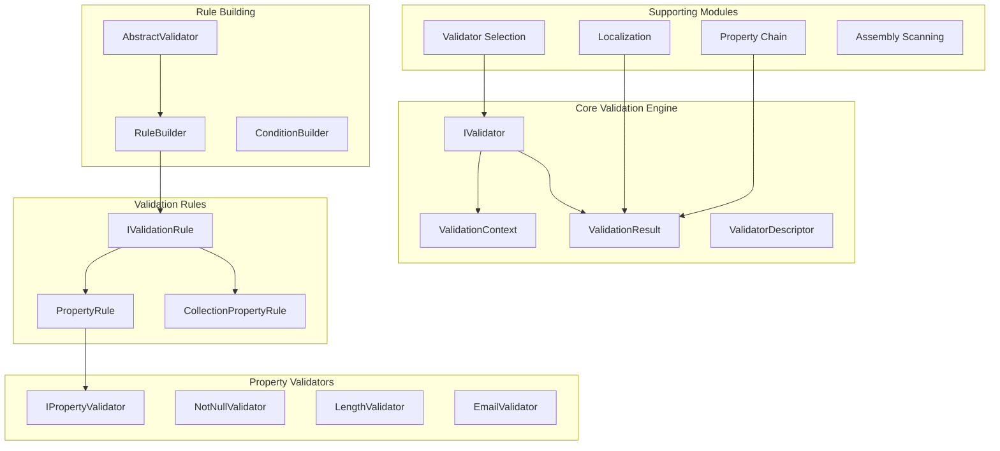
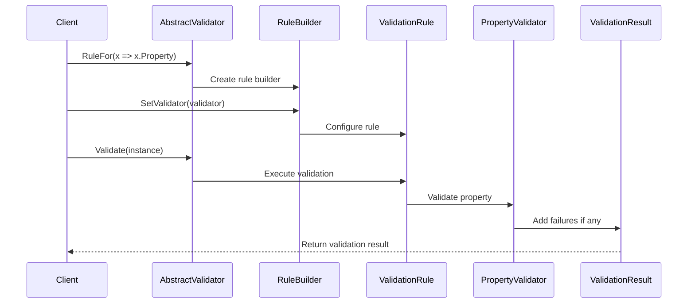

# FluentValidation Repository Overview

## Purpose

The FluentValidation repository is a comprehensive .NET validation library that provides a fluent interface for building strongly-typed validation rules. It serves as the core implementation of the FluentValidation framework, offering a declarative and extensible approach to object validation with support for complex scenarios including nested objects, collections, conditional validation, and localization.

## Architecture

The repository follows a modular architecture with clear separation of concerns:

## Core Modules

### 1. Core Validation Engine (`src/FluentValidation`)
The foundational module providing:
- **IValidator<T>**: Primary validation interface
- **ValidationContext<T>**: Execution context management
- **ValidationResult**: Result aggregation and failure reporting
- **ValidatorDescriptor<T>**: Metadata inspection capabilities

### 2. Validation Rules (`src/FluentValidation/Internal`)
Implements the rule-based validation system:
- **PropertyRule<T,TProperty>**: Individual property validation
- **CollectionPropertyRule<T,TElement>**: Collection element validation
- **RuleComponent<T,TProperty>**: Validator composition within rules
- **IncludeRule<T>**: External validator inclusion

### 3. Property Validators (`src/FluentValidation/Validators`)
Contains built-in validation logic:
- **Null Validators**: NotNullValidator, NullValidator
- **String Validators**: LengthValidator, RegularExpressionValidator, EmailValidator
- **Comparison Validators**: GreaterThanValidator, LessThanValidator, BetweenValidator
- **Specialized Validators**: CreditCardValidator, EnumValidator, ChildValidatorAdaptor

### 4. Rule Building (`src/FluentValidation/Internal`)
Provides fluent API construction:
- **RuleBuilder<T,TProperty>**: Rule configuration interface
- **ConditionBuilder<T>**: Conditional logic management
- **AbstractValidator<T>**: Base validator implementation

### 5. Validator Selection (`src/FluentValidation/Internal`)
Controls rule execution through selection strategies:
- **DefaultValidatorSelector**: Standard execution behavior
- **MemberNameValidatorSelector**: Property-specific validation
- **RulesetValidatorSelector**: Ruleset-based execution
- **CompositeValidatorSelector**: Combined selection logic

### 6. Localization (`src/FluentValidation/Resources`)
Multi-language support system:
- **LanguageManager**: 50+ language translations
- **MessageFormatter**: Dynamic message construction
- **MessageBuilderContext**: Context-aware formatting

## Key Features

- **Type-Safe Validation**: Compile-time validation rule construction
- **Fluent API**: Intuitive, chainable rule definition syntax
- **Async Support**: Full asynchronous validation capabilities
- **Nested Validation**: Complex object graph validation
- **Conditional Logic**: When/Unless conditional rule execution
- **Localization**: Multi-language error message support
- **Extensibility**: Custom validator and rule creation
- **Performance**: Optimized expression compilation and caching

## Validation Flow

## Integration Points

The repository provides seamless integration with:
- **ASP.NET Core**: Model validation integration
- **Dependency Injection**: Service provider support
- **Entity Framework**: Data annotation alternatives
- **Testing Frameworks**: Unit testing support

## Performance Characteristics

- **Expression Compilation**: Cached compiled expressions for property access
- **Rule Optimization**: Efficient rule execution with early termination support
- **Memory Management**: Minimal allocations during validation execution
- **Thread Safety**: Thread-safe validator instances for concurrent usage

## Extension Capabilities

Developers can extend the framework through:
- **Custom Property Validators**: Implementing IPropertyValidator<T,TProperty>
- **Custom Rules**: Extending validation rule base classes
- **Custom Selectors**: Implementing IValidatorSelector for custom execution logic
- **Localization**: Adding custom language translations

This repository serves as the definitive implementation of the FluentValidation framework, providing a robust, extensible, and performant validation solution for .NET applications.