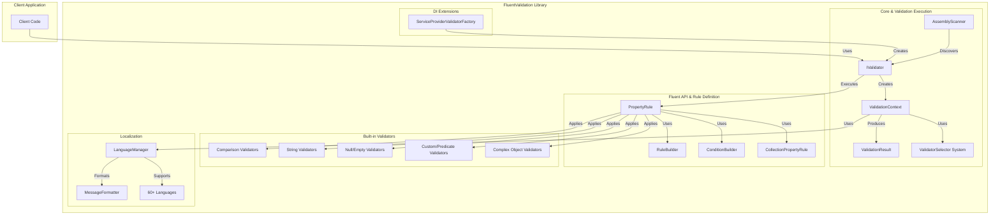
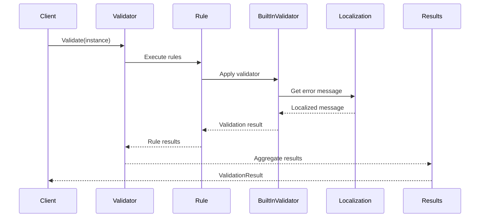

# FluentValidation Repository Overview

## Purpose
FluentValidation is a popular .NET validation library that provides a fluent interface for building strongly-typed validation rules. The repository contains the core library and its extensions, enabling developers to create expressive, maintainable validation logic for .NET applications.

## End-to-End Architecture

```mermaid
graph TB
    subgraph "Client Application"
        Client[Client Code]
    end
    
    subgraph "FluentValidation Library"
        subgraph "Core & Validation Execution"
            IValidator[IValidator<T>]
            ValidationContext[ValidationContext<T>]
            ValidationResult[ValidationResult]
            ValidatorSelector[ValidatorSelector System]
            AssemblyScanner[AssemblyScanner]
        end
        
        subgraph "Fluent API & Rule Definition"
            RuleBuilder[RuleBuilder<T,TProperty>]
            PropertyRule[PropertyRule]
            ConditionBuilder[ConditionBuilder]
            CollectionRule[CollectionPropertyRule]
        end
        
        subgraph "Built-in Validators"
            ComparisonValidators[Comparison Validators]
            StringValidators[String Validators]
            NullValidators[Null/Empty Validators]
            CustomValidators[Custom/Predicate Validators]
            ComplexValidators[Complex Object Validators]
        end
        
        subgraph "Localization"
            LanguageManager[LanguageManager]
            MessageFormatter[MessageFormatter]
            Languages[60+ Languages]
        end
        
        subgraph "DI Extensions"
            ServiceProviderFactory[ServiceProviderValidatorFactory]
        end
    end
    
    Client -->|Uses| IValidator
    IValidator -->|Creates| ValidationContext
    IValidator -->|Executes| PropertyRule
    PropertyRule -->|Uses| RuleBuilder
    PropertyRule -->|Applies| ComparisonValidators
    PropertyRule -->|Applies| StringValidators
    PropertyRule -->|Applies| NullValidators
    PropertyRule -->|Applies| CustomValidators
    PropertyRule -->|Applies| ComplexValidators
    PropertyRule -->|Uses| ConditionBuilder
    PropertyRule -->|Uses| CollectionRule
    ValidationContext -->|Produces| ValidationResult
    ValidationContext -->|Uses| ValidatorSelector
    ValidationContext -->|Uses| LanguageManager
    LanguageManager -->|Formats| MessageFormatter
    LanguageManager -->|Supports| Languages
    ServiceProviderFactory -->|Creates| IValidator
    AssemblyScanner -->|Discovers| IValidator
```

## Core Modules

### 1. Core & Validation Execution (`src/FluentValidation/`)
The foundational layer providing:
- **Validation Context Management**: Execution environment for validation operations
- **Validator Selection System**: Controls which rules execute based on criteria
- **Assembly Scanning**: Discovers validators in assemblies for DI registration
- **Validation Results**: Encapsulates validation outcomes and failures
- **Configuration**: Global options and behavior settings

### 2. Fluent API & Rule Definition (`src/FluentValidation/Internal/`)
Provides the fluent interface for defining validation rules:
- **Rule Builder System**: Type-safe fluent interface for rule construction
- **Rule Implementation**: Core rule classes handling validation execution
- **Rule Components**: Individual validation steps within rule chains
- **Condition System**: Supports When/Unless conditions for dynamic validation
- **Collection Rules**: Specialized validation for collection elements
- **Property Chain Management**: Handles nested object validation paths

### 3. Built-in Validators (`src/FluentValidation/Validators/`)
Comprehensive set of pre-built validators:
- **Comparison Validators**: Equal, NotEqual, GreaterThan, LessThan, Between
- **String Validators**: Length, Regex, Email, CreditCard, Enum validation
- **Null and Empty Validators**: NotNull, Null, NotEmpty, Empty
- **Custom and Predicate Validators**: User-defined validation logic
- **Complex Object Validators**: Child validators and polymorphic validation
- **Enum and Numeric Validators**: Enum validation and precision/scale checks

### 4. Localization (`src/FluentValidation/Resources/`)
Internationalization support with:
- **Language Management**: Multi-language support with culture fallback
- **Message Formatting**: Template-based message construction
- **60+ Supported Languages**: Comprehensive language coverage
- **Custom Translations**: Support for user-defined translations

### 5. Dependency Injection Extensions (`src/FluentValidation.DependencyInjectionExtensions/`)
Integration with dependency injection:
- **ServiceProviderValidatorFactory**: Bridge between FluentValidation and DI containers
- **Automatic Registration**: Validator discovery and registration in DI containers

## Key Features

- **Type Safety**: Full generic support with compile-time validation
- **Fluent Interface**: Expressive, readable rule definition
- **Async Support**: Complete async/await support for validation operations
- **Extensibility**: Plugin architecture for custom validators and conditions
- **Performance**: Optimized with caching and efficient execution paths
- **Localization**: Built-in support for 60+ languages
- **DI Integration**: Seamless integration with modern DI containers
- **Testing Support**: Designed for unit testing and mocking

## Usage Flow

```mermaid
sequenceDiagram
    participant Client
    participant Validator
    participant Rule
    participant BuiltInValidator
    participant Localization
    participant Results
    
    Client->>Validator: Validate(instance)
    Validator->>Rule: Execute rules
    Rule->>BuiltInValidator: Apply validator
    BuiltInValidator->>Localization: Get error message
    Localization-->>BuiltInValidator: Localized message
    BuiltInValidator-->>Rule: Validation result
    Rule-->>Validator: Rule results
    Validator-->>Results: Aggregate results
    Results-->>Client: ValidationResult
```

This repository provides a complete, production-ready validation framework for .NET applications, offering both simplicity for basic scenarios and advanced features for complex validation requirements.