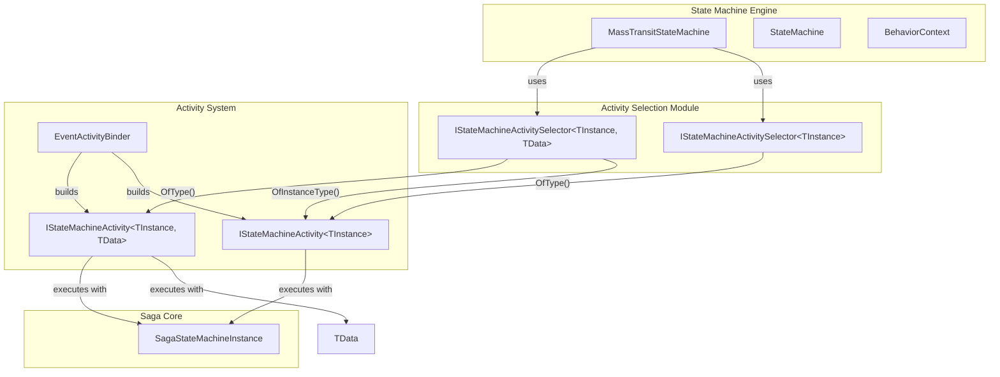
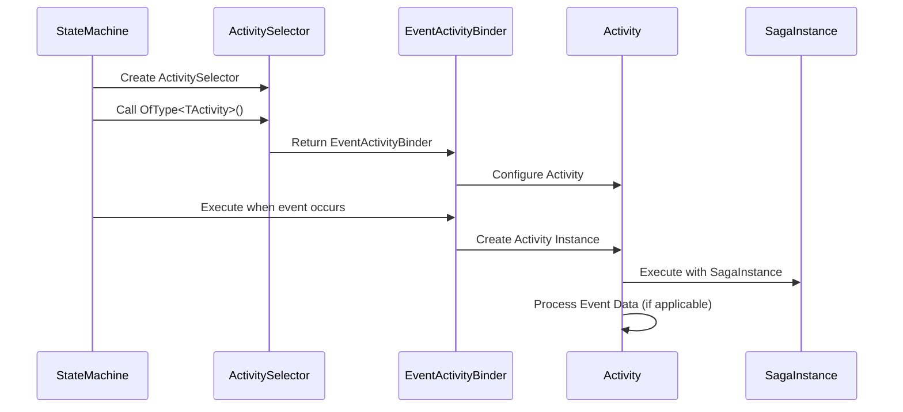
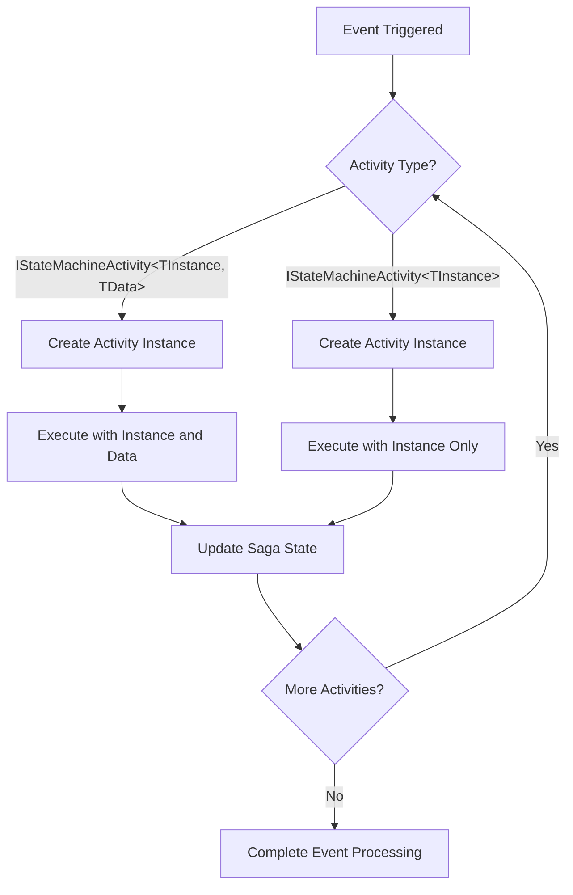

# Activity Selection Module Documentation

## Introduction

The Activity Selection module is a core component of MassTransit's Saga State Machine system that provides a fluent interface for configuring and selecting activities within state machine behaviors. This module enables developers to declaratively specify which activities should be executed in response to events within saga state machine instances.

## Purpose and Core Functionality

The Activity Selection module serves as the bridge between state machine events and the activities that should be executed when those events occur. It provides a type-safe, fluent API for:

- Selecting activities that operate on both saga instances and event data
- Selecting activities that operate only on saga instances
- Building event activity binders that define the execution flow
- Enabling compile-time validation of activity configurations

## Architecture and Component Relationships

### Core Components

The module consists of two primary interfaces:

1. **`IStateMachineActivitySelector<TInstance, TData>`** - For activities that require both saga instance and event data
2. **`IStateMachineActivitySelector<TInstance>`** - For activities that only require the saga instance

### Architecture Diagram



## Component Details

### IStateMachineActivitySelector<TInstance, TData>

This interface provides activity selection capabilities for scenarios where the activity needs access to both the saga instance and the event data.

**Key Methods:**
- `OfType<TActivity>()` - Selects an activity that operates on both instance and data
- `OfInstanceType<TActivity>()` - Selects an activity that operates only on the instance

**Type Constraints:**
- `TInstance` must be a class implementing `SagaStateMachineInstance`
- `TData` must be a class
- `TActivity` must implement `IStateMachineActivity<TInstance, TData>`

### IStateMachineActivitySelector<TInstance>

This interface provides activity selection for scenarios where the activity only needs access to the saga instance.

**Key Methods:**
- `OfType<TActivity>()` - Selects an activity that operates on the instance

**Type Constraints:**
- `TInstance` must be a class implementing `SagaStateMachineInstance`
- `TActivity` must implement `IStateMachineActivity<TInstance>`

## Data Flow and Process Flow

### Activity Selection Process Flow



### Activity Execution Flow



## Integration with MassTransit System

### Dependencies

The Activity Selection module integrates with several core MassTransit systems:

1. **[Saga State Machine Engine](StateMachine_Engine.md)** - The module is used by the state machine engine to configure activities
2. **[Behavior Context](Behavior_Context.md)** - Provides the execution context for activities
3. **[Core Abstractions](Core_Abstractions.md)** - Relies on `SagaStateMachineInstance` and message contracts

### Usage Patterns

```csharp
// Example usage within a state machine
public class OrderStateMachine : MassTransitStateMachine<OrderState>
{
    public OrderStateMachine()
    {
        Initially(
            When(OrderSubmitted)
                .Then(context => 
                {
                    // Activity selection happens here
                    context.Instance.OrderId = context.Data.OrderId;
                })
                .Activity(x => x.OfType<ValidateOrderActivity>())
                .TransitionTo(Submitted));
    }
}
```

## Key Features

### Type Safety
The module provides compile-time type checking for activity configurations, ensuring that only compatible activities can be selected for specific event contexts.

### Fluent Interface
The API design follows a fluent pattern, allowing for readable and chainable configuration of activities within state machine definitions.

### Flexibility
Supports both data-dependent and instance-only activities, providing flexibility in how activities are implemented and configured.

### Extensibility
The interface-based design allows for custom activity implementations while maintaining consistency with the state machine execution model.

## Best Practices

1. **Use appropriate selector interface** - Choose the selector that matches your activity's data requirements
2. **Keep activities focused** - Each activity should have a single, well-defined responsibility
3. **Consider transaction boundaries** - Activities execute within the saga's transaction context
4. **Handle exceptions appropriately** - Activities should handle their own exceptions or let them bubble up to the state machine

## Related Documentation

- [State Machine Engine](StateMachine_Engine.md) - Core state machine implementation
- [Behavior Context](Behavior_Context.md) - Execution context for activities
- [Core Abstractions](Core_Abstractions.md) - Base interfaces and contracts
- [Saga State Machine Core](Saga_StateMachine_Core.md) - Overview of the saga state machine system