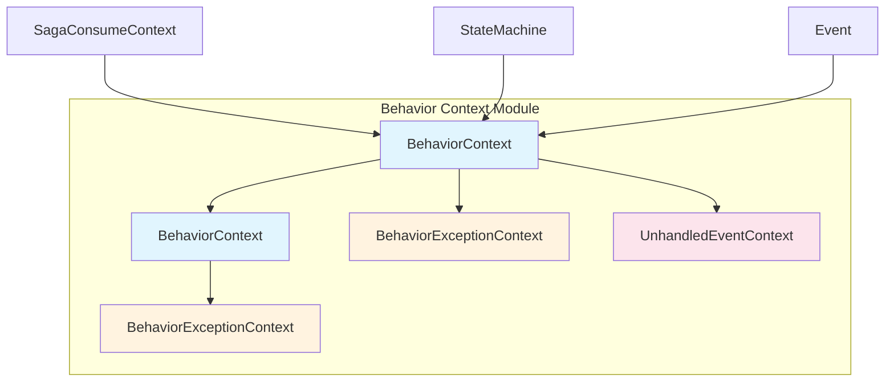
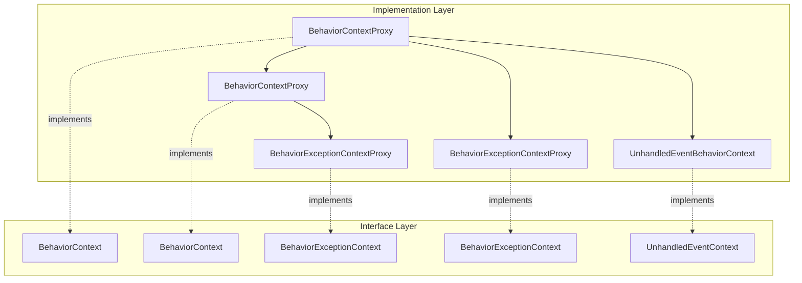
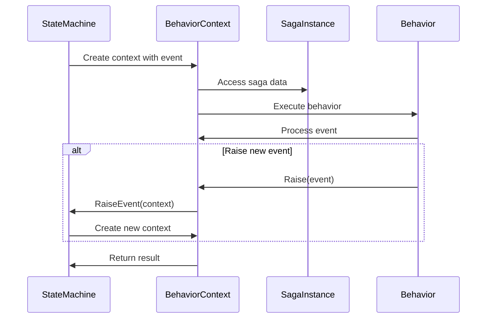
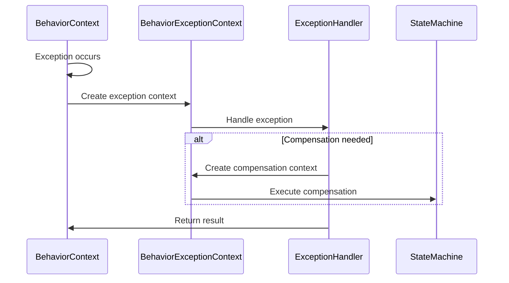
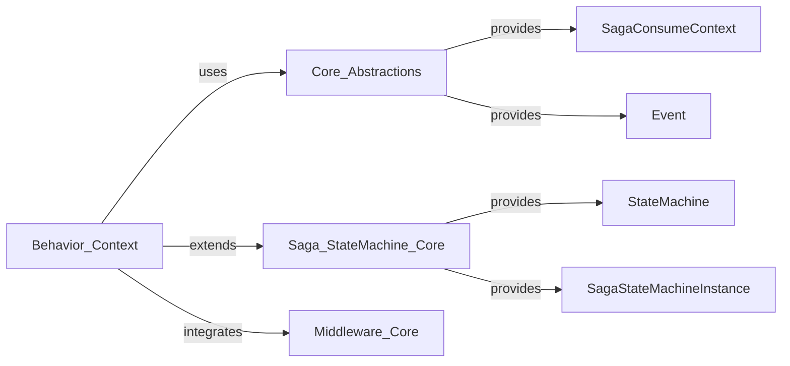

# Behavior Context Module

## Overview

The Behavior Context module is a core component of MassTransit's Saga State Machine implementation, providing the execution context for state machine behaviors and activities. It serves as the bridge between the state machine engine and the business logic that processes events within saga instances.

## Purpose and Core Functionality

The Behavior Context module provides:

- **Execution Context**: Encapsulates the runtime environment for state machine behaviors, including the saga instance, current event, and state machine reference
- **Event Processing**: Enables raising new events and creating contextual proxies for event handling
- **Message Initialization**: Provides message initialization capabilities for creating new messages within behaviors
- **Exception Handling**: Supports exceptional contexts for error scenarios and compensation activities
- **State Management**: Integrates with saga lifecycle management, including completion tracking

## Architecture and Component Relationships

### Core Components



### Implementation Hierarchy



## Key Interfaces and Their Roles

### BehaviorContext<TSaga>
The primary interface that provides:
- Access to the state machine instance
- Current event information
- Event raising capabilities
- Message initialization
- Context proxy creation

### BehaviorContext<TSaga, TMessage>
Extends the base behavior context with:
- Typed message access
- Strongly-typed event handling
- Message-specific operations

### BehaviorExceptionContext<TSaga, TException>
Handles exceptional scenarios by providing:
- Exception information within the behavior context
- Maintains state machine context during error handling
- Enables compensation activities

### UnhandledEventContext<TSaga>
Manages unhandled events with:
- Current state information
- Options to ignore or throw on unhandled events
- Graceful degradation capabilities

## Data Flow and Process Flows

### Event Processing Flow



### Exception Handling Flow



## Integration with Other Modules

### Dependencies on Core Modules



### Key Dependencies

- **[Core_Abstractions](Core_Abstractions.md)**: Provides foundational interfaces like `SagaConsumeContext`, `ConsumeContext`, and `Event`
- **[Saga_StateMachine_Core](Saga_StateMachine_Core.md)**: Supplies the `StateMachine` interface and saga instance abstractions
- **[Middleware_Core](Middleware_Core.md)**: Integrates with the middleware pipeline for message processing

## Usage Patterns and Best Practices

### Basic Behavior Implementation
```csharp
public class MyBehavior : IBehavior<MySaga, MyMessage>
{
    public async Task Execute(BehaviorContext<MySaga, MyMessage> context)
    {
        // Access saga instance
        var saga = context.Saga;
        
        // Access message data
        var message = context.Message;
        
        // Raise new events
        await context.Raise(new MyEvent());
        
        // Initialize new messages
        var sendTuple = await context.Init<OtherMessage>(new { Property = value });
    }
}
```

### Exception Handling
```csharp
public async Task Faulted<TException>(BehaviorExceptionContext<MySaga, MyMessage, TException> context)
    where TException : Exception
{
    // Access exception
    var exception = context.Exception;
    
    // Handle compensation
    await context.Raise(new CompensationEvent());
}
```

### Unhandled Event Management
```csharp
public async Task Unhandled(UnhandledEventContext<MySaga> context)
{
    // Check current state
    var currentState = context.CurrentState;
    
    // Choose to ignore or throw
    if (ShouldIgnore(context.Event))
        await context.Ignore();
    else
        await context.Throw();
}
```

## Advanced Features

### Context Proxy Creation
The module supports creating proxy contexts for:
- Event forwarding and transformation
- Nested event processing
- Message enrichment before processing

### Message Initialization
Provides type-safe message initialization with:
- Object mapping capabilities
- Header preservation
- Correlation ID management

### State Machine Integration
Tight integration with the state machine engine enables:
- Event raising within behaviors
- State transition management
- Saga lifecycle control

## Performance Considerations

- **Context Pooling**: Proxy contexts are designed for efficient creation and disposal
- **Memory Efficiency**: Minimal overhead in context creation and proxy operations
- **Async Operations**: All operations support async/await patterns for scalability

## Error Handling and Resilience

The module provides comprehensive error handling through:
- Exception context propagation
- Compensation activity support
- Unhandled event management
- Graceful degradation options

## Testing and Debugging

Behavior contexts support testing through:
- Mock context creation
- Event simulation
- Exception scenario testing
- State verification

## References

- [Core_Abstractions](Core_Abstractions.md) - Foundation interfaces and base contracts
- [Saga_StateMachine_Core](Saga_StateMachine_Core.md) - State machine engine and saga management
- [Middleware_Core](Middleware_Core.md) - Message processing pipeline integration