# Configuration_Core Module Documentation

## Introduction

The Configuration_Core module is the central configuration system of MassTransit, providing a comprehensive and extensible framework for configuring all aspects of the message bus. This module serves as the foundation for setting up bus instances, defining message routing, configuring endpoints, and establishing the behavior of consumers, sagas, and other message handling components.

The configuration system is designed with a fluent API that allows developers to easily configure complex messaging scenarios while maintaining type safety and discoverability. It acts as the primary entry point for MassTransit applications, orchestrating the setup of transport layers, serialization, middleware pipelines, and endpoint configurations.

## Architecture Overview

The Configuration_Core module implements a hierarchical configuration pattern where bus-level settings cascade to endpoint-level configurations, with the ability to override settings at each level. The architecture is built around several key interfaces and implementations that work together to create a cohesive configuration experience.

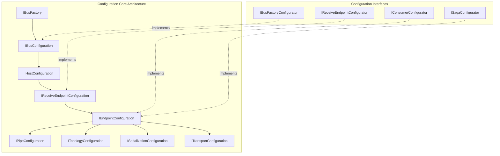

## Core Components

### IBusFactory
The `IBusFactory` interface is the entry point for creating bus configurations. It defines the contract for creating bus endpoint configurations and serves as the foundation for all bus creation scenarios.

```csharp
public interface IBusFactory : ISpecification
{
    IReceiveEndpointConfiguration CreateBusEndpointConfiguration(Action<IReceiveEndpointConfigurator> configure);
}
```

### IBusConfiguration
The `IBusConfiguration` interface represents the complete configuration of a bus instance, extending endpoint configuration with bus-specific concerns like observers and host configuration.

```csharp
public interface IBusConfiguration : IEndpointConfiguration, IBusObserverConnector, IEndpointConfigurationObserverConnector
{
    IHostConfiguration HostConfiguration { get; }
    IEndpointConfiguration BusEndpointConfiguration { get; }
    IBusObserver BusObservers { get; }
}
```

### IHostConfiguration
The `IHostConfiguration` interface manages host-level settings including transport configuration, retry policies, and topology deployment settings.

```csharp
public interface IHostConfiguration : IEndpointConfigurationObserverConnector, IReceiveObserverConnector, 
    IConsumeObserverConnector, IPublishObserverConnector, ISendObserverConnector, ISpecification
{
    IBusConfiguration BusConfiguration { get; }
    Uri HostAddress { get; }
    bool DeployTopologyOnly { get; set; }
    bool DeployPublishTopology { get; set; }
    ISendObserver SendObservers { get; }
    ILogContext? LogContext { get; set; }
    IBusTopology Topology { get; }
    IRetryPolicy ReceiveTransportRetryPolicy { get; }
    IRetryPolicy SendTransportRetryPolicy { get; }
    TimeSpan? ConsumerStopTimeout { get; set; }
    TimeSpan? StopTimeout { get; set; }
    
    IReceiveEndpointConfiguration CreateReceiveEndpointConfiguration(string queueName, Action<IReceiveEndpointConfigurator>? configure = null);
    ConnectHandle ConnectReceiveEndpointContext(ReceiveEndpointContext context);
    IHost Build();
}
```

### BusFactoryConfigurator
The `BusFactoryConfigurator` class is the primary implementation for configuring buses, providing a fluent API for setting up message topology, serialization, middleware, and observers.

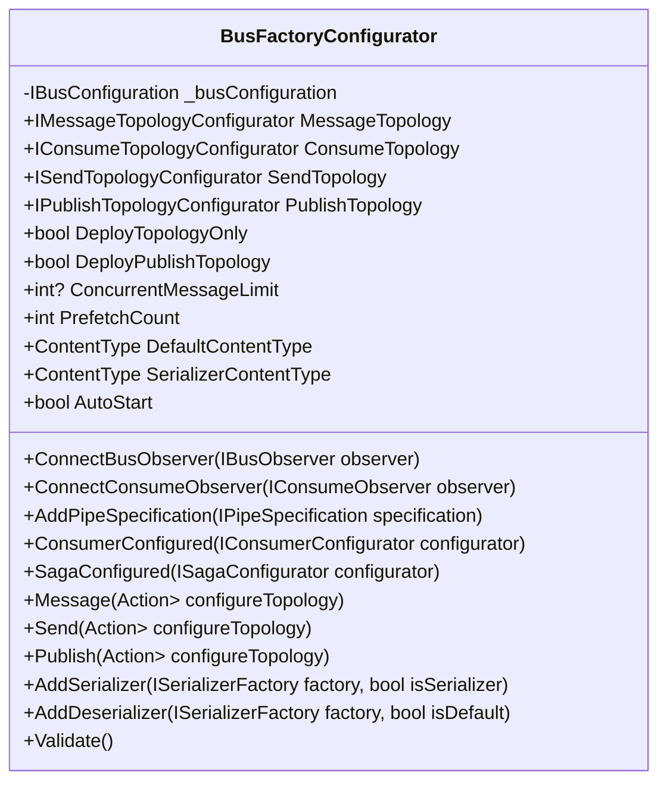

## Configuration Hierarchy

The configuration system implements a hierarchical pattern where settings flow from bus-level to endpoint-level configurations:

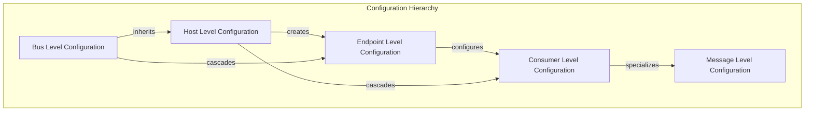

## Endpoint Configuration

### IReceiveEndpointConfiguration
The `IReceiveEndpointConfiguration` interface manages receive endpoint-specific settings including consume pipes, observers, and transport settings.

```csharp
public interface IReceiveEndpointConfiguration : IEndpointConfiguration, IReceiveEndpointObserverConnector, IReceiveEndpointDependentConnector
{
    IConsumePipe ConsumePipe { get; }
    Uri HostAddress { get; }
    Uri InputAddress { get; }
    bool ConfigureConsumeTopology { get; }
    bool PublishFaults { get; }
    int PrefetchCount { get; }
    int? ConcurrentMessageLimit { get; }
    ReceiveEndpointObservable EndpointObservers { get; }
    ReceiveObservable ReceiveObservers { get; }
    ReceiveTransportObservable TransportObservers { get; }
    IReceiveEndpoint ReceiveEndpoint { get; }
    Task DependenciesReady { get; }
    Task DependentsCompleted { get; }
    IReceivePipe CreateReceivePipe();
    ReceiveEndpointContext CreateReceiveEndpointContext();
}
```

### IEndpointConfiguration
The `IEndpointConfiguration` interface provides the base configuration capabilities for all endpoints, including pipe configurations and topology settings.

```csharp
public interface IEndpointConfiguration : IConsumePipeConfigurator, ISendPipelineConfigurator, 
    IPublishPipelineConfigurator, IReceivePipelineConfigurator, ISpecification
{
    bool IsBusEndpoint { get; }
    IConsumePipeConfiguration Consume { get; }
    ISendPipeConfiguration Send { get; }
    IPublishPipeConfiguration Publish { get; }
    IReceivePipeConfiguration Receive { get; }
    ITopologyConfiguration Topology { get; }
    ISerializationConfiguration Serialization { get; }
    ITransportConfiguration Transport { get; }
}
```

## Consumer and Saga Configuration

### Consumer Configuration
The configuration system provides specialized interfaces for configuring consumers, allowing fine-grained control over consumer behavior, message handling, and middleware integration.

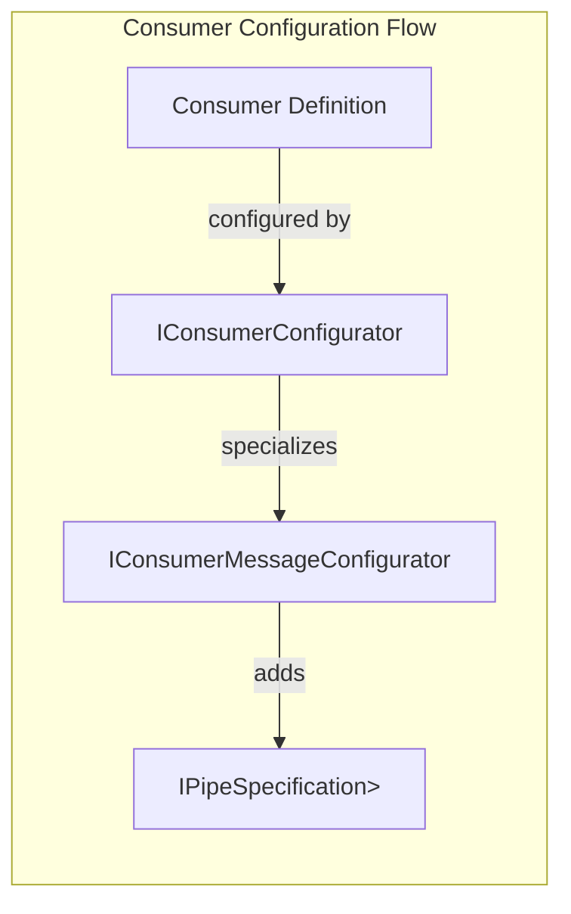

### Saga Configuration
Saga configuration extends consumer configuration with state machine capabilities and specialized middleware for state persistence and correlation.

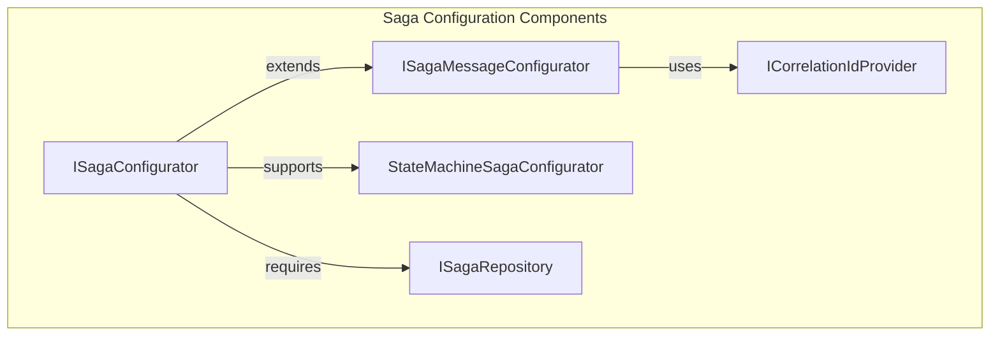

## Middleware Pipeline Configuration

The configuration system provides extensive support for middleware pipeline configuration, allowing developers to customize message processing behavior at various stages.

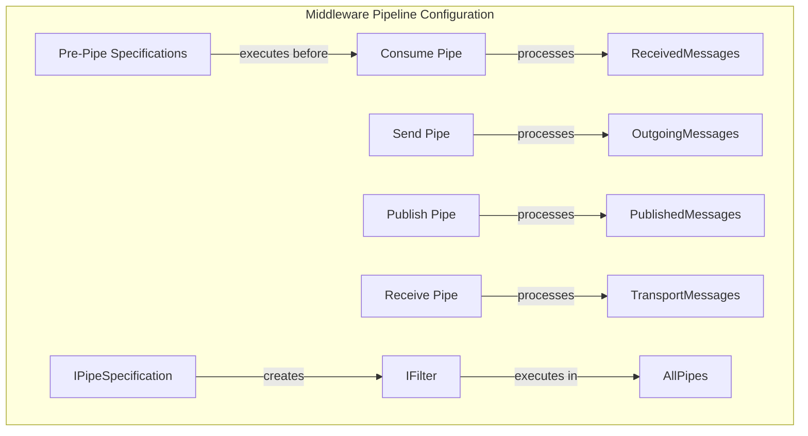

## Topology Configuration

The configuration system manages message topology, including exchange and queue definitions, routing keys, and message type mappings.

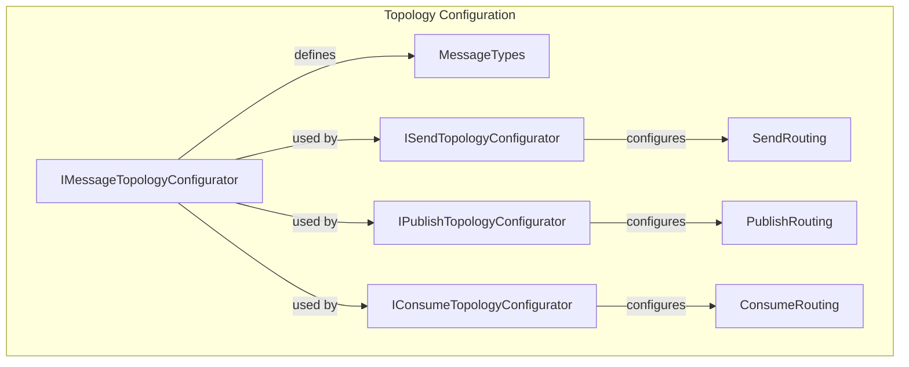

## Serialization Configuration

The configuration system provides flexible serialization configuration, supporting multiple serializers and content type negotiation.

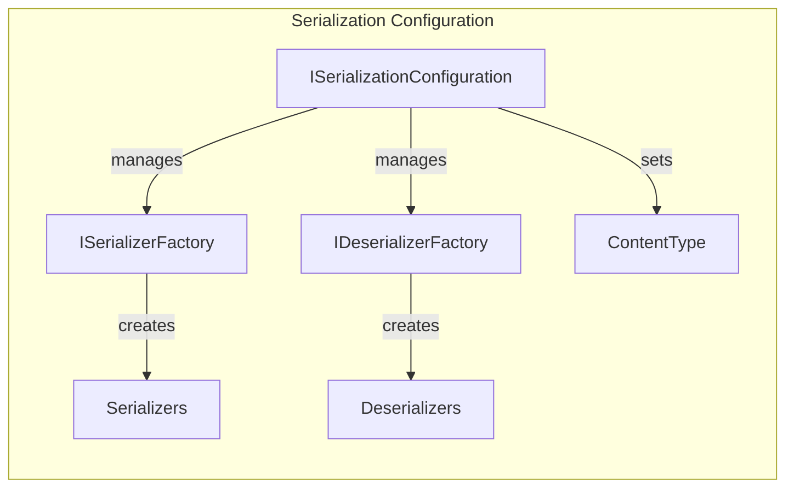

## Transport Configuration

Transport configuration manages the underlying transport-specific settings, including connection parameters, retry policies, and performance tuning.

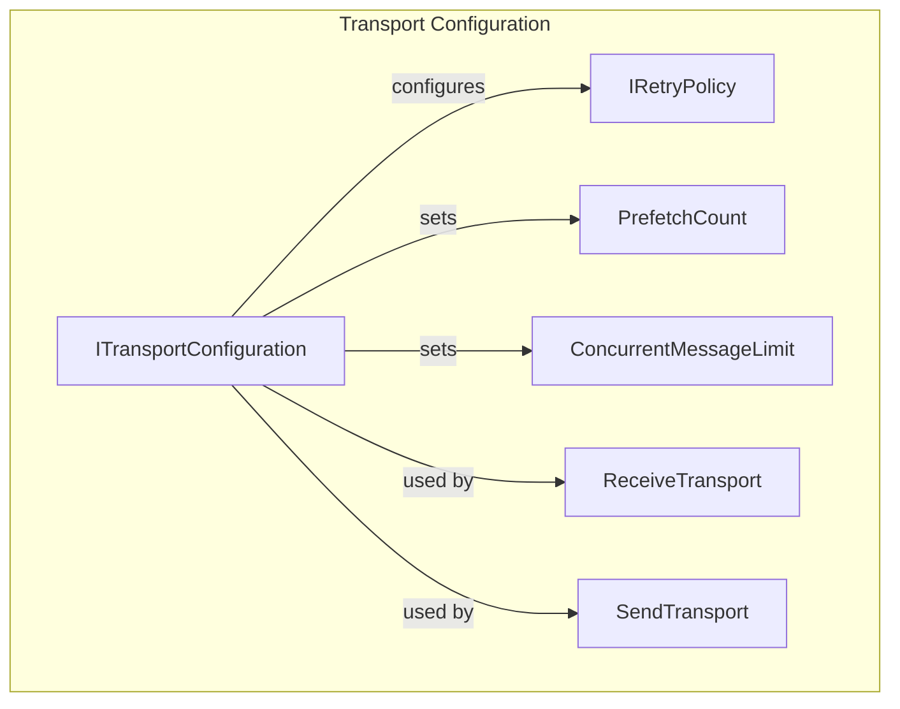

## Configuration Validation

The configuration system includes comprehensive validation capabilities to ensure configurations are valid before creating bus instances.

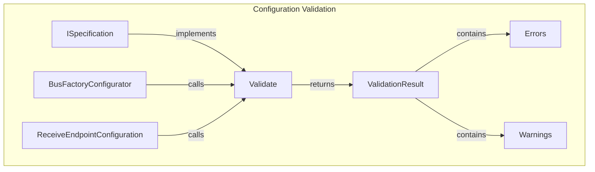

## Integration with Other Modules

The Configuration_Core module integrates extensively with other MassTransit modules:

### Core_Abstractions Integration
- Uses [IConsumer](Core_Abstractions.md#iconsumer), [ISaga](Core_Abstractions.md#isaga), and [IRequestClient](Core_Abstractions.md#irequestclient) for configuration contracts
- Leverages [ConsumeContext](Core_Abstractions.md#consumecontext) and related context types for middleware configuration

### Middleware_Core Integration
- Configures [IPipe](Middleware_Core.md#ipipe) and [IFilter](Middleware_Core.md#ifilter) implementations
- Manages [ConsumePipe](Middleware_Core.md#consumepipe), [SendPipe](Middleware_Core.md#sendpipe), and [PublishPipe](Middleware_Core.md#publishpipe) configurations

### Transports_Core Integration
- Configures [ISendTransport](Transports_Core.md#isendtransport) and [IReceiveTransport](Transports_Core.md#ireceivetransport) implementations
- Manages [SendEndpoint](Transports_Core.md#sendendpoint) and [ReceiveEndpoint](Transports_Core.md#receiveendpoint) configurations

### Serialization_Core Integration
- Configures [IMessageSerializer](Serialization_Core.md#imessageserializer) and [IMessageDeserializer](Serialization_Core.md#imessagedeserializer) implementations
- Manages [JsonMessageEnvelope](Serialization_Core.md#jsonmessageenvelope) and serialization settings

### DependencyInjection_Core Integration
- Provides integration points for dependency injection containers
- Supports [IRegistrationBusFactory](DependencyInjection_Core.md#iregistrationbusfactory) and [IBusRegistrationContext](DependencyInjection_Core.md#ibusregistrationcontext)

## Usage Patterns

### Basic Bus Configuration
```csharp
var bus = Bus.Factory.CreateUsingRabbitMq(cfg =>
{
    cfg.Host("rabbitmq://localhost");
    
    cfg.ReceiveEndpoint("order-service", e =>
    {
        e.Consumer<OrderConsumer>();
    });
});
```

### Advanced Consumer Configuration
```csharp
cfg.ReceiveEndpoint("order-service", e =>
{
    e.UseMessageRetry(r => r.Interval(3, TimeSpan.FromSeconds(5)));
    e.UseInMemoryOutbox();
    
    e.Consumer<OrderConsumer>(c =>
    {
        c.UseConcurrentMessageLimit(10);
        c.Message<OrderSubmitted>(m =>
        {
            m.UsePartitioner(10, x => x.OrderId);
        });
    });
});
```

### Saga Configuration
```csharp
cfg.ReceiveEndpoint("order-saga", e =>
{
    e.StateMachineSaga<OrderSagaInstance, OrderStateMachine>(repository);
});
```

## Configuration Lifecycle

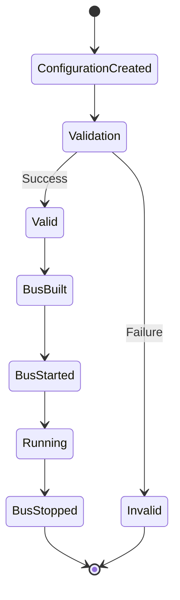

## Best Practices

1. **Configuration Separation**: Keep transport-specific configuration separate from business logic configuration
2. **Validation**: Always validate configurations before building bus instances
3. **Observer Pattern**: Use observers for cross-cutting concerns like logging and monitoring
4. **Middleware Ordering**: Be mindful of middleware execution order when configuring pipelines
5. **Resource Management**: Properly configure timeouts and limits to prevent resource exhaustion
6. **Topology Management**: Understand the implications of topology deployment settings

## Extensibility

The Configuration_Core module is designed for extensibility through:

- **Custom Configurators**: Implement configuration interfaces for custom components
- **Pipe Specifications**: Create custom middleware by implementing `IPipeSpecification<T>`
- **Observer Pattern**: Extend functionality through observer interfaces
- **Transport Extensions**: Add transport-specific configuration capabilities
- **Serialization Extensions**: Support custom serialization formats

This comprehensive configuration system provides the foundation for building robust, scalable message-based applications with MassTransit, offering both simplicity for basic scenarios and extensive customization for complex enterprise requirements.