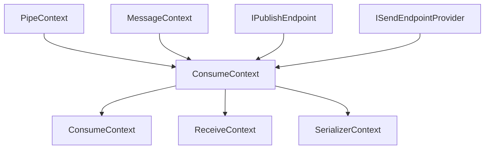
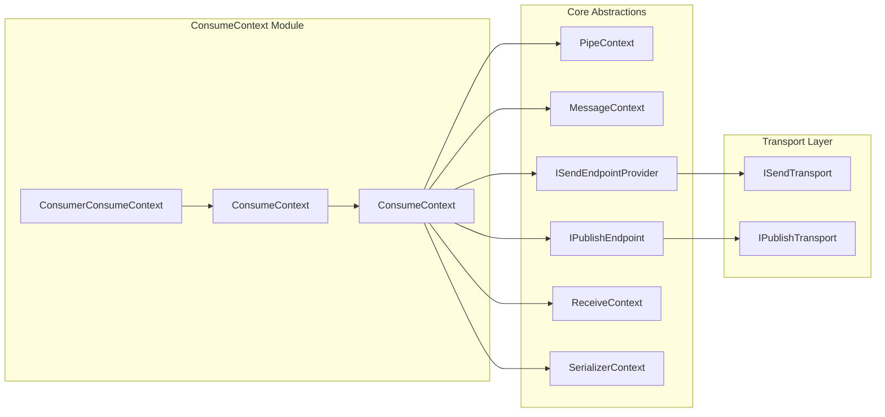
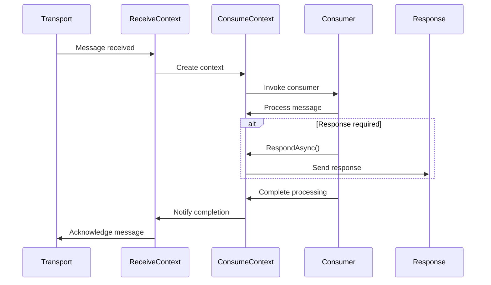

# ConsumeContext Module Documentation

## Overview

The ConsumeContext module is a fundamental component of MassTransit's message consumption infrastructure. It provides the execution context for message consumers, encapsulating all the information and capabilities needed to process incoming messages within the MassTransit messaging framework.

## Purpose and Core Functionality

The ConsumeContext serves as the primary interface between MassTransit's messaging infrastructure and message consumers. It provides:

- **Message Access**: Access to the deserialized message and its metadata
- **Response Capabilities**: Ability to respond to request messages
- **Message Publishing**: Publish new messages to the bus
- **Message Sending**: Send messages to specific endpoints
- **Contextual Information**: Access to message headers, correlation IDs, and conversation tracking
- **Lifecycle Management**: Coordination of consume operations and completion tracking

## Architecture

### Core Interface Hierarchy



### Component Relationships



## Key Components

### 1. ConsumeContext Interface

The base `ConsumeContext` interface provides:

- **Message Type Support**: `SupportedMessageTypes` property and `HasMessageType()` method
- **Message Access**: `TryGetMessage<T>()` for type-safe message access
- **Response Methods**: Multiple overloads of `RespondAsync()` and `Respond()`
- **Lifecycle Management**: `ConsumeCompleted` task and `AddConsumeTask()` method
- **Notification Methods**: `NotifyConsumed()` and `NotifyFaulted()` for tracking

### 2. Generic ConsumeContext<T>

The generic version provides:

- **Typed Message Access**: Direct access to the strongly-typed `Message` property
- **Simplified Notifications**: Type-specific notification methods

### 3. ConsumerConsumeContext<TConsumer, TMessage>

Combines consumer and message context for advanced scenarios:

- **Consumer Access**: Access to the consumer instance handling the message
- **Dual Context**: Inherits from both consumer context and typed consume context

## Data Flow



## Integration with Other Modules

### Middleware Core Integration

The ConsumeContext works closely with the [Middleware Core](Middleware_Core.md) module:

- **Pipe Execution**: Inherits from `PipeContext` for middleware pipeline execution
- **Filter Context**: Provides context for message filters and middleware components
- **Retry Support**: Integrates with retry policies through the pipe context

### Transport Layer Integration

Consumes transport services from [Transports_Core](Transports_Core.md):

- **Send Operations**: Uses `ISendEndpointProvider` to obtain send endpoints
- **Publish Operations**: Leverages `IPublishEndpoint` for message publishing
- **Address Resolution**: Works with transport-specific address formats

### Serialization Integration

Coordinates with [Serialization_Core](Serialization_Core.md):

- **Message Deserialization**: Uses `SerializerContext` for message deserialization
- **Type Resolution**: Supports multiple message types through serialization context
- **Content Type Handling**: Manages message content types for proper deserialization

## Usage Patterns

### Basic Message Consumption

```csharp
public class OrderConsumer : IConsumer<OrderMessage>
{
    public async Task Consume(ConsumeContext<OrderMessage> context)
    {
        var order = context.Message;
        // Process order
        
        // Send response if needed
        await context.RespondAsync(new OrderAcknowledged 
        {
            OrderId = order.OrderId,
            Timestamp = DateTime.UtcNow
        });
    }
}
```

### Publishing New Messages

```csharp
public async Task Consume(ConsumeContext<OrderMessage> context)
{
    var order = context.Message;
    
    // Process order
    
    // Publish order processed event
    await context.Publish(new OrderProcessedEvent
    {
        OrderId = order.OrderId,
        ProcessedAt = DateTime.UtcNow
    });
}
```

### Sending to Specific Endpoints

```csharp
public async Task Consume(ConsumeContext<OrderMessage> context)
{
    var order = context.Message;
    
    // Get endpoint for inventory service
    var inventoryEndpoint = await context.GetSendEndpoint(
        new Uri("queue:inventory-service"));
    
    // Send update inventory command
    await inventoryEndpoint.Send(new UpdateInventoryCommand
    {
        ProductId = order.ProductId,
        Quantity = -order.Quantity
    });
}
```

## Advanced Features

### Message Type Polymorphism

The ConsumeContext supports consuming messages of multiple types:

```csharp
public async Task Consume(ConsumeContext<IBaseEvent> context)
{
    if (context.TryGetMessage(out ConsumeContext<ISpecificEvent> specificContext))
    {
        // Handle specific event type
        var specificEvent = specificContext.Message;
    }
    else
    {
        // Handle base event type
        var baseEvent = context.Message;
    }
}
```

### Context Payload Management

Leverages the pipe context payload system for storing additional data:

```csharp
public async Task Consume(ConsumeContext<OrderMessage> context)
{
    // Add custom payload
    var correlationInfo = context.GetOrAddPayload(() => new CorrelationInfo 
    {
        CorrelationId = context.CorrelationId ?? Guid.NewGuid(),
        StartedAt = DateTime.UtcNow
    });
    
    // Use payload in downstream processing
}
```

### Response Pattern Variations

Multiple response patterns are supported:

- **Immediate Response**: `RespondAsync()` for immediate responses
- **Deferred Response**: `Respond()` for responses sent after consumer completion
- **Typed Responses**: Generic overloads for type-safe responses
- **Dynamic Responses**: Object-based responses with runtime type resolution

## Error Handling and Faults

The ConsumeContext provides comprehensive error handling:

- **Automatic Fault Publishing**: Faults are automatically published when consumers fail
- **Fault Address Support**: Messages can specify fault addresses for error handling
- **Exception Notification**: `NotifyFaulted()` methods for tracking consumer failures
- **Retry Integration**: Works with retry policies through the pipe context

## Performance Considerations

- **Task Completion**: The `ConsumeCompleted` task ensures all related operations complete before message acknowledgment
- **Async Operations**: All response and messaging operations are asynchronous
- **Resource Management**: Proper cleanup through task completion and cancellation token support
- **Payload Efficiency**: Lazy payload creation through factory methods

## Thread Safety

The ConsumeContext is designed for single-threaded consumption within the message processing pipeline. However, it supports concurrent operations for:

- **Response Sending**: Multiple response operations can be initiated
- **Message Publishing**: Concurrent publish operations are supported
- **Task Coordination**: The completion task coordinates multiple async operations

## Related Documentation

- [ReceiveContext](ReceiveContext.md) - Transport-level message receiving context
- [Middleware_Core](Middleware_Core.md) - Pipeline and middleware infrastructure
- [Transports_Core](Transports_Core.md) - Transport layer abstractions
- [Serialization_Core](Serialization_Core.md) - Message serialization infrastructure
- [IConsumer](IConsumer.md) - Message consumer interface
- [IPublishEndpoint](IPublishEndpoint.md) - Message publishing capabilities
- [ISendEndpointProvider](ISendEndpointProvider.md) - Message sending capabilities