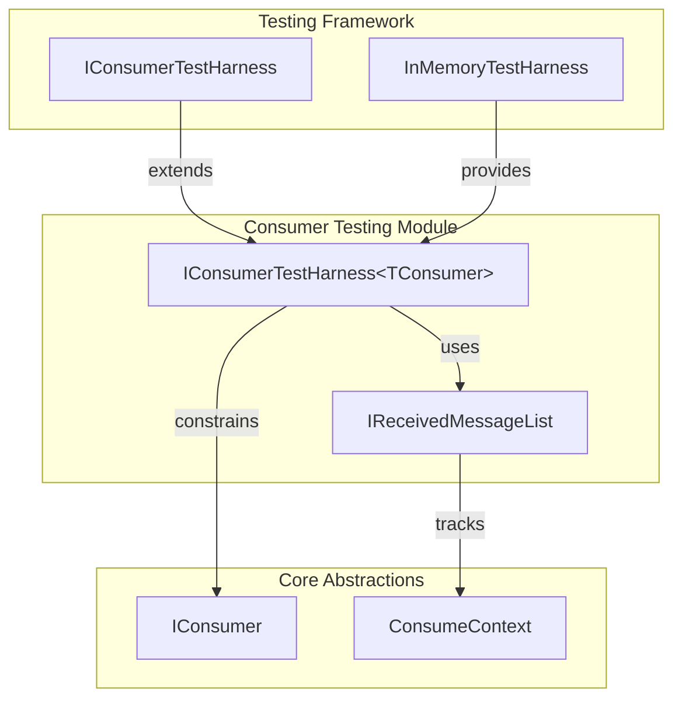
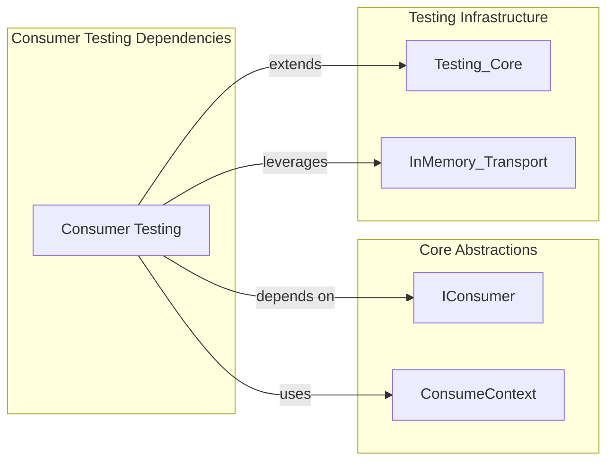
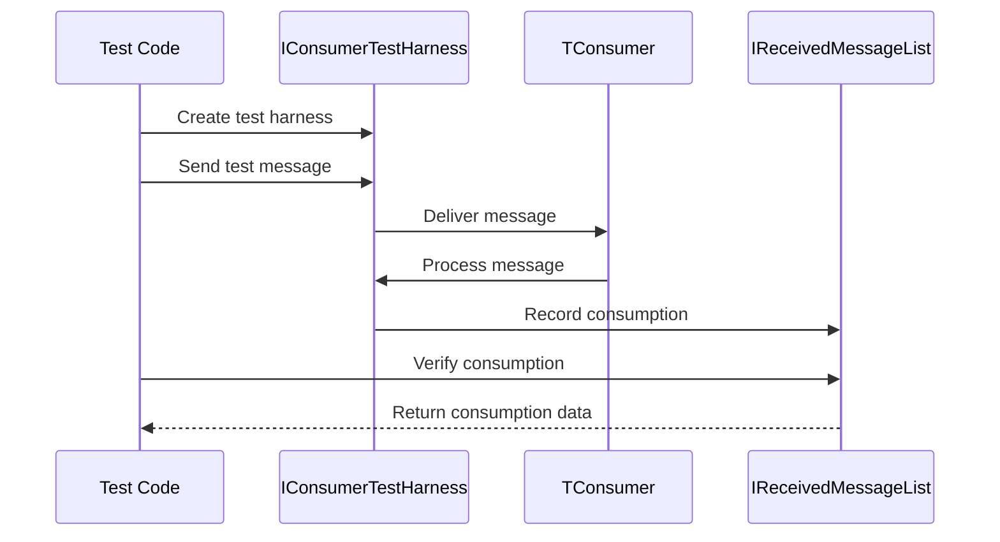

# Consumer Testing Module Documentation

## Introduction

The Consumer Testing module provides specialized testing capabilities for MassTransit message consumers. It offers a streamlined approach to verify consumer behavior, message processing, and consumption patterns in isolated test environments. This module is essential for developers who need to ensure their message consumers handle messages correctly and maintain expected behaviors under various conditions.

## Module Overview

The Consumer Testing module is part of the broader [Testing_Core](Testing_Core.md) ecosystem and specifically focuses on consumer-centric testing scenarios. It provides test harnesses that allow developers to observe and verify how consumers process messages, track consumption history, and validate consumer-side message handling logic.

## Core Architecture

### Component Structure

### Key Components

#### IConsumerTestHarness<TConsumer>
The primary interface that provides testing capabilities for consumer instances. This generic interface is constrained to work with classes that implement the `IConsumer` interface, ensuring type safety and proper consumer behavior validation.

**Key Features:**
- **Consumed Property**: Provides access to `IReceivedMessageList` which tracks all messages consumed by the test harness
- **Generic Type Safety**: Constrained to `class, IConsumer` ensuring only valid consumer types can be tested
- **Message Tracking**: Enables verification of message consumption patterns and history

## Dependencies and Integration

### Core Dependencies

### Integration Points

1. **Core Abstractions Integration**: The module heavily relies on [Core_Abstractions](Core_Abstractions.md) components:
   - `IConsumer`: Defines the contract that tested consumers must implement
   - `ConsumeContext`: Provides message consumption context that can be verified

2. **Testing Framework Integration**: Works closely with [Testing_Core](Testing_Core.md) components:
   - `InMemoryTestHarness`: Provides the underlying test infrastructure
   - Consumer test harnesses are typically created and managed by the main test harness

3. **Transport Layer Integration**: Utilizes [InMemory_Transport](InMemory_Transport.md) for:
   - Message delivery simulation
   - Consumer endpoint management
   - Transport-level testing scenarios

## Usage Patterns

### Basic Consumer Testing Flow

### Advanced Testing Scenarios

The consumer testing module supports various testing patterns:

1. **Message Consumption Verification**: Verify that specific messages were consumed
2. **Consumer Behavior Validation**: Test consumer-side business logic
3. **Error Handling Testing**: Verify consumer behavior under error conditions
4. **Message Ordering Tests**: Validate message processing order
5. **Performance Testing**: Measure consumer processing performance

## Implementation Considerations

### Type Constraints
The `IConsumerTestHarness<TConsumer>` interface enforces strict type constraints:
- `TConsumer` must be a class (reference type)
- `TConsumer` must implement `IConsumer` interface
- This ensures compile-time safety and proper consumer behavior

### Message Tracking
The `Consumed` property provides access to `IReceivedMessageList` which:
- Tracks all messages processed by the consumer
- Provides query capabilities for message verification
- Maintains message metadata and consumption timing
- Enables assertion-based testing patterns

### Test Isolation
Consumer test harnesses are designed to:
- Provide isolated testing environments
- Prevent cross-test contamination
- Support parallel test execution
- Enable independent consumer lifecycle management

## Related Modules

- [Testing_Core](Testing_Core.md): Parent testing framework providing base testing infrastructure
- [Core_Abstractions](Core_Abstractions.md): Core consumer and message abstractions
- [InMemory_Transport](InMemory_Transport.md): In-memory transport for testing scenarios
- [Saga_Testing](Saga_Testing.md): Related testing module for saga-based scenarios

## Best Practices

1. **Use Type-Specific Harnesses**: Always use the generic `IConsumerTestHarness<TConsumer>` for type-safe testing
2. **Verify Consumption**: Always verify message consumption through the `Consumed` property
3. **Test Error Scenarios**: Use the harness to test both success and failure paths
4. **Leverage Message Lists**: Use the provided message lists for comprehensive consumption verification
5. **Integrate with Test Framework**: Combine consumer testing with broader test harness capabilities

## Common Use Cases

- Unit testing individual consumer logic
- Integration testing consumer-message interactions
- Performance testing consumer processing
- Error handling and recovery testing
- Message ordering and delivery verification
- Consumer lifecycle management testing