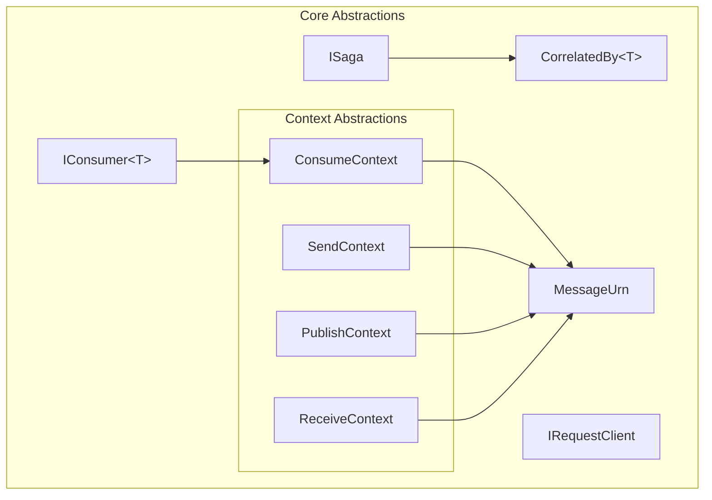

# Core Abstractions Module Documentation

## Overview

The Core Abstractions module forms the foundational layer of the MassTransit messaging framework, providing essential interfaces and base types that define the core concepts and contracts used throughout the system. This module establishes the fundamental building blocks for message-based communication, consumer patterns, and distributed system coordination.

## Purpose

The Core Abstractions module serves as the contract layer that:
- Defines the primary interfaces for message consumers and sagas
- Establishes context abstractions for message processing
- Provides message identification and correlation mechanisms
- Enables loose coupling between different parts of the messaging system

## Architecture Overview



## Core Components

### Message Consumer Infrastructure

The consumer infrastructure provides the foundation for message processing:

- **[IConsumer](IConsumer.md)**: Defines the contract for message consumers, enabling asynchronous message processing
- **[ConsumeContext](ConsumeContext.md)**: Provides contextual information and operations for consuming messages
- **[ReceiveContext](ReceiveContext.md)**: Contains transport-level information about received messages

### Message Correlation and Identification

Message correlation and identification mechanisms ensure proper message routing and processing:

- **[MessageUrn](MessageUrn.md)**: Provides a standardized way to identify message types using URNs
- **[CorrelatedBy](CorrelatedBy.md)**: Enables message correlation for distributed transaction tracking

### Message Publishing and Sending

Publishing and sending abstractions support different message delivery patterns:

- **[SendContext](SendContext.md)**: Context for point-to-point message sending
- **[PublishContext](PublishContext.md)**: Context for publish-subscribe message distribution
- **[IRequestClient](IRequestClient.md)**: Supports request-response messaging patterns

### Saga Support

Saga abstractions enable long-running business processes:

- **[ISaga](ISaga.md)**: Defines the base contract for saga instances with correlation capabilities

## Integration with Other Modules

The Core Abstractions module integrates with several other core modules:

### [Middleware_Core](Middleware_Core.md)
The middleware module builds upon the context abstractions to provide pipeline processing capabilities. The `ConsumeContext`, `SendContext`, and `PublishContext` interfaces are extended by middleware components to add cross-cutting concerns.

### [Configuration_Core](Configuration_Core.md)
Configuration components use the consumer and saga interfaces to configure message processing endpoints. The `IConsumer` and `ISaga` contracts are fundamental to endpoint configuration.

### [Transports_Core](Transports_Core.md)
Transport implementations utilize the context abstractions to provide transport-specific functionality. `ReceiveContext` is particularly important for transport-level message handling.

### [Serialization_Core](Serialization_Core.md)
Serialization components work with message types identified by `MessageUrn` and process messages within the various context abstractions.

### [Saga_StateMachine_Core](Saga_StateMachine_Core.md)
The saga state machine module extends the basic `ISaga` interface to provide sophisticated state management and orchestration capabilities.

## Key Design Patterns

### 1. Context Pattern
All message operations are wrapped in context objects that provide:
- Message access
- Headers and metadata
- Operations (send, publish, reply)
- Cancellation support

### 2. Generic Type Constraints
Message types are constrained to reference types (`where TMessage : class`) to ensure:
- Proper serialization behavior
- Null reference safety
- Consistent messaging patterns

### 3. Correlation Pattern
Messages and sagas support correlation through:
- `CorrelatedBy<T>` interface for messages
- `CorrelationId` property for sagas
- Consistent GUID-based identification

## Usage Examples

### Basic Consumer Implementation
```csharp
public class OrderConsumer : IConsumer<OrderMessage>
{
    public async Task Consume(ConsumeContext<OrderMessage> context)
    {
        // Process the order message
        var order = context.Message;
        
        // Access message headers
        var correlationId = context.CorrelationId;
        
        // Send response or publish events
        await context.Publish<OrderProcessedEvent>(new { OrderId = order.Id });
    }
}
```

### Saga Implementation
```csharp
public class OrderSaga : ISaga
{
    public Guid CorrelationId { get; set; }
    public string OrderId { get; set; }
    public decimal OrderTotal { get; set; }
    public SagaState CurrentState { get; set; }
}
```

### Message Identification
```csharp
// Get URN for a message type
var messageUrn = MessageUrn.ForType<OrderMessage>();

// Use in routing or logging
Console.WriteLine($"Processing message type: {messageUrn}");
```

## Best Practices

1. **Message Design**: Keep messages simple and focused on a single concern
2. **Correlation**: Always include correlation IDs for tracking distributed operations
3. **Context Usage**: Leverage context objects for all messaging operations rather than using static accessors
4. **Type Safety**: Use strongly-typed consumers and messages to ensure compile-time safety
5. **Naming Conventions**: Follow consistent naming patterns for messages (e.g., *Command, *Event, *Message)

## Extensibility Points

The Core Abstractions module provides several extension points:

- Custom context implementations for specialized scenarios
- Message type conventions through `MessageUrn` customization
- Correlation ID generation strategies
- Consumer base classes for common patterns

This foundational module enables the flexible and extensible architecture that characterizes the MassTransit framework, providing the essential contracts that all other modules build upon.