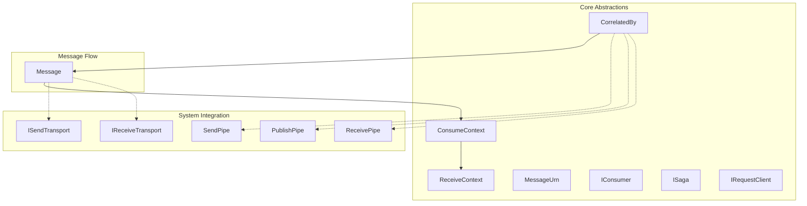
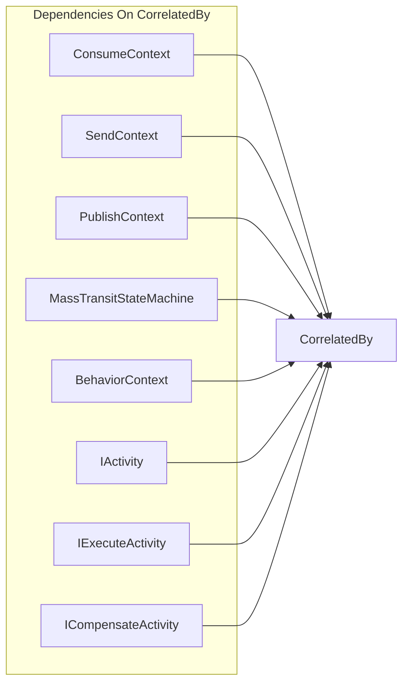
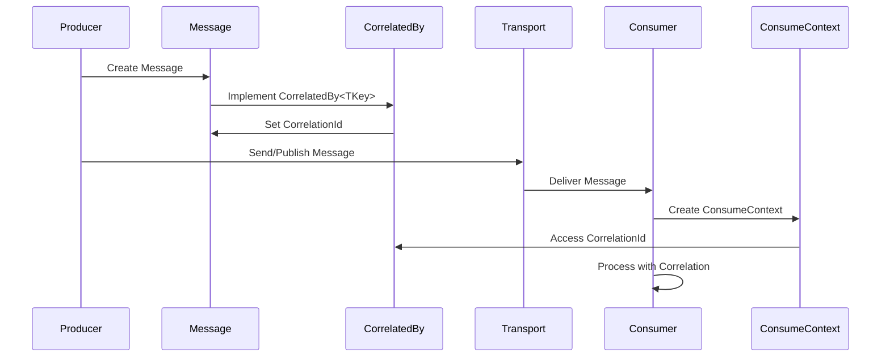
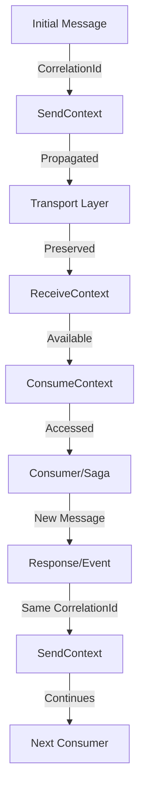
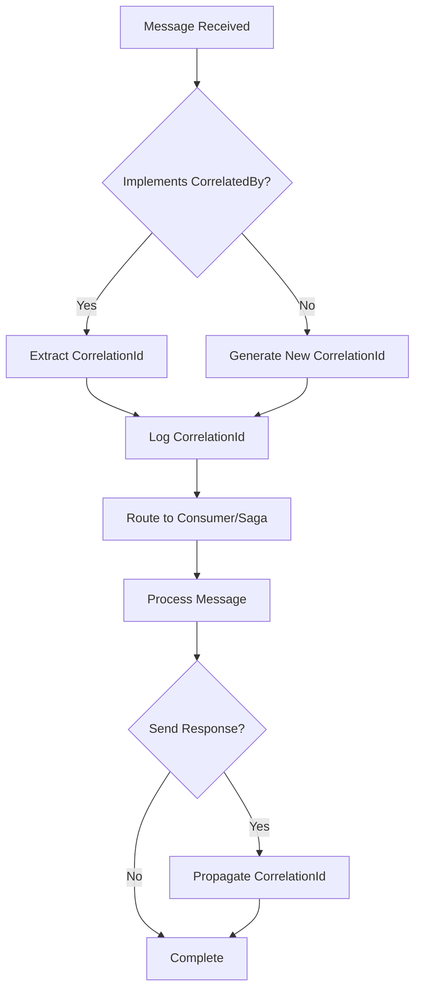
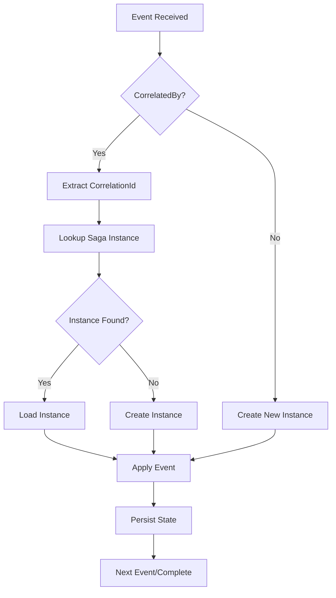

# CorrelatedBy Module Documentation

## Introduction

The CorrelatedBy module is a fundamental abstraction in MassTransit that provides a standardized way to identify and track messages using correlation identifiers. This simple yet powerful interface enables message correlation across distributed systems, allowing messages to be linked together for tracking conversations, request-response patterns, and saga state management.

## Core Component

### CorrelatedBy<TKey> Interface

The `CorrelatedBy<TKey>` interface is the primary component of this module, providing a contract for messages that contain a correlation identifier.

```csharp
public interface CorrelatedBy<out TKey>
{
    TKey CorrelationId { get; }
}
```

**Key Characteristics:**
- **Generic Interface**: Uses `TKey` to allow flexible correlation ID types (Guid, string, int, etc.)
- **Covariant**: The `out` keyword enables covariance, allowing more derived types to be used
- **Read-only Property**: The CorrelationId is immutable once set
- **Universal Contract**: Provides a consistent way to access correlation IDs across all message types

## Architecture

### Module Position in System



### Component Dependencies



## Data Flow

### Message Correlation Flow



### Correlation ID Propagation



## Integration Points

### Context Integration

The CorrelatedBy interface is deeply integrated with MassTransit's context system:

- **[ConsumeContext](ConsumeContext.md)**: Provides access to the correlation ID of the consumed message
- **[SendContext](SendContext.md)**: Ensures correlation IDs are propagated when sending messages
- **[PublishContext](PublishContext.md)**: Maintains correlation IDs during publish operations
- **[ReceiveContext](ReceiveContext.md)**: Preserves correlation IDs at the transport level

### Saga State Machine Integration

In the [Saga State Machine](Saga_StateMachine_Core.md) module:

- **[MassTransitStateMachine](Saga_StateMachine_Core.md)**: Uses correlation IDs to route events to correct saga instances
- **[BehaviorContext](Saga_StateMachine_Core.md)**: Provides correlation ID access within saga behaviors

### Courier Integration

In the [Courier](Courier_Core.md) module for routing slips:

- **[IActivity](Courier_Core.md)**: Activities can access correlation IDs for tracking
- **[IExecuteActivity](Courier_Core.md)** and **[ICompensateActivity](Courier_Core.md)**: Maintain correlation across execution and compensation

## Usage Patterns

### Basic Message Implementation

```csharp
public class OrderSubmitted : CorrelatedBy<Guid>
{
    public Guid CorrelationId { get; set; }
    public string OrderId { get; set; }
    public decimal Amount { get; set; }
}
```

### Request-Response Pattern

```csharp
// Request message
public class CheckOrderStatus : CorrelatedBy<Guid>
{
    public Guid CorrelationId { get; set; }
    public string OrderId { get; set; }
}

// Response message
public class OrderStatusResult : CorrelatedBy<Guid>
{
    public Guid CorrelationId { get; set; }
    public string OrderId { get; set; }
    public string Status { get; set; }
}
```

### Saga Correlation

```csharp
public class OrderSaga : ISaga, CorrelatedBy<Guid>
{
    public Guid CorrelationId { get; set; } // Saga instance identifier
    public string OrderId { get; set; }
    public decimal OrderAmount { get; set; }
}
```

## Process Flow

### Message Processing with Correlation



### Saga Instance Resolution



## Best Practices

### Correlation ID Selection

1. **Use Guid for Distributed Scenarios**: Ensures uniqueness across systems
2. **Consider Business Keys**: Use natural identifiers when appropriate (OrderId, CustomerId)
3. **Maintain Consistency**: Use the same correlation ID type within a conversation
4. **Document Conventions**: Clearly define correlation ID usage in your system

### Implementation Guidelines

1. **Always Implement for Request-Response**: Ensures proper message matching
2. **Implement in Saga Messages**: Required for proper saga instance routing
3. **Propagate Through System**: Maintain correlation IDs across service boundaries
4. **Log with Correlation**: Include correlation IDs in all relevant log entries

## Relationship to Other Modules

### Direct Dependencies
- **[Core Abstractions](Core_Abstractions.md)**: Foundation interface for message identification

### Modules Using CorrelatedBy
- **[Middleware Core](Middleware_Core.md)**: Pipes and filters use correlation for message tracking
- **[Configuration Core](Configuration_Core.md)**: Configurators set up correlation-based routing
- **[Transports Core](Transports_Core.md)**: Transports preserve correlation IDs across boundaries
- **[Serialization Core](Serialization_Core.md)**: Serializers handle correlation ID persistence
- **[Saga State Machine Core](Saga_StateMachine_Core.md)**: State machines rely on correlation for instance management
- **[Courier Core](Courier_Core.md)**: Routing slips maintain correlation across activities
- **[Testing Core](Testing_Core.md)**: Test harnesses verify correlation ID behavior

## Summary

The CorrelatedBy module provides the essential abstraction for message correlation in MassTransit. Despite its simplicity, it enables powerful patterns for message tracking, conversation management, and distributed system coordination. By implementing this interface, messages become traceable across service boundaries, enabling sophisticated scenarios like saga management, request-response patterns, and end-to-end system monitoring.

The module's design emphasizes simplicity and flexibility, allowing developers to choose appropriate correlation ID types while ensuring consistent behavior across the entire MassTransit ecosystem.