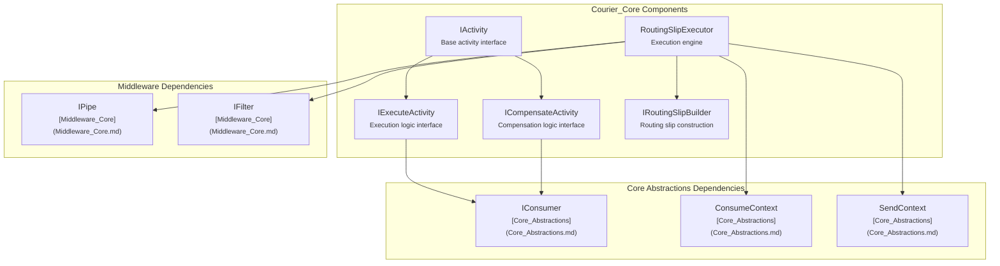
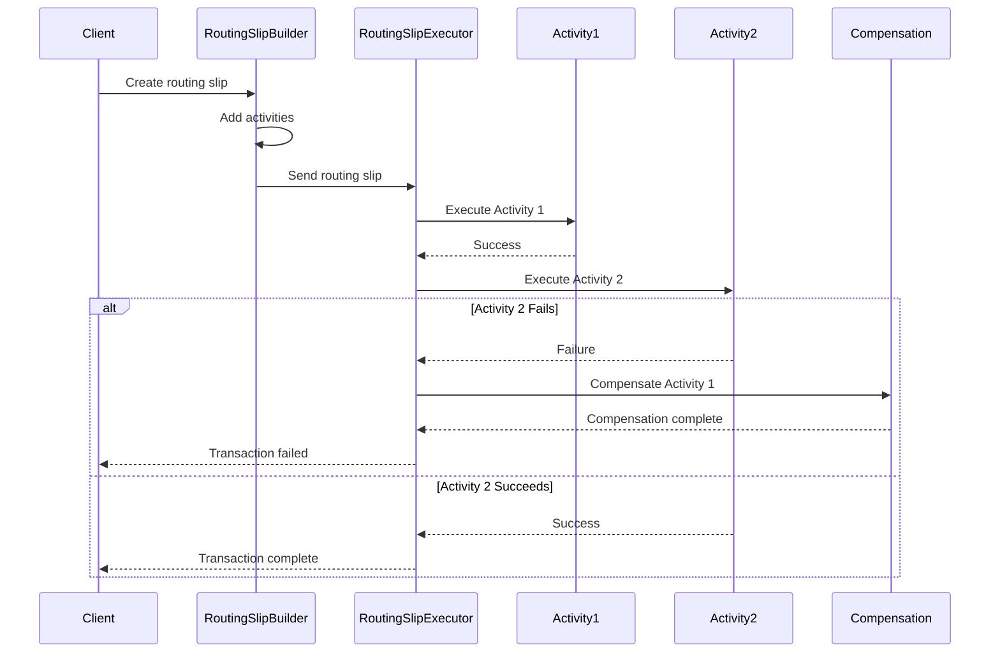
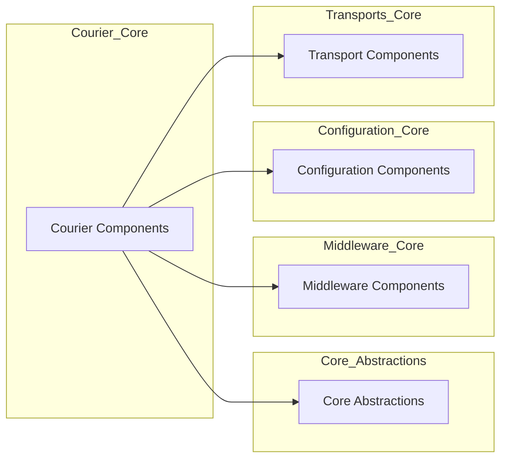
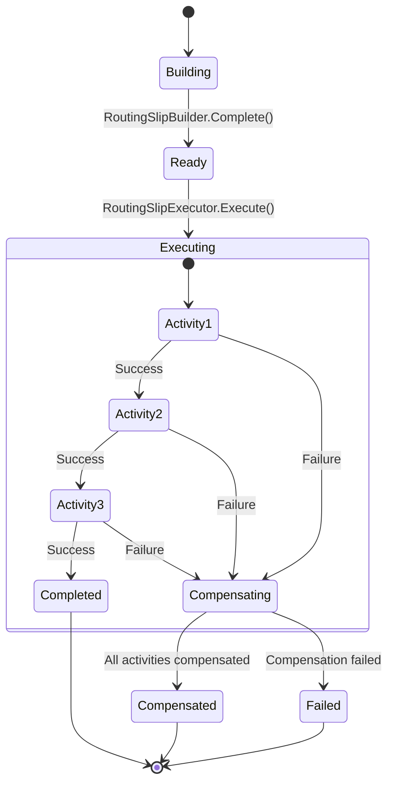

# Courier_Core Module Documentation

## Introduction

The Courier_Core module is MassTransit's distributed transaction processing framework that implements the Routing Slip pattern for reliable message processing and compensation. This module provides the foundation for building complex distributed transactions with built-in support for execution, compensation, and state management across multiple services.

## Overview

Courier_Core enables developers to implement distributed transactions using the Routing Slip pattern, where a message (routing slip) contains the itinerary of services to be invoked along with their execution and compensation logic. This approach provides reliable execution with automatic compensation capabilities when failures occur.

## Architecture

### Core Components Architecture



### Routing Slip Data Flow



## Core Components

### IActivity
The foundational interface that defines the contract for activities that can participate in routing slip transactions. Activities must implement both execution and compensation logic.

**Key Responsibilities:**
- Define activity metadata and configuration
- Provide execution context requirements
- Specify compensation requirements

### IExecuteActivity
Defines the execution logic for an activity within a routing slip. This interface is responsible for performing the actual work during the forward execution phase.

**Key Responsibilities:**
- Execute business logic
- Update routing slip with execution results
- Handle execution context
- Manage activity state

### ICompensateActivity
Defines the compensation logic that reverses the effects of a previously executed activity. This is invoked when a subsequent activity fails and the transaction needs to be rolled back.

**Key Responsibilities:**
- Reverse the effects of execution
- Handle compensation context
- Update routing slip with compensation results
- Manage compensation state

### IRoutingSlipBuilder
Provides a fluent interface for constructing routing slips with the appropriate activities, arguments, and configuration.

**Key Responsibilities:**
- Build routing slip itineraries
- Add activities with arguments
- Configure activity execution order
- Set compensation strategies
- Manage routing slip metadata

### RoutingSlipExecutor
The core execution engine that processes routing slips, manages activity execution, and handles compensation when failures occur.

**Key Responsibilities:**
- Execute routing slip itineraries
- Manage activity execution order
- Handle failures and trigger compensation
- Maintain execution state
- Provide execution monitoring

## Integration with MassTransit Core

### Dependency Relationships



### Message Flow Integration

The Courier_Core module integrates with MassTransit's messaging infrastructure through:

1. **ConsumeContext Integration**: Activities receive execution context through MassTransit's ConsumeContext, providing access to message headers, correlation IDs, and other metadata.

2. **SendContext Integration**: Routing slip execution results are published using MassTransit's SendContext, ensuring proper message routing and delivery guarantees.

3. **Middleware Pipeline**: The RoutingSlipExecutor integrates with MassTransit's middleware pipeline, allowing for cross-cutting concerns like logging, metrics, and error handling.

## Activity Execution Model

### Execution Phases



### Compensation Strategy

The Courier_Core implements a backward compensation strategy:

1. **Forward Execution**: Activities are executed in the order specified in the routing slip
2. **Failure Detection**: If any activity fails, the executor stops forward execution
3. **Backward Compensation**: Previously executed activities are compensated in reverse order
4. **Compensation Tracking**: Each compensation result is recorded in the routing slip
5. **Final State**: The routing slip contains both execution and compensation results

## Configuration and Usage

### Basic Activity Implementation

```csharp
public class PaymentActivity : IActivity<PaymentArguments, PaymentLog>
{
    public async Task<ExecutionResult> Execute(ExecuteContext<PaymentArguments> context)
    {
        // Process payment
        var paymentId = await ProcessPayment(context.Arguments);
        
        return context.Completed(new PaymentLog { PaymentId = paymentId });
    }

    public async Task<CompensationResult> Compensate(CompensateContext<PaymentLog> context)
    {
        // Refund payment
        await RefundPayment(context.Log.PaymentId);
        
        return context.Compensated();
    }
}
```

### Routing Slip Construction

```csharp
var builder = new RoutingSlipBuilder(NewId.NextGuid());

builder.AddActivity("Payment", new Uri("queue:payment-service"), new 
{
    Amount = 100.00,
    AccountId = "ACC123"
});

builder.AddActivity("Inventory", new Uri("queue:inventory-service"), new
{
    ProductId = "PROD456",
    Quantity = 2
});

var routingSlip = builder.Build();
```

## Error Handling and Recovery

### Failure Scenarios

The Courier_Core handles several failure scenarios:

1. **Activity Execution Failure**: Individual activity failures trigger compensation
2. **Transport Failures**: Message delivery failures are handled by MassTransit's retry mechanisms
3. **Compensation Failures**: Failed compensations are logged and can be manually resolved
4. **Timeout Handling**: Activities can specify timeout values for long-running operations

### Monitoring and Observability

Routing slip execution provides comprehensive monitoring capabilities:

- **Execution Tracking**: Each activity's execution state is tracked
- **Compensation Tracking**: Compensation activities are monitored
- **Performance Metrics**: Execution duration and latency metrics
- **Error Reporting**: Detailed error information for failed activities

## Relationship to Other Modules

### Core_Abstractions
Courier_Core builds upon the foundational abstractions provided by [Core_Abstractions](Core_Abstractions.md), extending the consumer model to support transactional execution patterns.

### Middleware_Core
Integration with [Middleware_Core](Middleware_Core.md) enables cross-cutting concerns like logging, metrics, and custom behaviors to be applied to routing slip execution.

### Configuration_Core
[Configuration_Core](Configuration_Core.md) provides the configuration infrastructure for registering activities and configuring routing slip behavior.

### Transports_Core
[Transports_Core](Transports_Core.md) handles the actual message transport for routing slip execution and compensation messages.

## Best Practices

### Activity Design
1. **Idempotent Execution**: Activities should be idempotent to handle duplicate executions
2. **Compensation Logic**: Always implement compensation logic that truly reverses execution effects
3. **State Management**: Keep activity state minimal and focused
4. **Error Handling**: Implement proper error handling within activities

### Routing Slip Construction
1. **Activity Ordering**: Order activities to minimize compensation complexity
2. **Argument Design**: Keep activity arguments simple and serializable
3. **Timeout Configuration**: Set appropriate timeouts for long-running activities
4. **Monitoring**: Include monitoring activities for complex routing slips

### Performance Considerations
1. **Activity Granularity**: Balance between fine-grained and coarse-grained activities
2. **Compensation Cost**: Consider the cost of compensation when designing activities
3. **Resource Usage**: Monitor resource usage during routing slip execution
4. **Scalability**: Design for horizontal scaling of activity execution

## Conclusion

The Courier_Core module provides a robust foundation for implementing distributed transactions in MassTransit applications. By combining the Routing Slip pattern with MassTransit's reliable messaging infrastructure, developers can build complex transactional systems with confidence in their reliability and consistency.