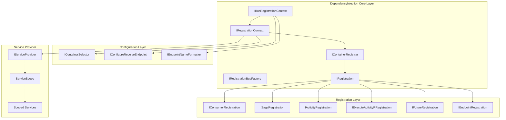
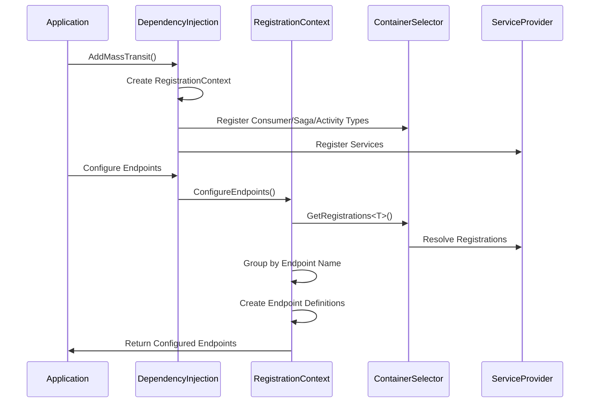
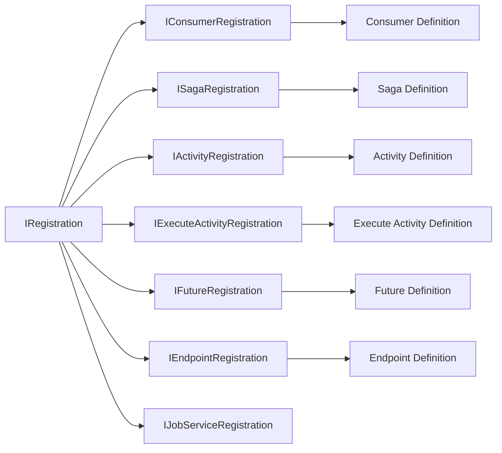
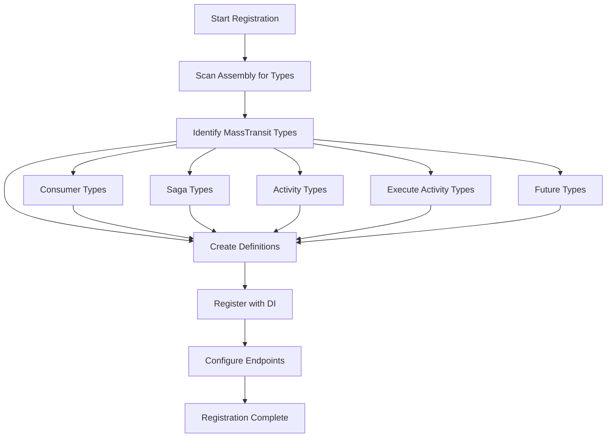
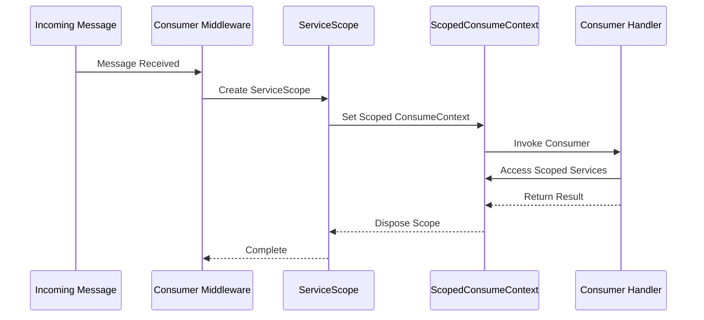
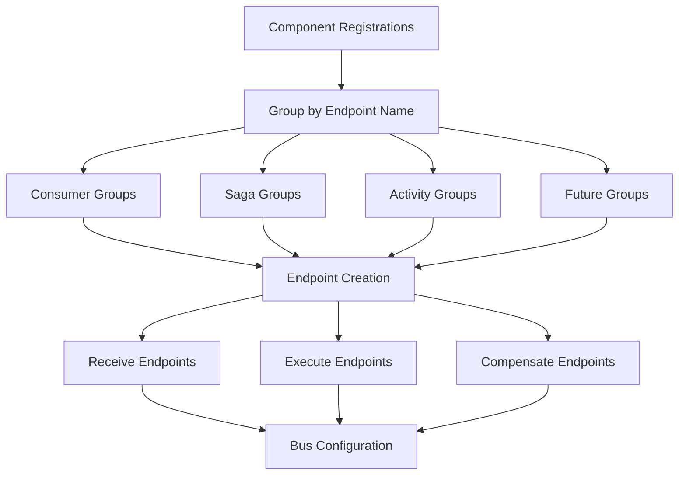
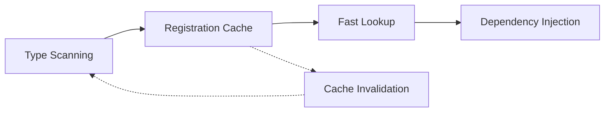

# DependencyInjection_Core Module Documentation

## Introduction

The DependencyInjection_Core module is the central component of MassTransit's dependency injection system, providing seamless integration with Microsoft.Extensions.DependencyInjection and other DI containers. This module serves as the bridge between MassTransit's messaging infrastructure and modern .NET dependency injection patterns, enabling automatic registration, configuration, and lifecycle management of all MassTransit components including consumers, sagas, activities, and endpoints.

The module eliminates the need for manual configuration by providing convention-based registration, scoped context management, and automatic endpoint discovery, making it significantly easier to build scalable message-driven applications.

## Architecture Overview

The DependencyInjection_Core module is built around several key architectural patterns that provide flexibility, extensibility, and maintainability:

### Core Architecture Pattern



### Component Registration Flow



## Core Components

### IBusRegistrationContext
The primary interface for configuring MassTransit endpoints using dependency injection. It provides methods to automatically configure all registered consumers, sagas, and activities.

**Key Responsibilities:**
- Endpoint configuration and management
- Registration discovery and grouping
- Endpoint name formatting
- Receive endpoint configuration coordination

**Key Methods:**
- `ConfigureEndpoints<T>()` - Automatically configures all registered endpoints
- `GetConfigureReceiveEndpoints()` - Returns receive endpoint configuration
- `EndpointNameFormatter` - Provides endpoint naming conventions

### IRegistrationContext
The base context for all registration operations, providing access to the service provider and registration management.

**Key Responsibilities:**
- Consumer configuration and lifecycle management
- Saga configuration and state management
- Activity and execute activity configuration
- Future (request-response) configuration
- Service resolution and scope management

### IContainerRegistrar
Interface for registering MassTransit components with the dependency injection container.

**Key Responsibilities:**
- Component registration (consumers, sagas, activities)
- Request client registration
- Endpoint name formatter registration
- Scoped client factory registration
- Registration caching and retrieval

### IRegistrationBusFactory
Factory interface for creating bus instances using the registration context.

**Key Responsibilities:**
- Bus instance creation
- Specification application
- Bus lifecycle management
- Multi-bus support

## Registration System

### Registration Types



### Registration Process Flow



## Scoped Context Management

### Scoped Consume Context

The module provides sophisticated scoped context management to ensure proper dependency injection scoping within message consumers:



### Scope Providers

The module includes specialized scope providers for different component types:

- **IConsumeScopeProvider** - Manages scopes for message consumers
- **IExecuteActivityScopeProvider** - Manages scopes for execute activities
- **ICompensateActivityScopeProvider** - Manages scopes for compensate activities
- **IFilterScopeProvider** - Manages scopes for middleware filters

## Endpoint Configuration

### Automatic Endpoint Discovery

The module automatically discovers and configures endpoints based on registered components:



### Endpoint Name Resolution

Endpoint names are resolved using the following priority:
1. Explicit endpoint definition
2. Consumer/Activity attribute specification
3. Convention-based naming using IEndpointNameFormatter
4. Default naming strategy

## Integration with Other Modules

### Core Abstractions Integration

The DependencyInjection_Core module integrates with [Core_Abstractions](Core_Abstractions.md) to provide DI support for:
- [IConsumer](Core_Abstractions.md#iconsumer) - Message consumers
- [ISaga](Core_Abstractions.md#isaga) - Saga state machines
- [IRequestClient](Core_Abstractions.md#irequestclient) - Request-response clients
- [ConsumeContext](Core_Abstractions.md#consumecontext) - Message consumption context

### Configuration Integration

Integrates with [Configuration_Core](Configuration_Core.md) to provide:
- Automatic registration of configuration interfaces
- DI-based configuration providers
- Scoped configuration resolution
- Configuration validation

### Transport Integration

Works with [Transports_Core](Transports_Core.md) for:
- Transport-specific endpoint configuration
- Send and receive endpoint providers
- Transport factory registration
- Endpoint lifecycle management

### Middleware Integration

Coordinates with [Middleware_Core](Middleware_Core.md) to provide:
- Scoped middleware registration
- Filter registration and configuration
- Pipeline configuration through DI
- Scoped context propagation

## Key Features

### 1. Convention-Based Registration

```csharp
services.AddMassTransit(cfg =>
{
    // Automatically scan and register all consumers
    cfg.AddConsumers(Assembly.GetExecutingAssembly());
    
    // Automatically scan and register all sagas
    cfg.AddSagas(Assembly.GetExecutingAssembly());
    
    // Automatically scan and register all activities
    cfg.AddActivities(Assembly.GetExecutingAssembly());
});
```

### 2. Scoped Service Resolution

Automatic scoping ensures that each message gets its own service scope:

```csharp
public class OrderConsumer : IConsumer<OrderMessage>
{
    private readonly IOrderService _orderService;
    private readonly ILogger<OrderConsumer> _logger;
    
    public OrderConsumer(IOrderService orderService, ILogger<OrderConsumer> logger)
    {
        _orderService = orderService;
        _logger = logger;
    }
    
    public async Task Consume(ConsumeContext<OrderMessage> context)
    {
        // Services are resolved in proper scope
        await _orderService.ProcessOrder(context.Message);
    }
}
```

### 3. Automatic Endpoint Configuration

```csharp
services.AddMassTransit(cfg =>
{
    cfg.AddConsumers(Assembly.GetExecutingAssembly());
    
    cfg.UsingRabbitMq((context, rabbitCfg) =>
    {
        // Automatically configure all endpoints
        context.ConfigureEndpoints(rabbitCfg);
    });
});
```

### 4. Request-Response Pattern

Built-in support for request-response patterns with automatic client registration:

```csharp
services.AddMassTransit(cfg =>
{
    cfg.AddRequestClient<IOrderRequest>();
    cfg.AddRequestClient<ICustomerRequest>(
        new Uri("queue:customer-service"));
});
```

## Configuration Options

### Registration Filtering

Control which components are included in endpoint configuration:

```csharp
context.ConfigureEndpoints(configurator, endpointNameFormatter, filter =>
{
    filter.Include<ImportantConsumer>();
    filter.Exclude<LegacyConsumer>();
    filter.IncludeOnly(types => types.Name.EndsWith("Consumer"));
});
```

### Custom Endpoint Name Formatting

```csharp
services.AddSingleton<IEndpointNameFormatter>(provider =>
    new KebabCaseEndpointNameFormatter("service-prefix", false));
```

### Scoped Configuration

Configure receive endpoints with dependency injection:

```csharp
services.AddMassTransit(cfg =>
{
    cfg.AddConfigureEndpointsCallback((name, configurator) =>
    {
        configurator.UseMessageRetry(r => r.Intervals(100, 500, 1000));
        configurator.UseInMemoryOutbox();
    });
});
```

## Best Practices

### 1. Assembly Scanning
- Use assembly scanning for automatic registration
- Be specific about which assemblies to scan
- Consider using filters to exclude unwanted types

### 2. Scoped Services
- Design consumers to use scoped services
- Avoid singleton services that depend on scoped services
- Use factory patterns for complex service creation

### 3. Endpoint Configuration
- Use convention-based configuration when possible
- Override conventions only when necessary
- Keep endpoint names consistent across services

### 4. Testing
- Use the test harness for integration testing
- Mock external dependencies in unit tests
- Test scoped service behavior

## Performance Considerations

### Registration Caching
The module implements registration caching to avoid repeated reflection-based type scanning:



### Scoped Service Resolution
Optimized scoped service resolution minimizes overhead:
- Lazy service resolution
- Scoped service caching within message processing
- Efficient scope disposal

## Error Handling

### Registration Errors
The module provides comprehensive error handling for registration issues:
- Duplicate registration detection
- Type validation
- Dependency resolution validation
- Configuration validation

### Runtime Errors
Runtime error handling includes:
- Scope creation failure handling
- Service resolution failure handling
- Consumer instantiation error handling
- Configuration error reporting

## Extension Points

### Custom Registration Types
Extend the registration system by implementing:
- `IRegistration` for basic registration
- `IConsumerRegistration` for consumer-specific registration
- `ISagaRegistration` for saga-specific registration

### Custom Container Support
Support for additional DI containers through:
- `IContainerRegistrar` implementation
- `IContainerSelector` implementation
- Custom registration providers

### Custom Endpoint Configuration
Extend endpoint configuration through:
- `IConfigureReceiveEndpoint` implementation
- Custom endpoint definitions
- Endpoint configuration callbacks

## Summary

The DependencyInjection_Core module is the foundation of MassTransit's integration with modern .NET dependency injection systems. It provides a comprehensive, convention-based approach to registering and configuring MassTransit components while maintaining flexibility for advanced scenarios. The module's architecture ensures proper scoping, lifecycle management, and seamless integration with the broader MassTransit ecosystem.

By automating the registration and configuration process, the module significantly reduces boilerplate code and configuration complexity, allowing developers to focus on business logic rather than infrastructure concerns. Its extensible design supports a wide range of scenarios from simple applications to complex distributed systems with multiple buses and transport types.