# Endpoint_Implementations Module Documentation

## Overview

The Endpoint_Implementations module provides the core concrete implementations for message endpoints in the MassTransit messaging framework. This module contains the fundamental building blocks that enable reliable message sending and receiving operations across different transport mechanisms. The module implements two primary endpoint types: `SendEndpoint` for outgoing messages and `ReceiveEndpoint` for incoming message processing.

## Purpose and Core Functionality

The Endpoint_Implementations module serves as the bridge between the abstract transport interfaces and the actual message processing logic. It provides:

- **Message Sending Infrastructure**: Through the `SendEndpoint` class, which handles serialization, addressing, and transport-level sending operations
- **Message Receiving Infrastructure**: Through the `ReceiveEndpoint` class, which manages message consumption, deserialization, and consumer pipeline execution
- **Endpoint Lifecycle Management**: Comprehensive state management for endpoint startup, operation, and shutdown phases
- **Observer Pattern Integration**: Extensible monitoring and observation capabilities for both send and receive operations

## Architecture and Component Relationships

### High-Level Architecture

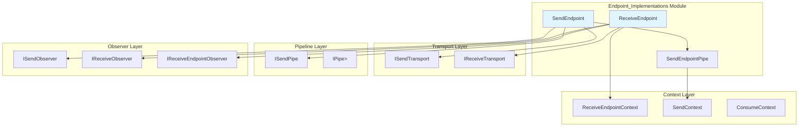

### Component Dependencies

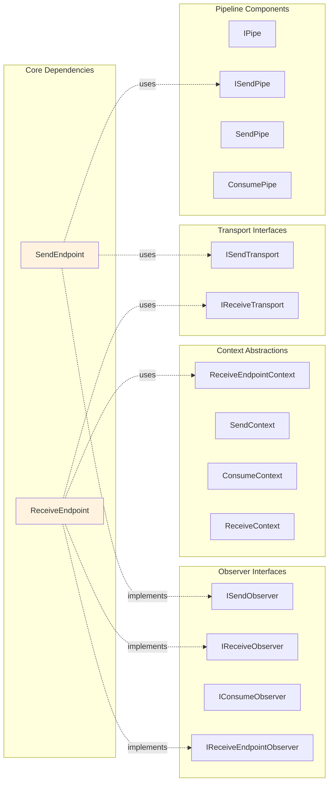

## SendEndpoint Implementation

### Core Responsibilities

The `SendEndpoint` class implements the `ITransportSendEndpoint` interface and provides comprehensive message sending capabilities:

- **Message Serialization**: Integrates with the serialization layer to convert messages to transport format
- **Address Management**: Handles source and destination address configuration
- **Pipeline Integration**: Executes send pipelines with proper context initialization
- **Observer Support**: Provides hooks for monitoring send operations
- **Type-Safe Operations**: Supports both generic and object-based message sending

### SendEndpoint Architecture

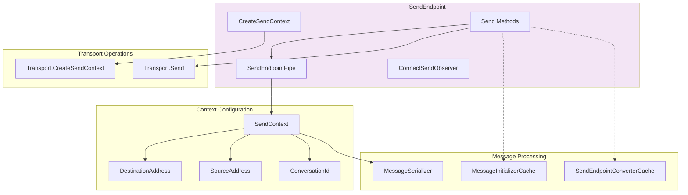

### SendEndpointPipe Implementation

The nested `SendEndpointPipe<T>` class serves as a critical integration point:

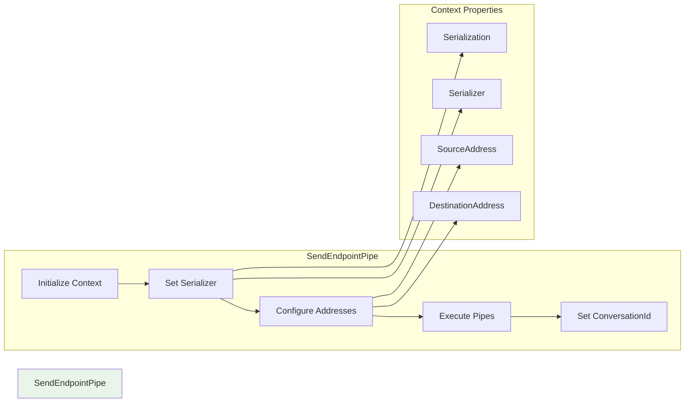

## ReceiveEndpoint Implementation

### Core Responsibilities

The `ReceiveEndpoint` class implements `IReceiveEndpoint` and manages the complete message receiving lifecycle:

- **Transport Integration**: Coordinates with the underlying receive transport
- **Consumer Pipeline**: Manages the execution of consumer message processing pipelines
- **State Management**: Implements comprehensive endpoint state tracking
- **Observer Pattern**: Provides extensive observation hooks for monitoring
- **Dependency Management**: Handles endpoint lifecycle dependencies

### ReceiveEndpoint State Machine

```mermaid
stateDiagram-v2
    [*] --> Initial
    Initial --> Started: Start()
    Started --> Ready: Transport Ready
    Started --> Faulted: Transport Faulted
    Ready --> Completed: Normal Shutdown
    Ready --> Faulted: Transport Error
    Faulted --> Final: Error Recovery
    Completed --> Final: Cleanup
    
    state Started {
        [*] --> Starting
        Starting --> Started
    }
    
    state Faulted {
        [*] --> ErrorState
        ErrorState --> Recoverable
        ErrorState --> Unrecoverable
    }
```

### ReceiveEndpoint Architecture

```mermaid
graph TB
    subgraph "ReceiveEndpoint"
        START[Start Method]
        STOP[Stop Method]
        STATE[State Management]
        OBS[Observer Connections]
        PIPE[Pipeline Connections]
    end
    
    subgraph "Transport Layer"
        RT[ReceiveTransport]
        RTH[ReceiveTransportHandle]
        RTO[ReceiveTransportObserver]
    end
    
    subgraph "Context Layer"
        REC[ReceiveEndpointContext]
        RP[ReceivePipe]
        SEP[SendEndpointProvider]
        PEP[PublishEndpointProvider]
    end
    
    subgraph "Observer Layer"
        ICO[IConsumeObserver]
        IRO[IReceiveObserver]
        IPO[IPublishObserver]
        ISO[ISendObserver]
        IEO[IReceiveEndpointObserver]
    end
    
    START --> RT
    START --> STATE
    START --> RTH
    
    STOP --> RT
    STOP --> STATE
    
    OBS --> ICO
    OBS --> IRO
    OBS --> IPO
    OBS --> ISO
    OBS --> IEO
    
    PIPE --> RP
    PIPE --> SEP
    PIPE --> PEP
    
    style ReceiveEndpoint fill:#fff8e1
```

### EndpointHandle Lifecycle Management

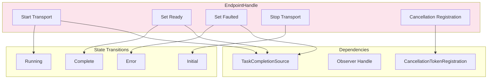

## Data Flow Patterns

### Send Operation Flow

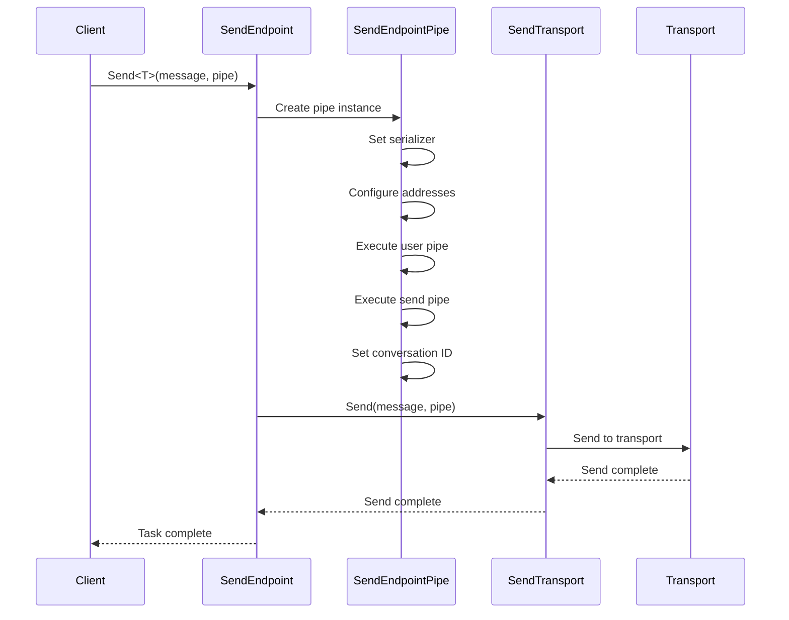

### Receive Operation Flow

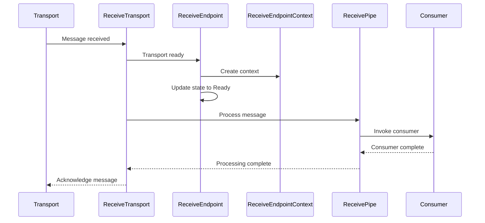

## Integration with Other Modules

### Dependency on Core Abstractions

The Endpoint_Implementations module heavily relies on the [Core_Abstractions](Core_Abstractions.md) module for:

- **Message Contracts**: `IConsumer<T>`, `ISaga` interfaces for consumer discovery
- **Context Abstractions**: `ConsumeContext`, `SendContext`, `ReceiveContext` for message processing context
- **Correlation Support**: `CorrelatedBy<Guid>` for message correlation
- **Message Identification**: `MessageUrn` for message type identification

### Integration with Transport Layer

The module implements the transport interfaces defined in [Transport_Interfaces](Transport_Interfaces.md):

- **ISendTransport**: Abstracts the underlying send transport mechanism
- **IReceiveTransport**: Abstracts the underlying receive transport mechanism

### Pipeline Integration

The module integrates with the [Middleware_Core](Middleware_Core.md) module:

- **IPipe<T>**: Generic pipeline abstraction for message processing
- **ISendPipe**: Specialized pipeline for send operations
- **ConsumePipe**: Pipeline for consumer message processing

### Configuration Integration

The module works with configuration components from [Configuration_Core](Configuration_Core.md):

- **IReceiveEndpointConfigurator**: For receive endpoint configuration
- **IConsumerConfigurator**: For consumer configuration
- **IBusFactoryConfigurator**: For bus-level configuration

## Key Design Patterns

### Observer Pattern

Both endpoints implement comprehensive observer patterns for monitoring:

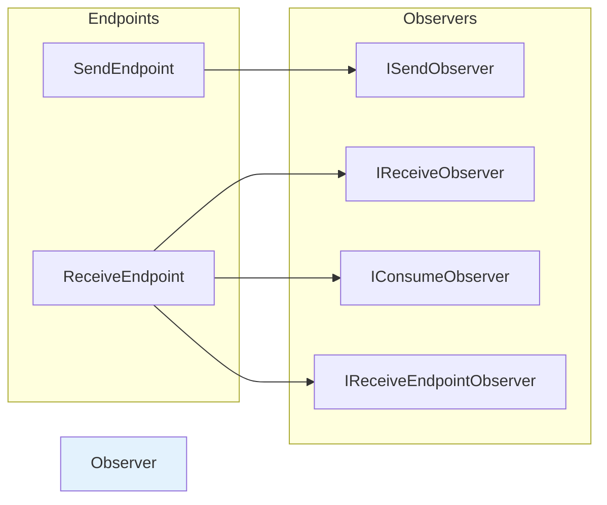

### Pipeline Pattern

The module implements the pipeline pattern for extensible message processing:

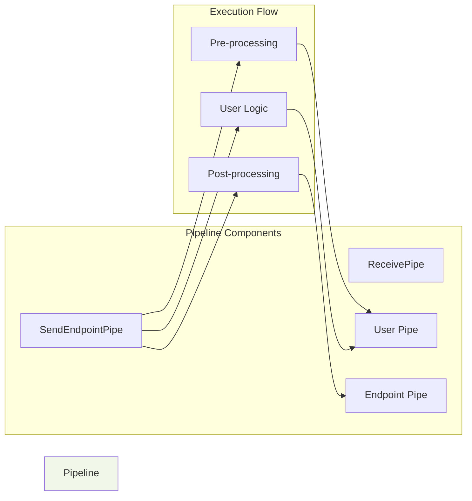

### State Machine Pattern

The `ReceiveEndpoint` implements a state machine for lifecycle management with states: Initial, Started, Ready, Completed, Faulted, and Final.

## Error Handling and Resilience

### Exception Handling Strategy

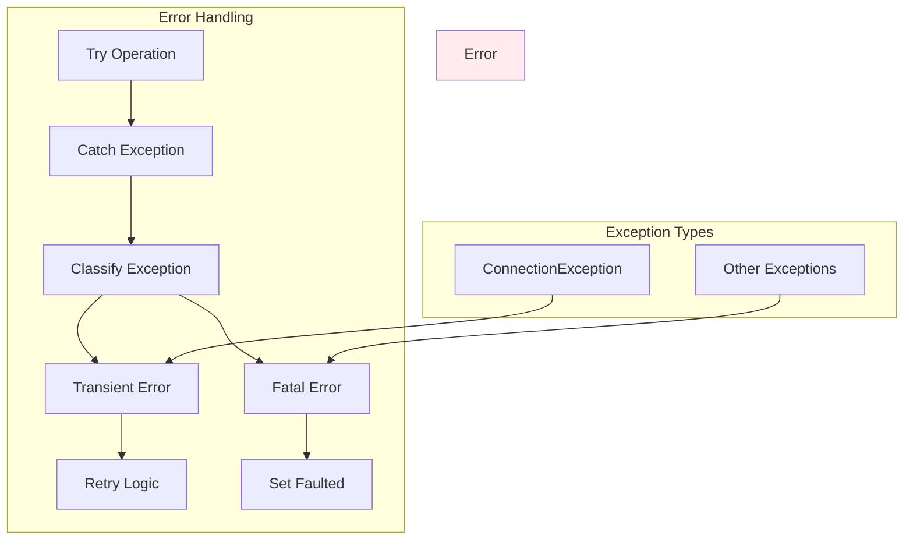

### Connection Exception Handling

The `ReceiveEndpoint` includes special handling for `ConnectionException` to determine if errors are transient and recoverable, enabling appropriate retry strategies versus immediate faulting.

## Performance Considerations

### Message Processing Optimization

- **Async/Await Pattern**: Extensive use of async operations for non-blocking message processing
- **TaskCompletionSource**: Efficient async state management with `TaskCreationOptions.RunContinuationsAsynchronously`
- **Caching**: Integration with `MessageInitializerCache` and `SendEndpointConverterCache` for performance
- **Pipeline Optimization**: Efficient pipe execution with null checks and early exits

### Memory Management

- **IAsyncDisposable**: Proper resource cleanup for transport resources
- **Observer Disconnection**: Proper cleanup of observer connections to prevent memory leaks
- **CancellationTokenRegistration**: Proper disposal of cancellation registrations

## Usage Examples

### SendEndpoint Usage Pattern

The `SendEndpoint` is typically obtained through the `ISendEndpointProvider` and used for sending messages:

```csharp
// SendEndpoint is created by the SendEndpointProvider
var sendEndpoint = await sendEndpointProvider.GetSendEndpoint(destinationAddress);
await sendEndpoint.Send(new MyMessage { Text = "Hello" });
```

### ReceiveEndpoint Usage Pattern

The `ReceiveEndpoint` is created during bus configuration and manages the message receiving lifecycle:

```csharp
// ReceiveEndpoint is created during bus configuration
var receiveEndpoint = new ReceiveEndpoint(transport, receiveEndpointContext);
var handle = receiveEndpoint.Start(cancellationToken);
await receiveEndpoint.Started; // Wait for endpoint to be ready
```

## Testing and Observability

### Health Monitoring

The `ReceiveEndpoint` provides health information through:

- **State Tracking**: Current operational state of the endpoint
- **Health Results**: Detailed health status information
- **Observer Notifications**: Comprehensive event notifications for monitoring

### Diagnostic Support

Both endpoints support extensive diagnostic capabilities through:

- **ProbeContext**: Integration with diagnostic frameworks
- **LogContext**: Structured logging support
- **Observer Pattern**: Real-time monitoring and metrics collection

This comprehensive implementation provides the foundation for reliable message-based communication in distributed systems, with robust error handling, extensive observability, and efficient resource management.