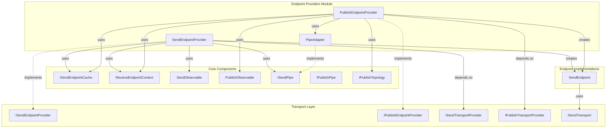
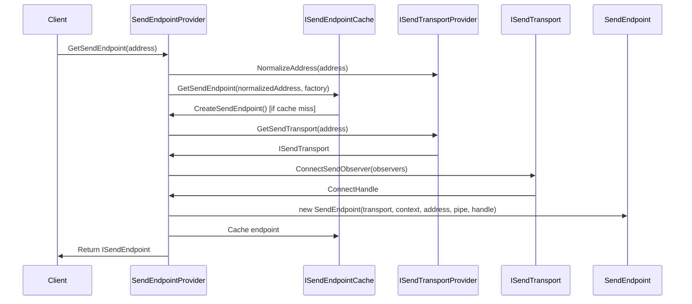
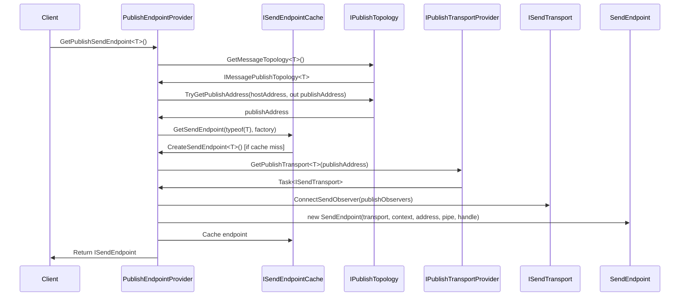
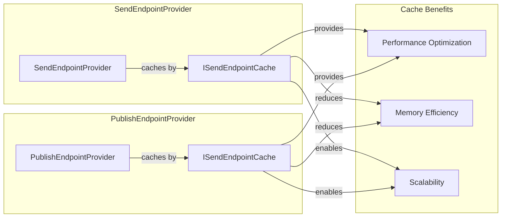
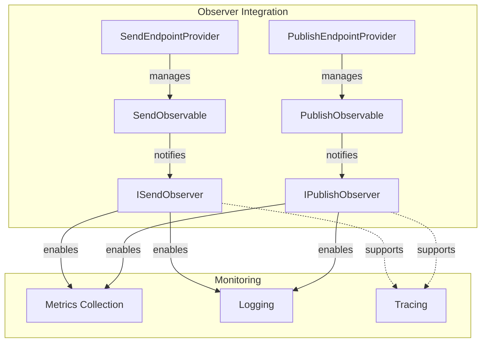
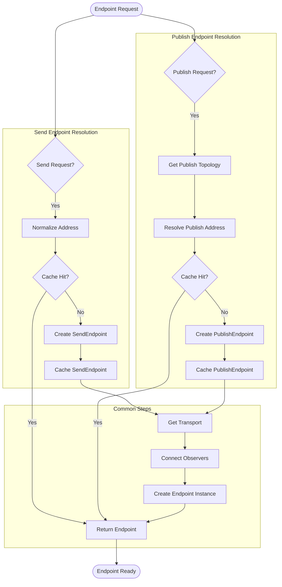

# Endpoint Providers Module

## Introduction

The Endpoint Providers module is a critical component of MassTransit's transport layer, responsible for managing the creation and caching of send endpoints for both direct message sending and message publishing. This module acts as a factory and cache layer that abstracts the complexity of transport management from higher-level components.

The module provides two primary providers:
- **SendEndpointProvider**: Manages endpoints for direct message sending to specific addresses
- **PublishEndpointProvider**: Manages endpoints for message publishing based on message types

## Architecture Overview

## Core Components

### SendEndpointProvider

The `SendEndpointProvider` is responsible for creating and caching send endpoints for direct message sending operations. It normalizes addresses, manages endpoint lifecycle, and provides observer connectivity for monitoring send operations.

**Key Responsibilities:**
- Address normalization through transport provider
- Endpoint caching to avoid repeated creation overhead
- Send observer connectivity for monitoring
- Integration with receive endpoint context

**Dependencies:**
- [Transport_Interfaces](Transport_Interfaces.md) - `ISendTransportProvider` for transport creation
- [Middleware_Core](Middleware_Core.md) - `ISendPipe` for message processing pipeline
- [Endpoint_Implementations](Endpoint_Implementations.md) - `SendEndpoint` for actual endpoint instances

### PublishEndpointProvider

The `PublishEndpointProvider` manages publish endpoints based on message types rather than specific addresses. It uses publish topology to determine appropriate publish addresses and adapts publish pipes to send pipes for unified processing.

**Key Responsibilities:**
- Message type-based endpoint resolution
- Publish topology integration for address determination
- Publish observer connectivity
- Pipe adaptation from publish to send semantics

**Dependencies:**
- [Transport_Interfaces](Transport_Interfaces.md) - `IPublishTransportProvider` for transport creation
- [Middleware_Core](Middleware_Core.md) - `IPublishPipe` and adapted `ISendPipe`
- [Endpoint_Implementations](Endpoint_Implementations.md) - `SendEndpoint` for endpoint instances

## Data Flow

### Send Endpoint Creation Flow

### Publish Endpoint Creation Flow

## Component Interactions

### Caching Strategy

Both providers implement caching strategies to optimize performance:

### Observer Pattern Integration

The providers integrate with MassTransit's observer pattern for monitoring:

## Process Flow

### Endpoint Resolution Process

## Integration Points

### Transport Layer Integration

The Endpoint Providers module integrates with the transport layer through well-defined interfaces:

- **ISendTransportProvider**: Provides send transport instances for specific addresses
- **IPublishTransportProvider**: Provides publish transport instances for message types
- **ISendTransport**: Actual transport implementation for message sending

### Context Integration

Both providers maintain references to `ReceiveEndpointContext`, enabling:
- Access to endpoint-specific configuration
- Integration with the receive pipeline
- Shared context between send and receive operations

### Pipe Integration

The providers integrate with MassTransit's pipe architecture:
- **SendEndpointProvider**: Uses `ISendPipe` directly
- **PublishEndpointProvider**: Adapts `IPublishPipe` to `ISendPipe` via `PipeAdapter`

## Performance Considerations

### Caching Benefits

1. **Reduced Transport Creation Overhead**: Endpoints are cached after initial creation
2. **Memory Efficiency**: Shared endpoint instances reduce memory footprint
3. **Improved Latency**: Cached endpoints eliminate repeated setup operations

### Scalability Features

1. **Thread-Safe Caching**: Cache implementations are thread-safe for concurrent access
2. **Async Operations**: All endpoint creation operations are asynchronous
3. **Observer Pattern**: Non-blocking observer notifications

## Error Handling

### Exception Scenarios

1. **Address Resolution Failure**: Transport provider normalization failures
2. **Transport Creation Failure**: Network or configuration issues
3. **Publish Address Resolution**: Missing topology configuration for message types

### Recovery Strategies

1. **Cache Miss Handling**: Automatic fallback to endpoint creation
2. **Transport Failure**: Exceptions propagated to caller for handling
3. **Observer Disconnection**: Graceful cleanup of observer connections

## Configuration Dependencies

The providers require several configuration components:

- **ReceiveEndpointContext**: Endpoint-specific configuration and services
- **PublishTopology**: Message type to address mapping configuration
- **Transport Providers**: Configured transport implementations
- **Pipe Configuration**: Send and publish pipeline configuration

## Testing Considerations

### Mock Dependencies

For unit testing, the following dependencies can be mocked:
- `ISendTransportProvider` / `IPublishTransportProvider`
- `ISendEndpointCache<Uri>` / `ISendEndpointCache<Type>`
- `ReceiveEndpointContext`
- `ISendPipe` / `IPublishPipe`

### Test Scenarios

1. **Cache Hit/Miss Behavior**: Verify caching logic
2. **Observer Connectivity**: Test observer connection and notification
3. **Error Handling**: Validate exception propagation
4. **Address Resolution**: Test address normalization and resolution

## Related Documentation

- [Transport_Interfaces](Transport_Interfaces.md) - Transport abstraction layer
- [Endpoint_Implementations](Endpoint_Implementations.md) - Concrete endpoint implementations
- [Middleware_Core](Middleware_Core.md) - Pipe and filter architecture
- [Configuration_Core](Configuration_Core.md) - Configuration interfaces and patterns