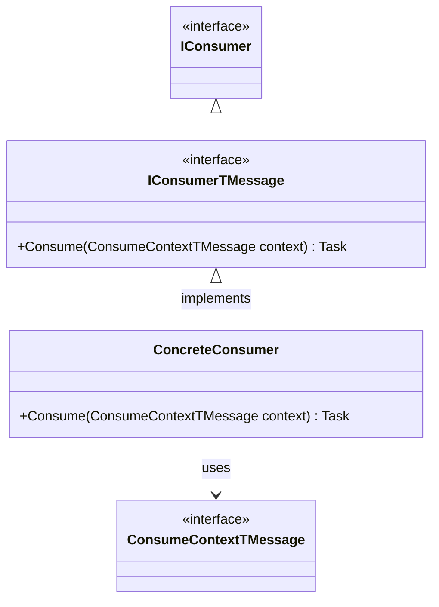
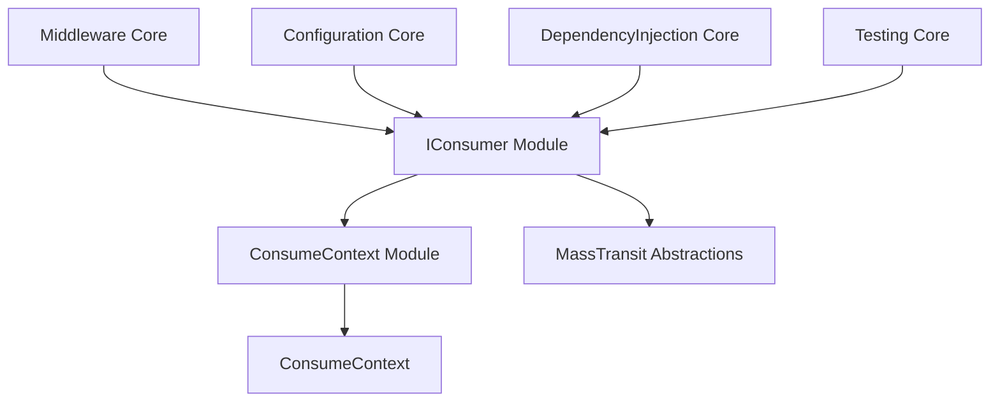
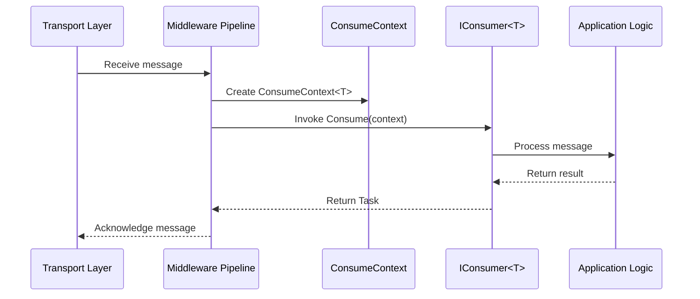
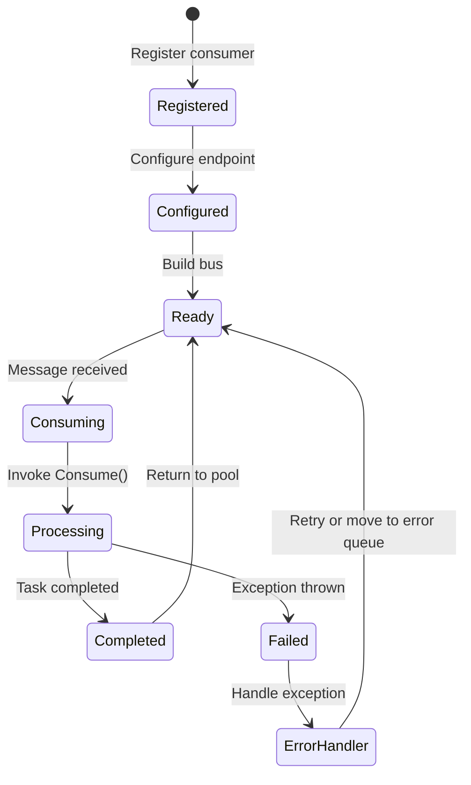

# IConsumer Module Documentation

## Introduction

The IConsumer module is a fundamental component of the MassTransit messaging framework that defines the contract for message consumers. It provides the core abstraction for classes that process messages within the MassTransit ecosystem, enabling developers to create message handlers that respond to specific message types in a distributed application architecture.

## Overview

The IConsumer module consists of two primary interfaces that work together to provide a type-safe, asynchronous message consumption pattern. The `IConsumer<TMessage>` interface is the main contract that developers implement to handle specific message types, while the base `IConsumer` interface serves as a marker interface for identification and reflection purposes within IoC containers.

## Core Components

### IConsumer<TMessage> Interface

The `IConsumer<TMessage>` interface is the primary contract for message consumers in MassTransit. It defines a single method `Consume` that takes a `ConsumeContext<TMessage>` parameter, providing access to the message and its associated metadata.

**Key Characteristics:**
- Generic interface with contravariant type parameter (`in TMessage`)
- Asynchronous operation returning `Task`
- Type-safe message handling
- Access to message context including headers and metadata

### IConsumer Interface

The base `IConsumer` interface serves as a marker interface for identification purposes within IoC containers and reflection scenarios. It does not contain any members and should not be used directly by application code.

**Purpose:**
- Enables identification of consumer types without generic constraints
- Facilitates reflection-based consumer discovery
- Supports IoC container registration and resolution

## Architecture

### Component Structure



### Module Dependencies



## Data Flow

### Message Consumption Flow



## Integration with MassTransit Ecosystem

### Consumer Registration and Configuration

The IConsumer module integrates with several other MassTransit modules to provide a complete message consumption experience:

1. **Configuration Module**: Consumers are registered and configured through `IConsumerConfigurator`
2. **Middleware Module**: Consumers are invoked within the middleware pipeline via `ConsumePipe`
3. **DependencyInjection Module**: Consumers are registered in IoC containers for dependency resolution
4. **Testing Module**: Test harnesses provide consumer testing capabilities

### Consumer Lifecycle



## Implementation Patterns

### Basic Consumer Implementation

```csharp
public class OrderConsumer : IConsumer<OrderMessage>
{
    public async Task Consume(ConsumeContext<OrderMessage> context)
    {
        var order = context.Message;
        // Process the order
        await ProcessOrderAsync(order);
        
        // Optionally publish events or send responses
        await context.Publish(new OrderProcessedEvent { OrderId = order.Id });
    }
}
```

### Consumer with Dependencies

```csharp
public class OrderConsumer : IConsumer<OrderMessage>
{
    private readonly IOrderService _orderService;
    private readonly ILogger<OrderConsumer> _logger;
    
    public OrderConsumer(IOrderService orderService, ILogger<OrderConsumer> logger)
    {
        _orderService = orderService;
        _logger = logger;
    }
    
    public async Task Consume(ConsumeContext<OrderMessage> context)
    {
        _logger.LogInformation("Processing order {OrderId}", context.Message.Id);
        await _orderService.ProcessOrderAsync(context.Message);
    }
}
```

## Relationship with Other Modules

### ConsumeContext Module
The IConsumer module depends on the [ConsumeContext](ConsumeContext.md) module, which provides the context object passed to the consumer's Consume method. This context contains the message, headers, and methods for publishing and sending messages.

### Middleware Module
The [Middleware](Middleware_Core.md) module is responsible for invoking consumers within the message processing pipeline. The `ConsumePipe` and related filters handle consumer resolution and invocation.

### Configuration Module
The [Configuration](Configuration_Core.md) module provides the `IConsumerConfigurator` interface used to configure consumer behavior, including retry policies, concurrency limits, and message bindings.

### DependencyInjection Module
The [DependencyInjection](DependencyInjection_Core.md) module enables consumer registration in IoC containers and provides dependency resolution during consumer instantiation.

### Testing Module
The [Testing](Testing_Core.md) module provides test harnesses specifically designed for testing consumer implementations, including `IConsumerTestHarness` for unit testing scenarios.

## Best Practices

### Consumer Design
1. **Keep consumers focused**: Each consumer should handle a single responsibility
2. **Use dependency injection**: Leverage IoC containers for dependency resolution
3. **Handle exceptions gracefully**: Implement proper error handling and logging
4. **Be idempotent**: Design consumers to handle duplicate messages safely
5. **Keep operations atomic**: Ensure message processing is transactional where appropriate

### Performance Considerations
1. **Avoid blocking operations**: Use async/await patterns throughout
2. **Minimize consumer dependencies**: Keep constructor injection lightweight
3. **Use consumer scoping appropriately**: Consider consumer lifetime (singleton, scoped, transient)
4. **Implement proper cancellation**: Respect cancellation tokens from the consume context

### Error Handling
1. **Throw exceptions for failures**: MassTransit will handle retry and error queue routing
2. **Log appropriately**: Use structured logging with correlation IDs
3. **Consider poison messages**: Implement strategies for handling malformed messages
4. **Use retry policies**: Configure retry behavior through the configuration module

## Advanced Scenarios

### Consumer Sagas
Consumers can participate in saga state machines by implementing multiple consumer interfaces and coordinating with the [Saga StateMachine](Saga_StateMachine_Core.md) module.

### Courier Activities
For distributed transaction scenarios, consumers can be implemented as [Courier](Courier_Core.md) activities that support compensation logic.

### Batch Consumers
While not directly supported by the IConsumer interface, batch processing can be implemented using custom middleware or by aggregating messages within the consumer implementation.

## Summary

The IConsumer module provides the foundational abstraction for message consumption in MassTransit. Its simple, type-safe design enables developers to create robust message handlers that integrate seamlessly with the broader MassTransit ecosystem. By understanding the consumer lifecycle, integration points, and best practices, developers can build scalable and maintainable distributed applications using the MassTransit framework.