# IRequestClient Module Documentation

## Overview

The `IRequestClient` module is a core component of MassTransit that provides a powerful and flexible way to implement the Request-Response messaging pattern in distributed systems. It enables applications to send requests and receive responses asynchronously, with built-in support for multiple response types, timeouts, and error handling.

## Purpose and Core Functionality

The `IRequestClient` module serves as the primary abstraction for implementing synchronous-style communication patterns over asynchronous messaging infrastructure. It provides:

- **Request-Response Pattern**: Send a request message and receive one or more response messages
- **Multiple Response Types**: Support for handling different response types from a single request
- **Timeout Management**: Configurable timeouts for request completion
- **Cancellation Support**: Full cancellation token support for request cancellation
- **Message Initialization**: Support for object-based message initialization
- **Pipe Configuration**: Extensible pipeline for request customization

## Architecture and Component Relationships

### Core Components


### Implementation Components


## Data Flow and Request-Response Lifecycle

### Single Response Request Flow


### Multiple Response Request Flow


## Component Interactions

### Request Client Creation and Configuration


### Request Handle State Management

```mermaid
stateDiagram-v2
    [*] --> Created: Create RequestHandle
    Created --> Sending: SendRequest() called
    Sending --> Waiting: Request sent
    Waiting --> ResponseReceived: Response received
    Waiting --> Timeout: Timeout expired
    Waiting --> Cancelled: Cancellation requested
    
    ResponseReceived --> [*]: Return response
    Timeout --> [*]: Throw RequestTimeoutException
    Cancelled --> [*]: Throw OperationCanceledException
    
    state Waiting {
        [*] --> SingleResponse: Single response expected
        [*] --> MultipleResponses: Multiple responses expected
        SingleResponse --> ResponseMatched: Response matched
        MultipleResponses --> AnyResponseMatched: Any response matched
    }
```



## Key Features and Capabilities

### 1. Multiple Response Type Support

The `IRequestClient` supports handling multiple response types from a single request:

```csharp
// Single response
Task<Response<OrderResult>> result = client.GetResponse<OrderResult>(request);

// Multiple responses - pattern matching
Task<Response<SuccessResult, ErrorResult>> result = client.GetResponse<SuccessResult, ErrorResult>(request);

// Three response types
Task<Response<SuccessResult, ValidationError, SystemError>> result = 
    client.GetResponse<SuccessResult, ValidationError, SystemError>(request);
```

### 2. Flexible Message Creation

Support for both strongly-typed messages and object initialization:

```csharp
// Strongly-typed message
var response = await client.GetResponse<Result>(new RequestMessage { Id = 123 });

// Object initialization
var response = await client.GetResponse<Result>(new { Id = 123, Name = "Test" });
```

### 3. Timeout and Cancellation

Built-in timeout management with cancellation support:

```csharp
// Default timeout (30 seconds)
var response = await client.GetResponse<Result>(request);

// Custom timeout
var response = await client.GetResponse<Result>(request, timeout: TimeSpan.FromSeconds(60));

// With cancellation token
var response = await client.GetResponse<Result>(request, cancellationToken: cts.Token);
```

### 4. Request Pipeline Configuration

Extensible pipeline for request customization:

```csharp
var response = await client.GetResponse<Result>(request, pipe =>
{
    pipe.UseExecute(context =>
    {
        // Customize send context
        context.Headers.Set("Custom-Header", "value");
    });
});
```

## Integration with MassTransit Ecosystem

### Relationship to Core Abstractions

- **[ConsumeContext](ConsumeContext.md)**: Provides the context for consuming responses
- **[SendContext](SendContext.md)**: Used to configure outgoing request messages
- **[MessageContext](MessageContext.md)**: Base context for all message operations
- **[IPipe](Middleware_Core.md)**: Pipeline abstraction for request/response processing

### Transport Integration

The `IRequestClient` integrates with various transport layers:

- **[ISendTransport](Transports_Core.md)**: For direct send operations
- **[IReceiveTransport](Transports_Core.md)**: For response reception
- **[PublishEndpoint](Transports_Core.md)**: For publish-based requests

### Error Handling Integration

- **[RequestException](Exceptions.md)**: Base exception for request failures
- **[RequestTimeoutException](Exceptions.md)**: Specific timeout handling
- **[Fault](Contracts.md)**: Standard fault message handling

## Configuration and Usage Patterns

### Basic Configuration

```csharp
services.AddMassTransit(cfg =>
{
    cfg.AddRequestClient<SubmitOrderRequest>();
});
```

### Custom Timeout Configuration

```csharp
services.AddMassTransit(cfg =>
{
    cfg.AddRequestClient<SubmitOrderRequest>(new RequestTimeout(TimeSpan.FromSeconds(45)));
});
```

### Destination Address Configuration

```csharp
services.AddMassTransit(cfg =>
{
    cfg.AddRequestClient<SubmitOrderRequest>(
        new Uri("queue:order-service"),
        RequestTimeout.Default);
});
```

## Process Flows

### Request-Response with Error Handling


### Advanced Request Pattern with Multiple Services


## Best Practices

### 1. Request Design

- Keep request messages focused and cohesive
- Use meaningful message names that describe the intent
- Include all necessary data in the request to avoid chatty interactions

### 2. Response Design

- Design responses to be self-descriptive
- Use multiple response types for different success/error scenarios
- Include correlation IDs for tracking

### 3. Timeout Configuration

- Set appropriate timeouts based on expected processing time
- Use shorter timeouts for user-facing operations
- Consider circuit breaker patterns for cascading failures

### 4. Error Handling

- Always handle `RequestTimeoutException`
- Implement retry policies for transient failures
- Use structured logging for request tracking

## Testing Considerations

The `IRequestClient` module integrates with MassTransit's testing framework:

- **[InMemoryTestHarness](Testing_Core.md)**: For unit testing request-response scenarios
- **[IConsumerTestHarness](Testing_Core.md)**: For testing consumer responses
- **[IBusTestHarness](Testing_Core.md)**: For integration testing

## Performance Characteristics

- **Async/Await**: Fully asynchronous implementation
- **Memory Efficient**: Uses struct-based response types for multiple responses
- **Timeout Management**: Efficient timer-based timeout handling
- **Connection Pooling**: Integrates with transport connection pooling

## Summary

The `IRequestClient` module provides a robust foundation for implementing request-response patterns in distributed systems. Its flexible design supports various messaging scenarios while maintaining strong type safety and excellent performance characteristics. The module's integration with MassTransit's broader ecosystem makes it an essential component for building reliable, scalable distributed applications.