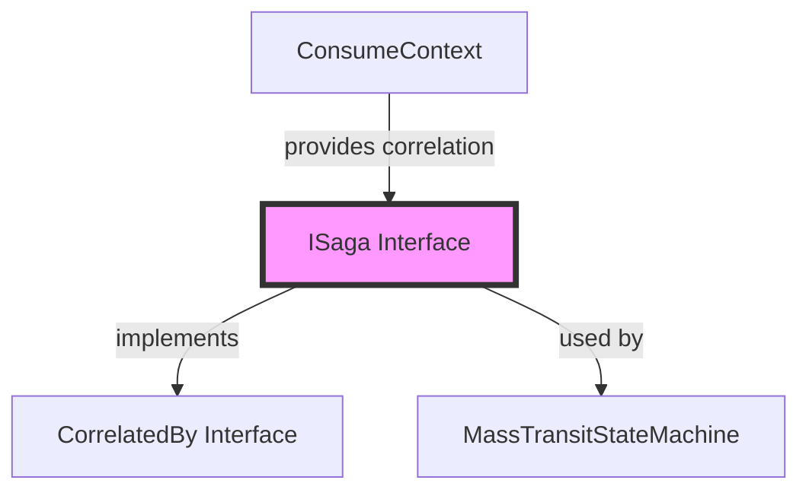
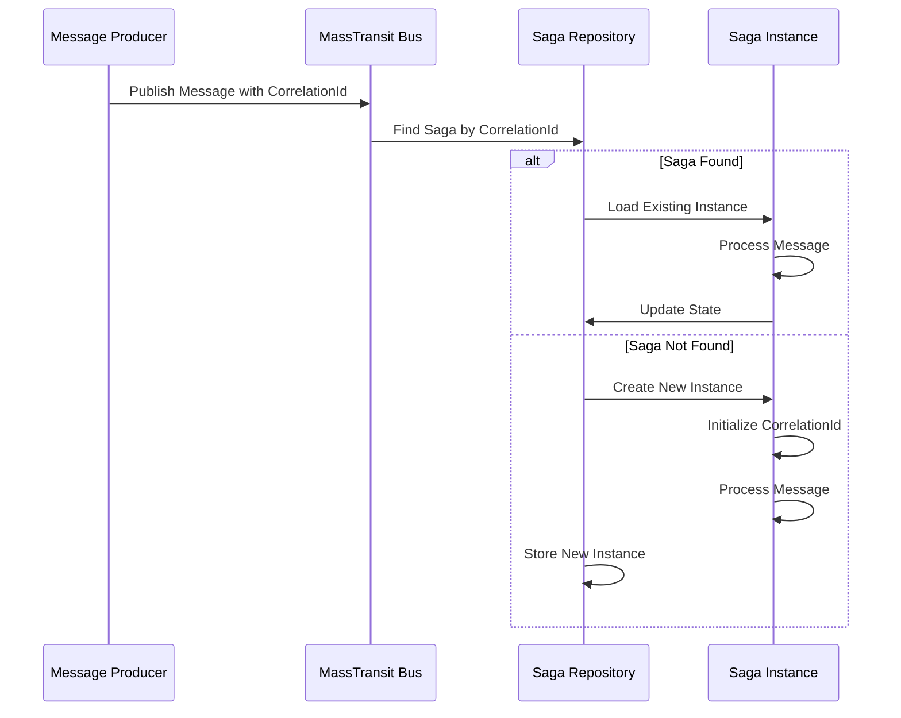
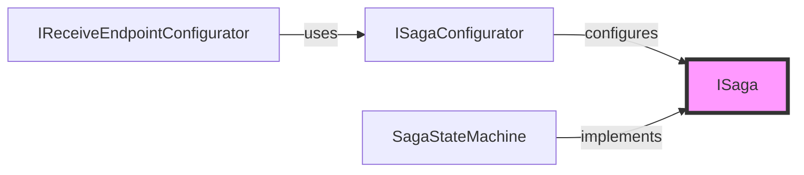
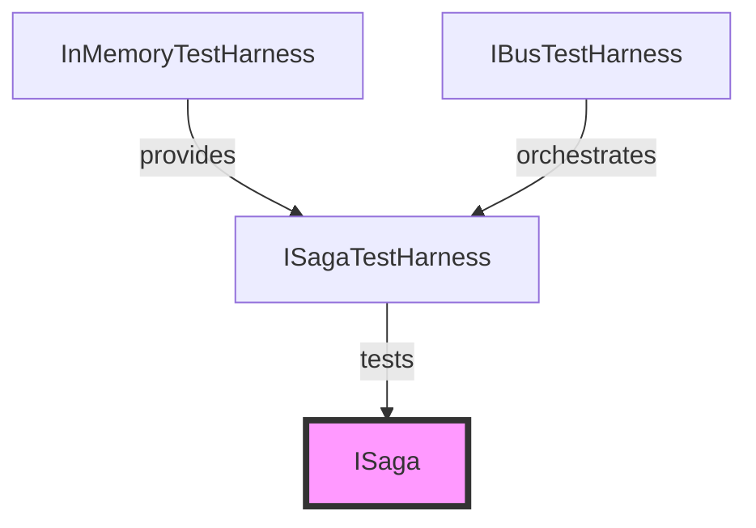
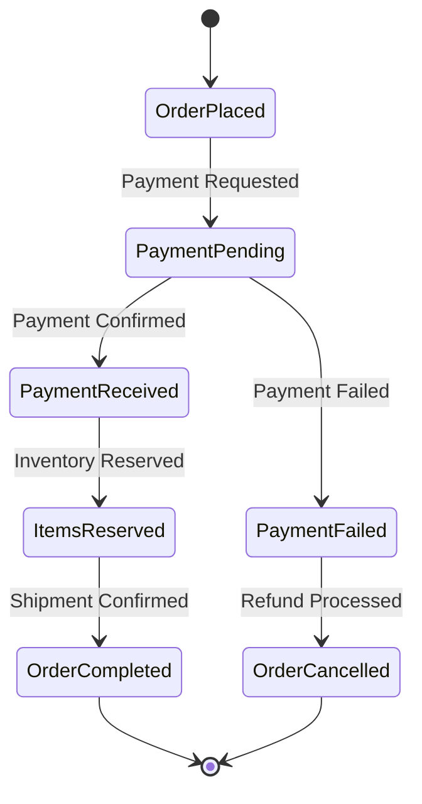

# ISaga Module Documentation

## Introduction

The ISaga module is a fundamental abstraction in MassTransit that defines the contract for saga instances within a distributed messaging system. A saga is a long-running business process that maintains state across multiple message exchanges and can handle complex workflows that span extended periods of time. The ISaga interface provides the essential correlation mechanism that enables MassTransit to route messages to the correct saga instance based on a unique identifier.

## Core Architecture

### ISaga Interface

The `ISaga` interface is the foundational contract that all saga instances must implement. It provides a simple but crucial capability: the ability to get and set a `CorrelationId` that uniquely identifies each saga instance within the system.

```csharp
public interface ISaga
{
    Guid CorrelationId { get; set; }
}
```

### Key Design Principles

1. **Correlation-Based Routing**: The `CorrelationId` serves as the primary mechanism for routing messages to the correct saga instance
2. **Persistence Agnostic**: The interface is designed to work with any persistence mechanism
3. **Thread Safety**: Implementations must ensure thread-safe access to the CorrelationId property
4. **Immutable Identity**: While the setter exists for persistence support, the CorrelationId should remain constant throughout the saga's lifetime

## System Integration

### Relationship to Core Abstractions



### Message Correlation Flow



## Component Relationships

### Saga Configuration



### Testing Integration



## Implementation Patterns

### Basic Saga Implementation

```csharp
public class OrderSaga : ISaga
{
    public Guid CorrelationId { get; set; }
    
    // Saga state properties
    public string OrderNumber { get; set; }
    public decimal OrderAmount { get; set; }
    public DateTime CreatedDate { get; set; }
    
    // Additional properties for workflow state
    public bool PaymentReceived { get; set; }
    public bool ItemsReserved { get; set; }
    public bool OrderCompleted { get; set; }
}
```

### Saga with State Machine

The ISaga interface works in conjunction with the [MassTransitStateMachine](MassTransitStateMachine.md) to provide sophisticated workflow capabilities:



## Persistence Considerations

### CorrelationId Persistence

The `CorrelationId` property must be persisted with the saga instance to ensure message correlation works correctly across system restarts. The setter is provided specifically to support persistence scenarios where the correlation ID needs to be restored from storage.

### Best Practices

1. **Generate on Creation**: Always generate a new `Guid` when creating a saga instance
2. **Immutable After Creation**: Treat the `CorrelationId` as immutable after initial assignment
3. **Index in Persistence**: Ensure the `CorrelationId` is indexed in your persistence layer for optimal query performance
4. **Handle Conflicts**: Implement proper conflict resolution for concurrent saga instance creation

## Integration with Other Modules

### Dependency Injection

The ISaga interface integrates with the [DependencyInjection_Core](DependencyInjection_Core.md) module through the `ISagaConfigurator` interface, allowing sagas to be registered and configured within the DI container.

### Courier Integration

In complex scenarios, sagas can work with the [Courier_Core](Courier_Core.md) module to orchestrate distributed transactions using routing slips and compensating activities.

### Transport Layer

The [Transports_Core](Transports_Core.md) module uses the `CorrelationId` to route messages to the correct saga instance across different transport mechanisms (RabbitMQ, Azure Service Bus, etc.).

## Testing Strategies

### Unit Testing

The [Testing_Core](Testing_Core.md) module provides `ISagaTestHarness` for testing saga behavior in isolation:

```csharp
// Example test setup using ISagaTestHarness
var sagaTestHarness = new InMemoryTestHarness();
var sagaHarness = sagaTestHarness.Saga<OrderSaga>();
```

### Integration Testing

Use the `InMemoryTestHarness` to test complete saga workflows including message correlation and state transitions.

## Performance Considerations

### Correlation Lookup

The `CorrelationId` is used as the primary key for saga instance lookup. Ensure your persistence layer optimizes queries based on this field.

### Message Throughput

High-throughput scenarios may require:
- Connection pooling for saga repository access
- Optimistic concurrency control
- Saga partitioning strategies

## Error Handling

### Correlation Failures

When a message cannot be correlated to an existing saga instance:
1. MassTransit can be configured to create a new instance
2. Messages can be moved to an error queue
3. Custom correlation logic can be implemented

### Concurrency Conflicts

Implement proper concurrency handling in saga persistence to manage simultaneous updates to the same saga instance.

## Migration and Versioning

### Schema Evolution

When evolving saga state schemas:
1. Maintain backward compatibility with existing `CorrelationId` values
2. Consider data migration strategies for complex schema changes
3. Implement versioning in saga state classes if needed

## References

- [CorrelatedBy](CorrelatedBy.md) - Base correlation interface
- [MassTransitStateMachine](MassTransitStateMachine.md) - State machine implementation for sagas
- [ISagaConfigurator](ISagaConfigurator.md) - Configuration interface for sagas
- [ISagaTestHarness](ISagaTestHarness.md) - Testing utilities for sagas
- [ConsumeContext](ConsumeContext.md) - Message consumption context
- [DependencyInjection_Core](DependencyInjection_Core.md) - DI integration
- [Testing_Core](Testing_Core.md) - Testing framework integration