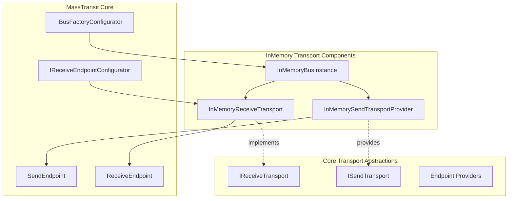
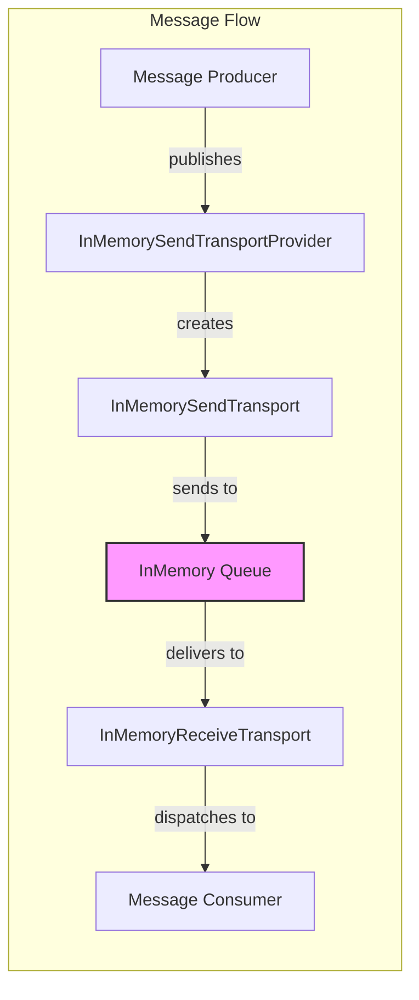
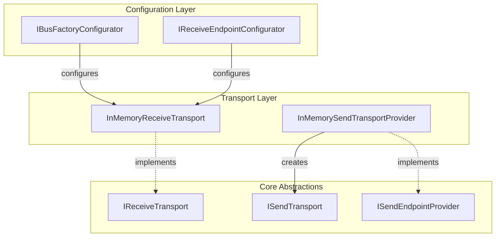
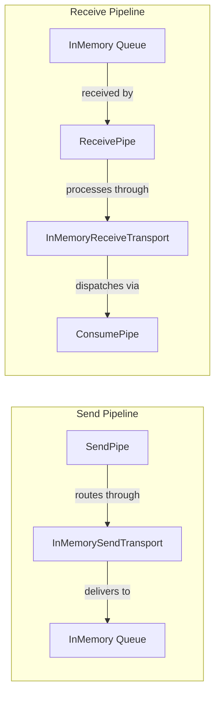
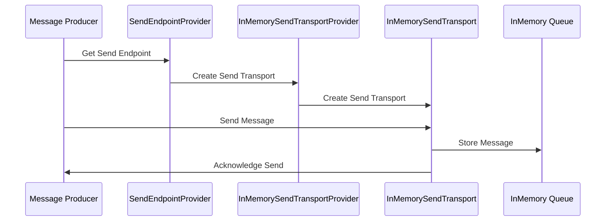
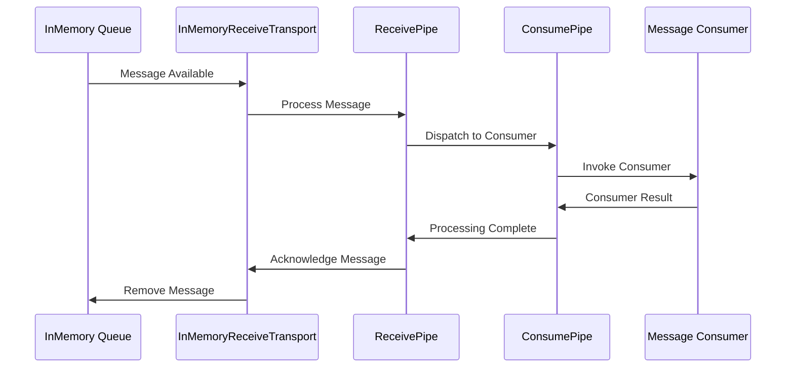
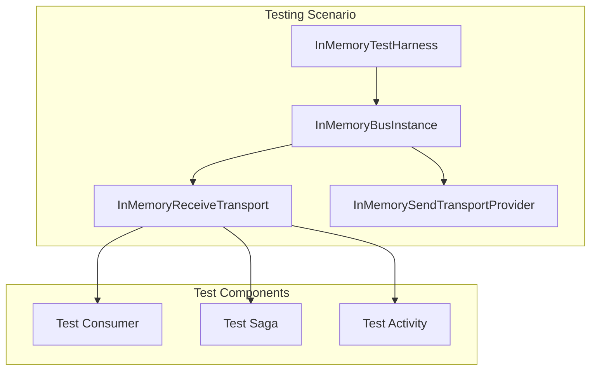

# InMemory Transport Module Documentation

## Introduction

The InMemory_Transport module provides a high-performance, lightweight transport implementation for MassTransit that operates entirely within the application's memory space. This transport is designed for testing scenarios, development environments, and scenarios where ultra-low latency message delivery is required without the overhead of external message brokers.

Unlike traditional message transports that require external infrastructure (RabbitMQ, Azure Service Bus, etc.), the InMemory transport enables message routing, delivery, and processing entirely within the application's process boundaries, making it ideal for unit testing, integration testing, and high-throughput scenarios where durability is not a primary concern.

## Architecture Overview

The InMemory transport implements the core MassTransit transport abstractions while providing in-memory message queuing, routing, and delivery mechanisms. It integrates seamlessly with the broader MassTransit ecosystem, supporting all major messaging patterns including publish-subscribe, request-response, and saga orchestration.



## Core Components

### InMemoryBusInstance

The `InMemoryBusInstance` serves as the central coordinator for the in-memory transport implementation. It manages the lifecycle of all in-memory transport components, maintains transport-level configuration, and provides the bridge between the MassTransit bus configuration and the in-memory transport implementation.

**Key Responsibilities:**
- Transport lifecycle management
- Configuration coordination
- Transport provider registration
- Endpoint management

### InMemoryReceiveTransport

The `InMemoryReceiveTransport` implements the `IReceiveTransport` interface and provides the mechanism for receiving messages from in-memory queues. It manages message delivery to consumers, handles message acknowledgment, and coordinates with the receive pipeline for message processing.

**Key Responsibilities:**
- In-memory queue management
- Message delivery coordination
- Consumer dispatch
- Receive pipeline integration
- Message acknowledgment handling

### InMemorySendTransportProvider

The `InMemorySendTransportProvider` creates and manages send transports for in-memory message delivery. It implements the transport provider pattern, creating appropriate send endpoints based on message destinations and coordinating message routing within the in-memory transport infrastructure.

**Key Responsibilities:**
- Send transport creation
- Message routing coordination
- Endpoint resolution
- Transport caching

## Component Relationships



## Integration with MassTransit Core

The InMemory transport integrates with the broader MassTransit architecture through well-defined interfaces and abstractions:

### Transport Interface Implementation



### Pipeline Integration

The InMemory transport seamlessly integrates with MassTransit's middleware pipeline system:



## Message Flow Architecture

### Send Flow



### Receive Flow



## Configuration and Usage

### Basic Configuration

The InMemory transport is configured through the MassTransit bus configuration system:

```csharp
// Configuration typically involves:
// - Bus factory configuration
// - Receive endpoint setup
// - Transport-specific settings
```

### Testing Integration

The InMemory transport is particularly well-suited for testing scenarios:



## Performance Characteristics

The InMemory transport provides several performance advantages:

- **Zero Network Latency**: Messages travel through memory without network overhead
- **No Serialization Overhead**: Messages can remain in their native format
- **Immediate Delivery**: No queue polling or connection management delays
- **High Throughput**: Limited only by CPU and memory bandwidth

## Limitations and Considerations

While the InMemory transport offers significant advantages for testing and high-performance scenarios, it has important limitations:

- **No Durability**: Messages are lost if the application process terminates
- **No Distribution**: Cannot route messages between different application instances
- **Memory Constraints**: Limited by available system memory
- **No Persistence**: No message recovery after application restart

## Relationship to Other Modules

The InMemory transport module interacts with several other core MassTransit modules:

- **[Core_Abstractions](Core_Abstractions.md)**: Implements core interfaces like `IReceiveTransport` and `ISendTransport`
- **[Transports_Core](Transports_Core.md)**: Extends transport abstractions and endpoint implementations
- **[Testing_Core](Testing_Core.md)**: Provides the foundation for the `InMemoryTestHarness`
- **[Configuration_Core](Configuration_Core.md)**: Integrates with configuration system for transport setup
- **[Middleware_Core](Middleware_Core.md)**: Works with pipeline system for message processing

## Use Cases

### Primary Use Cases

1. **Unit Testing**: Test consumers, sagas, and routing logic without external dependencies
2. **Integration Testing**: Verify end-to-end message flows in controlled environments
3. **Development**: Rapid development and debugging without infrastructure setup
4. **High-Performance Scenarios**: Ultra-low latency messaging where durability is not required

### Secondary Use Cases

1. **Load Testing**: Generate high message volumes to test consumer performance
2. **Prototype Development**: Quick proof-of-concept implementations
3. **Training and Demos**: Simplified environments for learning MassTransit concepts

## Best Practices

### Testing Best Practices

- Use the InMemory transport for all unit and integration tests
- Leverage the `InMemoryTestHarness` for comprehensive test scenarios
- Combine with MassTransit's testing extensions for consumer and saga testing

### Performance Best Practices

- Monitor memory usage in high-throughput scenarios
- Implement appropriate message size limits
- Consider garbage collection impact in long-running applications

### Development Best Practices

- Use InMemory transport for local development and debugging
- Switch to durable transports for production deployments
- Maintain transport abstraction in application code for easy switching

## Conclusion

The InMemory_Transport module provides a crucial component in the MassTransit ecosystem, enabling efficient testing, development, and high-performance messaging scenarios. Its seamless integration with the broader MassTransit architecture makes it an invaluable tool for developers building message-based applications with MassTransit.