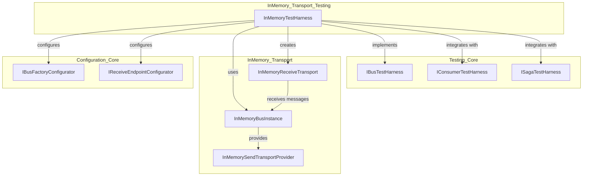
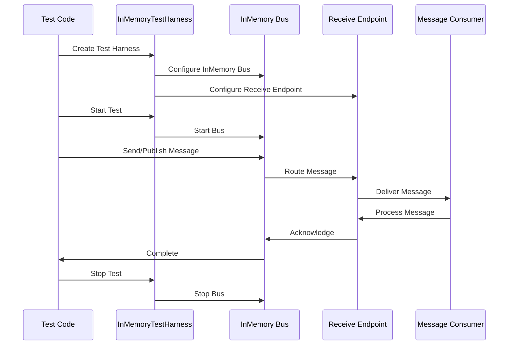
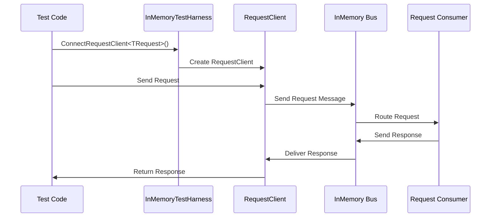
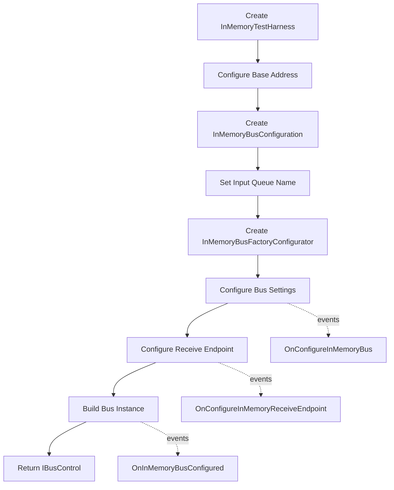
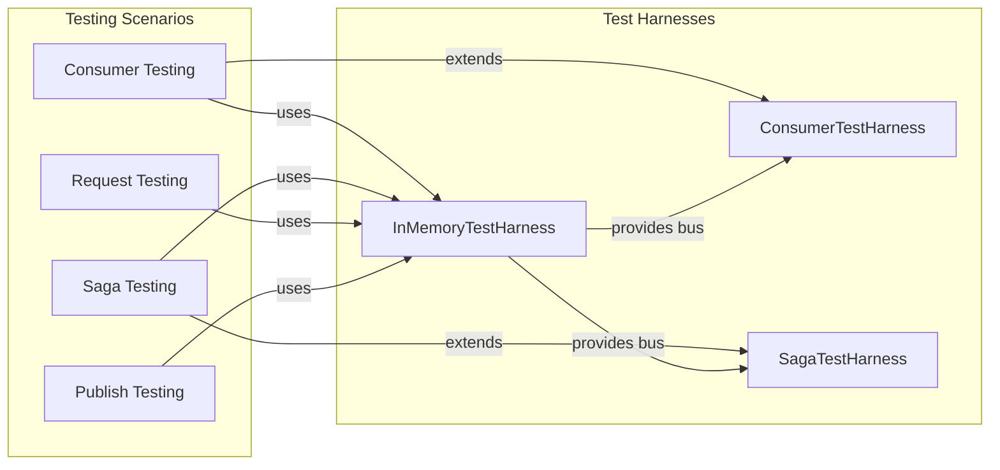

# InMemory Transport Testing Module

## Introduction

The InMemory Transport Testing module provides a lightweight, in-memory testing harness for MassTransit applications. This module enables developers to test message-based applications without requiring external message brokers, making unit and integration testing fast, reliable, and isolated from external dependencies.

## Module Overview

The InMemory Transport Testing module is built around the `InMemoryTestHarness` class, which creates a complete MassTransit bus instance that operates entirely in memory. This harness provides a controlled environment for testing message consumers, sagas, routing slip activities, and other MassTransit components.

## Core Architecture

### Component Structure



### Key Components

#### InMemoryTestHarness
The primary class that provides testing capabilities for MassTransit applications:

- **Purpose**: Creates and manages an in-memory MassTransit bus instance for testing
- **Base Class**: Implements `BusTestHarness` from the Testing_Core module
- **Transport**: Uses the InMemory transport for message delivery
- **Configuration**: Manages bus and endpoint configuration for testing scenarios

## Data Flow Architecture

### Message Flow in Testing Scenarios



### Request-Response Testing Flow



## Configuration and Setup

### Bus Configuration Process



### Configuration Events

The `InMemoryTestHarness` provides several configuration events for customization:

- **OnConfigureInMemoryBus**: Raised during bus configuration
- **OnConfigureInMemoryReceiveEndpoint**: Raised during receive endpoint configuration  
- **OnInMemoryBusConfigured**: Raised after bus configuration is complete

## Integration with Testing Framework

### Relationship with Other Testing Components



### Test Harness Capabilities

The InMemoryTestHarness provides:

1. **Message Publishing**: Test message publishing to any endpoint
2. **Message Sending**: Direct message sending to specific endpoints
3. **Request-Response**: Full request-response pattern testing
4. **Consumer Testing**: Integration with consumer test harnesses
5. **Saga Testing**: Integration with saga test harnesses
6. **Message Inspection**: Access to sent and received messages
7. **Timeout Handling**: Configurable test timeouts

## Usage Patterns

### Basic Test Setup

```csharp
// Typical usage pattern (conceptual)
var harness = new InMemoryTestHarness();
await harness.Start();

try
{
    // Test message flow
    await harness.Bus.Publish(new TestMessage());
    
    // Verify results
    // ... assertions ...
}
finally
{
    await harness.Stop();
}
```

### Request-Client Testing

```csharp
// Request-response testing (conceptual)
var client = await harness.ConnectRequestClient<TestRequest>();
var response = await client.GetResponse<TestResponse>(new TestRequest());
// ... verify response ...
```

## Dependencies

### Direct Dependencies

- **[Testing_Core](Testing_Core.md)**: Provides base test harness abstractions
- **[InMemory_Transport](InMemory_Transport.md)**: Provides in-memory transport implementation
- **[Configuration_Core](Configuration_Core.md)**: Provides configuration interfaces

### Indirect Dependencies

- **[Core_Abstractions](Core_Abstractions.md)**: Message and consumer abstractions
- **[Transports_Core](Transports_Core.md)**: Transport abstractions
- **[Middleware_Core](Middleware_Core.md)**: Pipeline processing

## Testing Scenarios Supported

### 1. Consumer Testing
- Unit testing of message consumers
- Integration testing of consumer pipelines
- Error handling and retry testing

### 2. Saga Testing  
- Saga state machine testing
- Event correlation testing
- Compensation testing

### 3. Request-Response Testing
- Request client testing
- Response timeout testing
- Fault handling testing

### 4. Publish-Subscribe Testing
- Message publishing testing
- Subscriber routing testing
- Content-based routing testing

### 5. Error Handling Testing
- Exception handling testing
- Retry policy testing
- Dead letter queue testing

## Advantages

1. **No External Dependencies**: Tests run entirely in memory
2. **Fast Execution**: No network or I/O overhead
3. **Deterministic**: Consistent test results
4. **Isolated**: No interference between tests
5. **Debuggable**: Easy to inspect message flow
6. **Comprehensive**: Supports all MassTransit patterns

## Best Practices

1. **Test Isolation**: Create new harness instances for each test
2. **Proper Cleanup**: Always stop the harness in test cleanup
3. **Timeout Configuration**: Set appropriate test timeouts
4. **Event Subscription**: Use configuration events for setup
5. **Message Inspection**: Leverage built-in message tracking
6. **Async Testing**: Use async/await patterns throughout

## Related Documentation

- [Testing_Core](Testing_Core.md) - Base testing abstractions and interfaces
- [InMemory_Transport](InMemory_Transport.md) - In-memory transport implementation
- [Configuration_Core](Configuration_Core.md) - Configuration system details
- [Consumer_Testing](Consumer_Testing.md) - Consumer-specific testing patterns
- [Saga_Testing](Saga_Testing.md) - Saga-specific testing patterns