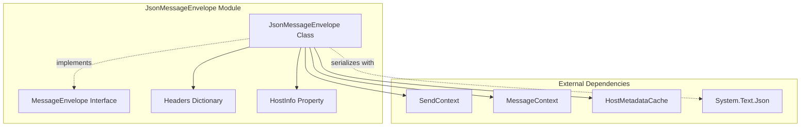
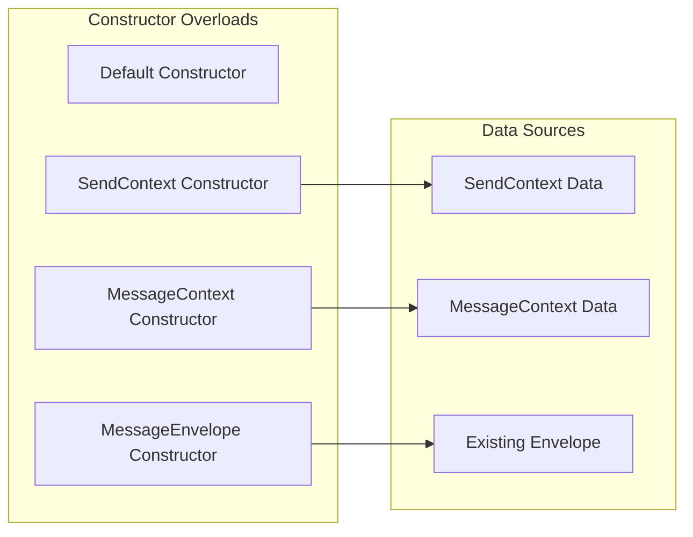
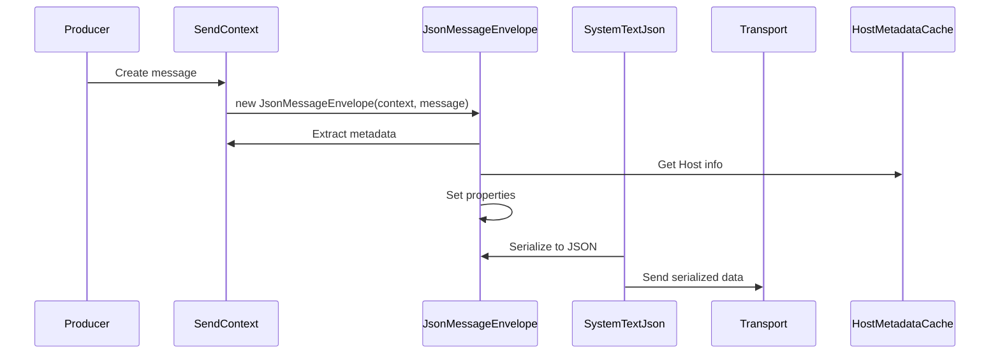
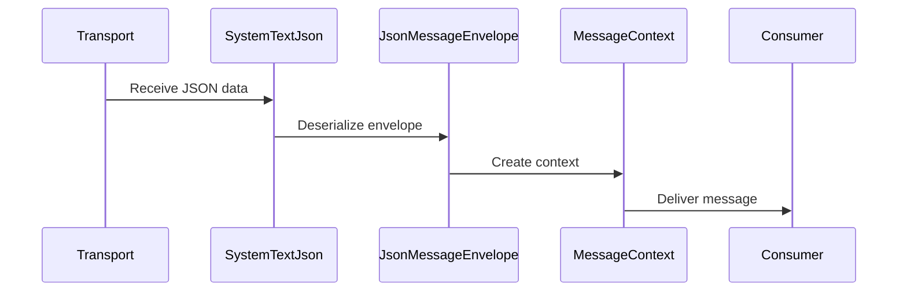

# JsonMessageEnvelope Module

## Overview

The JsonMessageEnvelope module is a core component of MassTransit's serialization infrastructure that provides a JSON-based implementation of the Message Envelope pattern. This module serves as the primary container for messages during serialization, ensuring that all message metadata, routing information, and context data are preserved and transmitted alongside the message payload.

## Purpose

The JsonMessageEnvelope module fulfills several critical roles in the MassTransit messaging system:

- **Message Container**: Encapsulates message payloads with their associated metadata in a JSON-serializable format
- **Context Preservation**: Maintains message context including IDs, addresses, timing, and custom headers during transmission
- **Cross-Platform Compatibility**: Provides a standardized format that can be consumed by different systems and platforms
- **Routing Support**: Carries routing information that enables message delivery, response handling, and fault processing
- **Correlation Tracking**: Preserves correlation IDs and conversation IDs for distributed tracing and request-response patterns

## Architecture

### Component Structure



### Constructor Architecture



## Core Components

### JsonMessageEnvelope Class

The `JsonMessageEnvelope` class is the primary implementation that provides JSON serialization capabilities for message envelopes. It implements the `MessageEnvelope` interface and provides three constructor overloads for different scenarios:

#### Properties

| Property | Type | Purpose |
|----------|------|---------|
| `MessageId` | `string?` | Unique identifier for the message |
| `RequestId` | `string?` | Identifier for request-response correlation |
| `CorrelationId` | `string?` | Correlation ID for distributed tracing |
| `ConversationId` | `string?` | Conversation ID for message grouping |
| `InitiatorId` | `string?` | ID of the message that initiated this conversation |
| `SourceAddress` | `string?` | Address of the message sender |
| `DestinationAddress` | `string?` | Target address for message delivery |
| `ResponseAddress` | `string?` | Address for response messages |
| `FaultAddress` | `string?` | Address for fault/error messages |
| `MessageType` | `string[]?` | Array of message type names |
| `Message` | `object?` | The actual message payload |
| `ExpirationTime` | `DateTime?` | Message expiration timestamp |
| `SentTime` | `DateTime?` | Message send timestamp |
| `Headers` | `Dictionary<string, object?>` | Custom headers and properties |
| `Host` | `HostInfo?` | Host information metadata |

### Constructor Patterns

#### 1. SendContext Constructor
```csharp
public JsonMessageEnvelope(SendContext context, object message)
```

This constructor creates an envelope from a `SendContext`, extracting all relevant metadata and routing information:

- **Message IDs**: Extracts MessageId, RequestId, CorrelationId, ConversationId, InitiatorId
- **Addresses**: Captures SourceAddress, DestinationAddress, ResponseAddress, FaultAddress
- **Message Types**: Sets SupportedMessageTypes from context
- **Timing**: Calculates ExpirationTime based on TimeToLive, sets SentTime
- **Headers**: Copies all headers from SendContext
- **Host**: Sets Host information from HostMetadataCache

#### 2. MessageContext Constructor
```csharp
public JsonMessageEnvelope(MessageContext context, object message, string[] messageTypeNames)
```

This constructor creates an envelope from a `MessageContext`, typically used when receiving messages:

- **Similar to SendContext**: Extracts the same ID and address information
- **Message Types**: Uses provided messageTypeNames array
- **Expiration**: Uses existing ExpirationTime from context
- **Headers**: Copies headers from MessageContext

#### 3. Copy Constructor
```csharp
public JsonMessageEnvelope(MessageEnvelope envelope)
```

Creates a copy of an existing envelope, useful for message transformation:

- **Deep Copy**: Copies all properties from source envelope
- **Headers**: Creates new dictionary with case-insensitive comparison
- **Host**: Preserves existing Host or sets from cache

### Update Method

```csharp
public void Update(SendContext context)
```

The `Update` method allows updating envelope properties from a SendContext, particularly useful for:

- **Routing Updates**: Updates destination and response addresses
- **ID Management**: Refreshes message and correlation IDs
- **Header Synchronization**: Merges headers from context
- **Expiration Handling**: Recalculates expiration time

## Data Flow

### Message Serialization Flow



### Message Deserialization Flow



## Integration with Other Modules

### Serialization Core Dependencies

The JsonMessageEnvelope module integrates closely with other serialization components:

- **[SystemTextJsonMessageSerializer](SystemTextJsonMessageSerializer.md)**: Uses JsonMessageEnvelope as the container for JSON serialization
- **[IMessageSerializer](IMessageSerializer.md)**: JsonMessageEnvelope implements the envelope pattern used by serializers
- **[IMessageDeserializer](IMessageDeserializer.md)**: Provides the structure for deserializing messages back to objects

### Core Abstractions Integration

JsonMessageEnvelope depends on several core abstractions:

- **[SendContext](Core_Abstractions.md#sendcontext)**: Primary source of message metadata during sending
- **[MessageContext](Core_Abstractions.md#messagecontext)**: Source of metadata during message consumption
- **[HostMetadataCache](Core_Abstractions.md#hostmetadata)**: Provides host information for envelope population

### Transport Layer Integration

The envelope works with transport components:

- **[SendEndpoint](Transports_Core.md#sendendpoint)**: Uses envelopes for message transmission
- **[ReceiveEndpoint](Transports_Core.md#receiveendpoint)**: Processes incoming envelopes
- **[MessageBody](Transports_Core.md#messagebody)**: Contains the serialized envelope data

## Key Features

### Message Envelope Pattern Implementation

JsonMessageEnvelope implements the Message Envelope pattern with JSON serialization:

- **Metadata Encapsulation**: All message metadata is contained within the envelope
- **Payload Separation**: Message payload is separate from routing information
- **Header Support**: Custom headers can be added for application-specific data
- **Version Compatibility**: JSON format ensures cross-version compatibility

### Flexible Construction

The module provides multiple construction patterns:

- **From SendContext**: For outgoing messages
- **From MessageContext**: For incoming messages
- **From Existing Envelope**: For message transformation scenarios
- **Default Constructor**: For manual envelope construction

### Thread Safety

JsonMessageEnvelope is designed with thread safety considerations:

- **Immutable Properties**: Most properties are get-only after construction
- **Lazy Initialization**: Headers dictionary is initialized on demand
- **Case-Insensitive Headers**: Uses StringComparer.OrdinalIgnoreCase for header keys

### Performance Optimizations

The implementation includes several performance optimizations:

- **Lazy Header Initialization**: Headers dictionary created only when accessed
- **String Interning**: Address strings are reused where possible
- **Minimal Allocations**: Efficient property copying in constructors
- **Direct Property Access**: No additional method calls for property access

## Error Handling

### Validation and Error Scenarios

JsonMessageEnvelope handles various error scenarios:

- **Null Context Handling**: Gracefully handles null contexts in constructors
- **Missing Properties**: Provides sensible defaults for optional properties
- **Type Safety**: Uses nullable reference types for optional properties
- **Header Validation**: Ensures header dictionary is always initialized

### Exception Handling

The module is designed to minimize exceptions:

- **Null-Safe Operations**: All property assignments are null-safe
- **Dictionary Safety**: Headers dictionary is never null after access
- **Type Compatibility**: Uses object type for maximum compatibility

## Configuration and Extensibility

### Customization Points

JsonMessageEnvelope provides several extension points:

- **Header Manipulation**: Headers dictionary can be modified after construction
- **Host Information**: Host property can be overridden
- **Message Types**: MessageType array can be modified for type resolution
- **Update Method**: Allows runtime updates from SendContext

### Serialization Configuration

While JsonMessageEnvelope itself doesn't handle serialization, it works with:

- **JsonSerializerOptions**: Configurable JSON serialization settings
- **Custom Converters**: Support for custom type converters
- **Naming Policies**: JSON property naming configuration
- **Type Handling**: Configurable type name resolution

## Usage Patterns

### Basic Usage

```csharp
// Creating from SendContext
var envelope = new JsonMessageEnvelope(sendContext, message);

// Creating from MessageContext
var envelope = new JsonMessageEnvelope(messageContext, message, messageTypes);

// Copying existing envelope
var copy = new JsonMessageEnvelope(existingEnvelope);
```

### Advanced Usage

```csharp
// Manual construction
var envelope = new JsonMessageEnvelope
{
    MessageId = messageId,
    Message = message,
    MessageType = new[] { "MyMessage" },
    Headers = new Dictionary<string, object?>
    {
        ["CustomHeader"] = "value"
    }
};

// Updating from context
envelope.Update(sendContext);
```

This comprehensive design makes JsonMessageEnvelope a robust and flexible component that serves as the foundation for JSON-based message serialization in MassTransit, ensuring reliable message transmission while preserving all necessary metadata and context information.