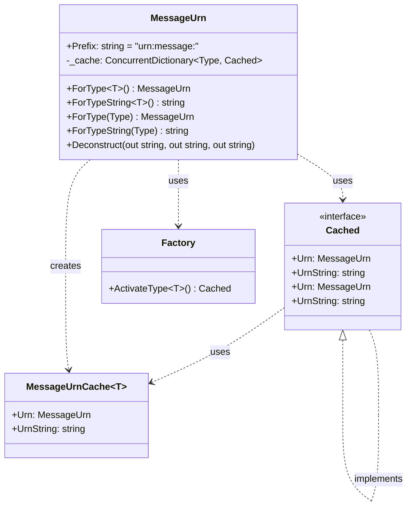
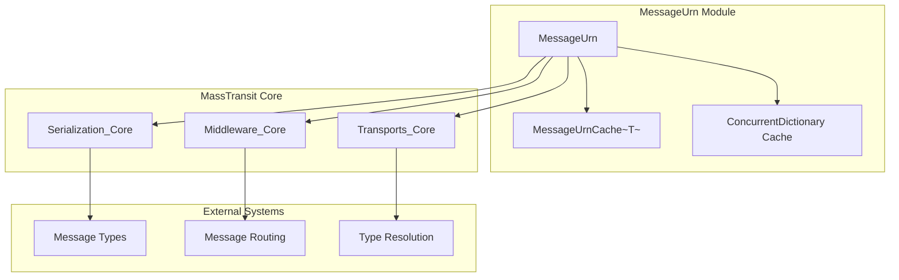
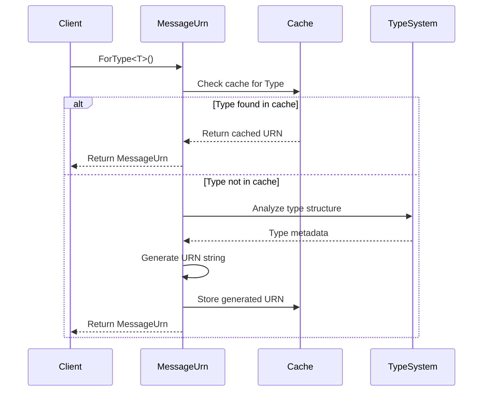

# MessageUrn Module Documentation

## Introduction

The MessageUrn module provides a standardized way to create unique identifiers for message types within the MassTransit messaging framework. It implements a URI-based naming scheme that ensures consistent message identification across different systems and serialization boundaries. This module is fundamental to MassTransit's message routing, serialization, and type resolution mechanisms.

## Core Functionality

The MessageUrn class extends the standard .NET Uri class to provide specialized functionality for message type identification. It generates URNs (Uniform Resource Names) following the pattern `urn:message:{namespace}:{typeName}:{assemblyName}` for any given .NET type, with special handling for generic types and nested classes.

## Architecture

### Component Structure



### System Integration



## Key Features

### 1. Type-Based URN Generation

The module automatically generates URNs for any .NET type using a consistent naming scheme:

```csharp
// Example URN generation
MessageUrn.ForType<CustomerCreatedEvent>()
// Result: "urn:message:MyApp.Messages:CustomerCreatedEvent:MyApp"
```

### 2. Generic Type Support

Handles complex generic types with proper formatting:

```csharp
// Generic type example
MessageUrn.ForType<MessageEnvelope<OrderCreated>>()
// Result: "urn:message:MyApp.Messages:MessageEnvelope[OrderCreated]:MyApp"
```

### 3. Performance Optimization

Implements a thread-safe caching mechanism using `ConcurrentDictionary<Type, Cached>` to avoid repeated URN generation for the same types.

### 4. Custom Message Naming

Supports custom message names through the `MessageUrnAttribute`:

```csharp
[MessageUrn("custom:message:name")]
public class CustomMessage
{
    // Message properties
}
```

## Data Flow



## Dependencies

### Internal Dependencies

- **Metadata Module**: Uses type metadata analysis for message name generation
- **Activation Module**: Leverages type activation for cache management

### External Dependencies

- **System.Uri**: Extends the base URI functionality
- **System.Reflection**: Uses reflection for type analysis and attribute inspection
- **System.Collections.Concurrent**: Utilizes thread-safe collections for caching

## Usage Patterns

### 1. Message Serialization

The MessageUrn is used during message serialization to identify message types:

```csharp
// Serialization process
var messageUrn = MessageUrn.ForType(message.GetType());
// Use URN in message envelope for type identification
```

### 2. Message Routing

URNs enable message routing based on type information:

```csharp
// Routing configuration
endpoint.Route<MessageUrn>(urn => urn.ForType<OrderCreated>());
```

### 3. Type Resolution

During deserialization, URNs help resolve the correct message type:

```csharp
// Deserialization process
var type = ResolveTypeFromUrn(messageUrn);
var message = Deserialize(messageBody, type);
```

## Performance Characteristics

### Caching Strategy

The module implements a two-tier caching system:

1. **Generic Cache**: `MessageUrnCache<T>` provides static caching for generic type parameters
2. **Runtime Cache**: `ConcurrentDictionary<Type, Cached>` handles dynamic type resolution

### Thread Safety

All operations are thread-safe due to the use of `ConcurrentDictionary` and immutable cache entries.

## Integration with MassTransit System

### Serialization Integration

The MessageUrn module works closely with the [Serialization_Core](Serialization_Core.md) module to ensure consistent message type identification across serialization boundaries.

### Middleware Integration

Integrates with [Middleware_Core](Middleware_Core.md) for message type filtering and routing decisions.

### Transport Integration

Used by [Transports_Core](Transports_Core.md) for message addressing and endpoint resolution.

## Best Practices

### 1. Type Naming

- Use clear, descriptive type names
- Maintain consistent namespace structures
- Avoid generic parameters in message types where possible

### 2. Performance

- Use generic `ForType<T>()` methods when type is known at compile time
- Leverage caching for frequently accessed message types

### 3. Custom Naming

- Use `MessageUrnAttribute` sparingly and only when necessary
- Ensure custom URNs are unique across your system

## Error Handling

The module includes validation for generic parameters:

```csharp
// Throws ArgumentException
MessageUrn.ForType(typeof(List<>)); // Open generic type
```

## Extensibility

The module's design allows for future extensions:

- Custom URN schemes through attribute-based naming
- Pluggable type name generation strategies
- Integration with external naming conventions

## Related Documentation

- [Core Abstractions](Core_Abstractions.md) - Overview of core MassTransit abstractions
- [Serialization_Core](Serialization_Core.md) - Message serialization and deserialization
- [Middleware_Core](Middleware_Core.md) - Message processing pipeline
- [Transports_Core](Transports_Core.md) - Message transport mechanisms