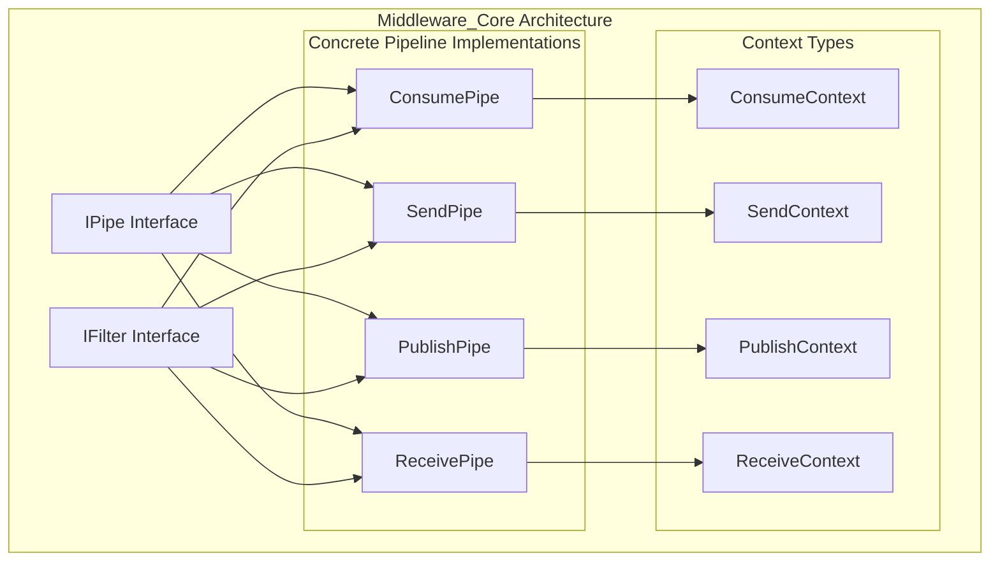
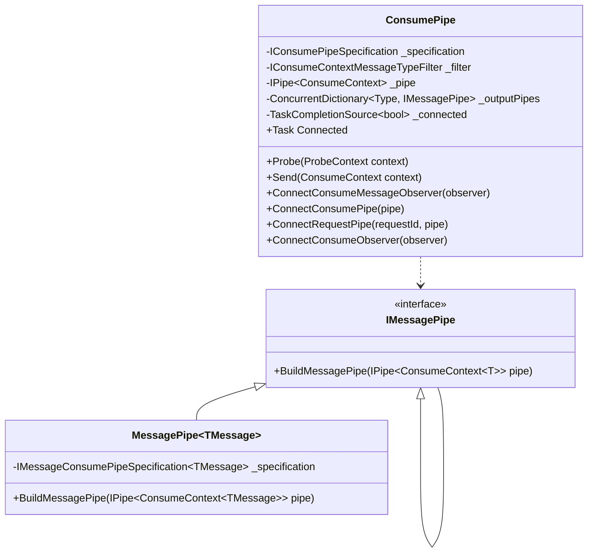
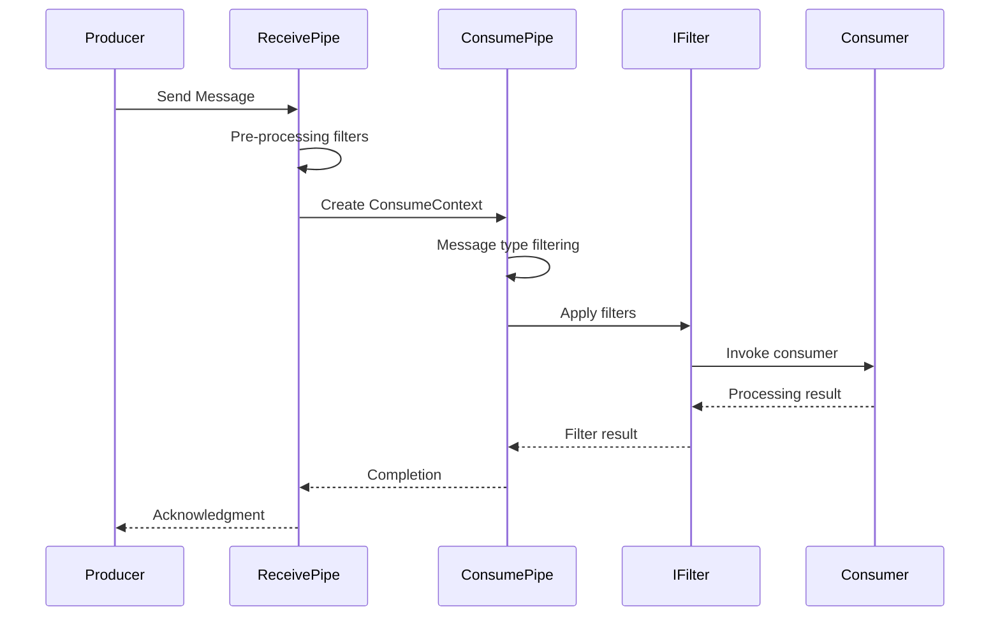
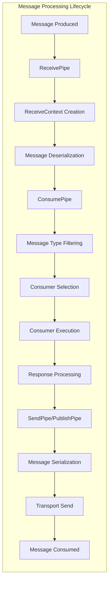
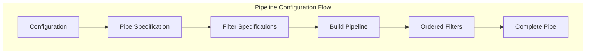
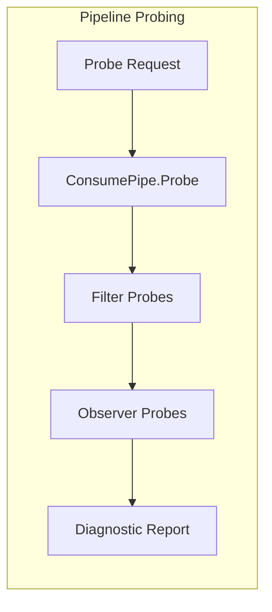

# Middleware_Core Module Documentation

## Introduction

The Middleware_Core module is the central processing engine of MassTransit, providing the foundational pipeline infrastructure for message processing. It implements a flexible, extensible middleware pattern that enables message transformation, filtering, routing, and processing across all message types (consume, send, publish, and receive operations).

This module serves as the backbone for MassTransit's message processing capabilities, orchestrating how messages flow through various filters and handlers before reaching their final destinations.

## Architecture Overview

### Core Components

The Middleware_Core module consists of several key components that work together to create a unified message processing pipeline:

1. **IPipe** - The fundamental pipeline abstraction
2. **IFilter** - Individual processing units within the pipeline
3. **ConsumePipe** - Specialized pipeline for message consumption
4. **SendPipe** - Pipeline for outgoing messages
5. **PublishPipe** - Pipeline for published messages
6. **ReceivePipe** - Pipeline for incoming messages

### Architecture Diagram



## Component Details

### IPipe Interface
The `IPipe<T>` interface is the core abstraction that represents a pipeline that can process a context of type `T`. It defines a single method `Send(T context)` that executes the pipeline with the given context.

### IFilter Interface
The `IFilter<T>` interface represents individual processing units that can be composed within a pipeline. Filters can inspect, modify, or act upon the context as it flows through the pipeline.

### ConsumePipe Implementation

The `ConsumePipe` is a specialized pipeline implementation for processing consumed messages. It demonstrates the sophisticated architecture of the middleware system:



#### Key Features of ConsumePipe:

1. **Message Type Filtering**: Uses `IConsumeContextMessageTypeFilter` to route messages based on type
2. **Dynamic Pipe Connection**: Allows runtime connection of additional pipes and observers
3. **Message Specification**: Leverages message specifications to build type-specific processing pipelines
4. **Observer Pattern**: Supports connection of message and consume observers for monitoring
5. **Thread-Safe Operations**: Uses concurrent collections for safe multi-threaded access

### Pipeline Flow



## Dependencies and Integration

### Core Abstractions Dependency
The Middleware_Core module heavily depends on the [Core_Abstractions](Core_Abstractions.md) module for:

- **Context Types**: `ConsumeContext`, `SendContext`, `PublishContext`, `ReceiveContext`
- **Message Contracts**: `IConsumer`, `ISaga`, `IRequestClient`
- **Correlation**: `CorrelatedBy` for message correlation
- **Message Identification**: `MessageUrn` for message type identification

### Configuration Integration
The module integrates with [Configuration_Core](Configuration_Core.md) through:
- `IConsumePipeSpecification` for pipeline configuration
- `IReceiveEndpointConfigurator` for endpoint-specific pipeline setup
- `IConsumerConfigurator` for consumer-specific middleware

### Transport Layer Integration
Works closely with [Transports_Core](Transports_Core.md) for:
- Message sending via `ISendTransport` and `SendEndpoint`
- Message receiving via `IReceiveTransport` and `ReceiveEndpoint`
- Endpoint providers for dynamic endpoint resolution

## Message Processing Flow

### Complete Message Lifecycle



### Filter Execution Model

```mermaid
graph TD
    subgraph "Filter Chain Execution"
        Start[Pipeline Start] --> Filter1[Filter 1: Pre-processing]
        Filter1 --> Filter2[Filter 2: Authentication]
        Filter2 --> Filter3[Filter 3: Validation]
        Filter3 --> Filter4[Filter 4: Transformation]
        Filter4 --> Handler[Message Handler]
        Handler --> Filter4Return[Filter 4: Post-processing]
        Filter4Return --> Filter3Return[Filter 3: Cleanup]
        Filter3Return --> Filter2Return[Filter 2: Logging]
        Filter2Return --> Filter1Return[Filter 1: Metrics]
        Filter1Return --> End[Pipeline End]
    end
```



## Extension Points

### Custom Filter Development
Developers can create custom filters by implementing `IFilter<T>`:

```csharp
public class CustomFilter<T> : IFilter<T>
    where T : class, PipeContext
{
    public async Task Send(T context, IPipe<T> next)
    {
        // Pre-processing logic
        
        await next.Send(context);
        
        // Post-processing logic
    }
    
    public void Probe(ProbeContext context)
    {
        context.CreateFilterScope("customFilter");
    }
}
```

### Pipeline Configuration
Pipelines can be configured through specifications that define filter ordering and behavior:



## Performance Considerations

### Concurrent Processing
- **Thread-Safe Collections**: Uses `ConcurrentDictionary` for message pipe caching
- **Async/Await**: Fully asynchronous pipeline execution
- **TaskCompletionSource**: Efficient connection state management

### Memory Optimization
- **Message Pipe Caching**: Reuses message pipes for the same message types
- **Lazy Initialization**: Pipes are built on-demand
- **Specification Pattern**: Avoids unnecessary object creation

### Scalability Features
- **Filter Chaining**: Efficient filter chain execution
- **Observer Pattern**: Non-blocking observer notifications
- **Pipeline Branching**: Supports parallel processing paths

## Testing and Monitoring

### Probe Support
All components implement probe interfaces for runtime inspection:



### Observer Integration
The module supports various observers for monitoring:
- **Consume Observers**: Monitor message consumption
- **Message Observers**: Monitor specific message types
- **Send/Publish Observers**: Monitor outgoing messages

## Best Practices

### Filter Ordering
1. **Authentication/Authorization**: Early in the pipeline
2. **Validation**: Before message processing
3. **Transformation**: After validation, before handling
4. **Logging/Metrics**: Throughout the pipeline
5. **Error Handling**: Comprehensive error filters

### Performance Optimization
- Minimize filter complexity
- Use async operations for I/O-bound filters
- Cache frequently used data
- Avoid blocking operations in filters
- Profile pipeline execution regularly

### Error Handling
- Implement comprehensive error filters
- Use circuit breakers for external dependencies
- Log errors with full context
- Implement retry policies where appropriate
- Provide fallback mechanisms

## Integration with Other Modules

### [Serialization_Core](Serialization_Core.md)
The middleware pipelines work closely with serialization components:
- Message deserialization before ConsumePipe
- Message serialization after SendPipe/PublishPipe
- Envelope handling for message metadata

### [Saga_StateMachine_Core](Saga_StateMachine_Core.md)
Saga integration through specialized filters:
- Saga instance loading
- State machine execution
- Correlation handling
- State persistence

### [Courier_Core](Courier_Core.md)
Routing slip execution through middleware:
- Activity execution
- Compensation handling
- Routing slip state management

### [Testing_Core](Testing_Core.md)
Test harness integration:
- In-memory pipeline execution
- Test observers
- Message tracking
- Performance testing

This comprehensive middleware system provides the foundation for all message processing in MassTransit, offering flexibility, extensibility, and performance for complex distributed messaging scenarios.