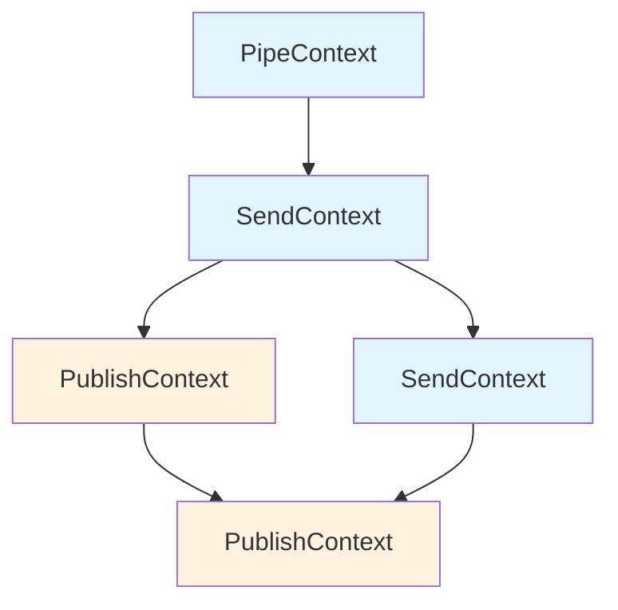
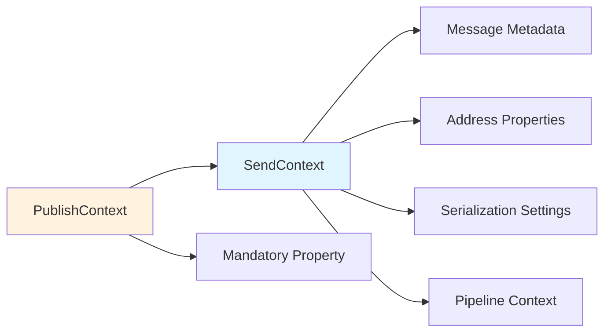
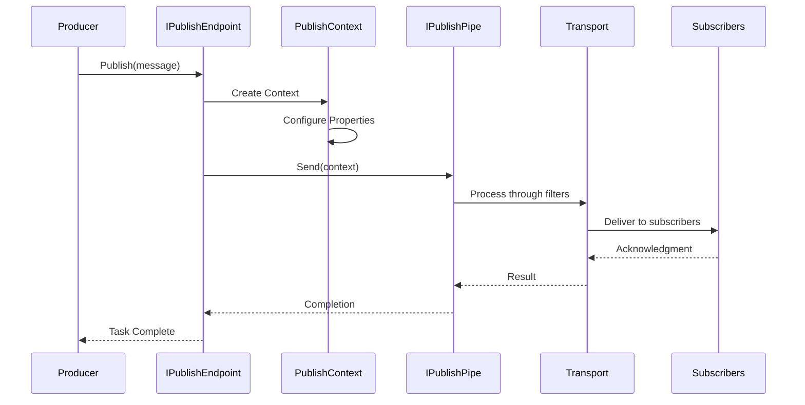
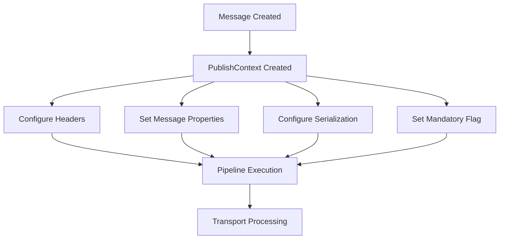
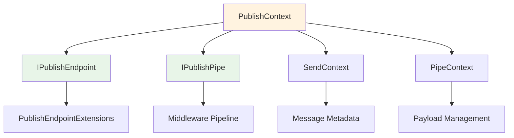
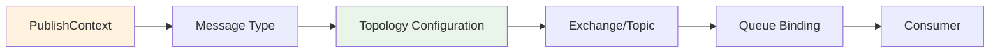
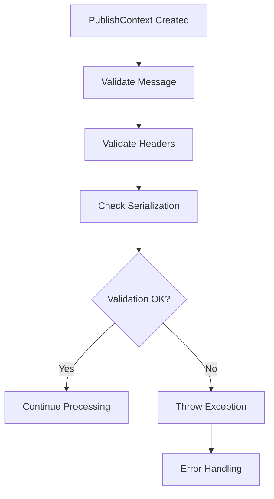

# PublishContext Module Documentation

## Overview

The **PublishContext** module is a core component of MassTransit's messaging abstractions that provides the contextual framework for publishing messages in a distributed messaging system. PublishContext extends the SendContext functionality to support the publish-subscribe messaging pattern, where messages are delivered to multiple subscribed consumers rather than a specific endpoint.

## Purpose and Core Functionality

PublishContext serves as the primary interface for configuring and controlling message publication in MassTransit. It provides:

- **Message Publication Control**: Manages the publishing of messages to subscribed consumers
- **Contextual Information**: Carries metadata and configuration for published messages
- **Pipeline Integration**: Works within MassTransit's middleware pipeline architecture
- **Transport Abstraction**: Provides a transport-agnostic way to publish messages

## Architecture and Component Relationships

### Inheritance Hierarchy



### Core Interface Structure



## Key Components

### 1. PublishContext Interface

The base `PublishContext` interface extends `SendContext` and adds publish-specific functionality:

```csharp
public interface PublishContext : SendContext
{
    /// <summary>
    /// True if the message must be delivered to a subscriber
    /// </summary>
    bool Mandatory { get; set; }
}
```

**Key Properties:**
- **Mandatory**: Indicates whether the message must be delivered to at least one subscriber

### 2. Generic PublishContext<T> Interface

The generic version provides type-safe access to the published message:

```csharp
public interface PublishContext<out T> : SendContext<T>, PublishContext
    where T : class
{
}
```

## Data Flow and Message Publishing

### Message Publishing Flow



### Context Configuration Flow



## Integration with MassTransit Architecture

### Relationship with Core Abstractions



### Middleware Pipeline Integration

PublishContext integrates with MassTransit's middleware pipeline through:

1. **IPipe<PublishContext<T>>**: Type-specific pipes for message processing
2. **IPipe<PublishContext>**: Non-generic pipes for general processing
3. **Filters**: Custom logic that can modify the publish context
4. **Observers**: Monitoring and logging of publish operations

## Usage Patterns and Examples

### Basic Message Publishing

```csharp
// Simple publish
await publishEndpoint.Publish(new OrderCreatedEvent 
{ 
    OrderId = orderId 
});
```

### Advanced Context Configuration

```csharp
// Configure publish context
await publishEndpoint.Publish(new OrderCreatedEvent 
{ 
    OrderId = orderId 
}, context =>
{
    context.Mandatory = true; // Must reach at least one subscriber
    context.Headers.Set("Priority", "High");
    context.TimeToLive = TimeSpan.FromMinutes(5);
});
```

### Using PublishContext with Pipes

```csharp
// Custom pipe implementation
public class LoggingPublishPipe<T> : IPipe<PublishContext<T>>
    where T : class
{
    public async Task Send(PublishContext<T> context)
    {
        // Log publish operation
        logger.LogInformation("Publishing message of type {MessageType}", typeof(T).Name);
        
        // Continue pipeline
        await next.Send(context);
    }
}
```

## Transport Integration

### Transport-Specific Behavior

Different transports handle the `Mandatory` property differently:

- **RabbitMQ**: Maps to mandatory delivery mode
- **Azure Service Bus**: Uses message properties for delivery guarantees
- **Amazon SQS**: Implements through message attributes
- **In-Memory**: Immediate delivery with validation

### Message Routing



## Error Handling and Reliability

### Mandatory Delivery Handling

When `Mandatory = true`:

1. Transport attempts delivery to all matching subscribers
2. If no subscribers found, returns negative acknowledgment
3. MassTransit can handle undeliverable messages through:
   - Dead letter queues
   - Error handling middleware
   - Custom failure handlers

### Context Validation



## Performance Considerations

### Context Pooling

- PublishContext instances are typically pooled for performance
- Reuse reduces allocation pressure in high-throughput scenarios
- Payload management ensures proper cleanup

### Serialization Optimization

- Context carries serialization settings for the specific message type
- Supports multiple serializers (JSON, XML, binary)
- ContentType property ensures proper deserialization by consumers

## Testing and Development

### Mocking PublishContext

```csharp
// Test setup with mock context
var mockContext = new Mock<PublishContext<TestMessage>>();
mockContext.Setup(x => x.Message).Returns(testMessage);
mockContext.Setup(x => x.Headers).Returns(new SendHeaders());

// Test publish behavior
await publishEndpoint.Publish(testMessage, mockContext.Object);
```

### Integration Testing

The [Testing_Core](Testing_Core.md) module provides test harnesses that work with PublishContext for integration testing scenarios.

## Related Modules

- **[SendContext](SendContext.md)**: Base context for message sending operations
- **[ConsumeContext](ConsumeContext.md)**: Context for message consumption
- **[Middleware_Core](Middleware_Core.md)**: Pipeline infrastructure supporting PublishContext
- **[Transports_Core](Transports_Core.md)**: Transport implementations that process PublishContext
- **[IPublishEndpoint](IPublishEndpoint.md)**: Interface for publishing messages using PublishContext

## Best Practices

1. **Use Mandatory Carefully**: Only set `Mandatory = true` when message delivery is critical
2. **Configure TimeToLive**: Set appropriate message expiration times
3. **Leverage Headers**: Use headers for cross-cutting concerns like correlation
4. **Implement Proper Error Handling**: Handle publish failures gracefully
5. **Use Type-Safe Contexts**: Prefer `PublishContext<T>` when message type is known

## Conclusion

The PublishContext module is fundamental to MassTransit's publish-subscribe messaging capabilities. It provides a rich, extensible framework for configuring message publication while maintaining transport independence. Understanding PublishContext is essential for building robust distributed applications with MassTransit.