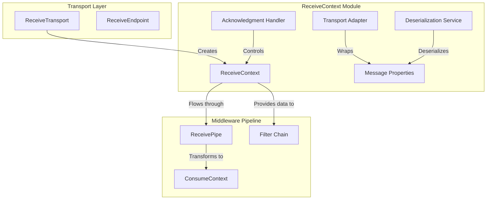
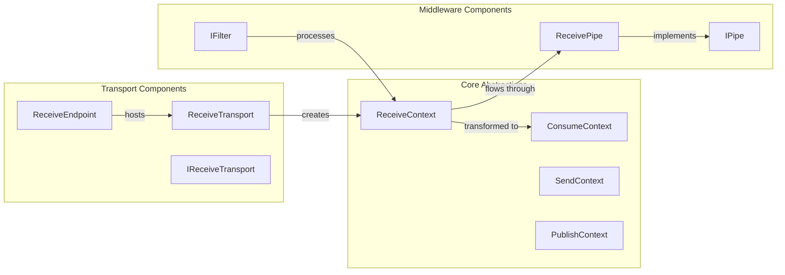
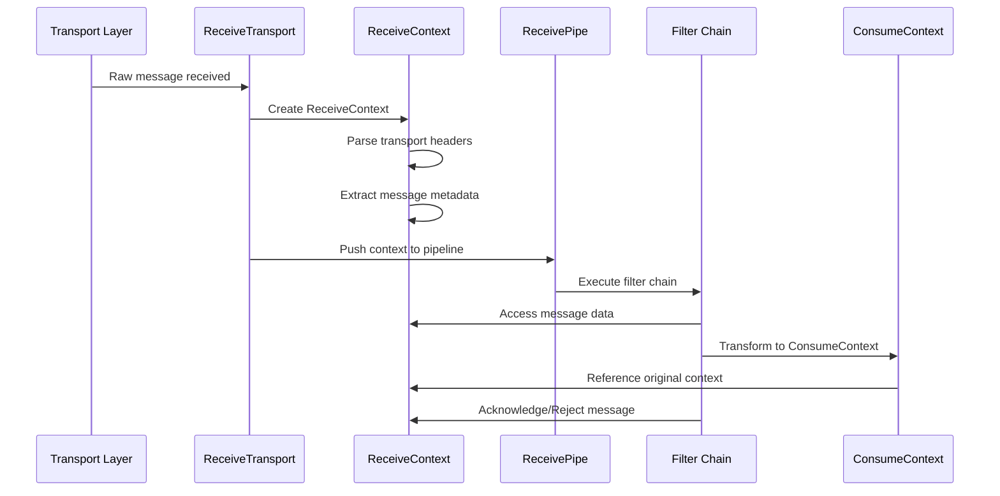
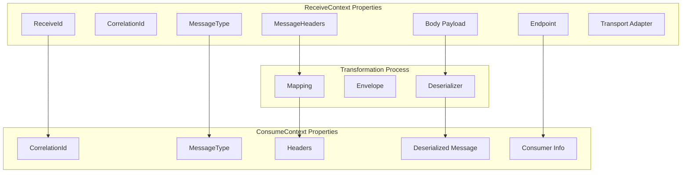
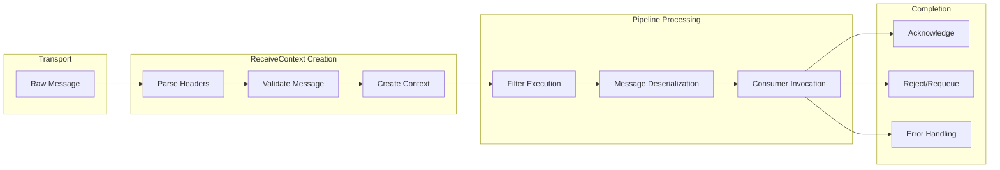
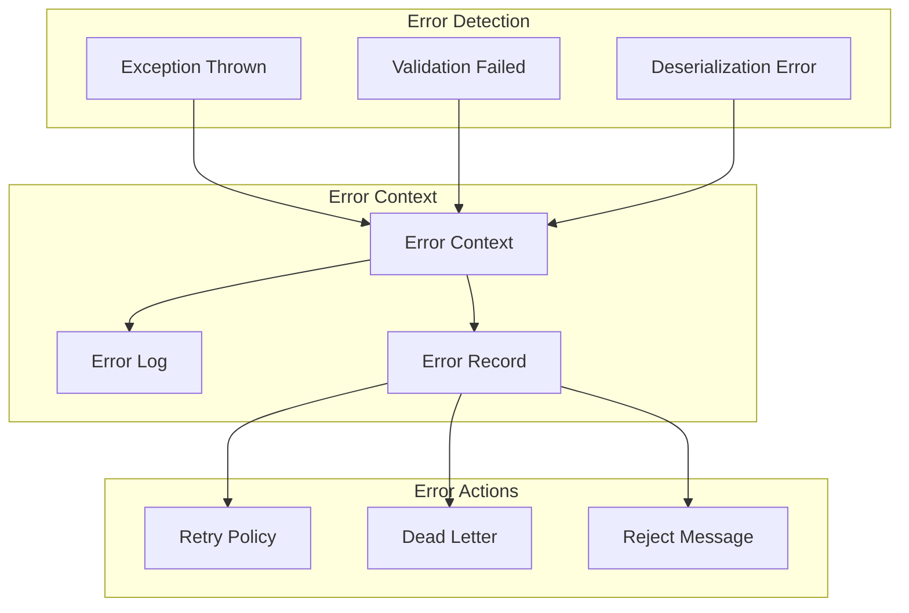

# ReceiveContext Module Documentation

## Introduction

The ReceiveContext module is a fundamental component of MassTransit's message processing pipeline, providing the contextual information and operations needed when a message is received from a transport. It serves as the primary interface between the transport layer and the message processing middleware, encapsulating all the necessary data and functionality required to handle incoming messages effectively.

## Overview

ReceiveContext represents the complete state and operations available when a message is received from the underlying transport mechanism. It provides access to the raw message data, transport-specific information, message deserialization capabilities, and acknowledgment mechanisms. This context flows through the entire receive pipeline, allowing filters and consumers to access message metadata, deserialize payloads, and control message acknowledgment behavior.

## Architecture

### Core Components

### Component Relationships

## Data Flow

### Message Reception Flow

### Context Transformation

## Key Features

### Message Metadata Access
ReceiveContext provides comprehensive access to message metadata including:
- Message identification (MessageId, CorrelationId, RequestId)
- Transport-specific headers and properties
- Message type information for deserialization routing
- Endpoint and routing information

### Transport Abstraction
The context abstracts transport-specific details, allowing the same processing logic to work across different transport mechanisms (RabbitMQ, Azure Service Bus, Amazon SQS, In-Memory, etc.).

### Deserialization Support
ReceiveContext coordinates with the serialization layer to:
- Determine the appropriate deserializer based on content type
- Provide access to raw message data for deserialization
- Handle deserialization errors gracefully

### Acknowledgment Control
The context provides mechanisms to:
- Acknowledge successful message processing
- Reject messages with optional requeue
- Handle poison messages through dead letter queues
- Manage transaction boundaries

## Integration Points

### Transport Layer Integration
ReceiveContext is created by the [ReceiveTransport](Transports_Core.md) when a message arrives from the underlying transport mechanism. It wraps the transport-specific message representation in a standardized interface.

### Middleware Pipeline Integration
The context flows through the [ReceivePipe](Middleware_Core.md) where various filters can inspect, modify, or take action based on the message content and metadata.

### Serialization Integration
ReceiveContext works with [IMessageDeserializer](Serialization_Core.md) to convert raw message data into strongly-typed .NET objects that can be consumed by message handlers.

### Consumer Context Transformation
After initial processing, ReceiveContext is typically transformed into [ConsumeContext](ConsumeContext.md) which provides higher-level abstractions for message consumers.

## Process Flows

### Message Processing Pipeline

### Error Handling Flow

## Dependencies

### Direct Dependencies
- **Transport Layer**: [IReceiveTransport](Transports_Core.md) creates ReceiveContext instances
- **Serialization**: [IMessageDeserializer](Serialization_Core.md) for message deserialization
- **Middleware**: [ReceivePipe](Middleware_Core.md) for pipeline processing

### Related Components
- **ConsumeContext**: Evolved from ReceiveContext for consumer processing
- **SendContext/PublishContext**: Companion contexts for outbound messages
- **Message Envelope**: Serialization wrapper for message data

## Best Practices

### Context Usage
- Always check for message validity before processing
- Use the provided acknowledgment mechanisms appropriately
- Handle deserialization errors gracefully
- Leverage built-in retry and error handling features

### Performance Considerations
- Minimize allocations within receive context processing
- Use async operations for I/O-bound operations
- Leverage batch processing where supported by transport
- Implement proper connection pooling for database operations

### Error Handling
- Implement comprehensive error handling at the filter level
- Use structured logging for debugging receive operations
- Configure appropriate retry policies for transient failures
- Set up dead letter queues for poison messages

## Configuration

### Receive Endpoint Configuration
ReceiveContext behavior can be configured through [IReceiveEndpointConfigurator](Configuration_Core.md):
- Message deserialization settings
- Error handling and retry policies
- Transport-specific properties
- Pipeline filter configuration

### Transport-Specific Settings
Different transports may expose additional configuration options:
- Prefetch counts and concurrency settings
- Message acknowledgment modes
- Dead letter queue configuration
- Transport-specific headers and properties

## Testing

### Unit Testing
The [InMemoryTestHarness](Testing_Core.md) provides capabilities for testing ReceiveContext behavior:
- Simulate message reception
- Inspect context properties
- Verify acknowledgment behavior
- Test error handling scenarios

### Integration Testing
Integration tests can verify complete receive pipelines:
- End-to-end message processing
- Transport integration verification
- Error handling validation
- Performance and throughput testing

## Monitoring and Observability

### Metrics
Key metrics to monitor around ReceiveContext:
- Message receive rates
- Processing latency
- Error rates and types
- Acknowledgment patterns

### Logging
Structured logging should capture:
- Message metadata (IDs, types, timestamps)
- Processing duration
- Error details and stack traces
- Acknowledgment decisions

### Distributed Tracing
ReceiveContext supports distributed tracing through:
- Correlation ID propagation
- Trace context extraction from headers
- Span creation for receive operations
- Baggage item propagation

## Advanced Scenarios

### Custom Transport Implementation
When implementing custom transports:
- Properly implement ReceiveContext creation
- Handle transport-specific error conditions
- Ensure proper acknowledgment semantics
- Support message batching where applicable

### Custom Filter Development
Filters processing ReceiveContext should:
- Respect the context lifecycle
- Handle errors appropriately
- Maintain thread safety
- Support async operations

### Message Routing
Advanced routing scenarios may involve:
- Dynamic message type determination
- Content-based routing decisions
- Multi-tenant message isolation
- Message transformation during receive

## Related Documentation

- [ConsumeContext](ConsumeContext.md) - Higher-level context for message consumers
- [Transports Core](Transports_Core.md) - Transport layer components and interfaces
- [Middleware Core](Middleware_Core.md) - Pipeline processing and filters
- [Serialization Core](Serialization_Core.md) - Message serialization and deserialization
- [Configuration Core](Configuration_Core.md) - Configuration interfaces and options
- [Testing Core](Testing_Core.md) - Testing harnesses and utilities