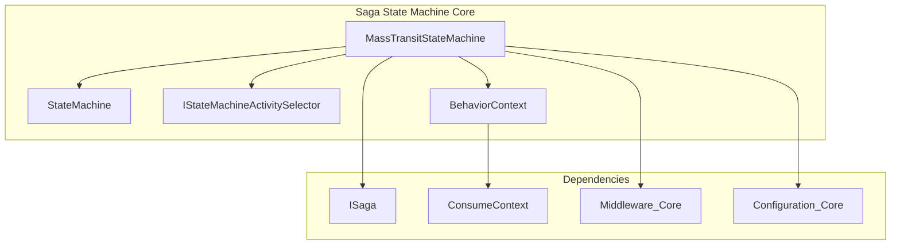
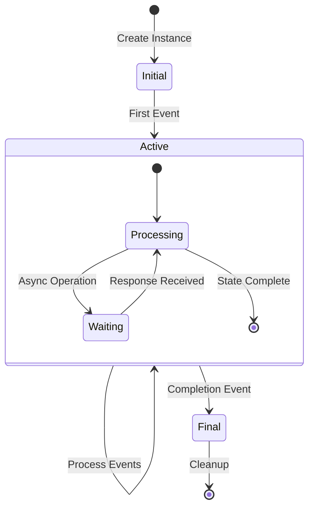

# Saga State Machine Core Module

## Overview

The Saga State Machine Core module is the heart of MassTransit's state machine implementation, providing a powerful and flexible framework for building complex, event-driven state machines. Built on top of Automatonymous, it extends the base functionality with MassTransit-specific features like message correlation, request/response patterns, and seamless integration with the MassTransit messaging infrastructure.

## Purpose

This module enables developers to:
- Define sophisticated state machines that can handle complex business processes
- Implement long-running workflows with persistence and recovery capabilities
- Build event-driven architectures with automatic message correlation
- Handle request/response patterns within state machine contexts
- Create composite events and manage state transitions based on multiple event conditions

## Architecture

### Core Components

### Key Relationships

The `MassTransitStateMachine<TInstance>` is the central component that:
- Extends the base `StateMachine<TInstance>` with MassTransit-specific functionality
- Integrates with the [Core Abstractions](Core_Abstractions.md) through `ISaga` and `ConsumeContext`
- Leverages [Middleware Core](Middleware_Core.md) for pipeline processing
- Uses [Configuration Core](Configuration_Core.md) for setup and configuration

## Core Functionality

### 1. State Machine Engine
The [State Machine Engine](StateMachine_Engine.md) provides the core execution framework:
- **MassTransitStateMachine<TInstance>**: Main state machine implementation with MassTransit integration
- **StateMachine<TInstance>**: Base state machine functionality and lifecycle management
- **State management**: Property-based, string-based, and integer-based state accessors
- **Event correlation**: Automatic message correlation to state machine instances

### 2. Activity Selection System
The [Activity Selection](Activity_Selection.md) framework enables flexible activity execution:
- **IStateMachineActivitySelector**: Interface for selecting and configuring activities
- **Type-based activity selection**: Select activities by type with generic constraints
- **Instance-based activities**: Activities that operate on state machine instances
- **Data-driven activities**: Activities that process event data

### 3. Behavior Context
The [Behavior Context](Behavior_Context.md) provides execution context for state machine operations:
- **BehaviorContext<TInstance>**: Context for state machine instance operations
- **Event data access**: Access to event payload data during execution
- **State transition context**: Information about current and target states
- **Service provider access**: Access to dependency injection container

## State Machine Lifecycle

## Integration Points

### Message Correlation
The state machine automatically correlates messages to instances using:
- **CorrelationId**: Primary correlation mechanism
- **Custom expressions**: Flexible correlation rules
- **Message properties**: Extract correlation data from message headers

### Persistence Integration
Seamless integration with saga persistence:
- **State persistence**: Automatic state serialization
- **Event replay**: Support for event sourcing patterns
- **Instance lifecycle**: Automatic creation and cleanup

### Middleware Integration
Leverages MassTransit's middleware pipeline:
- **Consume filters**: Pre/post processing of messages
- **Send filters**: Outgoing message processing
- **Publish filters**: Published message processing

## Configuration

State machines are configured through a fluent API that allows:
- **State declaration**: Define states and their relationships
- **Event declaration**: Configure events and their data types
- **Activity binding**: Associate activities with events and states
- **Correlation setup**: Define message correlation rules

## Error Handling

Comprehensive error handling including:
- **Unhandled events**: Configurable behavior for unexpected events
- **State validation**: Ensure valid state transitions
- **Activity exceptions**: Graceful handling of activity failures
- **Timeout management**: Automatic timeout handling for requests

## Performance Considerations

- **Caching**: Event and state caching for improved performance
- **Lazy initialization**: Deferred loading of registrations
- **Observer pattern**: Efficient event/state change notifications
- **Memory management**: Proper cleanup of completed instances

## Usage Examples

The state machine is typically used to implement complex business processes such as:
- Order processing workflows
- Payment processing systems
- Multi-step approval processes
- Long-running integration scenarios
- Event-driven microservice orchestration

## Related Documentation

- [Core Abstractions](Core_Abstractions.md) - Base interfaces and contracts
- [Middleware Core](Middleware_Core.md) - Pipeline processing infrastructure
- [Configuration Core](Configuration_Core.md) - Configuration and setup patterns
- [Transports Core](Transports_Core.md) - Transport layer integration

## Detailed Sub-Module Documentation

For detailed information about specific components, see:

- [State Machine Engine](StateMachine_Engine.md) - Comprehensive documentation of the core state machine implementation
- [Activity Selection](Activity_Selection.md) - Detailed guide to activity selection and configuration
- [Behavior Context](Behavior_Context.md) - In-depth coverage of behavior context and execution environment