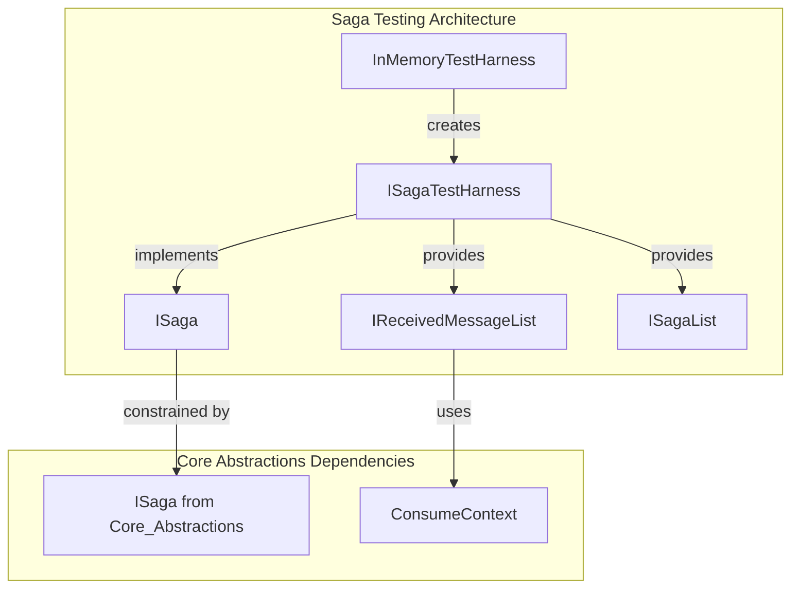
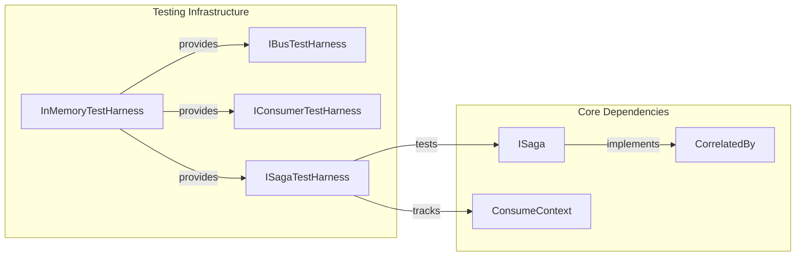
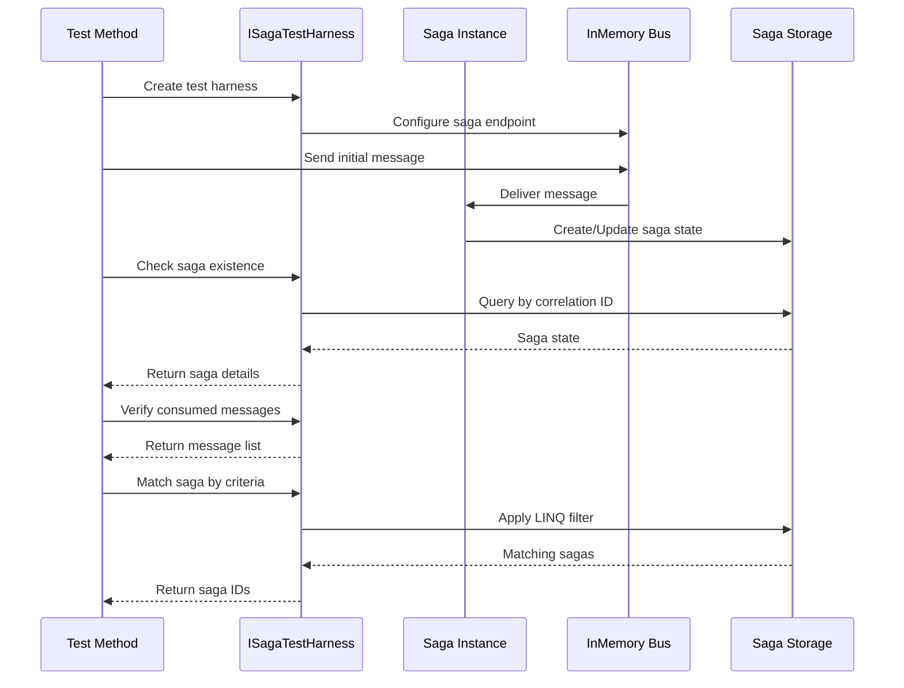
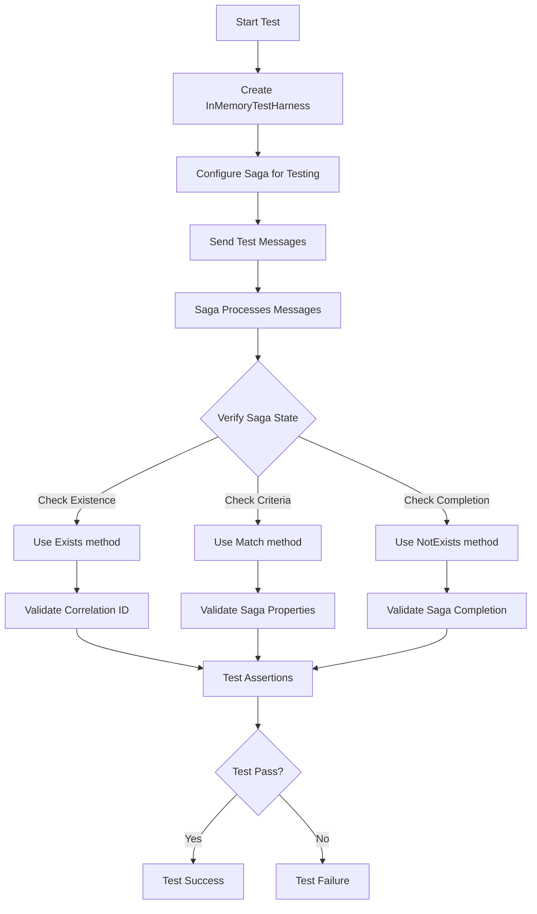
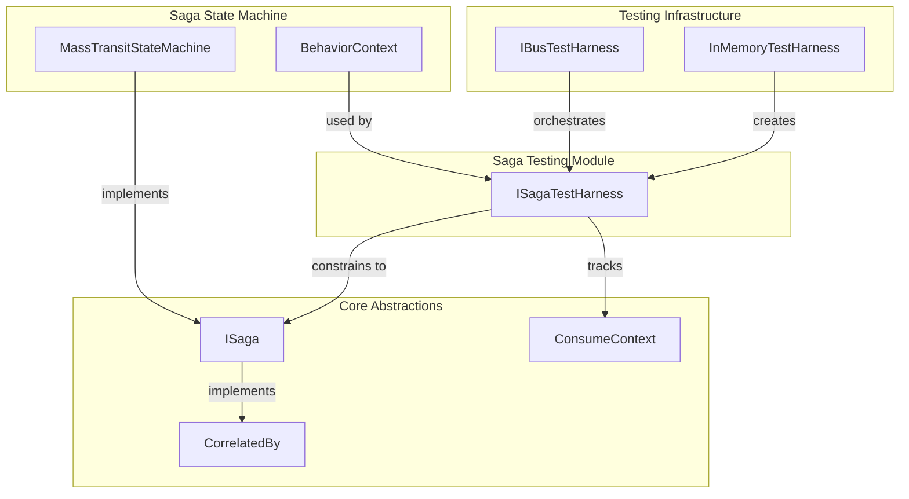

# Saga Testing Module Documentation

## Introduction

The Saga Testing module provides specialized testing capabilities for MassTransit sagas, enabling developers to verify saga behavior, state transitions, and message consumption in isolated test environments. This module is essential for ensuring the reliability and correctness of complex distributed transaction workflows implemented using the MassTransit saga state machine pattern.

## Module Overview

The Saga Testing module is part of the broader [Testing_Core](Testing_Core.md) infrastructure and specifically focuses on providing test harnesses for saga instances. It integrates with the [InMemory_Transport](InMemory_Transport.md) to create lightweight, fast-testing environments without requiring external message brokers.

## Core Components

### ISagaTestHarness<TSaga>

The primary interface for saga testing functionality, providing a comprehensive set of methods to verify saga behavior during test execution.

**Key Properties:**
- `Consumed`: Tracks all messages consumed by the saga under test
- `Sagas`: Provides access to all saga instances in the test environment  
- `Created`: Filters to show only newly created saga instances during the test

**Key Methods:**
- `Exists()`: Waits for and verifies saga existence by correlation ID
- `Match()`: Finds saga instances matching specific criteria using LINQ expressions
- `NotExists()`: Verifies saga completion or removal by correlation ID

## Architecture



## Component Relationships



## Data Flow



## Testing Process Flow



## Integration with MassTransit System

The Saga Testing module integrates with several key MassTransit components:

### Dependencies on Core Modules

1. **[Core_Abstractions](Core_Abstractions.md)**: Utilizes the `ISaga` interface as the fundamental constraint for all saga test harnesses
2. **[Testing_Core](Testing_Core.md)**: Part of the broader testing infrastructure, sharing common testing patterns and interfaces
3. **[InMemory_Transport](InMemory_Transport.md)**: Leverages in-memory transport for fast, isolated testing without external dependencies

### Integration Points



## Usage Patterns

### Basic Saga Testing

```csharp
// Typical usage pattern for saga testing
var harness = new InMemoryTestHarness();
var sagaHarness = harness.Saga<MySaga>();

// Send message that should create saga
await harness.InputQueueSendEndpoint.Send(new CreateSagaMessage { CorrelationId = sagaId });

// Verify saga was created
var exists = await sagaHarness.Exists(sagaId);
Assert.IsTrue(exists.HasValue);

// Verify saga consumed the message
Assert.IsTrue(sagaHarness.Consumed.Select<CreateSagaMessage>().Any());
```

### Advanced Saga State Verification

```csharp
// Match sagas by custom criteria
var matchingSagas = await sagaHarness.Match(x => 
    x.State == "Processing" && 
    x.OrderAmount > 1000);

Assert.AreEqual(1, matchingSagas.Count);
```

## Key Benefits

1. **Isolation**: Tests run in complete isolation using in-memory transport
2. **Speed**: No external dependencies means fast test execution
3. **Observability**: Full visibility into saga state and message consumption
4. **Flexibility**: Support for complex saga state verification scenarios
5. **Integration**: Seamless integration with existing MassTransit testing patterns

## Best Practices

1. **Use Timeouts**: Always specify appropriate timeouts when waiting for saga state
2. **Clean State**: Ensure each test starts with a fresh test harness
3. **Verify Consumption**: Check both saga state AND message consumption
4. **Test Completion**: Verify saga completion using `NotExists` for terminal states
5. **State Validation**: Use `Match` for complex state verification scenarios

## Related Documentation

- [Testing_Core](Testing_Core.md) - General testing infrastructure and patterns
- [InMemory_Transport](InMemory_Transport.md) - In-memory transport implementation
- [Core_Abstractions](Core_Abstractions.md) - Core saga abstractions and interfaces
- [Saga_StateMachine_Core](Saga_StateMachine_Core.md) - Saga state machine implementation