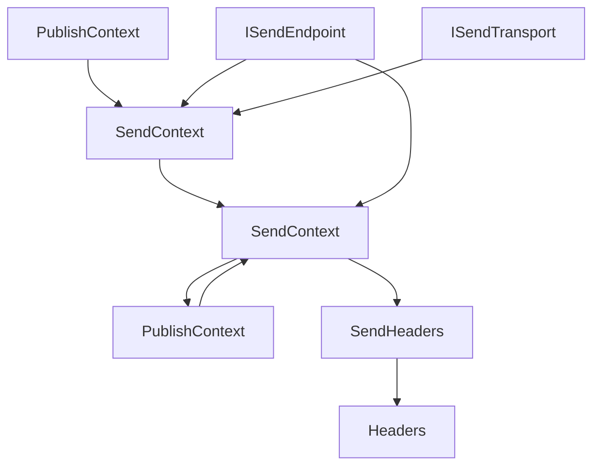
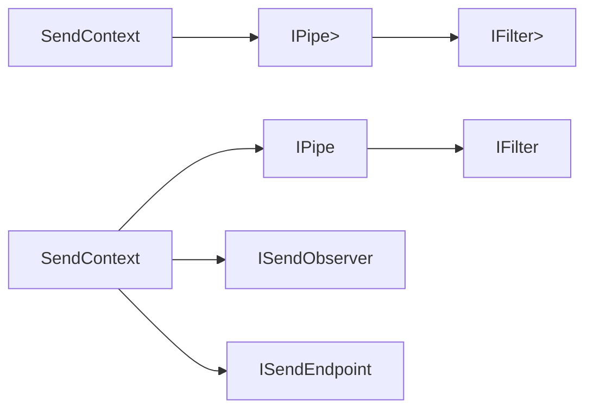
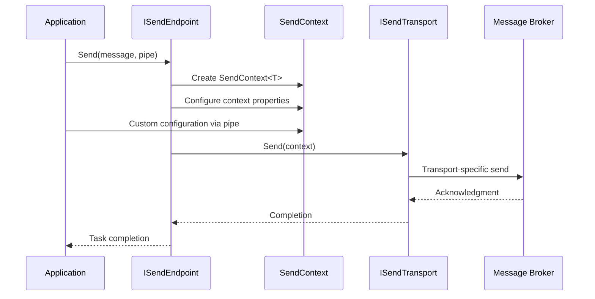
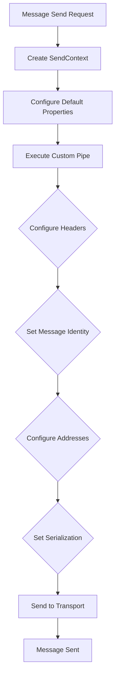

# SendContext Module Documentation

## Overview

The **SendContext** module is a fundamental component of MassTransit's messaging infrastructure that provides the context and configuration for sending messages through the transport layer. It serves as the primary abstraction for message sending operations, encapsulating all the metadata, headers, and configuration options needed to send messages reliably across different transport mechanisms.

SendContext acts as a bridge between the high-level message sending API and the low-level transport operations, providing a unified interface for configuring message delivery properties, managing message identity, and handling message serialization.

## Architecture

### Core Components

The SendContext module consists of two primary interfaces that form a hierarchical structure:

#### SendContext<T> (Generic Interface)
- **Purpose**: Type-safe send context for specific message types
- **Location**: `src.MassTransit.Abstractions.SendContext.SendContext`
- **Key Feature**: Provides direct access to the strongly-typed message being sent
- **Inheritance**: Extends the base `SendContext` interface

#### SendContext (Base Interface)
- **Purpose**: Non-generic base interface for all send operations
- **Location**: `src.MassTransit.Abstractions.SendContext.SendContext`
- **Inheritance**: Extends `PipeContext` for payload management and cancellation support
- **Key Feature**: Provides message-agnostic sending capabilities

### Inheritance Hierarchy

```
PipeContext (Base context with payload management)
    ↓
SendContext (Message sending configuration)
    ↓
SendContext<T> (Type-specific message sending)
    ↓
PublishContext (Publishing-specific extensions)
    ↓
PublishContext<T> (Type-specific publishing)
```

## Key Features and Capabilities

### Message Identity Management
SendContext provides comprehensive message identity tracking through multiple identifier properties:

- **MessageId**: Unique identifier for the message
- **CorrelationId**: Correlation identifier for tracking related messages
- **ConversationId**: Identifier for conversation tracking across multiple messages
- **InitiatorId**: Identifier of the message that initiated this conversation
- **RequestId**: Identifier for request-response patterns
- **ScheduledMessageId**: Identifier for scheduled messages

### Address Management
The context manages various endpoint addresses for message routing:

- **SourceAddress**: The address where the message originated
- **DestinationAddress**: The target endpoint address
- **ResponseAddress**: The address for response messages
- **FaultAddress**: The address for fault/exception messages

### Message Configuration
SendContext provides extensive configuration options:

- **TimeToLive**: Message expiration time
- **Delay**: Delivery delay for scheduled messages
- **Durable**: Persistence configuration for broker restart survival
- **ContentType**: Message content type for serialization
- **Serializer**: Custom message serializer
- **Serialization**: Endpoint serialization configuration
- **SupportedMessageTypes**: Array of supported message types

### Header Management
Integrated header management through the `SendHeaders` interface:

- **Custom Headers**: Support for application-specific headers
- **Host Headers**: Automatic host information headers
- **Exception Headers**: Fault and error information headers
- **Header Transfer**: Mechanisms for transferring headers between contexts

## Component Relationships

### Integration with Core Abstractions



### Middleware Integration



## Data Flow Architecture

### Message Sending Flow



### Context Creation and Configuration



## Usage Patterns

### Basic Message Sending
```csharp
// Direct message sending
await endpoint.Send(new MyMessage { Property = "value" });

// With custom configuration
await endpoint.Send(new MyMessage { Property = "value" }, context =>
{
    context.MessageId = NewId.NextGuid();
    context.CorrelationId = existingCorrelationId;
    context.TimeToLive = TimeSpan.FromMinutes(5);
});
```

### Advanced Configuration
```csharp
await endpoint.Send(new MyMessage { Property = "value" }, pipe:
    Pipe.Execute<SendContext<MyMessage>>(context =>
    {
        context.Headers.Set("Custom-Header", "value");
        context.Delay = TimeSpan.FromSeconds(30);
        context.Durable = true;
        context.ContentType = new ContentType("application/json");
    }));
```

### Header Management
```csharp
// Set host headers
sendContext.Headers.SetHostHeaders();

// Set exception headers
sendContext.Headers.SetExceptionHeaders(exceptionContext);

// Transfer headers from consume context
sendContext.TransferConsumeContextHeaders(consumeContext);
```

## Extension Points

### Custom Serializers
SendContext supports custom serialization through the `IMessageSerializer` interface, allowing applications to implement custom serialization strategies for specific message types or transport requirements.

### Header Adapters
The module supports transport-specific header adapters through `ITransportSetHeaderAdapter<T>`, enabling integration with different transport mechanisms while maintaining consistent header management.

### Context Payloads
Inheriting from `PipeContext` provides access to the payload system, allowing middleware components to attach additional data to the send context without modifying the core interface.

## Integration with Other Modules

### [ConsumeContext](ConsumeContext.md)
SendContext works closely with ConsumeContext for request-response patterns and message correlation. The `TransferConsumeContextHeaders` extension method facilitates seamless header transfer between consuming and sending operations.

### [PublishContext](PublishContext.md)
PublishContext extends SendContext to add publishing-specific functionality, demonstrating the extensible design pattern used throughout MassTransit.

### [Middleware_Core](Middleware_Core.md)
SendContext integrates with the middleware pipeline through `IPipe<SendContext>` and `IPipe<SendContext<T>>`, enabling cross-cutting concerns like logging, metrics, and custom behaviors.

### [Transports_Core](Transports_Core.md)
The ISendTransport interface uses SendContext as the primary mechanism for message delivery, providing transport-specific implementations while maintaining a consistent sending API.

## Error Handling and Fault Management

### Exception Context Integration
SendContext provides specialized support for error scenarios through:

- **Fault Address Configuration**: Dedicated address for fault messages
- **Exception Header Management**: Standardized exception information headers
- **Retry Context Integration**: Support for retry attempt tracking
- **Error Transport Integration**: Connection to error and dead-letter transports

### Message Redelivery
The module supports message redelivery scenarios through:

- **Message ID Replacement**: Ability to generate new message IDs while preserving original IDs
- **Redelivery Count Tracking**: Header-based redelivery attempt counting
- **Delay Configuration**: Support for delayed redelivery

## Performance Considerations

### Context Pooling
SendContext implementations are designed to support object pooling patterns, reducing allocation overhead in high-throughput scenarios.

### Lazy Initialization
Many properties and features are lazily initialized to minimize overhead when not needed.

### Proxy Creation
The `CreateProxy<T>` method enables efficient context transformation without full context recreation.

## Security and Compliance

### Header Filtering
The header transfer mechanism includes filtering capabilities to prevent sensitive information from being propagated unintentionally.

### Message Identity
Comprehensive message identity tracking supports audit trails and compliance requirements.

### Host Information
Automatic host header injection provides operational visibility while maintaining security boundaries.

## Best Practices

### Message Identity
- Always set MessageId for idempotent operations
- Use CorrelationId for tracking related messages
- Leverage ConversationId for conversation tracking

### Header Management
- Use the built-in header extension methods for consistency
- Avoid propagating sensitive headers across service boundaries
- Leverage header filtering capabilities when transferring from consume contexts

### Configuration
- Set appropriate TimeToLive values to prevent message accumulation
- Use Delay properties for scheduled message delivery
- Configure Durable settings based on message importance

### Error Handling
- Configure FaultAddress for proper error message routing
- Use exception header methods for consistent error information
- Implement proper retry policies at the middleware level

## Conclusion

The SendContext module represents a critical component in MassTransit's messaging architecture, providing a comprehensive and extensible foundation for message sending operations. Its design enables both simple and complex messaging scenarios while maintaining consistency across different transport mechanisms and message types. The module's integration with the broader middleware pipeline and support for advanced features like scheduling, correlation, and error handling makes it an essential building block for reliable distributed messaging systems.