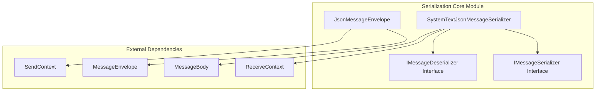
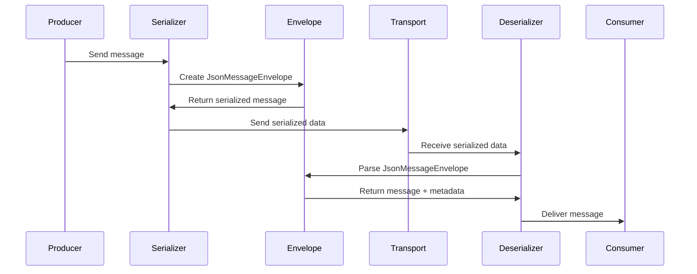
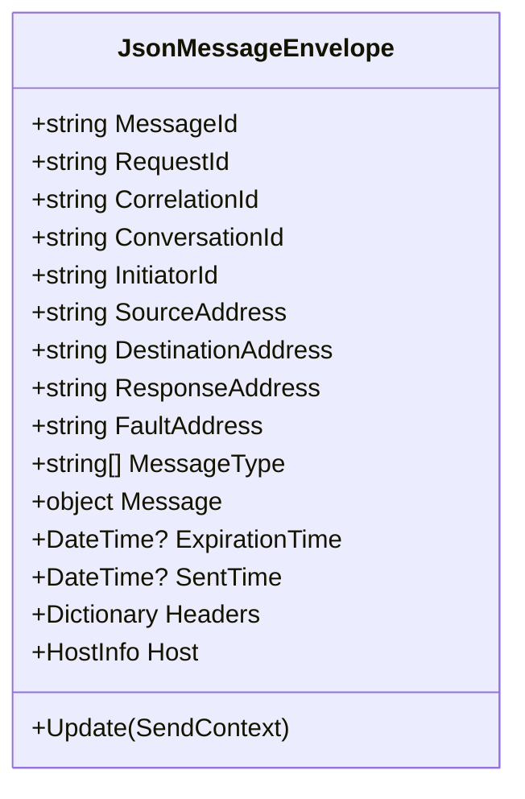

# Serialization Core Module

## Overview

The Serialization Core module is a fundamental component of MassTransit that handles the transformation of messages between their in-memory object representation and their serialized format for network transmission. This module provides the essential infrastructure for message serialization and deserialization, ensuring that messages can be reliably transmitted across different transport mechanisms while preserving their structure, metadata, and context.

## Purpose

The primary purpose of the Serialization Core module is to:

- **Message Transformation**: Convert messages between object and serialized formats
- **Cross-Platform Compatibility**: Ensure messages can be serialized and deserialized across different systems and platforms
- **Metadata Preservation**: Maintain message context, headers, and routing information during serialization
- **Performance Optimization**: Provide efficient serialization mechanisms for high-throughput messaging scenarios
- **Format Flexibility**: Support multiple serialization formats with JSON as the primary format

## Architecture

The Serialization Core module implements a layered architecture with clear separation of concerns:

## Core Components

### 1. Serialization Interfaces

The module defines two primary interfaces that form the contract for all serialization operations:

- **IMessageSerializer**: Defines the contract for serializing messages into a transmittable format
  - `GetMessageBody<T>(SendContext<T>)`: Serializes a message with its context
  - `SerializeObject(object)`: Serializes arbitrary objects
  - `ContentType`: Specifies the media type of the serialized content
  
- **IMessageDeserializer**: Defines the contract for deserializing received messages back into objects
  - `Deserialize(ReceiveContext)`: Deserializes a complete message from transport
  - `Deserialize(MessageBody, Headers, Uri)`: Deserializes message components
  - `DeserializeObject<T>(object)`: Deserializes objects with type conversion support

### 2. JsonMessageEnvelope

The [JsonMessageEnvelope](JsonMessageEnvelope.md) component serves as a container that wraps messages with their associated metadata, including:

- Message identifiers (MessageId, RequestId, CorrelationId, etc.)
- Routing information (SourceAddress, DestinationAddress, ResponseAddress, FaultAddress)
- Message type information
- Headers and custom properties
- Host information
- Timing information (SentTime, ExpirationTime)

### 3. SystemTextJsonMessageSerializer

The [SystemTextJsonMessageSerializer](SystemTextJsonMessageSerializer.md) is the primary implementation that uses System.Text.Json for high-performance JSON serialization. It provides:

- JSON serialization and deserialization capabilities
- Support for custom type converters
- Integration with MassTransit's type system
- Configurable serialization options
- Message data handling for large payloads

## Data Flow

## Integration with Other Modules

The Serialization Core module integrates with several other MassTransit modules:

- **[Core_Abstractions](Core_Abstractions.md)**: Uses SendContext, ReceiveContext, and MessageContext for message metadata
- **[Transports_Core](Transports_Core.md)**: Provides serialized message bodies to transport layers
- **[Middleware_Core](Middleware_Core.md)**: Serialization occurs within the message processing pipeline

## Message Envelope Structure

The JsonMessageEnvelope implements a comprehensive message wrapper that includes:

This structure enables:

- **Message Versioning**: MessageType array supports multiple type names for version compatibility
- **Conversation Tracking**: CorrelationId and ConversationId enable distributed tracing
- **Error Handling**: FaultAddress specifies where error responses should be sent
- **Routing**: SourceAddress and DestinationAddress enable flexible routing scenarios
- **Metadata**: Headers dictionary supports custom properties and middleware requirements

## Key Features

### Message Envelope Pattern
The module implements the Message Envelope pattern, which encapsulates the message payload with routing and metadata information. This pattern enables:

- Message versioning and evolution
- Header-based routing and processing
- Correlation and conversation tracking
- Error handling and fault addressing

### JSON as Primary Format
JSON is used as the primary serialization format due to its:

- Human readability for debugging
- Wide platform support
- Schema flexibility
- Compact size for network transmission

### Extensibility
The module provides extension points for:

- Custom serializers for different formats
- Type converters for specialized serialization
- Custom message envelope implementations
- Header processing and transformation

## Performance Considerations

The Serialization Core module is designed for high-performance scenarios:

- **System.Text.Json**: Uses the high-performance JSON library from .NET
- **Object Pooling**: Reuses serialization contexts and buffers
- **Lazy Initialization**: Headers and properties are initialized on demand
- **Memory Efficiency**: Minimizes allocations during serialization/deserialization

## Error Handling

The module implements comprehensive error handling:

- **SerializationException**: Thrown when serialization/deserialization fails
- **Validation**: Ensures message envelopes are complete and valid
- **Fallback Mechanisms**: Provides default values for missing optional fields
- **Logging Integration**: Supports diagnostic logging for troubleshooting

## Configuration

Serialization behavior can be configured through:

- **JsonSerializerOptions**: Custom serialization settings
- **Content Type**: Support for different media types
- **Type Converters**: Custom conversion logic for specific types
- **Message Type Resolution**: Configurable type name handling

This modular design ensures that the Serialization Core can adapt to various messaging scenarios while maintaining consistency and reliability across the MassTransit ecosystem.