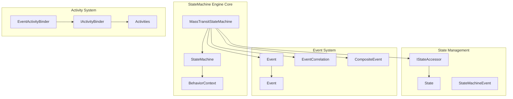
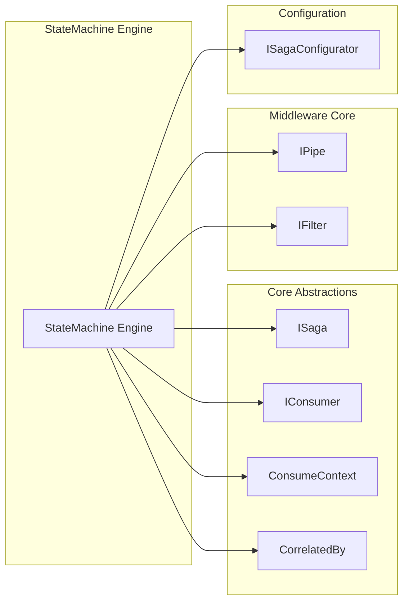
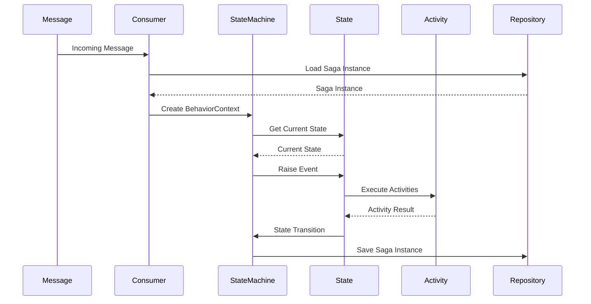
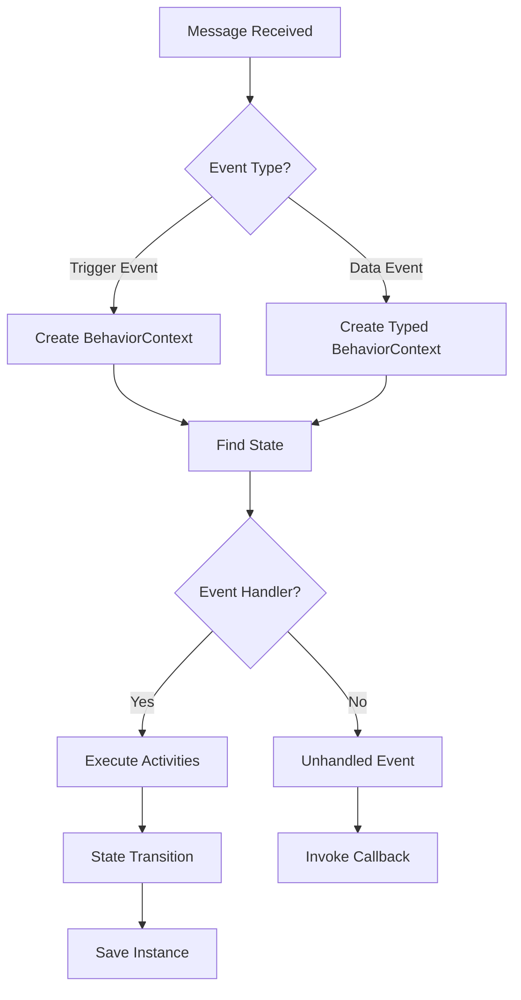
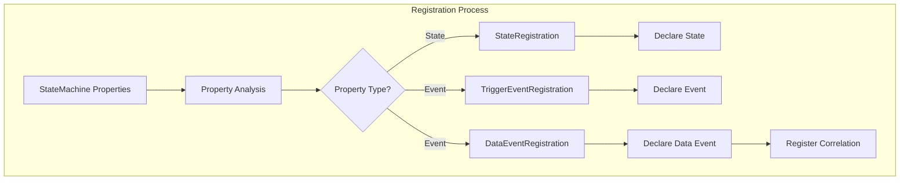
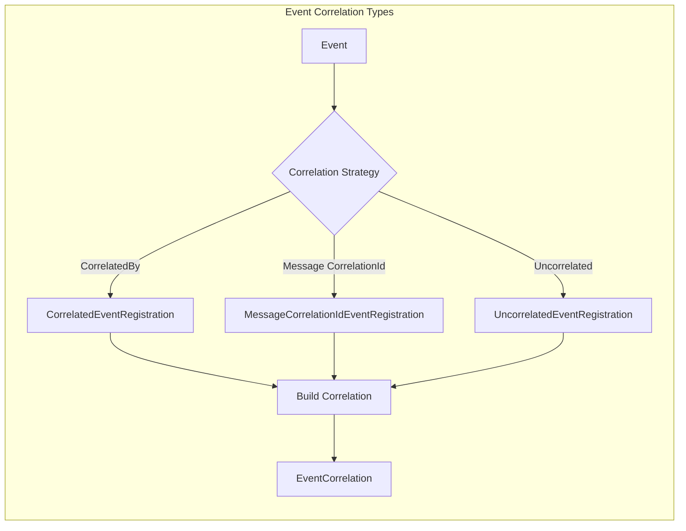

# StateMachine Engine Module

## Introduction

The StateMachine Engine module is the core implementation of MassTransit's saga state machine functionality. It provides a powerful, declarative way to define complex business processes and workflows using state machine patterns. Built on top of Automatonymous, this module extends the base state machine capabilities with MassTransit-specific features like message correlation, request/response patterns, and integration with the broader messaging infrastructure.

## Overview

The StateMachine Engine serves as the orchestration layer for long-running business processes that need to maintain state across multiple message interactions. It enables developers to define state machines that can react to incoming messages, transition between states, execute activities, and coordinate with external services through request/response patterns.

## Architecture

### Core Components



### Module Dependencies



## Key Features

### 1. State Management

The engine provides sophisticated state management capabilities:

- **State Declaration**: Define states using property expressions or string names
- **Sub-states**: Support for hierarchical state machines with super-states and sub-states
- **State Accessors**: Multiple strategies for storing state (string, int, State object)
- **State Transitions**: Automatic state transition events (BeforeEnter, Enter, Leave, AfterLeave)

### 2. Event System

Comprehensive event handling with multiple event types:

- **Trigger Events**: Simple events without data
- **Data Events**: Events carrying message data
- **Composite Events**: Events triggered when multiple prerequisite events occur
- **Transition Events**: Automatic events fired during state transitions

### 3. Request/Response Pattern

Built-in support for request/response interactions:

- **Request Declaration**: Define requests with automatic timeout and fault handling
- **Multiple Response Types**: Support for single, dual, and triple response patterns
- **Automatic Correlation**: RequestId correlation using saga CorrelationId
- **Timeout Management**: Automatic timeout scheduling and cancellation

### 4. Scheduling

Integrated scheduling capabilities:

- **Scheduled Messages**: Schedule messages to be delivered at specific times
- **Token-based Cancellation**: Use tokens to cancel scheduled messages
- **Automatic Correlation**: ScheduleId correlation with saga instance

## Data Flow

### State Machine Execution Flow



### Event Processing Flow



## Component Interactions

### State Machine Registration



### Event Correlation



## Configuration Patterns

### Basic State Machine Definition

```csharp
public class OrderStateMachine : MassTransitStateMachine<OrderState>
{
    public State Submitted { get; private set; }
    public State Accepted { get; private set; }
    public State Completed { get; private set; }
    
    public Event<OrderSubmitted> OrderSubmitted { get; private set; }
    public Event<OrderAccepted> OrderAccepted { get; private set; }
    
    public OrderStateMachine()
    {
        InstanceState(x => x.CurrentState);
        
        Initially(
            When(OrderSubmitted)
                .Then(context => context.Saga.OrderId = context.Message.OrderId)
                .TransitionTo(Submitted));
                
        During(Submitted,
            When(OrderAccepted)
                .TransitionTo(Accepted));
    }
}
```

### Request/Response Pattern

```csharp
public class OrderStateMachine : MassTransitStateMachine<OrderState>
{
    public Request<OrderState, ValidateOrder, OrderValidated> ValidateOrder { get; private set; }
    
    public OrderStateMachine()
    {
        Request(() => ValidateOrder, x => x.ValidationRequestId, cfg =>
        {
            cfg.Timeout = TimeSpan.FromSeconds(30);
        });
        
        During(Submitted,
            When(OrderSubmitted)
                .Request(ValidateOrder, context => new ValidateOrder(context.Saga.OrderId))
                .TransitionTo(Validating));
                
        During(Validating,
            When(ValidateOrder.Completed)
                .TransitionTo(Validated),
            When(ValidateOrder.Faulted)
                .TransitionTo(ValidationFailed),
            When(ValidateOrder.TimeoutExpired)
                .TransitionTo(ValidationTimeout));
    }
}
```

### Composite Events

```csharp
public class OrderStateMachine : MassTransitStateMachine<OrderState>
{
    public Event AllItemsReady { get; private set; }
    public Event InventoryAllocated { get; private set; }
    public Event PaymentProcessed { get; private set; }
    
    public OrderStateMachine()
    {
        CompositeEvent(() => AllItemsReady, x => x.ReadyStatus, 
            InventoryAllocated, PaymentProcessed);
            
        DuringAny(
            When(AllItemsReady)
                .TransitionTo(ReadyForShipping));
    }
}
```

## Integration Points

### Saga Repository Integration

The StateMachine Engine integrates with MassTransit's saga repository pattern:

- **Instance Persistence**: State machine instances are persisted through saga repositories
- **Correlation**: Events are correlated to instances using configured correlation strategies
- **Concurrency**: Optimistic concurrency control for state transitions
- **Completion**: Instances can be marked as completed and removed from storage

### Message Transport Integration

Integration with the transport layer provides:

- **Message Consumption**: State machines consume messages through standard consumers
- **Publish/Send**: Activities can publish events or send commands
- **Scheduling**: Integration with message scheduling for delayed messages
- **Fault Handling**: Automatic fault message generation and handling

### Middleware Integration

The engine leverages MassTransit's middleware pipeline:

- **Filters**: Custom filters can be applied to state machine execution
- **Pipes**: Message processing through configurable pipes
- **Observability**: Integration with monitoring and diagnostics

## Performance Considerations

### State Access Optimization

- **Caching**: State and event definitions are cached for performance
- **Property Access**: Optimized property access using compiled expressions
- **Backing Fields**: Automatic detection and use of auto-property backing fields

### Memory Management

- **Instance Lifecycle**: Proper cleanup of completed state machine instances
- **Event Subscription**: Observable pattern with proper disposal
- **Registration Caching**: Lazy initialization of expensive operations

### Concurrency

- **Thread Safety**: State machine definitions are immutable after creation
- **Instance Isolation**: Each saga instance is processed independently
- **Optimistic Concurrency**: Version-based concurrency control

## Error Handling

### Exception Types

- **UnknownStateException**: Thrown when accessing undefined states
- **UnknownEventException**: Thrown when accessing undefined events
- **UnhandledEventException**: Thrown when events are raised in states without handlers
- **RequestException**: Thrown for request/response related errors

### Fault Handling

- **Automatic Fault Generation**: Fault messages are automatically generated
- **Fault Event Handling**: Dedicated events for handling fault messages
- **Timeout Handling**: Special handling for request timeouts
- **Retry Policies**: Integration with retry policies for transient failures

## Testing Support

### Test Harness Integration

The engine integrates with MassTransit's testing framework:

- **In-Memory Testing**: Full state machine testing in memory
- **Saga Test Harness**: Specialized harness for saga testing
- **Message Assertions**: Verify message publishing and sending
- **State Verification**: Assert state transitions and instance state

### State Machine Testing Patterns

```csharp
[Test]
public async Task Should_transition_to_accepted_state()
{
    var harness = new InMemoryTestHarness();
    var sagaHarness = harness.StateMachineSaga<OrderState, OrderStateMachine>();
    
    await harness.Start();
    try
    {
        var orderId = NewId.NextGuid();
        await harness.Bus.Publish(new OrderSubmitted { OrderId = orderId });
        
        var instance = sagaHarness.Sagas.Select(x => x.CorrelationId == orderId).Single();
        Assert.AreEqual("Submitted", instance.CurrentState);
        
        await harness.Bus.Publish(new OrderAccepted { OrderId = orderId });
        
        Assert.AreEqual("Accepted", instance.CurrentState);
    }
    finally
    {
        await harness.Stop();
    }
}
```

## Best Practices

### State Machine Design

1. **Keep States Focused**: Each state should represent a clear business state
2. **Use Descriptive Names**: State and event names should be self-documenting
3. **Minimize State Count**: Avoid creating too many fine-grained states
4. **Handle All Events**: Ensure all events are handled in all states

### Event Design

1. **Use Correlated Events**: Leverage CorrelatedBy<Guid> for automatic correlation
2. **Design for Idempotency**: Ensure events can be processed multiple times safely
3. **Version Events**: Plan for event versioning and evolution
4. **Use Composite Events**: Combine related events using composite events

### Performance Optimization

1. **Cache State Machines**: Reuse state machine definitions across instances
2. **Optimize Correlation**: Use efficient correlation strategies
3. **Limit Activities**: Keep activities focused and efficient
4. **Use Scheduling Wisely**: Avoid excessive use of scheduled messages

### Error Handling

1. **Handle Unhandled Events**: Always configure unhandled event callbacks
2. **Plan for Timeouts**: Handle request timeouts appropriately
3. **Use Fault Events**: Leverage fault events for error handling
4. **Implement Compensation**: Use compensation activities for rollback scenarios

## Related Documentation

- [Core Abstractions](Core_Abstractions.md) - Base interfaces and abstractions
- [Saga StateMachine Core](Saga_StateMachine_Core.md) - Parent module documentation
- [Middleware Core](Middleware_Core.md) - Pipeline and filter system
- [Configuration Core](Configuration_Core.md) - Configuration interfaces
- [Testing Core](Testing_Core.md) - Testing framework integration

## Summary

The StateMachine Engine module provides a comprehensive, feature-rich implementation of the saga pattern for MassTransit. It combines the power of state machines with MassTransit's messaging capabilities to enable complex, long-running business processes. With its declarative syntax, extensive feature set, and tight integration with the MassTransit ecosystem, it serves as the foundation for building reliable, scalable distributed applications.