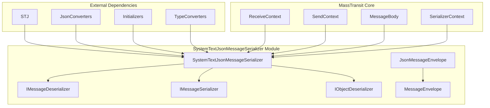
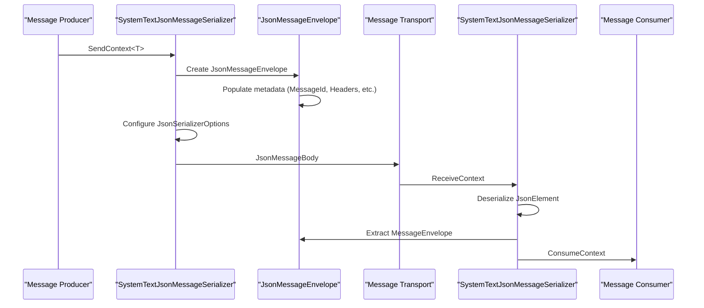
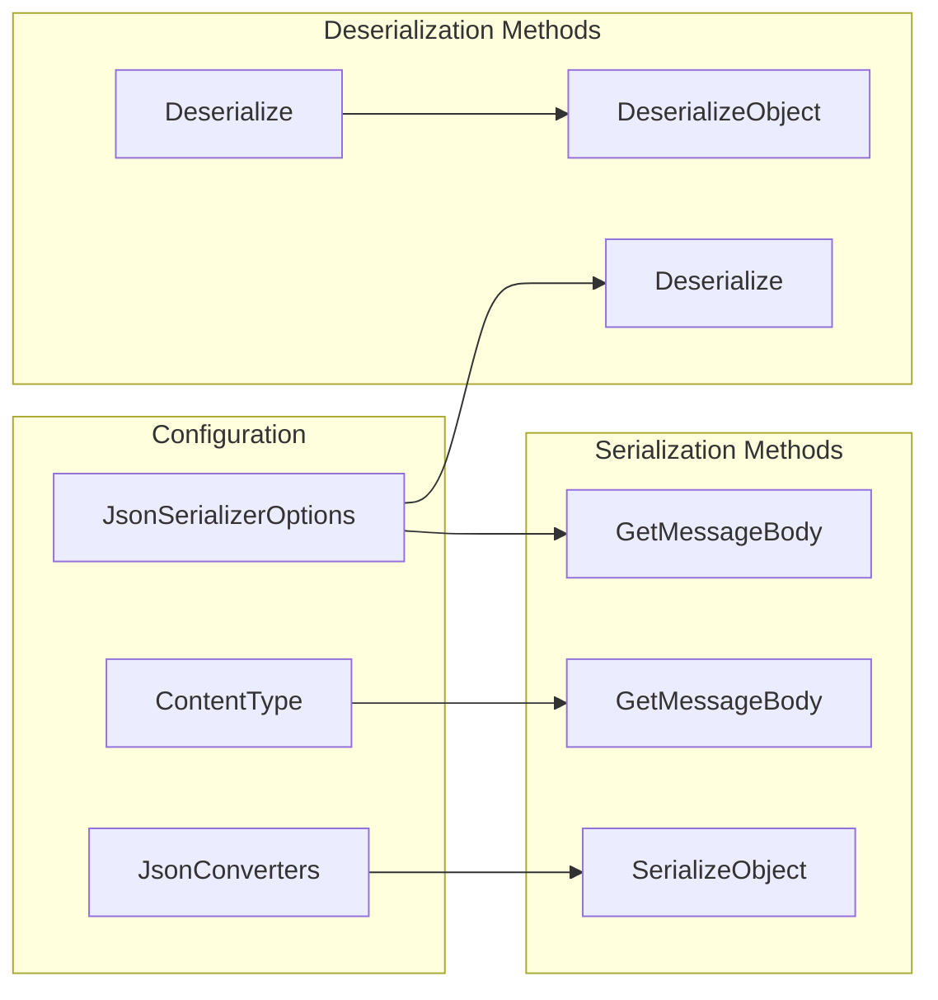
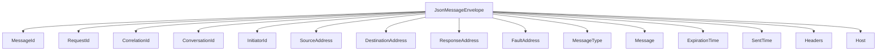
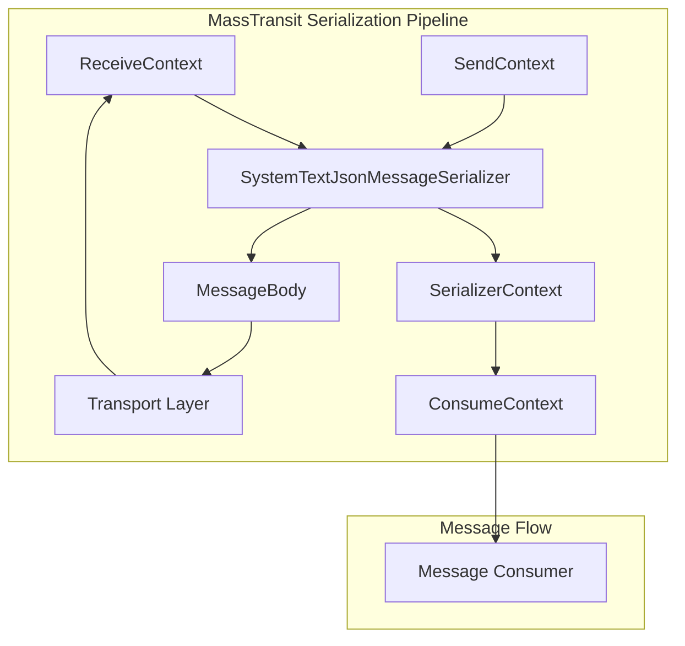
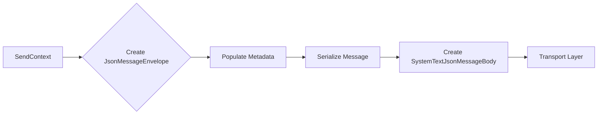
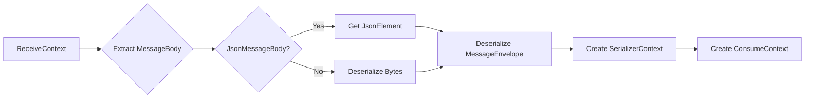

# SystemTextJsonMessageSerializer Module

## Introduction

The SystemTextJsonMessageSerializer module provides the primary JSON serialization and deserialization capabilities for MassTransit using the high-performance `System.Text.Json` library. This module implements both `IMessageSerializer` and `IMessageDeserializer` interfaces, enabling seamless conversion between .NET objects and JSON representations for message transport across the MassTransit bus infrastructure.

## Core Purpose

The module serves as the default JSON serialization provider in MassTransit, offering:
- High-performance message serialization using System.Text.Json
- Configurable JSON serialization options optimized for message transport
- Support for message envelopes with metadata and headers
- Type-safe deserialization with fallback mechanisms
- Integration with MassTransit's message type system

## Architecture Overview

### Component Structure



### Serialization Flow



## Core Components

### SystemTextJsonMessageSerializer

The main serializer class that implements three key interfaces:

- **IMessageDeserializer**: Handles deserialization of incoming messages
- **IMessageSerializer**: Handles serialization of outgoing messages  
- **IObjectDeserializer**: Provides generic object deserialization capabilities

#### Key Features:



#### Static Configuration

The serializer uses a static configuration approach with carefully tuned `JsonSerializerOptions`:

```csharp
Options = new JsonSerializerOptions
{
    AllowTrailingCommas = true,
    PropertyNameCaseInsensitive = true,
    PropertyNamingPolicy = JsonNamingPolicy.CamelCase,
    ReadCommentHandling = JsonCommentHandling.Skip,
    WriteIndented = true,
    Encoder = JavaScriptEncoder.UnsafeRelaxedJsonEscaping
}
```

### JsonMessageEnvelope

The envelope structure that wraps messages with metadata:



## Integration Points

### With MassTransit Core



### With Message Types

The serializer integrates with MassTransit's message type system:

- **Message Type Resolution**: Uses `MessageType` array from envelope to determine supported message types
- **Type Conversion**: Leverages `TypeConverterCache` for string-to-type conversions
- **Generic Support**: Provides both class and struct deserialization methods

## Data Flow

### Serialization Process



### Deserialization Process



## Error Handling

The serializer implements comprehensive error handling:

- **SerializationException**: Thrown for envelope deserialization failures
- **Exception Wrapping**: General exceptions are wrapped in SerializationException with context
- **Null Handling**: Graceful handling of null values and empty message bodies
- **Type Safety**: Safe type conversion with fallback to default values

## Performance Optimizations

### System.Text.Json Benefits

- **High Performance**: Native JSON parsing without reflection overhead
- **Source Generation**: Support for System.Text.Json source generation in .NET 8+
- **Reduced Allocations**: Efficient memory usage with JsonElement reuse
- **Camel Case Policy**: Consistent JSON naming conventions

### Custom Converters

The serializer includes specialized converters:

- **StringDecimalJsonConverter**: Optimized decimal handling
- **SystemTextJsonMessageDataConverter**: Message data serialization
- **SystemTextJsonConverterFactory**: Type-specific converter resolution

## Configuration Options

### Content Type Support

- **Default**: `application/vnd.masstransit+json`
- **Customizable**: Constructor allows custom ContentType specification
- **Probe Support**: Exposes configuration via ProbeContext for diagnostics

### JsonSerializerOptions Customization

The static `Options` property can be modified for application-specific needs:

- **TypeInfoResolver**: Configurable for source generation scenarios
- **Converter Chain**: Extensible converter system
- **Encoding**: Configurable character encoding

## Usage Patterns

### Basic Serialization

```csharp
// The serializer is typically used through MassTransit's configuration
configurator.UseJsonSerializer();
```

### Custom Configuration

```csharp
// Modify static options for application-wide changes
SystemTextJsonMessageSerializer.Options.Converters.Add(new MyCustomConverter());
```

### Direct Usage

```csharp
// Direct serialization (less common)
var serializer = new SystemTextJsonMessageSerializer();
var messageBody = serializer.GetMessageBody(sendContext);
```

## Related Modules

- **[JsonMessageEnvelope](JsonMessageEnvelope.md)**: Message envelope implementation
- **[Serialization Core](Serialization_Core.md)**: Base serialization interfaces
- **[Core Abstractions](Core_Abstractions.md)**: Message and context abstractions
- **[Transports Core](Transports_Core.md)**: Transport layer integration

## Dependencies

- **System.Text.Json**: Primary JSON serialization library
- **MassTransit.Abstractions**: Core message abstractions
- **MassTransit.Serialization**: Base serialization interfaces
- **MassTransit.Initializers**: Type conversion utilities

## Thread Safety

The `SystemTextJsonMessageSerializer` is thread-safe for concurrent operations:
- Static `Options` are read-only after initialization
- Instance methods are stateless
- `JsonSerializerOptions` instances are not modified after creation

## Version Compatibility

- **.NET 8+**: Enhanced with source generation support via `TypeInfoResolver`
- **Earlier Versions**: Fallback to reflection-based serialization
- **Backward Compatible**: Maintains compatibility across MassTransit versions