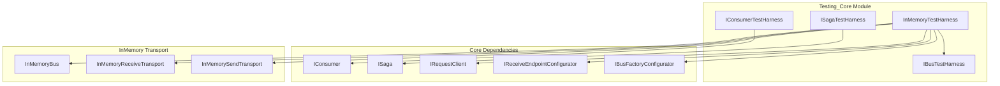

# Testing_Core Module Documentation

## Overview

The Testing_Core module provides comprehensive testing infrastructure for MassTransit applications, enabling developers to write unit and integration tests for message-based systems. This module offers specialized test harnesses that simulate bus behavior, message consumption, and saga state management in a controlled testing environment.

## Purpose

Testing_Core serves as the foundation for testing MassTransit-based applications by providing:
- In-memory test harnesses that eliminate external dependencies
- Consumer testing capabilities with message tracking
- Saga testing with state verification and correlation
- Request/response pattern testing support
- Configurable test timeouts and assertions

## Architecture



## Core Components

### 1. IBusTestHarness
The base interface for all test harnesses, providing fundamental testing capabilities for MassTransit buses. This interface is implemented by concrete test harnesses and provides common functionality for test setup and execution.

### 2. IConsumerTestHarness<TConsumer>
Specialized test harness for testing message consumers. Provides message consumption tracking and verification capabilities, allowing tests to assert that specific messages were consumed by the consumer under test.

**Key Features:**
- Message consumption tracking via `IReceivedMessageList`
- Type-safe consumer testing
- Message receipt verification

### 3. ISagaTestHarness<TSaga>
Comprehensive testing framework for saga state machines. Enables testing of complex saga workflows including state transitions, correlation, and timeout handling.

**Key Features:**
- Saga state tracking and verification
- Correlation ID-based saga lookup
- Expression-based saga matching
- Creation and existence assertions
- Asynchronous wait operations for saga state changes

### 4. InMemoryTestHarness
Concrete implementation providing a complete in-memory testing environment. This harness creates a fully functional MassTransit bus instance using in-memory transport, eliminating the need for external message brokers during testing.

**Key Features:**
- Loopback transport configuration
- Configurable virtual hosts
- Request client creation and management
- Event-driven configuration hooks
- Integration with MassTransit's configuration system

## Sub-modules

The Testing_Core module can be divided into the following sub-modules based on functionality:

### Consumer Testing
Handles testing of message consumers, providing message tracking and verification capabilities. See [Consumer_Testing](Consumer_Testing.md) for detailed documentation.

### Saga Testing
Provides comprehensive testing infrastructure for saga state machines, including state verification and correlation testing. See [Saga_Testing](Saga_Testing.md) for detailed documentation.

### InMemory Transport Testing
Implements the in-memory test harness that simulates a complete MassTransit bus environment for testing purposes. See [InMemory_Transport_Testing](InMemory_Transport_Testing.md) for detailed documentation.

## Integration with Other Modules

Testing_Core integrates with several other MassTransit modules:

- **[Core_Abstractions](Core_Abstractions.md)**: Uses IConsumer, ISaga, and IRequestClient interfaces
- **[Configuration_Core](Configuration_Core.md)**: Leverages configuration interfaces for test setup
- **[InMemory_Transport](InMemory_Transport.md)**: Utilizes in-memory transport for isolated testing
- **[Middleware_Core](Middleware_Core.md)**: Tests can verify middleware behavior

## Usage Patterns

### Basic Consumer Testing
```csharp
// Test setup using InMemoryTestHarness
var harness = new InMemoryTestHarness();
await harness.Start();

// Consumer testing via IConsumerTestHarness
var consumerHarness = harness.Consumer<MyConsumer>();

// Send test message
await harness.InputQueueSendEndpoint.Send(new TestMessage());

// Verify consumption
Assert.IsTrue(consumerHarness.Consumed.Select<TestMessage>().Any());
```

### Saga Testing
```csharp
// Saga test harness usage
var sagaHarness = harness.Saga<MySaga>();

// Trigger saga
await harness.InputQueueSendEndpoint.Send(new StartSagaMessage() { CorrelationId = sagaId });

// Verify saga creation and state
var exists = await sagaHarness.Exists(sagaId);
Assert.IsNotNull(exists);
```

## Best Practices

1. **Test Isolation**: Each test should create its own test harness instance
2. **Cleanup**: Always stop and dispose test harnesses after tests complete
3. **Timeouts**: Use appropriate timeouts for async operations in tests
4. **Message Types**: Use specific message types for testing rather than generic objects
5. **State Verification**: For sagas, verify both state transitions and side effects

## Configuration Options

The InMemoryTestHarness provides several configuration points:
- **Virtual Host**: Configure isolated testing environments
- **Base Address**: Customize the loopback URI
- **Input Queue**: Configure the test input queue name
- **Event Handlers**: Hook into bus configuration events
- **Specifications**: Apply additional bus instance specifications